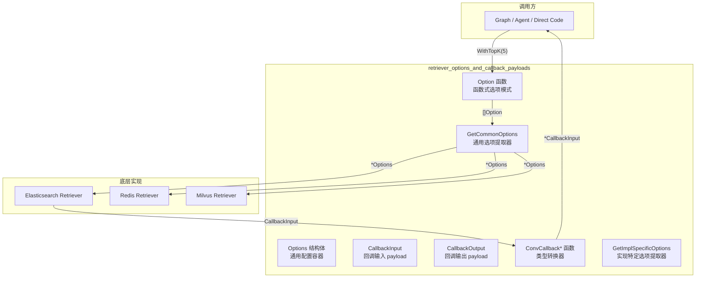

# retriever_options_and_callback_payloads

## 模块概述

`retriever_options_and_callback_payloads` 模块是 Eino 框架中检索器（Retriever）组件的核心配置与回调基础设施。它位于 `components/retriever` 包中，扮演着**配置标准化**和**可观测性桥梁**的双重角色。

**一句话解释**：当你调用 `retriever.Retrieve(ctx, "query", retriever.WithTopK(5))` 时，传递给检索器的配置来自这个模块；而当你想在检索前后插入日志、监控或自定义逻辑时，回调 payload 定义也来自这里。

---

## 问题空间：为什么需要这个模块？

在构建 RAG（检索增强生成）应用时，检索器是连接用户查询与知识库的桥梁。一个实际的 RAG 流程会遇到这些问题：

1. **配置粒度问题**：不同的检索实现（如 Elasticsearch、Redis、Milvus、PgVector）有不同的配置参数，但上层调用方需要一个统一的接口。指定 `TopK=5` 应该是通用的，不关心底层是哪个向量数据库。

2. **动态配置需求**：有时你不想在初始化检索器时就确定所有参数，而是在每次调用时灵活指定。比如在同一个检索器实例上，有时查 3 条结果，有时查 10 条。

3. **可观测性需求**：在生产环境中，你想知道「刚才查了什么」「返回了多少条」「耗时多久」。这需要一种标准化的方式将检索输入输出暴露给上层监控系统。

4. **实现扩展性**：框架自带的通用选项（TopK、ScoreThreshold）应该与各实现特有的选项（如 Elasticsearch 的 DSL、Redis 的索引名称）共存，而不是互相冲突。

这个模块正是为了解决这四个问题而设计的。

---

## 架构设计

### 核心组件



### 数据流向

```
调用方传递 Option 列表
        ↓
    GetCommonOptions() 提取通用配置 → *Options
        ↓
    传递给 Retriever.Retrieve()
        ↓
    检索执行，返回 []Document
        ↓
    打包为 CallbackOutput
        ↓
    回调处理器消费（监控、日志等）
```

---

## 设计决策与权衡分析

### 1. 函数式选项模式（Functional Options） vs. 构建器模式

**选择**：函数式选项模式

```go
// 优点：灵活、可组合、兼容可选参数
docs, err := retriever.Retrieve(ctx, query, 
    retriever.WithTopK(5),
    retriever.WithScoreThreshold(0.7),
)
```

**为什么不选传统的构建器？**
- 避免创建临时构建器对象
- 支持 nil 安全（可以直接传空 `[]Option{}`）
- 在 Graph 场景下更容易序列化/传递

**代价**：IDE 提示较弱，无法静态检查必填参数。框架通过在文档中标注「必填」来规避。

### 2. 指针类型字段 vs. 值类型字段

**选择**：所有可选项都使用指针

```go
type Options struct {
    TopK           *int      // 指针：区分"未设置"和"设置为0"
    ScoreThreshold *float64  // 同上
    Index          *string   // 同上
    ...
}
```

**设计意图**：这解决了 Go 语言的核心难题——**零值歧义**。如果 `TopK` 是 `int` 类型，调用方无法区分「没传 TopK」和「TopK 设为 0」。使用指针后，`nil` 表示未设置，非 nil 表示已设置。

**权衡**：
- ✅ 明确区分三种状态：未设置、使用默认值、使用显式值
- ❌ 调用方需要取地址（`&topK`），代码稍显冗长

### 3. 通用选项与实现特定选项的分离

**选择**：双层提取机制

```go
// 通用选项（框架级别）
opts := GetCommonOptions(nil, retriever.WithTopK(5))
// opts.TopK 现在是 5

// 实现特定选项（各 Retriever 实现自定义）
myOpts := GetImplSpecificOptions[MyCustomOptions](nil, opts...)
```

**设计意图**：这是一个**两栖方案**——既保证了框架层面的互操作性（所有 Retriever 都理解 TopK），又为特定实现保留了扩展空间。

**实际例子**：
- 框架通用选项：`TopK`、`ScoreThreshold`、`Embedding`
- Elasticsearch 特有：`DSLInfo`（用于复杂查询 DSL）
- Redis 特有：`Index`、`SubIndex`

### 4. 回调系统的类型安全设计

**选择**：提供显式转换函数

```go
// callback_extra.go
func ConvCallbackInput(src callbacks.CallbackInput) *CallbackInput {
    switch t := src.(type) {
    case *CallbackInput:
        return t
    case string:  // 支持简单字符串查询
        return &CallbackInput{Query: t}
    default:
        return nil
    }
}
```

**设计意图**：回调系统是通用的（`callbacks.CallbackInput` 是空接口 `any`），但检索有特定的语义结构。通过转换函数，既保持了回调框架的统一性，又保证了类型安全。

---

## 核心 API 详解

### Options 结构体

```go
type Options struct {
    Index          *string              // 索引名称（如 Redis 键名、ES 索引名）
    SubIndex       *string              // 子索引（如多租户场景）
    TopK           *int                 // 返回结果数量
    ScoreThreshold *float64             // 相似度阈值（0-1）
    Embedding      embedding.Embedder   // 向量化器（用于将查询文本转为向量）
    DSLInfo        map[string]any       // 实现特定的 DSL 配置
}
```

**每个字段的用途**：

| 字段 | 场景 | 例子 |
|------|------|------|
| `Index` | 多索引切换 | 在同一个应用中查询「用户文档」或「产品文档」 |
| `SubIndex` | 分片/分区 | 按时间范围或地域划分子索引 |
| `TopK` | 结果数量控制 | 首页展示 3 条，详情页展示 10 条 |
| `ScoreThreshold` | 质量过滤 | 只返回相似度 > 0.8 的结果，避免「幻觉文档」 |
| `Embedding` | 运行时向量化 | 某些检索器需要接收向量而非文本查询 |
| `DSLInfo` | 高级查询 | 复杂布尔查询、过滤器、排序规则 |

### Option 函数（构建器）

每个字段都有对应的 `With*` 函数：

```go
func WithIndex(index string) Option
func WithSubIndex(subIndex string) Option
func WithTopK(topK int) Option
func WithScoreThreshold(threshold float64) Option
func WithEmbedding(emb embedding.Embedder) Option
func WithDSLInfo(dsl map[string]any) Option
```

**使用模式**：

```go
// 基础用法
docs, err := r.Retrieve(ctx, "如何配置", retriever.WithTopK(3))

// 组合多个选项
docs, err := r.Retrieve(ctx, "如何配置", 
    retriever.WithTopK(5),
    retriever.WithScoreThreshold(0.75),
    retriever.WithIndex("knowledge_base_v2"),
)

// 默认值 + 覆盖
baseOpts := &retriever.Options{TopK: &defaultK}
opts := retriever.GetCommonOptions(baseOpts, customOpts...)
```

### CallbackInput 与 CallbackOutput

```go
type CallbackInput struct {
    Query          string
    TopK           int
    Filter         string
    ScoreThreshold *float64
    Extra          map[string]any
}

type CallbackOutput struct {
    Docs  []*schema.Document
    Extra map[string]any
}
```

**注意**：`CallbackInput` 中的字段与 `Options` 有重叠，但语义不同：
- `Options` 是**请求配置**（我要查什么）
- `CallbackInput` 是**实际执行参数**（查了什么，包括默认值展开后的情况）

---

## 与其他模块的关系

### 上游依赖

| 模块 | 关系 |
|------|------|
| [embedding_contract_and_runtime_metadata](embedding_contract_and_runtime_metadata.md) | 通过 `Options.Embedding` 字段依赖 embedder 接口 |
| callbacks 系统 | 提供 `ConvCallbackInput/Output` 转换函数，融入统一回调体系 |
| schema | `CallbackOutput.Docs` 使用 `schema.Document` 类型 |

### 下游使用者

| 使用场景 | 调用方式 |
|----------|----------|
| retriever_strategies_and_routing | 在路由逻辑中传递 `Option` 动态切换检索策略 |
| react_agent_runtime_and_options | Agent 运行时调用 `retriever.Retrieve` 时传入选项 |
| compose_graph_engine | Graph 节点配置中使用 `Option` 列表 |

---

## 新贡献者注意事项

### 1. 指针陷阱

```go
// ❌ 错误：值类型无法区分"未设置"
opts := &Options{TopK: 5}  // TopK == 5，即使不调用 WithTopK

// ✅ 正确：使用指针
k := 5
opts := &Options{TopK: &k}
```

### 2. Option 列表求值时机

`Option` 函数是**即时执行**的——它们在调用 `GetCommonOptions` 时才应用到你传入的 `Options` 对象上。这意味着：

```go
// 每次调用都创建新 Option，不会有累积副作用
for i := 0; i < 10; i++ {
    docs, _ := retriever.Retrieve(ctx, query, retriever.WithTopK(i))
    // 每次 TopK 都是 i，不会受上次影响
}
```

### 3. 实现特定选项的正确用法

如果你在实现一个自定义 Retriever 并想支持自定义选项：

```go
// 1. 定义你的自定义选项结构
type MyRetrieverOptions struct {
    CustomField string
    AnotherField int
}

// 2. 在 Retrieve 调用时包装
func (r *MyRetriever) Retrieve(ctx context.Context, query string, opts ...Option) ([]*schema.Document, error) {
    // 提取通用选项
    commonOpts := GetCommonOptions(nil, opts...)
    
    // 提取自定义选项
    myOpts := GetImplSpecificOptions(&MyRetrieverOptions{}, opts...)
    
    // 使用它们
    ...
}
```

### 4. 回调转换的非侵入性

`ConvCallbackInput` 支持多种输入类型（`string`、`*CallbackInput`），这是为了兼容不同的调用模式。但它不会对未知类型 panic，而是返回 `nil`。如果你的回调处理器收到 `nil`，应该跳过处理而不是报错。

---

## 相关文档

- [Embedding 组件选项](embedding_contract_and_runtime_metadata.md)