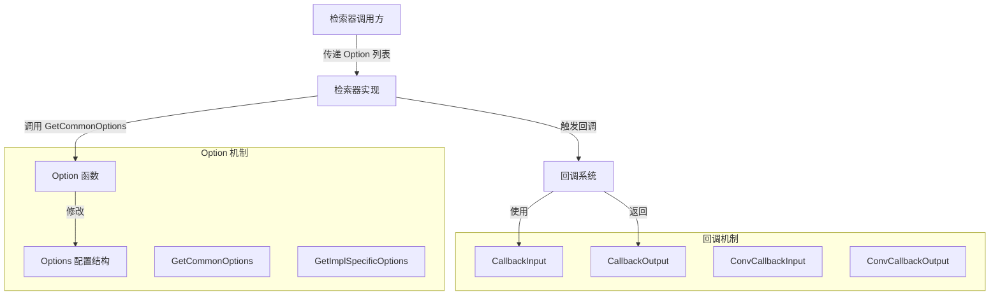

# Retriever Options and Callbacks 模块深度剖析

## 1. 模块概述

**retriever_options_and_callbacks** 模块是检索器（Retriever）组件的基础设施层，它解决了两个关键问题：如何以类型安全且可扩展的方式配置检索器行为，以及如何在检索过程中注入可观测性和扩展点。

### 问题背景

在构建检索系统时，我们面临两个核心挑战：
1. **配置多样性**：不同的检索器实现（如向量检索、全文检索、混合检索）需要不同的配置参数，但我们希望提供统一的配置接口
2. **可观测性需求**：检索过程需要被监控、调试和扩展，但直接在检索逻辑中埋点会导致代码耦合

### 设计洞察

这个模块采用了函数式选项模式（Functional Options Pattern）和回调契约模式的组合，将配置和可观测性从检索器的核心逻辑中解耦出来。Think of it as a "control panel" for retrievers — you can dial in settings without opening up the machine, and plug in monitoring tools without rewiring the circuits.

## 2. 核心架构



### 架构角色说明

1. **Option**: 函数式选项的载体，封装了对配置的修改逻辑
2. **Options**: 公共配置的聚合结构，包含所有检索器共有的配置项
3. **CallbackInput**: 检索前回调的输入契约，定义了回调可以访问的信息
4. **CallbackOutput**: 检索后回调的输出契约，定义了回调可以返回的信息
5. **GetCommonOptions/GetImplSpecificOptions**: 配置解析工具，将 Option 列表转换为具体的配置结构

## 3. 核心组件深度解析

### 3.1 Option 与 Options：函数式选项模式的实现

#### 设计意图

`Option` 和 `Options` 的设计解决了一个经典问题：如何在保持类型安全的同时，支持可选配置和未来扩展。如果使用传统的构造函数参数，每次添加新配置都会破坏 API 兼容性；如果使用 map[string]any，又会失去类型安全。

#### 内部机制

```go
// Option 是一个闭包容器，它包含两个部分：
type Option struct {
    apply func(opts *Options)  // 公共配置修改函数
    implSpecificOptFn any       // 实现特定的配置函数（类型擦除）
}
```

这种设计的巧妙之处在于它的**双重身份**：
- 对于公共配置，它通过 `apply` 函数直接修改 `Options` 结构
- 对于实现特定的配置，它通过 `implSpecificOptFn` 存储类型擦除的函数，在具体实现中通过 `GetImplSpecificOptions` 恢复类型

#### Options 结构解析

`Options` 结构包含了检索器的通用配置：

| 字段 | 类型 | 说明 | 设计考虑 |
|------|------|------|----------|
| Index | *string | 索引名称 | 使用指针是为了区分"未设置"和"空值" |
| SubIndex | *string | 子索引名称 | 同上 |
| TopK | *int | 返回文档数量 | 同上 |
| ScoreThreshold | *float64 | 相似度阈值 | 同上 |
| Embedding | embedding.Embedder | 嵌入模型 | 这是一个组件依赖，不是简单配置 |
| DSLInfo | map[string]any | 特定实现的 DSL | 这是一个"逃生舱"，用于处理特殊情况 |

#### 配置解析流程

`GetCommonOptions` 函数是配置解析的核心：

```go
func GetCommonOptions(base *Options, opts ...Option) *Options {
    if base == nil {
        base = &Options{}
    }

    for i := range opts {
        if opts[i].apply != nil {
            opts[i].apply(base)
        }
    }

    return base
}
```

这个函数的设计体现了**不可变性原则**：它接受一个可选的 `base` 配置，然后在副本上应用修改，而不是直接修改输入参数。

### 3.2 CallbackInput 与 CallbackOutput：回调契约

#### 设计意图

回调机制的核心是**契约设计**。`CallbackInput` 和 `CallbackOutput` 定义了检索器和回调处理器之间的"协议"，使得：
- 检索器知道需要向回调提供什么信息
- 回调处理器知道可以从检索器获取什么信息，以及可以返回什么信息

#### CallbackInput 结构

```go
type CallbackInput struct {
    Query          string                 // 检索查询
    TopK           int                    // 返回文档数量
    Filter         string                 // 过滤条件
    ScoreThreshold *float64               // 相似度阈值
    Extra          map[string]any         // 扩展信息
}
```

注意这里的设计选择：`TopK` 是值类型（不是指针），因为在回调触发时，`TopK` 一定有一个确定的值（要么是用户设置的，要么是默认值）。而 `ScoreThreshold` 是指针，因为它可能是"未设置"状态。

#### CallbackOutput 结构

```go
type CallbackOutput struct {
    Docs  []*schema.Document  // 检索到的文档
    Extra map[string]any      // 扩展信息
}
```

这个结构很简洁，但它的作用很重要：它将检索结果标准化，使得回调处理器可以以统一的方式处理不同检索器的输出。

#### 类型转换函数

`ConvCallbackInput` 和 `ConvCallbackOutput` 是两个有趣的函数，它们体现了**适配模式**：

```go
func ConvCallbackInput(src callbacks.CallbackInput) *CallbackInput {
    switch t := src.(type) {
    case *CallbackInput:
        return t
    case string:
        return &CallbackInput{
            Query: t,
        }
    default:
        return nil
    }
}
```

这种设计允许检索器在简单场景下直接传递字符串作为查询，而回调系统仍然可以以统一的方式处理。

## 4. 数据流与依赖关系

### 4.1 数据流向

检索器的典型调用流程如下：

1. **配置准备**：调用方创建 Option 列表（如 `WithTopK(10)`, `WithScoreThreshold(0.8)`）
2. **配置解析**：检索器调用 `GetCommonOptions` 将 Option 列表转换为 Options 结构
3. **实现特定配置**：检索器调用 `GetImplSpecificOptions` 提取实现特定的配置
4. **检索前回调**：检索器创建 `CallbackInput`，触发 `OnStart` 回调
5. **执行检索**：检索器使用解析后的配置执行实际的检索逻辑
6. **检索后回调**：检索器创建 `CallbackOutput`，触发 `OnEnd` 回调
7. **返回结果**：检索器返回检索结果

### 4.2 依赖关系

这个模块的依赖关系非常简洁，这是一个好的设计标志：

- **被依赖**：
  - 检索器实现（如 `flow.retriever.multiquery.multi_query.multiQueryRetriever`）
  - 回调处理器模板（如 `utils.callbacks.template.RetrieverCallbackHandler`）
  
- **依赖**：
  - `embedding` 模块（仅用于 Options 结构中的 Embedder 字段）
  - `schema` 模块（仅用于 CallbackOutput 结构中的 Document 类型）
  - `callbacks` 模块（仅用于回调接口的定义）

这种**最小依赖**设计使得模块非常稳定，不容易受到其他模块变化的影响。

## 5. 设计决策与权衡

### 5.1 函数式选项 vs 其他配置模式

**选择**：函数式选项模式

**替代方案**：
1. **配置结构体**：直接传递一个大的配置结构体
2. **Builder 模式**：使用 Builder 来构建配置
3. **map[string]any**：使用动态配置

**权衡分析**：

| 维度 | 函数式选项 | 配置结构体 | Builder 模式 | map[string]any |
|------|-----------|-----------|-------------|----------------|
| 类型安全 | ✅ 高 | ✅ 高 | ✅ 高 | ❌ 低 |
| 可选参数 | ✅ 完美支持 | ⚠️ 需要指针 | ✅ 支持 | ✅ 支持 |
| 向前兼容 | ✅ 优秀 | ⚠️ 一般 | ✅ 优秀 | ✅ 优秀 |
| 可读性 | ✅ 好 | ⚠️ 一般 | ✅ 好 | ❌ 差 |
| 实现复杂度 | ⚠️ 中等 | ✅ 简单 | ⚠️ 中等 | ✅ 简单 |

**为什么选择函数式选项**：
- 它提供了最好的向前兼容性（添加新配置不需要修改现有代码）
- 它的可读性很好（`WithTopK(10)` 比 `Config{TopK: 10}` 更清晰）
- 它支持可选参数的完美语义（区分"未设置"和"零值"）

### 5.2 公共配置与实现特定配置的分离

**选择**：将配置分为公共部分和实现特定部分

**设计意图**：
- 公共配置部分提供了统一的接口，使得调用方可以以相同的方式配置不同的检索器
- 实现特定配置部分提供了扩展性，使得每个检索器可以有自己独特的配置

**权衡**：
- ✅ 优点：统一与灵活的平衡
- ⚠️ 缺点：需要两次配置解析（`GetCommonOptions` 和 `GetImplSpecificOptions`）

### 5.3 指针字段 vs 值字段

**选择**：在 Options 结构中，大部分字段使用指针类型

**设计意图**：
- 区分"未设置"和"零值"（如 `TopK` 未设置 vs `TopK` 设置为 0）
- 允许检索器实现自己决定默认值

**权衡**：
- ✅ 优点：语义清晰
- ⚠️ 缺点：使用时需要解引用，增加了一点复杂度

### 5.4 回调契约的灵活性 vs 严格性

**选择**：提供类型安全的契约，但也提供转换函数支持简化场景

**设计意图**：
- 在常见场景下保持简单（如直接传递字符串作为查询）
- 在复杂场景下提供丰富的信息（如完整的 CallbackInput）

**权衡**：
- ✅ 优点：简单场景简单，复杂场景强大
- ⚠️ 缺点：转换函数可能返回 nil，需要调用方处理

## 6. 使用指南与最佳实践

### 6.1 如何使用 Options

#### 基本用法

```go
// 创建选项
opts := []retriever.Option{
    retriever.WithTopK(10),
    retriever.WithScoreThreshold(0.8),
    retriever.WithIndex("my-index"),
}

// 在检索器实现中解析选项
commonOpts := retriever.GetCommonOptions(nil, opts...)
if commonOpts.TopK != nil {
    // 使用用户设置的 TopK
    topK := *commonOpts.TopK
} else {
    // 使用默认值
    topK := 5
}
```

#### 实现特定的选项

如果您在实现一个自定义检索器，您可以这样添加实现特定的选项：

```go
// 定义您的特定配置
type MyRetrieverOptions struct {
    CustomField string
    AnotherField int
}

// 定义选项构造函数
func WithCustomField(value string) retriever.Option {
    return retriever.WrapImplSpecificOptFn(func(opts *MyRetrieverOptions) {
        opts.CustomField = value
    })
}

// 在检索器实现中解析
func (r *MyRetriever) Retrieve(ctx context.Context, query string, opts ...retriever.Option) ([]*schema.Document, error) {
    // 解析公共选项
    commonOpts := retriever.GetCommonOptions(nil, opts...)
    
    // 解析特定选项
    myOpts := &MyRetrieverOptions{
        AnotherField: 100, // 默认值
    }
    myOpts = retriever.GetImplSpecificOptions(myOpts, opts...)
    
    // 使用配置...
}
```

### 6.2 如何使用回调

#### 在检索器实现中触发回调

```go
func (r *MyRetriever) Retrieve(ctx context.Context, query string, opts ...retriever.Option) ([]*schema.Document, error) {
    // 解析选项...
    
    // 创建回调输入
    cbInput := &retriever.CallbackInput{
        Query:          query,
        TopK:           topK,
        ScoreThreshold: commonOpts.ScoreThreshold,
        Extra:          map[string]any{"index": commonOpts.Index},
    }
    
    // 触发 OnStart 回调
    // 注意：实际的回调触发需要使用回调管理器，这里只是概念演示
    
    // 执行检索...
    docs, err := doRetrieve(query, topK, scoreThreshold)
    
    // 创建回调输出
    cbOutput := &retriever.CallbackOutput{
        Docs:  docs,
        Extra: map[string]any{"duration": time.Since(start)},
    }
    
    // 触发 OnEnd 回调...
    
    return docs, err
}
```

### 6.3 最佳实践

1. **总是提供默认值**：在检索器实现中，不要假设所有配置项都已设置
2. **使用 GetCommonOptions 的 base 参数**：如果您有默认配置，通过 base 参数传递
3. **谨慎使用 DSLInfo**：DSLInfo 是一个"逃生舱"，尽量避免使用它，因为它会降低可移植性
4. **在回调中不要修改输入**：回调应该是观察者，而不是修改者
5. **处理 ConvCallbackInput/Output 的 nil 返回**：这两个函数可能返回 nil，总是检查返回值

## 7. 边缘情况与注意事项

### 7.1 选项顺序问题

选项是按顺序应用的，如果有冲突的选项，后面的会覆盖前面的：

```go
opts := []retriever.Option{
    retriever.WithTopK(5),
    retriever.WithTopK(10), // 这个会覆盖前面的
}
```

### 7.2 nil 选项安全

`GetCommonOptions` 和 `GetImplSpecificOptions` 都能安全处理 nil 输入：

```go
// 这些都是安全的
opts := retriever.GetCommonOptions(nil)
opts = retriever.GetCommonOptions(nil, nil, nil) // 混合 nil Option
```

### 7.3 实现特定选项的类型安全

`GetImplSpecificOptions` 使用类型断言，如果类型不匹配，它会静默忽略：

```go
// 如果您传递了错误类型的选项函数，它会被忽略
wrongOpt := retriever.WrapImplSpecificOptFn(func(opts *SomeOtherOptions) {
    // 这个不会被应用到 MyRetrieverOptions
})
```

**注意**：这是一个潜在的陷阱，因为它不会报错，只是静默失败。

### 7.4 回调输入的一致性

在创建 `CallbackInput` 时，确保您填充的字段与实际使用的配置一致。例如，如果您使用了默认的 TopK，确保在 `CallbackInput` 中也使用相同的值。

## 8. 相关模块参考

- [embedding_options_and_callbacks](embedding_options_and_callbacks.md)：嵌入模型的选项和回调，设计模式相似
- [model_options_and_callbacks](model_options_and_callbacks.md)：模型的选项和回调，设计模式相似
- [tool_options_and_callbacks](tool_options_and_callbacks.md)：工具的选项和回调，设计模式相似
- [indexer_options_and_callbacks](indexer_options_and_callbacks.md)：索引器的选项和回调，与本模块关系密切
- [Callbacks System](callbacks_system.md)：回调系统的核心实现

## 9. 总结

**retriever_options_and_callbacks** 模块是一个小而美的基础设施模块，它展示了如何通过精心的设计来平衡统一性和灵活性、简单性和强大性。

这个模块的核心价值在于：
1. **解耦**：将配置和可观测性从检索器的核心逻辑中分离出来
2. **统一**：为所有检索器提供一致的配置接口
3. **扩展**：为每个检索器提供实现特定配置的能力
4. **可观测**：为检索过程提供标准的回调接口

当您需要实现一个新的检索器时，这个模块会成为您的好朋友——它会帮您处理配置和回调的基础设施，让您专注于检索逻辑本身。
