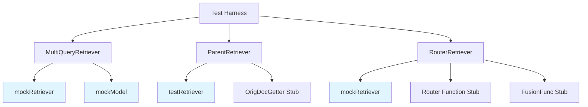

# retriever_strategy_test_doubles 模块深度解析

## 1. 模块概述

`retriever_strategy_test_doubles` 模块是专门为检索策略组件设计的测试替身（Test Doubles）集合。它解决了在测试复杂检索策略时的一个核心问题：如何在不依赖真实检索后端和大语言模型的情况下，对多查询扩展、父文档检索、路由分发等高级检索策略进行快速、可靠、可重复的单元测试。

想象一下，如果你正在测试一个使用真实向量数据库和 LLM 的检索策略，每次测试都需要：等待网络请求、消耗 API 额度、处理随机的 LLM 输出、面对数据库状态的不一致性。这个模块就像是为检索策略提供了一个"可控实验室"，让你能够精确控制每一个输入输出，从而验证策略的逻辑正确性，而不是后端服务的可用性。

## 2. 核心设计理念

### 2.1 问题空间

在测试检索策略时，我们面临几个关键挑战：
- **外部依赖复杂性**：真实的检索器和模型需要网络连接、认证、付费，不适合频繁的单元测试
- **非确定性行为**：LLM 的输出可能每次都不同，导致测试结果不稳定
- **状态管理困难**：向量数据库的状态难以在测试之间完全重置
- **测试覆盖受限**：难以构造极端情况和边界条件来验证策略的鲁棒性

### 2.2 解决方案：可预测的测试替身

本模块采用的核心思想是：**用简单、确定、可配置的测试替身来模拟真实组件的行为**。这些测试替身不是要替代真实实现的功能测试，而是要专注于验证策略本身的逻辑正确性。

### 2.3 架构概览



这个架构图展示了测试替身如何与被测试的检索策略交互。所有标记为蓝色的组件都是本模块提供的测试替身，它们实现了与真实组件相同的接口，但行为完全可控。

## 3. 核心组件详解

### 3.1 mockRetriever（多查询和路由测试用）

**位置**：`flow.retriever.multiquery.multi_query_test.mockRetriever` 和 `flow.retriever.router.router_test.mockRetriever`

这是一个基于字符串匹配的简单检索器，它根据查询字符串中包含的数字返回对应的文档。设计理念是"输入什么数字，得到什么文档"，让测试断言变得直观明了。

**内部工作原理**：
```go
func (m *mockRetriever) Retrieve(ctx context.Context, query string, opts ...retriever.Option) ([]*schema.Document, error) {
    var ret []*schema.Document
    if strings.Contains(query, "1") {
        ret = append(ret, &schema.Document{ID: "1"})
    }
    // ... 类似检查 2-5
    return ret, nil
}
```

**设计意图**：
- **确定性**：相同的输入总是产生相同的输出，消除测试的不稳定性
- **简单性**：不需要复杂的配置，数字就是文档的标识
- **可组合性**：查询中可以包含多个数字，方便测试去重和合并逻辑

**使用场景**：
- 测试 MultiQueryRetriever 时，验证查询扩展后的多个查询是否都被正确执行
- 测试 RouterRetriever 时，验证路由选择和结果融合逻辑

### 3.2 mockModel

**位置**：`flow.retriever.multiquery.multi_query_test.mockModel`

这是一个模拟的大语言模型，用于测试查询扩展策略。它总是返回固定的查询列表：`"12\n23\n34\n14\n23\n45"`。

**设计意图**：
- **固定输出**：避免 LLM 的随机性对测试的影响
- **重复查询**：故意包含重复的查询（"23" 出现两次），用于测试去重逻辑
- **预定义覆盖**：返回的查询覆盖了数字 1-5，便于验证完整的检索覆盖范围

**注意**：`Stream` 和 `BindTools` 方法都直接 panic，这是有意为之——因为在这个测试场景中，我们只需要验证 `Generate` 方法的使用，其他方法的存在只是为了满足接口契约。

### 3.3 testRetriever（父文档测试用）

**位置**：`flow.retriever.parent.parent_test.testRetriever`

这是一个专门为父文档检索策略设计的测试替身。它的行为非常特殊：**返回的文档数量等于查询字符串的长度，每个文档的 `parent` 元数据字段设置为查询字符串中的对应字符**。

**内部工作原理**：
```go
func (t *testRetriever) Retrieve(ctx context.Context, query string, opts ...retriever.Option) ([]*schema.Document, error) {
    ret := make([]*schema.Document, 0)
    for i := range query {
        ret = append(ret, &schema.Document{
            ID:      "",
            Content: "",
            MetaData: map[string]interface{}{
                "parent": query[i : i+1],
            },
        })
    }
    return ret, nil
}
```

**设计意图**：
- **输入驱动输出**：查询字符串直接决定了返回的父文档 ID，例如查询 "123" 会返回三个文档，其 parent 分别为 "1"、"2"、"3"
- **重复测试**：查询 "123233" 会产生重复的父 ID，用于测试父文档去重逻辑
- **元数据提取**：验证 ParentRetriever 是否正确从元数据中提取父 ID

## 4. 数据流程分析

### 4.1 MultiQueryRetriever 测试流程

让我们通过 `TestMultiQueryRetriever` 函数来追踪数据的完整流向：

1. **初始化阶段**：
   - 创建 `mockModel`，它会生成固定的查询扩展结果
   - 创建 `mockRetriever`，它根据查询中的数字返回对应文档
   - 将两者注入 `MultiQueryRetriever`

2. **执行阶段**：
   ```
   "query" → MultiQueryRetriever
               ↓
           mockModel.Generate() → "12\n23\n34\n14\n23\n45"
               ↓
           解析为 6 个查询，去重后为 4 个唯一查询
               ↓
           每个查询调用 mockRetriever.Retrieve()
               ↓
           合并所有结果并去重
               ↓
           返回 4 个文档（ID: 1, 2, 3, 4）
   ```

3. **断言阶段**：
   - 验证最终返回的文档数量为 4，这确认了两个关键点：
     - 查询去重工作正常（6 个原始查询 → 4 个唯一查询）
     - 文档去重工作正常（多个查询可能返回相同文档）

### 4.2 ParentRetriever 测试流程

`TestParentRetriever` 展示了父文档检索的典型数据流：

1. **输入**：查询 "123233"
2. **子检索阶段**：
   - `testRetriever` 返回 6 个文档（与查询长度相同）
   - 每个文档的 `parent` 元数据分别为："1", "2", "3", "2", "3", "3"
3. **父 ID 提取阶段**：
   - 从元数据中提取所有父 ID：["1", "2", "3", "2", "3", "3"]
   - 去重得到：["1", "2", "3"]
4. **父文档获取阶段**：
   - 调用 `OrigDocGetter` 获取这三个父文档
5. **输出**：返回 3 个父文档（ID: 1, 2, 3）

这个流程验证了 ParentRetriever 的核心逻辑：从子文档的元数据中提取父 ID，去重后获取完整的父文档。

### 4.3 RouterRetriever 测试流程

`TestRouterRetriever` 展示了路由检索的数据流：

1. **路由阶段**：
   - `Router` 函数返回 ["2", "3"]，表示选择这两个检索器
2. **并行检索阶段**：
   - 调用 "2" 号 `mockRetriever`，查询 "3" → 返回文档 3
   - 调用 "3" 号 `mockRetriever`，查询 "3" → 返回文档 3
3. **融合阶段**：
   - `FusionFunc` 将两个结果合并 → [文档 3, 文档 3]
4. **输出**：返回 2 个文档

同时，测试还通过回调验证了每个阶段的输出类型是否正确，确保了内部流程的完整性。

## 5. 设计决策与权衡

### 5.1 简单性 vs 完整性

**决策**：测试替身只实现必要的方法，其他方法直接 panic

**分析**：
- **选择理由**：在单元测试中，我们通常只关注组件的一个特定行为路径。实现完整接口会增加测试代码的复杂度，反而可能隐藏真正的问题。
- **权衡**：如果被测代码的路径发生变化，开始调用之前未使用的方法，测试会直接 panic。这其实是一个好的特性——它立即告诉你测试假设被打破了，而不是默默地通过或失败。
- **替代方案**：可以创建完整的模拟实现，但这会增加维护成本，且可能导致测试过于宽松。

### 5.2 硬编码 vs 可配置

**决策**：测试替身的行为是硬编码的，而不是通过配置参数控制

**分析**：
- **选择理由**：硬编码使测试用例更加自包含和可读。当你看到测试用例时，不需要去查看另一个配置文件就能理解预期行为。
- **示例**：`mockModel` 总是返回固定的字符串，这使得测试用例中的断言 `len(result) != 4` 变得非常直观。
- **权衡**：如果需要测试多种场景，可能需要创建多个测试替身。但在实践中，对于单元测试来说，少数几个针对性的测试替身通常就足够了。

### 5.3 基于字符串匹配 vs 真实语义

**决策**：`mockRetriever` 使用简单的字符串包含检查，而不是任何形式的语义匹配

**分析**：
- **选择理由**：字符串匹配是完全可预测的，且性能极高。在测试检索策略时，我们关心的是"是否调用了检索器"、"调用了几次"、"结果如何合并"，而不是"检索器返回的结果是否相关"。
- **更深层的设计思想**：这体现了测试的隔离性原则——我们在测试策略层，而不是检索实现层。检索质量应该在专门测试检索器的测试用例中验证，而不是在这里。

## 6. 使用指南与最佳实践

### 6.1 什么时候使用这些测试替身

**适用场景**：
- 单元测试检索策略的逻辑正确性
- 验证查询扩展、结果合并、去重等纯逻辑行为
- 测试异常处理和边界条件

**不适用场景**：
- 端到端测试（应该使用真实组件）
- 性能测试（测试替身不反映真实性能）
- 检索质量评估（测试替身不提供真实的语义匹配）

### 6.2 常见使用模式

#### 模式 1：验证查询扩展和去重

```go
// 使用 mockModel 和 mockRetriever 测试 MultiQueryRetriever
// mockModel 返回包含重复查询的结果
// 断言最终文档数量确认去重逻辑
```

#### 模式 2：验证父文档提取

```go
// 使用 testRetriever，它的输出直接由查询字符串控制
// 查询 "123233" 会产生重复的父 ID
// 断言最终只有唯一的父文档被返回
```

#### 模式 3：验证路由和融合

```go
// 配置 Router 函数返回特定的检索器选择
// 配置 FusionFunc 来测试不同的融合策略
// 使用回调来验证每个阶段的输出
```

### 6.3 潜在陷阱与注意事项

**陷阱 1：过度依赖测试替身的行为**
- **风险**：如果测试替身的行为与真实组件不一致，测试可能通过但实际代码失败
- **缓解**：定期在集成测试中使用真实组件验证相同的场景

**陷阱 2：忘记更新测试替身**
- **风险**：当接口契约变化时，测试替身可能不再实现正确的接口
- **缓解**：将测试替身与接口定义放在一起审查，使用编译器检查接口实现

**陷阱 3：测试过于具体**
- **风险**：测试断言可能过于关注实现细节（如调用顺序），而不是行为结果
- **缓解**：专注于验证最终输出，而不是中间步骤，除非中间步骤对正确性至关重要

## 7. 与其他模块的关系

`retriever_strategy_test_doubles` 模块与以下模块紧密相关：

- **[retriever_strategies_and_routing](flow_agents_and_retrieval-retriever_strategies_and_routing.md)**：这是被测试的主要模块，包含了 MultiQueryRetriever、ParentRetriever 和 RouterRetriever 的实际实现。
- **[model_retrieval_and_indexing_mocks](internal_runtime_and_mocks-model_retrieval_and_indexing_mocks.md)**：提供了更通用的模型和检索器模拟组件，适用于更复杂的测试场景。
- **[graph_and_workflow_test_harnesses](compose_graph_engine-graph_and_workflow_test_harnesses.md)**：提供了测试图和工作流的基础设施，可以与本模块的测试替身结合使用。

## 8. 总结

`retriever_strategy_test_doubles` 模块通过提供简单、可预测的测试替身，解决了测试复杂检索策略时的外部依赖问题。它的设计体现了几个重要的测试哲学：

1. **隔离性**：测试应该只关注被测试单元的逻辑，而不是外部依赖的正确性
2. **确定性**：相同的输入应该总是产生相同的输出，消除测试的不稳定性
3. **简单性**：测试替身应该足够简单，使得测试用例本身易于理解和维护

这些测试替身不是真实组件的替代品，而是它们的"可控制版本"，让我们能够在实验室环境中验证策略的每个细节。当你需要测试检索策略的逻辑正确性时，这个模块就是你的得力助手。
