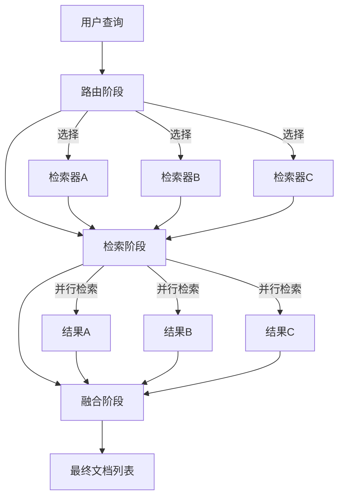

# Router 模块技术深度解析

## 1. 模块定位与问题解决

想象一下，你正在构建一个强大的问答系统，需要从不同来源检索信息：有些使用向量数据库检索语义相似的文档，有些使用关键词搜索，还有些从知识库中查找结构化数据。每个检索器都有其优势，但如何让它们协同工作？

**Router 模块** 正是为了解决这个问题而设计的——它提供了一个灵活的框架，可以根据查询智能选择合适的检索器，将它们的结果合并，并使用先进的排序算法生成最终的文档列表。

## 2. 核心设计理念与思维模型

Router 模块采用了 "路由-检索-融合" 三阶段的处理模型：



这个设计背后的核心思维模型是：
1. **模块化**: 每个组件（路由、检索、融合）都是独立可配置的
2. **灵活性**: 允许自定义路由策略和融合算法
3. **并发性**: 同时调用多个检索器以提高性能
4. **可观察性**: 集成回调系统以追踪执行过程

## 3. 核心组件详解

### 3.1 routerRetriever 结构体

`routerRetriever` 是整个模块的核心实现，它封装了三个关键组件：

```go
type routerRetriever struct {
    retrievers map[string]retriever.Retriever  // 可用的检索器集合
    router     func(ctx context.Context, query string) ([]string, error)  // 路由函数
    fusionFunc func(ctx context.Context, result map[string][]*schema.Document) ([]*schema.Document, error)  // 结果融合函数
}
```

### 3.2 Config 结构体

配置结构提供了完全的灵活性：

```go
type Config struct {
    Retrievers map[string]retriever.Retriever  // 命名的检索器集合
    Router     func(ctx context.Context, query string) ([]string, error)  // 自定义路由逻辑
    FusionFunc func(ctx context.Context, result map[string][]*schema.Document) ([]*schema.Document, error)  // 自定义结果融合
}
```

### 3.3 关键方法解析

#### NewRetriever 工厂函数

```go
func NewRetriever(ctx context.Context, config *Config) (retriever.Retriever, error)
```

**设计意图**：
- 验证配置的完整性（至少一个检索器）
- 提供合理的默认值（默认路由选择所有检索器，默认融合使用 RRF 算法）
- 返回符合 `retriever.Retriever` 接口的实例

#### Retrieve 方法

这是模块的核心执行流程，分为三个阶段：

```go
func (e *routerRetriever) Retrieve(ctx context.Context, query string, opts ...retriever.Option) ([]*schema.Document, error)
```

**执行流程**：
1. **路由阶段**：调用路由函数确定要使用哪些检索器
2. **检索阶段**：并行调用选定的检索器获取文档
3. **融合阶段**：使用融合函数合并和排序结果

**回调集成**：
- 为路由和融合阶段分别设置了回调上下文
- 使用 `ctxWithRouterRunInfo` 和 `ctxWithFusionRunInfo` 创建专用上下文
- 在每个阶段的开始、结束和错误时触发回调

## 4. 数据流动分析

让我们追踪一个查询通过 Router 模块的完整路径：

1. **输入**：用户查询字符串 + 上下文 + 可选参数
2. **路由决策**：
   - 创建路由专用上下文
   - 调用路由函数，传入查询
   - 得到要使用的检索器名称列表
3. **并行检索**：
   - 为每个选定的检索器创建 `utils.RetrieveTask`
   - 使用 `utils.ConcurrentRetrieveWithCallback` 并行执行
   - 收集所有检索结果
4. **结果融合**：
   - 创建融合专用上下文
   - 调用融合函数，传入所有检索结果
   - 得到最终排序的文档列表
5. **输出**：返回最终文档列表

## 5. 默认融合算法：RRF (Reciprocal Rank Fusion)

Router 模块默认使用 RRF 算法进行结果融合：

```go
docRankMap[v[i].ID] += 1.0 / float64(i+60)
```

**设计考虑**：
- RRF 是一种简单但有效的结果融合算法
- 公式：`score(d) = Σ 1/(k + rank(d))`，其中 k 是一个常数（这里使用 60）
- 常数 60 的选择是一个常见的实践值，平衡了靠前和靠后结果的权重

**为什么选择 RRF？**：
- 不需要了解各个检索器的性能特点
- 对不同检索器的结果规模差异不敏感
- 计算简单，性能高效

## 6. 依赖关系与集成

Router 模块与以下关键模块有紧密联系：

- **[Retriever Interface](components.md#retriever-interface)**: 定义了检索器的契约
- **[Document Schema](schema.md#document)**: 定义了文档的数据结构
- **[Retriever Utils](retriever_utils.md)**: 提供并发检索功能
- **[Callbacks System](callbacks.md)**: 用于可观察性和监控

## 7. 设计权衡与决策

### 7.1 灵活性 vs 简单性

**决策**：优先考虑灵活性
- 允许完全自定义路由和融合逻辑
- 提供合理的默认值以简化常见用例

**权衡**：
- 优势：可以适应各种复杂场景
- 劣势：API 表面相对复杂，需要理解多个概念

### 7.2 并行检索 vs 顺序检索

**决策**：使用并行检索
- 通过 `utils.ConcurrentRetrieveWithCallback` 实现

**权衡**：
- 优势：显著提高多个检索器的总体响应时间
- 劣势：一个检索器的失败会导致整个操作失败（当前实现）
- 改进空间：可以考虑实现部分失败容忍策略

### 7.3 回调集成设计

**决策**：为路由和融合阶段创建专用上下文
- 使用 `ctxWithRouterRunInfo` 和 `ctxWithFusionRunInfo`

**权衡**：
- 优势：提供细粒度的可观察性
- 劣势：增加了代码复杂度

## 8. 使用指南与最佳实践

### 8.1 基本使用

```go
// 创建基本的路由器检索器
routerRetriever, err := router.NewRetriever(ctx, &router.Config{
    Retrievers: map[string]retriever.Retriever{
        "vector": vectorRetriever,
        "keyword": keywordRetriever,
    },
})
```

### 8.2 自定义路由

```go
// 根据查询内容智能选择检索器
customRouter := func(ctx context.Context, query string) ([]string, error) {
    if strings.Contains(query, "recent") || strings.Contains(query, "latest") {
        return []string{"time-sensitive-index"}, nil
    }
    if len(query) < 10 {  // 短查询可能更适合关键词搜索
        return []string{"keyword", "vector"}, nil
    }
    return []string{"vector"}, nil  // 长查询使用语义搜索
}

routerRetriever, err := router.NewRetriever(ctx, &router.Config{
    Retrievers: retrievers,
    Router: customRouter,
})
```

### 8.3 自定义融合策略

```go
// 加权融合示例 - 某些检索器的结果更可信
weightedFusion := func(ctx context.Context, result map[string][]*schema.Document) ([]*schema.Document, error) {
    weights := map[string]float64{
        "trusted-source": 2.0,
        "regular-source": 1.0,
    }
    
    docScores := make(map[string]float64)
    docMap := make(map[string]*schema.Document)
    
    for name, docs := range result {
        weight := weights[name]
        if weight == 0 {
            weight = 1.0  // 默认权重
        }
        
        for i, doc := range docs {
            docMap[doc.ID] = doc
            // 简单的基于位置的加权
            positionScore := 1.0 / float64(i+1)
            docScores[doc.ID] += positionScore * weight
        }
    }
    
    // 排序和返回结果...
}
```

## 9. 常见陷阱与注意事项

### 9.1 路由函数返回空列表

**问题**：如果路由函数返回空的检索器列表，会导致错误
**解决方案**：始终确保路由函数至少返回一个检索器，或在自定义路由中处理边界情况

### 9.2 检索器名称不匹配

**问题**：路由函数返回的名称在 Retrievers 映射中不存在
**解决方案**：在创建配置时验证名称一致性，或在路由函数中进行安全检查

### 9.3 文档 ID 一致性

**问题**：RRF 算法依赖文档 ID 进行去重和合并，不同检索器对同一文档可能使用不同 ID
**解决方案**：确保所有检索器对相同内容使用一致的文档 ID，或实现自定义融合函数处理 ID 映射

### 9.4 回调处理

**注意**：Router 模块会为路由和融合阶段创建新的上下文，但会重用父上下文的处理器
**含义**：确保你了解回调上下文的层次结构，避免处理器的意外行为

## 10. 扩展点与未来方向

Router 模块设计了几个关键的扩展点：

1. **自定义路由逻辑**：可以实现基于查询分类、检索器性能历史等高级路由策略
2. **自定义融合函数**：可以实现基于机器学习的结果重排序、跨检索器的结果去重等
3. **部分失败处理**：可以扩展为容忍个别检索器失败，返回部分结果

## 11. 总结

Router 模块是一个强大而灵活的工具，用于协调多个检索器的工作。它的设计理念是通过分离关注点（路由、检索、融合）和提供可配置的默认值，来平衡灵活性和易用性。

通过 Router 模块，你可以构建智能检索系统，充分利用不同检索技术的优势，同时保持系统的可维护性和可扩展性。
