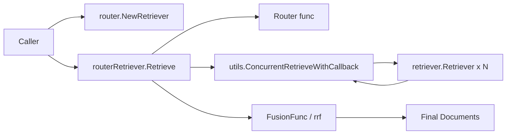

# router_retriever 深度解析

`router_retriever` 的核心价值，可以用一句话概括：**把“该去哪个检索器查”与“查完怎么合并”从业务代码里抽出来，做成一个可组合的检索编排器**。在真实系统里，单一 retriever 往往覆盖不全：有的擅长语义召回，有的擅长关键词，有的只服务某类数据域。朴素做法是上层自己 `if/else` 挑 retriever，再手工 merge 结果；这会很快演变成难维护的分支地狱。`router_retriever` 通过“路由 + 并发检索 + 融合排序”三段式，把这件事封装成一个标准 `retriever.Retriever`，让上游继续只面对一个统一接口。

## 架构角色与数据流



从代码角色上看，这个模块是一个**orchestrator（编排器）**，不是底层召回算法本身。`routerRetriever` 不关心某个 retriever 内部怎么查，它只做三件事：先通过 `Router` 决定要调用哪些 retriever，然后借助 `utils.ConcurrentRetrieveWithCallback` 并发拉取结果，最后把各路结果交给 `FusionFunc`（默认 `rrf`）融合成单一文档列表。

`NewRetriever` 是构造入口，返回值类型是 `retriever.Retriever`，这点很关键：它让 router retriever 在类型层面与普通 retriever 完全等价，可被任何只依赖 `retriever.Retriever` 的上游透明接入。`Retrieve` 是热路径；每次查询都会走这条链路，因此这里的错误处理、并发模型、回调埋点，都是运行期最敏感的部分。

## 心智模型：像“总机 + 并行外呼 + 话务汇总”

可以把这个模块想象成一个客服总机：

- `Router` 像接线员，先判断这个问题该转给哪些专家坐席。
- 各个 `retriever.Retriever` 是专家坐席，被并行呼叫。
- `FusionFunc` 是值班经理，把多位专家答案汇总排序后给出最终答复。

这个模型的设计重点是**职责分离**：

- 路由策略可以按业务演化（规则、模型判断、AB 实验）。
- 召回执行并发化，降低整体尾延迟。
- 融合策略可替换，不把排序规则硬编码在执行层。

## 核心组件深挖

### `Config`

`Config` 是策略注入点，包含三个字段：

- `Retrievers map[string]retriever.Retriever`：注册表，key 是路由输出的 retriever 名称。
- `Router func(ctx context.Context, query string) ([]string, error)`：输入 query，输出应调用的 retriever 名单。
- `FusionFunc func(ctx context.Context, result map[string][]*schema.Document) ([]*schema.Document, error)`：把多路结果融合成最终列表。

设计意图是让执行框架稳定，而把“选路”和“融合”这两个最容易变化的策略做成函数注入。这是典型的“骨架固定、策略可插拔”。

### `NewRetriever`

`NewRetriever` 负责构造 `routerRetriever`。它会做最基本校验（`Retrievers` 不能为空），并尝试提供默认策略：

- 若未提供 `Router`，理论上应回退为“全量 retriever 都调用”。
- 若未提供 `FusionFunc`，回退到默认 `rrf`。

这里有一个需要新贡献者特别注意的实现细节：函数内确实计算了本地变量 `router` 的默认值，但返回结构体时赋值的是 `router: config.Router`，不是本地变量 `router`。这意味着当 `config.Router == nil` 时，`routerRetriever.router` 仍可能是 `nil`，`Retrieve` 调用时会触发空函数调用 panic。**从代码行为看这是一个明显的实现缺陷/疏漏**，不是设计本意。

### `routerRetriever`

`routerRetriever` 是具体实现，字段分别承载 retriever 注册表、路由函数、融合函数。它通过 `Retrieve` 满足 `retriever.Retriever` 接口契约：

```go
type Retriever interface {
    Retrieve(ctx context.Context, query string, opts ...Option) ([]*schema.Document, error)
}
```

这保证了它可在任何“期望一个 retriever”的地方被直接替换。

### `(*routerRetriever).Retrieve`

这是模块主流程，按时间顺序分为三段。

第一段是**路由**。代码先用 `ctxWithRouterRunInfo` 构造带回调元信息的上下文，再 `callbacks.OnStart` 记录路由输入（query），调用 `e.router` 得到 retriever 名称列表。若路由失败或返回空列表，会 `callbacks.OnError` 并返回错误。成功则 `callbacks.OnEnd` 上报路由结果。

第二段是**并发检索**。它把路由结果转成 `[]*utils.RetrieveTask`，每个任务携带 `Name`、`Retriever`、`Query`、`RetrieveOptions`。随后调用 `utils.ConcurrentRetrieveWithCallback(ctx, tasks)`：该工具函数内部用 goroutine + `sync.WaitGroup` 并发执行每个 retriever 的 `Retrieve`，并为每个任务补齐 `Result` 或 `Err`，还带有 panic recover 保护。回到主流程后，`routerRetriever` 顺序扫描 tasks，任何一个子任务失败即整体失败（fail-fast），否则汇总为 `map[string][]*schema.Document`。

第三段是**融合**。它用 `ctxWithFusionRunInfo` 标记运行信息，`callbacks.OnStart` 上报融合输入（多路结果 map），调用 `e.fusionFunc` 输出最终文档序列，并通过 `callbacks.OnEnd` 上报结果。

### `rrf`（默认融合策略）

默认 `FusionFunc` 是 `rrf`。实现要点如下：

- 输入为空时报错 `no documents`。
- 仅一路结果时直接返回该路文档。
- 多路结果时，对每个文档按名次累加分数：`1.0 / float64(i+60)`。
- 用 `Document.ID` 做去重键并汇总最终对象。
- 最后按累计分数降序排序输出。

这属于 **Reciprocal Rank Fusion** 的一种实现（带常数偏移 60）。直觉上，它不会过度放大某一路第 1 名的优势，同时奖励“在多路里都排得不错”的文档，适合 heterogeneous retriever 的结果融合。

### `ctxWithRouterRunInfo` 与 `ctxWithFusionRunInfo`

这两个函数的作用是给 callbacks 系统注入 `RunInfo`：

- `Component: compose.ComponentOfLambda`
- `Type: "Router"` 或 `"FusionFunc"`
- `Name = Type + string(Component)`（测试里可见如 `RouterLambda`、`FusionFuncLambda`）

它们本质是观测性（observability）桥接点，让路由与融合在 tracing/callback 面板中成为可辨识的步骤。

## 依赖与调用关系分析

这个模块直接依赖了几类契约。

它向下依赖 `components/retriever`：`routerRetriever` 自己实现 `retriever.Retriever`，同时又组合多个 `retriever.Retriever` 作为子调用目标。换句话说，它既是 retriever，也是 retriever 的调用者，形成“接口同构”的组合关系。

它向下依赖 `flow/retriever/utils` 的 `RetrieveTask` 与 `ConcurrentRetrieveWithCallback`，把并发执行、panic recover、子调用 callback 这些横切逻辑外包出去，避免 `router.go` 自己管理 goroutine 细节。

它向下依赖 `callbacks` 和 `compose` 的运行元信息体系，通过 `callbacks.OnStart/OnEnd/OnError` 和 `callbacks.ReuseHandlers` 打通可观测性链路。测试 `router_test.go` 明确验证了这些事件的输出类型与名字约定。

它与 `schema.Document` 之间的核心数据契约是：融合与去重依赖 `Document.ID` 的稳定性和唯一性。如果上游 retriever 不填 `ID` 或 `ID` 冲突，融合行为会明显退化。

反过来看上游，任何只接受 `retriever.Retriever` 的组件都可以把 router retriever 当普通 retriever 使用。从模块树可见，它属于 [Flow Retrievers](Flow Retrievers.md) 家族，可与 [multiquery_rewriter_retriever](multiquery_rewriter_retriever.md)、[parent_document_retriever](parent_document_retriever.md) 在更高层组合；但具体谁直接调用谁，需要结合调用方代码进一步确认。

## 关键设计取舍

`router_retriever` 选择了“函数注入策略 + 固定执行框架”，牺牲了一些静态类型约束，换来高度可定制性。`Router` 与 `FusionFunc` 都是函数签名而不是接口对象，配置非常轻量；代价是当函数为空或行为不符合隐式约定时，只能运行时暴露问题（例如上面提到的 nil router 风险）。

并发执行选择了“全并发 + 全等待 + 失败即整体失败”。这对延迟友好，也保证了最终结果的一致性语义（不返回部分成功）；但如果某一路 retriever 不稳定，会拖垮整个查询成功率。若业务更偏可用性，可能会想改成“允许部分失败并打标返回”。当前实现显然偏正确性与简单语义。

默认 `rrf` 采用基于 rank 的融合，而非直接依赖各 retriever 的原始 score。这个选择提升了跨 retriever 可比性（不同检索器 score 标尺常常不一致），但也丢失了各自 score 的细粒度信息。对异构检索系统来说，这是常见且实用的折中。

## 使用方式与实践建议

最小可用示例（显式提供 Router 与 FusionFunc）：

```go
r, err := router.NewRetriever(ctx, &router.Config{
    Retrievers: map[string]retriever.Retriever{
        "semantic": semanticRetriever,
        "keyword":  keywordRetriever,
    },
    Router: func(ctx context.Context, query string) ([]string, error) {
        return []string{"semantic", "keyword"}, nil
    },
    FusionFunc: func(ctx context.Context, result map[string][]*schema.Document) ([]*schema.Document, error) {
        return rrfLike(result), nil
    },
})
if err != nil { /* ... */ }

docs, err := r.Retrieve(ctx, "how to build agent with eino")
```

工程上建议优先做两件事：第一，确保所有子 retriever 返回稳定 `Document.ID`；第二，给 `Router` 增加白名单校验与降级逻辑，避免输出未注册名称导致请求直接失败。

## 边界条件与易踩坑

- `Config.Retrievers` 为空时，`NewRetriever` 直接报错。
- `Router` 返回空列表时，`Retrieve` 返回 `no retriever has been selected`。
- `Router` 输出未注册名称时，`Retrieve` 返回 `router output[%s] has not registered`。
- 任一子任务报错（或 panic，经 `ConcurrentRetrieveWithCallback` recover 后转 error）会使整体失败。
- 默认 `rrf` 在输入结果 map 为空时报 `no documents`。
- `rrf` 依赖 `Document.ID` 去重；空 ID/重复 ID 会引发覆盖或错误聚合。
- 当前 `NewRetriever` 存在 `Router` 默认值未真正写入 `routerRetriever` 的风险（见上文），在未传 `Config.Router` 时尤其需要警惕。

## 给新贡献者的修改建议

如果你要扩展这个模块，优先保持三段式结构稳定：路由、并发执行、融合。大多数需求都应通过替换 `Router` 或 `FusionFunc` 实现，而不是改动 `Retrieve` 主流程。若必须调整主流程（例如引入部分失败容忍、超时分组、加权路由），请同步评估 callback 事件语义是否还能保持一致，否则可观测性会先坏掉。

另外，建议先补一个回归测试覆盖“`Config.Router == nil` 时应走默认全量路由”的期望行为，再修复构造函数赋值问题。这类 bug 对外表现是运行时 panic，优先级通常高于策略优化。

## 相关模块

- [multiquery_rewriter_retriever](multiquery_rewriter_retriever.md)
- [parent_document_retriever](parent_document_retriever.md)
- [embedding_retriever_indexer_options_and_callbacks](embedding_retriever_indexer_options_and_callbacks.md)
- [Callbacks System](Callbacks System.md)
