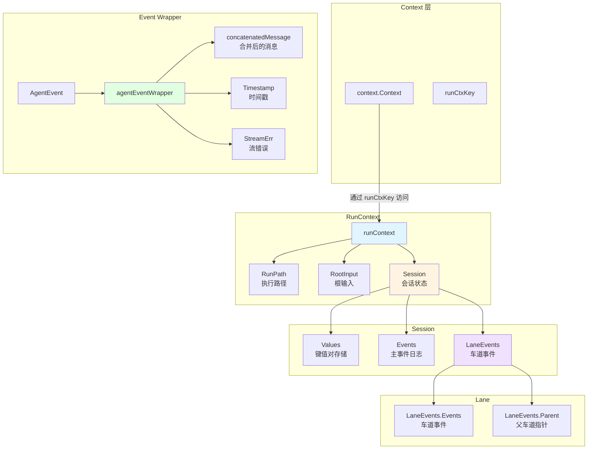

# Run Context and Session State 深度解析

## 核心问题：在异步、可中断的多 Agent 执行环境中管理共享状态

想象你正在构建一个多智能体协作系统：一个主 Agent 调用多个子 Agent，子 Agent 可能并行执行、互相传递数据、随时可能被中断和恢复。在这个过程中，你需要回答几个棘手的问题：

1. **如何追踪执行路径？** 哪个 Agent 产生了哪个事件？当事件从嵌套的 Agent 层级向上冒泡时，如何保持调用链的完整性？
2. **如何共享状态？** 不同的 Agent 需要访问共同的上下文信息（如用户 ID、会话 ID），但又要避免状态污染？
3. **如何处理并行执行中的事件顺序？** 当多个 Agent 并行产生事件时，如何按照时间戳而不是完成顺序来合并它们？
4. **如何支持中断恢复？** 当 Agent 被中断后恢复执行时，如何正确重建运行上下文，包括历史事件和会话状态？

`run_context_and_session_state` 模块正是为了解决这些问题而设计的。它提供了一个轻量级的、基于 Go `context.Context` 的运行时状态管理机制，让 Agent 执行过程中的上下文传递、事件收集和会话数据共享变得可控且线程安全。

## 心智模型：可追踪的执行沙盒

### 把 RunContext 想象成一个"可追踪的执行沙盒"

每个 Agent 的执行都在一个沙盒中进行，这个沙盒有三个核心组件：

- **执行路径（RunPath）**：就像函数调用栈，记录了从根 Agent 到当前 Agent 的完整调用链。每进入一个 Agent，就在路径上压入一个 `RunStep`。
- **事件日志（Events）**：就像一个分布式追踪系统中的 span 记录，每个 Agent 执行过程中产生的所有事件（输出、动作、错误）都被有序地记录在这里。
- **会话存储（Session Values）**：就像一个线程安全的全局缓存，允许 Agent 之间共享键值对数据，用于跨 Agent 的上下文传递。

### 并行执行中的"车道"隐喻

当多个 Agent 并行执行时，`run_context_and_session_state` 使用了"车道（lane）"的概念：

- **主车道**：串行执行路径上的事件，直接追加到主事件日志。
- **子车道**：并行分支中的事件，先在各自的子车道中收集，待所有分支完成后，按时间戳合并到主车道。

这就像多条高速公路汇入一条主干道——每条车道上的车辆先在自己的车道上行驶，最后在汇合点按到达顺序合并。

## 架构概览



### 核心组件职责

| 组件 | 职责 | 关键特性 |
|------|------|----------|
| `runContext` | 单次执行的完整上下文 | 包含执行路径、根输入、会话引用 |
| `runSession` | 会话状态容器 | 线程安全的键值对存储和事件收集 |
| `laneEvents` | 并行执行的事件车道 | 通过 `Parent` 指针形成链表结构，支持车道嵌套 |
| `agentEventWrapper` | 事件的包装器 | 提供时间戳排序、序列化支持、流错误处理 |

## 数据流：一次完整的执行旅程

让我们追踪一个典型的多 Agent 执行场景，看看数据如何在系统中流动。

### 场景：一个顺序执行后接并行执行的 Workflow

```go
// 伪代码，展示执行流程
mainAgent.Run(ctx, input)  // 主 Agent 开始
    -> subAgent1.Run(ctx)   // 串行执行子 Agent
        -> 产生事件 A
    -> subAgent2.Run(ctx)   // 串行执行子 Agent
        -> 产生事件 B
    -> parallelAgent.Run(ctx)  // 并行执行多个子 Agent
        -> forkRunCtx(ctx)     // 创建车道 1
        -> forkRunCtx(ctx)     // 创建车道 2
        -> subAgent3.Run(lane1Ctx)  // 在车道 1 执行
            -> 产生事件 C（ts=100）
        -> subAgent4.Run(lane2Ctx)  // 在车道 2 执行
            -> 产生事件 D（ts=50）
        -> joinRunCtxs(parentCtx, lane1Ctx, lane2Ctx)  // 合并车道
            -> 按时间戳排序：D, C
            -> 提交到主事件日志
```

### 阶段 1：初始化（initRunCtx）

```go
// 1. 从 context 中获取现有的 runContext（如果有）
runCtx := getRunCtx(ctx)

// 2. 如果是首次执行，创建新的 runContext 和 session
if runCtx == nil {
    runCtx = &runContext{
        Session: newRunSession(),  // 创建空的事件日志和值存储
    }
}

// 3. 深拷贝 RunPath，为当前 Agent 添加新的步骤
runCtx.RunPath = append(runCtx.RunPath, RunStep{agentName: agentName})

// 4. 如果是根 Agent，保存根输入
if runCtx.isRoot() && input != nil {
    runCtx.RootInput = input
}

// 5. 将更新后的 runContext 存回 context
ctx = setRunCtx(ctx, runCtx)
```

**设计意图**：每次进入 Agent 时都创建 `RunPath` 的副本，而不是修改共享的切片。这确保了不同的执行分支不会互相干扰。

### 阶段 2：串行执行的事件收集

```go
// Agent 产生事件时，调用 addEvent
func (rs *runSession) addEvent(event *AgentEvent) {
    // 1. 包装事件，添加时间戳
    wrapper := &agentEventWrapper{
        AgentEvent: event,
        TS: time.Now().UnixNano(),
    }
    
    // 2. 判断是否在并行车道中
    if rs.LaneEvents != nil {
        // 在车道中：无锁追加到车道的事件切片
        rs.LaneEvents.Events = append(rs.LaneEvents.Events, wrapper)
    } else {
        // 在主路径上：加锁追加到主事件日志
        rs.mtx.Lock()
        rs.Events = append(rs.Events, wrapper)
        rs.mtx.Unlock()
    }
}
```

**设计意图**：在串行执行时，所有事件都追加到主事件日志。由于多个 goroutine 可能同时访问（例如在并行执行的分支结束后合并时），所以需要加锁。在车道中执行时，由于每个车道是独立的，可以无锁追加。

### 阶段 3：并行执行的分支（forkRunCtx）

```go
// 创建并行车道时
func forkRunCtx(ctx context.Context) context.Context {
    parentRunCtx := getRunCtx(ctx)
    
    // 1. 创建新的 session，共享已提交的历史事件和值
    childSession := &runSession{
        Events:    parentRunCtx.Session.Events,    // 共享引用
        Values:    parentRunCtx.Session.Values,    // 共享引用
        valuesMtx: parentRunCtx.Session.valuesMtx,  // 共享互斥锁
    }
    
    // 2. 创建新的车道，指向父车道
    childSession.LaneEvents = &laneEvents{
        Parent: parentRunCtx.Session.LaneEvents,  // 形成链表
        Events: make([]*agentEventWrapper, 0),
    }
    
    // 3. 创建新的 runContext，深拷贝 RunPath
    childRunCtx := &runContext{
        RootInput: parentRunCtx.RootInput,
        RunPath:   make([]RunStep, len(parentRunCtx.RunPath)),
        Session:   childSession,
    }
    copy(childRunCtx.RunPath, parentRunCtx.RunPath)
    
    return setRunCtx(ctx, childRunCtx)
}
```

**设计意图**：
- **共享已提交历史**：子车道通过共享 `Events` 和 `Values` 的引用，可以读取父会话的所有状态，但新的事件会写入自己的车道。
- **链式父指针**：`LaneEvents.Parent` 形成单向链表，支持任意深度的车道嵌套（例如并行的并行）。
- **深拷贝 RunPath**：每个车道有独立的 `RunPath` 副本，避免修改时影响其他分支。

### 阶段 4：并行执行的合并（joinRunCtxs）

```go
// 合并多个子上下文的事件
func joinRunCtxs(parentCtx context.Context, childCtxs ...context.Context) {
    // 1. 收集所有车道中的新事件
    newEvents := unwindLaneEvents(childCtxs...)
    
    // 2. 按时间戳排序（并行分支中的事件按发生顺序合并）
    sort.Slice(newEvents, func(i, j int) bool {
        return newEvents[i].TS < newEvents[j].TS
    })
    
    // 3. 提交到父上下文
    commitEvents(parentCtx, newEvents)
}

// 从车道链表中收集所有事件
func unwindLaneEvents(ctxs ...context.Context) []*agentEventWrapper {
    var allNewEvents []*agentEventWrapper
    for _, ctx := range ctxs {
        runCtx := getRunCtx(ctx)
        if runCtx != nil && runCtx.Session != nil && runCtx.Session.LaneEvents != nil {
            allNewEvents = append(allNewEvents, runCtx.Session.LaneEvents.Events...)
        }
    }
    return allNewEvents
}
```

**设计意图**：
- **时间戳排序**：确保并行执行的事件按真实发生顺序合并，而不是按分支完成顺序。这对于 LLM 上下文构建至关重要——消息顺序影响模型的推理。
- **无锁读取父指针**：`laneEvents.Parent` 在创建后是不可变的，因此读取时无需加锁。

### 阶段 5：获取完整事件视图（getEvents）

```go
func (rs *runSession) getEvents() []*agentEventWrapper {
    // 场景 1：没有车道，直接返回主事件日志
    if rs.LaneEvents == nil {
        rs.mtx.Lock()
        events := rs.Events
        rs.mtx.Unlock()
        return events
    }
    
    // 场景 2：有车道，构建完整视图
    
    // 1. 获取已提交的主事件日志（深拷贝，避免竞态）
    rs.mtx.Lock()
    committedEvents := make([]*agentEventWrapper, len(rs.Events))
    copy(committedEvents, rs.Events)
    rs.mtx.Unlock()
    
    // 2. 遍历车道链表，收集所有事件
    var laneSlices [][]*agentEventWrapper
    totalLaneSize := 0
    for lane := rs.LaneEvents; lane != nil; lane = lane.Parent {
        if len(lane.Events) > 0 {
            laneSlices = append(laneSlices, lane.Events)
            totalLaneSize += len(lane.Events)
        }
    }
    
    // 3. 合并已提交事件和车道事件
    finalEvents := make([]*agentEventWrapper, 0, len(committedEvents)+totalLaneSize)
    finalEvents = append(finalEvents, committedEvents...)
    
    // 4. 按从父到子的顺序追加车道事件（假设已按时间戳排序）
    for i := len(laneSlices) - 1; i >= 0; i-- {
        finalEvents = append(finalEvents, laneSlices[i]...)
    }
    
    return finalEvents
}
```

**设计意图**：`getEvents` 提供了一个统一的事件视图，无论是否有并行车道。调用者不需要关心内部结构，只需按顺序处理事件即可。

### 阶段 6：序列化与恢复（GobEncode/GobDecode）

`agentEventWrapper` 实现了 `gob.GobEncoder` 和 `gob.GobDecoder` 接口，支持将运行时状态序列化到检查点：

```go
func (a *agentEventWrapper) GobEncode() ([]byte, error) {
    // 1. 如果事件包含流式消息，将已合并的消息转换回流
    if a.concatenatedMessage != nil && 
       a.Output != nil && 
       a.Output.MessageOutput != nil && 
       a.Output.MessageOutput.IsStreaming {
        a.Output.MessageOutput.MessageStream = schema.StreamReaderFromArray([]Message{a.concatenatedMessage})
    }
    
    // 2. 使用 gob 编码
    buf := &bytes.Buffer{}
    err := gob.NewEncoder(buf).Encode((*otherAgentEventWrapperForEncode)(a))
    if err != nil {
        return nil, fmt.Errorf("failed to gob encode agent event wrapper: %w", err)
    }
    return buf.Bytes(), nil
}
```

**设计意图**：
- **流式消息的序列化**：`concatenatedMessage` 是为了性能预先合并的消息，序列化时需要转换回流的形式，以便恢复时正确处理。
- **避免循环引用**：通过 `otherAgentEventWrapperForEncode` 类型别名，绕过 gob 对指针类型的递归编码问题。

## 组件深度解析

### runContext：执行的骨架

```go
type runContext struct {
    RootInput *AgentInput      // 根 Agent 的输入，用于恢复时重建执行上下文
    RunPath   []RunStep        // 执行路径，记录调用链
    Session   *runSession      // 会话状态，包含事件和值存储
}
```

**设计决策**：为什么 `RunPath` 是切片而不是链表？

- **权衡**：切片在遍历时更高效（连续内存），但追加时需要拷贝。
- **选择原因**：调用深度通常较浅（< 10 层），拷贝成本可忽略。切片在序列化和日志记录时更直观。
- **深拷贝的必要性**：如果多个分支共享同一个切片，一个分支修改 `RunPath` 会影响其他分支。`deepCopy()` 确保了分支间的隔离。

### runSession：会话状态的容器

```go
type runSession struct {
    Values    map[string]any      // 键值对存储
    valuesMtx *sync.Mutex         // 保护 Values 的互斥锁
    
    Events     []*agentEventWrapper  // 主事件日志
    LaneEvents *laneEvents           // 当前车道（如果有）
    mtx        sync.Mutex            // 保护 Events 和 LaneEvents
}
```

**设计决策**：为什么 `Values` 和 `Events` 使用不同的锁？

- **Values 的访问模式**：通常是频繁的读写操作（`AddSessionValue`, `GetSessionValue`），独立的锁可以减少竞争。
- **Events 的访问模式**：通常是批量追加和整体读取（`addEvent`, `getEvents`），使用一个锁足以保护。
- **车道事件的特殊性**：`LaneEvents.Events` 在创建后仅被单线程写入（对应的车道），所以 `addEvent` 在车道中不需要加锁。

**为什么 `Values` 使用指针类型的锁？**

- 车道共享父会话的 `valuesMtx` 指针，确保所有车道访问同一个锁。
- 如果每个车道创建新锁，会导致并发安全问题（多个 goroutine 同时修改 `Values`）。

### laneEvents：并行执行的快照

```go
type laneEvents struct {
    Events []*agentEventWrapper  // 车道中的事件
    Parent *laneEvents           // 父车道指针
}
```

**设计决策**：为什么使用链表而不是树？

- **权衡**：链表更简单（单向指针），但遍历到父节点需要 O(n)。树可以支持 O(log n) 的查找，但结构更复杂。
- **选择原因**：车道嵌套深度通常较小（< 5 层），O(n) 的遍历成本可忽略。链表在序列化时更容易处理（无需处理循环引用）。
- **不可变性保证**：`Parent` 指针在创建后永不修改，这允许在 `getEvents` 和 `unwindLaneEvents` 中无锁读取。

### agentEventWrapper：事件的增强容器

```go
type agentEventWrapper struct {
    *AgentEvent                       // 原始事件
    
    mu                  sync.Mutex    // 保护以下字段
    concatenatedMessage Message       // 合并后的消息（性能优化）
    TS                  int64         // 创建时间戳（纳秒）
    StreamErr           error         // 流错误（用于重试逻辑）
}
```

**为什么需要 `concatenatedMessage`？**

- **问题**：流式消息（`MessageStream`）在生成时是分块发送的，但恢复时需要完整的消息用于 LLM 上下文。
- **解决方案**：首次消费 `MessageStream` 时，将所有块合并到 `concatenatedMessage`，后续访问直接返回缓存。
- **权衡**：增加内存占用，但避免了重新生成消息流的开销。

**为什么 `StreamErr` 需要特殊处理？**

- **问题**：`MessageStream` 是一次性消费的，如果第一次消费时出错，第二次访问会得到 EOF 而不是错误。
- **解决方案**：将第一次遇到的错误存储到 `StreamErr`，后续访问直接返回这个错误。
- **重试场景**：如果 Agent 配置了重试，`StreamErr` 可能是 `WillRetryError`，表示重试正在进行中。

## 依赖分析

### 调用者（Depended By）

| 调用者 | 使用场景 | 期望行为 |
|--------|----------|----------|
| `flowAgent` ([agent_contracts_and_handoff](agent-contracts_and_context-agent_contracts_and_handoff.md)) | 工作流编排，管理多个子 Agent 的执行顺序 | 正确设置 `RunPath`，合并并行事件 |
| `workflowAgent` ([workflow_agents](../../workflow-agents.md)) | 顺序/并行/循环工作流 | 支持 `forkRunCtx` 和 `joinRunCtxs` |
| `agentTool` ([agent_tool_adapter](../../agent-tool-adapter.md)) | 将 Agent 作为工具调用，传递事件 | 正确传递 `RunPath` 到嵌套 Agent |
| `interrupt` ([interrupt_resume_bridge](../../interrupt-resume-bridge.md)) | 中断恢复，重建运行上下文 | 支持序列化和反序列化 `runContext` |

### 被调用者（Depends On）

| 依赖 | 使用场景 | 契约 |
|------|----------|------|
| `context.Context` | 存储和传递 `runContext` | 使用 `runCtxKey` 作为键 |
| `sync.Mutex` | 保护并发访问 | 确保正确加锁和解锁 |
| `schema.StreamReaderFromArray` | 重建流式消息 | 提供正确的消息切片 |
| `time.Now()` | 生成时间戳 | 需要单调递增（或至少可排序） |

### 数据契约

1. **AgentEvent 的 RunPath**：由框架设置，用户不应修改。`flowAgent` 在事件没有 `RunPath` 时设置，`agentTool` 在转发事件时添加前缀。
2. **MessageStream 的独占性**：一旦被消费，不应再次访问。`agentEventWrapper` 通过 `concatenatedMessage` 和 `StreamErr` 处理这个问题。
3. **Session Values 的键冲突**：用户需自行管理键的命名空间，避免冲突。模块提供 `AddSessionValues` 和 `GetSessionValue`，但不强制隔离。

## 设计决策与权衡

### 1. 基于 context.Context 而非自定义的传递机制

**权衡**：
- **优点**：与 Go 生态系统的标准模式一致，无需学习新的 API。自然支持取消和超时。
- **缺点**：类型不安全（`ctx.Value` 返回 `interface{}`），需要运行时类型断言。

**为什么仍然选择 context.Context？**
Go 社区对 `context.Context` 作为请求范围的上下文传递机制有广泛共识。虽然有类型不安全的问题，但这是可接受的成本，尤其是考虑到 Agent 执行框架本身已经在大量使用 context。

### 2. 共享 Values 和 Events 引用而非深拷贝

**权衡**：
- **优点**：减少内存占用，避免大量的数据拷贝。车道的修改立即可见（通过锁保护）。
- **缺点**：需要严格的锁管理，容易引入竞态条件。

**为什么选择共享引用？**
Session Values 和 Events 的大小不可预测（可能包含大量的消息历史），深拷贝的成本很高。通过细粒度的锁（`valuesMtx` 和 `mtx`）和不可变性保证（`LaneEvents.Parent`），可以在安全性和性能之间取得平衡。

### 3. 时间戳排序而非依赖分支完成顺序

**权衡**：
- **优点**：确保事件的时序正确性，即使分支的完成顺序与事件发生顺序不一致。
- **缺点**：依赖系统时钟，在时钟跳变的极端情况下可能出错。

**为什么选择时间戳排序？**
LLM 的上下文构建高度依赖消息顺序。如果并行分支的事件按完成顺序合并，可能导致消息的因果顺序错误。时间戳排序虽然依赖系统时钟，但在大多数场景下是可靠的，且时钟跳变的概率极低。

### 4. laneEvents 使用链表而非树

**权衡**：
- **优点**：结构简单，序列化时无需处理循环引用。嵌套深度通常较小，遍历成本可忽略。
- **缺点**：查找效率低（O(n)），不支持快速访问特定层级。

**为什么选择链表？**
车道嵌套的典型深度是 2-3 层（例如并行内的并行），遍历成本可忽略。链表在序列化时更简单——只需序列化每个节点的 `Events` 和 `Parent` 指针，无需处理树的复杂结构。

### 5. Gob 序列化而非 JSON

**权衡**：
- **优点**：二进制格式更紧凑，支持 Go 类型系统（包括循环引用处理），性能更好。
- **缺点**：不跨语言，调试不如 JSON 直观。

**为什么选择 Gob？**
检查点数据仅在 Go 运行时内部使用，不需要跨语言兼容。Gob 的二进制格式和内置的类型支持使得序列化更高效。

### 6. agentEventWrapper 内部嵌套 sync.Mutex

**权衡**：
- **优点**：保护 `concatenatedMessage` 的并发访问，避免重复消费 `MessageStream`。
- **缺点**：增加结构体大小，可能导致缓存不友好的内存布局。

**为什么选择内嵌锁？**
`concatenatedMessage` 的访问模式是"读多写少"（首次消费时写入，后续多次读取）。内置的 `sync.Mutex` 提供了简单的保护机制。性能影响在大多数场景下可忽略，因为锁的竞争仅发生在流式消息的首次消费时。

## 使用场景与示例

### 场景 1：在 Agent 之间共享状态

```go
// Agent A 设置会话值
func (a *AgentA) Run(ctx context.Context, input *AgentInput) *AsyncIterator[*AgentEvent] {
    // ... 执行逻辑 ...
    
    // 设置用户 ID，供后续 Agent 使用
    AddSessionValue(ctx, "user_id", "12345")
    
    // 返回事件
    // ...
}

// Agent B 读取会话值
func (b *AgentB) Run(ctx context.Context, input *AgentInput) *AsyncIterator[*AgentEvent] {
    // 获取用户 ID
    userID, ok := GetSessionValue(ctx, "user_id")
    if !ok {
        // 处理错误或使用默认值
    }
    
    // 使用 userID 执行逻辑
    // ...
}
```

### 场景 2：自定义车道管理（高级用法）

```go
// 在自定义并行执行中使用 forkRunCtx 和 joinRunCtxs
func customParallelExecution(ctx context.Context, agents []Agent) {
    // 为每个 Agent 创建车道
    childCtxs := make([]context.Context, len(agents))
    for i, agent := range agents {
        childCtxs[i] = forkRunCtx(ctx)
        
        go func(idx int, a Agent) {
            a.Run(childCtxs[idx], input)
        }(i, agent)
    }
    
    // 等待所有车道完成
    // ...
    
    // 合并车道事件
    joinRunCtxs(ctx, childCtxs...)
}
```

### 场景 3：隔离嵌套的 Multi-Agent

```go
// 当一个 Multi-Agent 作为另一个 Multi-Agent 的子 Agent 时，
// 可能需要隔离执行上下文
func (outerAgent *MultiAgent) Run(ctx context.Context, input *AgentInput) *AsyncIterator[*AgentEvent] {
    // ... 执行逻辑 ...
    
    // 创建新的上下文，不继承外部的 RunPath
    innerCtx := ClearRunCtx(ctx)
    innerCtx = ctxWithNewRunCtx(innerCtx, input, false)
    
    // 运行内部的 Multi-Agent
    innerAgent.Run(innerCtx, input)
    
    // ...
}
```

### 场景 4：顺序工作流中的路径更新

```go
// 在顺序执行多个 Agent 时，使用 updateRunPathOnly
func sequentialWorkflow(ctx context.Context, agents []Agent) {
    currentCtx := ctx
    
    for _, agent := range agents {
        // 只更新 RunPath，不修改 Address
        currentCtx = updateRunPathOnly(currentCtx, agent.Name(ctx))
        
        agent.Run(currentCtx, input)
    }
}
```

## 边界情况与注意事项

### 1. 并行车道的事件可见性

**问题**：并行车道中的事件是否在执行过程中对其他车道可见？

**答案**：否。车道中的事件只在车道完成后，通过 `joinRunCtxs` 合并到父上下文后才可见。这避免了并行分支之间的数据竞争。

**例外**：如果共享 `Session.Values`，并通过 `AddSessionValue` 传递数据，那么其他车道可以读取到这些值（因为共享同一个 `Values` map 和锁）。

### 2. 嵌套并行执行的栈溢出风险

**问题**：深层嵌套的并行执行是否会耗尽栈空间？

**答案**：否。车道嵌套是通过链表实现的，每次嵌套只增加一个 `laneEvents` 节点，不增加调用栈深度。

**注意事项**：`LaneEvents.Parent` 链表的遍历是 O(n) 的，如果嵌套深度非常大（> 100），可能会影响性能。但在实际场景中，嵌套深度通常 < 5。

### 3. MessageStream 的并发消费

**问题**：多个 goroutine 同时消费 `MessageStream` 会发生什么？

**答案**：未定义行为。`MessageStream` 必须独占消费。

**保护机制**：`agentEventWrapper` 通过 `concatenatedMessage` 和 `StreamErr` 确保流只被消费一次。如果多个 goroutine 同时访问 `getMessageFromWrappedEvent`，锁会串行化访问。

### 4. Session Values 的键冲突

**问题**：如果多个 Agent 使用相同的键设置会话值，会发生什么？

**答案**：后设置的值会覆盖先设置的值。

**建议**：使用命名空间约定，例如 `"agent_a.user_id"` 而不是 `"user_id"`。

### 5. 时间戳排序的时钟依赖

**问题**：如果系统时钟发生跳变（例如手动调整时间），时间戳排序是否会出错？

**答案**：是。如果时钟向后跳变，较晚发生的事件可能获得较早的时间戳，导致排序错误。

**建议**：在生产环境中，确保系统时钟正确配置，并使用 NTP 同步。

### 6. 序列化时的内存占用

**问题**：序列化大量的历史事件是否会耗尽内存？

**答案**：可能。如果事件历史非常大（例如包含成千上万条消息），序列化时的内存占用会很高。

**建议**：
- 定期检查点，避免事件历史无限增长。
- 在 `agentEventWrapper` 中，可以考虑移除不再需要的字段（如 `concatenatedMessage`）以减少内存占用。

### 7. Context 取消与资源清理

**问题**：当 context 被取消时，`MessageStream` 是否会被自动关闭？

**答案**：否。Agent 需要手动关闭 `MessageStream`，或使用 `SetAutomaticClose()` 确保流在未被消费时也能关闭。

**建议**：在生成 `AgentEvent` 时，始终为 `MessageStream` 调用 `SetAutomaticClose()`。

### 8. 深拷贝 RunPath 的性能影响

**问题**：每次进入 Agent 都深拷贝 `RunPath`，是否会成为性能瓶颈？

**答案**：在调用深度较小时（< 10），拷贝成本可忽略。如果调用深度非常大（> 100），可能会成为瓶颈。

**建议**：在深度嵌套的场景中，考虑使用 `updateRunPathOnly` 而不是 `initRunCtx`，避免不必要的深拷贝。

### 9. LaneEvents.Parent 的不可变性假设

**问题**：如果代码违反约定，在创建后修改 `LaneEvents.Parent`，会发生什么？

**答案**：无锁读取会看到不一致的状态，导致事件丢失或重复。

**建议**：不要直接修改 `LaneEvents.Parent`。如果需要修改车道结构，使用框架提供的 API（`forkRunCtx`, `joinRunCtxs`）。

### 10. Gob 序列化的版本兼容性

**问题**：如果 `agentEventWrapper` 的字段结构发生变化，旧的检查点是否能恢复？

**答案**：取决于具体的变化。Gob 对新增字段有较好的兼容性，但对删除或重命名字段的处理可能不理想。

**建议**：
- 在检查点结构变化时，提供迁移逻辑。
- 考虑使用版本号字段，以便在将来处理不兼容的变更。

## 调试与故障排查

### 1. 检查 RunPath 的完整性

```go
// 在 Agent 中检查当前执行路径
func (a *MyAgent) Run(ctx context.Context, input *AgentInput) *AsyncIterator[*AgentEvent] {
    runCtx := getRunCtx(ctx)
    if runCtx != nil {
        fmt.Printf("Current run path: %v\n", runCtx.RunPath)
    }
    // ...
}
```

### 2. 监控车道事件

```go
// 在并行执行完成后，检查车道中的事件
func checkLaneEvents(ctx context.Context) {
    runCtx := getRunCtx(ctx)
    if runCtx != nil && runCtx.Session != nil && runCtx.Session.LaneEvents != nil {
        fmt.Printf("Lane events count: %d\n", len(runCtx.Session.LaneEvents.Events))
    }
}
```

### 3. 追踪 Session Values 的变化

```go
// 添加日志，追踪会话值的设置和读取
func logSessionValues(ctx context.Context) {
    values := GetSessionValues(ctx)
    fmt.Printf("Session values: %v\n", values)
}
```

### 4. 检查 MessageStream 的错误

```go
// 在消费 MessageStream 时，检查是否有错误
func consumeMessageStream(wrapper *agentEventWrapper) error {
    if wrapper.StreamErr != nil {
        return wrapper.StreamErr
    }
    // ... 正常消费 ...
}
```

## 与其他模块的协作

### 与 [flowAgent](agent-contracts_and_context-agent_contracts_and_handoff.md) 的协作

- **flowAgent** 使用 `initRunCtx` 初始化子 Agent 的运行上下文。
- 在并行执行时，使用 `forkRunCtx` 创建车道。
- 在并行执行完成后，使用 `joinRunCtxs` 合并事件。
- 在产生事件时，如果事件的 `RunPath` 为空，`flowAgent` 会设置它。

### 与 [agentTool](../../agent-tool-adapter.md) 的协作

- `agentTool` 将 Agent 作为工具调用时，会传递当前的 `RunPath` 到嵌套的 Agent。
- 在转发嵌套 Agent 的事件时，`agentTool` 会在事件的 `RunPath` 前添加当前 Agent 的名称。

### 与 [workflowAgent](../../workflow-agents.md) 的协作

- 在顺序工作流中，使用 `updateRunPathOnly` 更新执行路径。
- 在并行工作流中，使用 `forkRunCtx` 和 `joinRunCtxs`。
- 在循环工作流中，`RunPath` 会记录每次迭代。

### 与 [interrupt](../../interrupt-resume-bridge.md) 的协作

- 在中断时，序列化 `runContext` 到检查点。
- 在恢复时，反序列化 `runContext` 并重建执行上下文。
- `RootInput` 用于恢复时重新初始化根 Agent。

## 总结

`run_context_and_session_state` 模块是 Agent 执行框架的基石，它解决了异步、可中断、可嵌套的多 Agent 执行中的状态管理难题。通过精心设计的数据结构和并发控制机制，它在保证线程安全的同时，提供了高效的内存使用和简洁的 API。

**核心设计原则**：
1. **基于 context.Context**：与 Go 生态系统的标准模式一致。
2. **深拷贝隔离分支，共享引用减少开销**：在安全性和性能之间取得平衡。
3. **时间戳排序确保时序正确性**：对 LLM 上下文构建至关重要。
4. **链式车道支持任意嵌套**：简化并行执行的实现。
5. **序列化支持中断恢复**：为长期运行的 Agent 提供容错能力。

**适用场景**：
- 多 Agent 协作系统
- 需要 LLM 上下文历史的工作流
- 支持中断恢复的长时间任务
- 并行执行的 Agent 编排

**不适用场景**：
- 超大规模的并行执行（> 1000 个并行分支）
- 需要跨语言兼容的状态管理
- 对内存占用极度敏感的场景

通过理解这个模块的设计意图和权衡，你可以更好地使用它来构建可靠的 Agent 系统，并在遇到问题时快速定位和解决。
