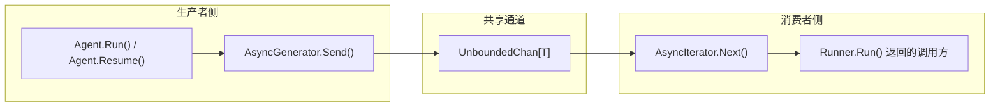
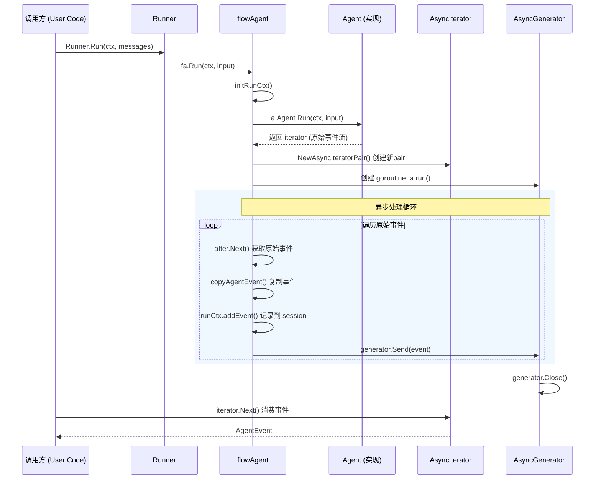

# async_iteration_utilities 模块技术文档

## 概述

`async_iteration_utilities` 模块是 ADK 运行时中负责异步迭代和事件流处理的核心基础设施。它位于 `adk_runtime/agent_contracts_and_context/run_context_and_session_state/` 路径下，为整个 ADK 框架提供了一种简洁而强大的异步事件迭代模式。

**这个模块解决什么问题？**

在构建 Agent 运行时系统时，我们面临一个核心挑战：Agent 的执行是异步的、事件驱长的。一个 Agent 在运行过程中会产生多个事件（AgentEvent），包括中间步骤、工具调用结果、最终输出等。调用方需要一种机制来：

1. **流式获取事件**：不是等待 Agent 完全执行完毕，而是实时接收每一个事件
2. **处理错误流**：当 Agent 执行出错时，错误也需要作为一个"事件"传递给调用方
3. **支持中断恢复**：在 Checkpoint 场景下，需要能够从中断点恢复事件流

传统的做法是使用 Go 的原生 channel，但原生 channel 存在一些不便之处：需要手动管理缓冲区大小、关闭逻辑复杂、难以实现"迭代器"语义等。本模块通过引入 `AsyncIterator` 和 `AsyncGenerator` 这一对搭档，提供了一个更高级、更易用的抽象。

## 架构设计

### 核心抽象：迭代器-生成器模式

想象一下工厂流水线上的传送带：

- **生成器（AsyncGenerator）** 就像是流水线的"投料口"，负责向传送带上放置物品（发送事件）
- **迭代器（AsyncIterator）** 就像是流水线的"取料口"，负责从传送带上取出物品（接收事件）
- **传送带（UnboundedChan）** 是连接两者的内部通道，它有一个关键特性：**无界**——投料口可以随时投放物品，不会因为缓冲区满而阻塞；取料口则会在物品到来之前阻塞等待



### 组件详解

#### 1. AsyncIterator[T any]

```go
type AsyncIterator[T any] struct {
    ch *internal.UnboundedChan[T]
}

func (ai *AsyncIterator[T]) Next() (T, bool)
```

**设计意图**：`AsyncIterator` 是整个 ADK 事件流的核心出口。它的 `Next()` 方法会阻塞等待，直到：
- 通道中有新元素——返回 `(element, true)`
- 通道已关闭且为空——返回 `(zero value, false)`

**内部机制**：底层依赖于 `UnboundedChan.Receive()`，该方法使用 `sync.Cond` 实现条件变量，等待数据可用时唤醒。

**使用场景**：
- `Runner.Run()` 方法返回 `*AsyncIterator[*AgentEvent]`——调用方通过循环调用 `Next()` 获取每一个 Agent 事件
- `Runner.Query()` 同样返回迭代器，用于简化单次查询场景

#### 2. AsyncGenerator[T any]

```go
type AsyncGenerator[T any] struct {
    ch *internal.UnboundedChan[T]
}

func (ag *AsyncGenerator[T]) Send(v T)
func (ag *AsyncGenerator[T]) Close()
```

**设计意图**：`AsyncGenerator` 是事件的生产端。它的 `Send()` 方法是非阻塞的——无论消费者是否准备好，它都能立即将数据放入通道。`Close()` 方法则标记数据流的结束。

**关键特性**：
- **非阻塞发送**：不会因为消费者慢而产生背压（backpressure），这简化了生产者代码，但需要注意内存使用
- **单生产者、多消费者友好**：虽然设计为单生产者，但底层 `UnboundedChan` 支持多消费者（需要额外同步）

#### 3. NewAsyncIteratorPair[T any]

```go
func NewAsyncIteratorPair[T any]() (*AsyncIterator[T], *AsyncGenerator[T])
```

**设计意图**：这是一个工厂函数，它创建一对共享同一底层通道的迭代器和生成器。这种"成对创建"的模式确保了：

1. 两者的底层通道完全一致，不存在"接错线"的可能
2. 迭代器和生成器生命周期一致，便于管理

**典型用法**：

```go
// 在 Runner.Run() 中
iterator, generator := NewAsyncIteratorPair[*AgentEvent]()

go func() {
    defer generator.Close()
    for {
        event, ok := agentIter.Next()
        if !ok {
            break
        }
        // 处理 event...
        generator.Send(event)
    }
}()

return iterator // 返回迭代器给调用方
```

#### 4. UnboundedChan[T any] —— 底层通道

这是 `internal` 包中的一个无界通道实现（详见 [internal/channel.go](https://github.com/cloudwego/eino/blob/main/internal/channel.go)），核心特性：

- 使用 `sync.Mutex` + `sync.Cond` 实现
- `Send()` 非阻塞，永不panic（除非向已关闭通道发送）
- `Receive()` 阻塞直到有数据或通道关闭
- `Close()` 标记关闭状态，唤醒所有等待的接收者

### 辅助函数

#### genErrorIter(err error)

```go
func genErrorIter(err error) *AsyncIterator[*AgentEvent]
```

这是一个便捷函数，用于快速创建一个只包含错误事件的迭代器。在 `flowAgent.Run()` 和 `flowAgent.Resume()` 中，当预检查失败时，直接返回错误迭代器而不是完整的执行流程：

```go
// flow.go 中的用法
input, err := a.genAgentInput(ctx, runCtx, o.skipTransferMessages)
if err != nil {
    return genErrorIter(err)  // 快速失败场景
}
```

## 数据流分析

### 完整调用链：Runner.Run()



### Checkpoint 场景下的额外处理

当 `Runner` 配置了 `CheckPointStore` 时，数据流会增加一个额外层：

```go
// runner.go 中的处理
iter := fa.Run(ctx, input, opts...)
if r.store == nil {
    return iter
}

niter, gen := NewAsyncIteratorPair[*AgentEvent]()
go r.handleIter(ctx, iter, gen, o.checkPointID)  // 增加 Checkpoint 处理层
return niter
```

`handleIter()` 负责：
1. 遍历原始事件流
2. 检测中断（Interrupt）事件，触发 Checkpoint 保存
3. 将处理后的事件转发给新的迭代器

### 错误处理流

当 Agent 执行过程中发生错误时，错误通过以下路径传播：

1. **预检查失败**（如 `genAgentInput` 返回错误）→ `genErrorIter(err)` → 返回只含错误事件的迭代器
2. **运行时的 panic** → `defer` 捕获 → 转换为 `AgentEvent`（包含错误） → `generator.Send()` → `generator.Close()`

## 设计决策与权衡

### 1. 无界通道 vs 有界通道

**选择**：使用 `UnboundedChan`（无界）

**理由**：
- **简化生产者逻辑**：生产者不需要关心消费者的处理速度，不需要处理"缓冲区满"的情况
- **避免死锁**：有界通道在某些场景下容易引发死锁，无界通道降低了使用复杂度
- **适合 ADK 场景**：Agent 事件的产生速率通常不会特别高，且事件需要被实时消费

**代价**：
- **潜在内存问题**：如果消费者明显慢于生产者，通道会积累大量未消费的元素，占用内存
- **反压缺失**：无法像有界通道那样通过阻塞来"提醒"生产者慢下来

**缓解措施**：在实际使用中，`Runner.handleIter()` 和 `flowAgent.run()` 都有 defer 中的 `generator.Close()` 确保通道最终会被关闭，防止泄漏。

### 2. 迭代器模式 vs Go Channel 直接返回

**选择**：封装 `AsyncIterator` 和 `AsyncGenerator`

**对比**：

| 特性 | 原始 Channel | 迭代器封装 |
|------|-------------|------------|
| 语义清晰度 | 较低，需理解 channel 语义 | 明确的"拉取"语义 |
| API 友好度 | 需要处理 channel 关闭和读取的边界 | `Next() (value, ok)` 更直观 |
| 可测试性 | 较难 mock | 易于 mock 接口 |
| 灵活性 | 高 | 中等，但足够用 |

**理由**：在 ADK 框架中，我们需要对事件流进行精细控制（如 `copyAgentEvent`、Checkpoint 拦截等），迭代器模式提供了更好的封装点。

### 3. 泛型设计

**选择**：使用 Go 泛型 `AsyncIterator[T]`

**理由**：
- **类型安全**：避免使用 `interface{}` 带来的类型断言
- **代码复用**：`AsyncIterator[*AgentEvent]` 和 `AsyncIterator[string>` 共享同一实现
- **性能**：编译时类型擦除，开销与 `interface{}` 相当

### 4. goroutine 所有权的隐式约定

**设计约定**：生成器（AsyncGenerator）在哪个 goroutine 中创建，就**应该**在同一 goroutine 中被 `Close()`。

**原因**：
- `UnboundedChan.Close()` 会调用 `Broadcast()` 唤醒所有等待者
- 如果在非创建 goroutine 中调用 Close，可能与 Send/Receive 形成竞态
- 代码中通过 defer 确保 Close 在正确的位置被调用

## 使用指南

### 基础用法：消费 Agent 事件

```go
runner := adk.NewRunner(ctx, adk.RunnerConfig{
    Agent:           myAgent,
    EnableStreaming: true,
})

iter := runner.Run(ctx, messages)
for {
    event, ok := iter.Next()
    if !ok {
        break
    }
    
    if event.Err != nil {
        fmt.Printf("Agent error: %v\n", event.Err)
        continue
    }
    
    if event.Action != nil && event.Action.Interrupted != nil {
        fmt.Printf("Agent interrupted: %+v\n", event.Action.Interrupted)
        // 可以保存 checkpointID 用于恢复
        continue
    }
    
    if event.Output != nil && event.Output.MessageOutput != nil {
        msgOutput := event.Output.MessageOutput
        if msgOutput.IsStreaming {
            // 处理流式输出
            for {
                msg, err := msgOutput.MessageStream.Recv()
                if err == io.EOF {
                    break
                }
                fmt.Print(msg.Content)
            }
        } else {
            // 处理非流式输出
            fmt.Print(msgOutput.Message.Content)
        }
    }
}
```

### 快速错误处理

```go
iter := runner.Run(ctx, messages)
event, ok := iter.Next()
if !ok {
    return fmt.Errorf("no events returned")
}
if event.Err != nil {
    return fmt.Errorf("agent failed: %w", event.Err)
}
```

### 注意事项

1. **必须消费完所有事件**：`Next()` 返回 `ok=false` 时表示通道已关闭且所有消息已消费完毕。不要在仍有数据时就放弃迭代，否则可能导致 goroutine 泄漏。

2. **generator.Close() 的位置**：确保在所有 `Send()` 完成**之后**调用 `Close()`。代码中通常使用 `defer generator.Close()` 在 goroutine 退出时执行。

3. **流式输出的生命周期**：`Agent.Run()` 接口注释中提到：
   > "如果返回的 AgentEvent 包含 MessageStream，该 MessageStream 必须是独占的、安全的"
   
   这意味着消费流式数据时，该流是专属的，不需要复制。但如果你需要保留事件供后续使用，应使用 `copyAgentEvent()`。

4. **并发安全**：`AsyncIterator` 和 `AsyncGenerator` 本身是线程安全的（底层由 `UnboundedChan` 的 mutex 保护），但对同一元素的多次消费需要额外同步。

## 相关模块

- [run_context_and_session_state](run_context_and_session_state.md) —— 运行上下文和会话状态管理，与本模块共享 `adk/utils.go`
- [agent_events_steps_and_message_variants](agent_events_steps_and_message_variants.md) —— AgentEvent、MessageVariant 等数据结构
- [agent_run_options](agent_run_options.md) —— Agent 执行选项配置
- [agent_contracts_and_handoff](agent_contracts_and_handoff.md) —— Agent 接口定义（包含 `Agent.Run()` 返回 `*AsyncIterator[*AgentEvent]` 的契约）