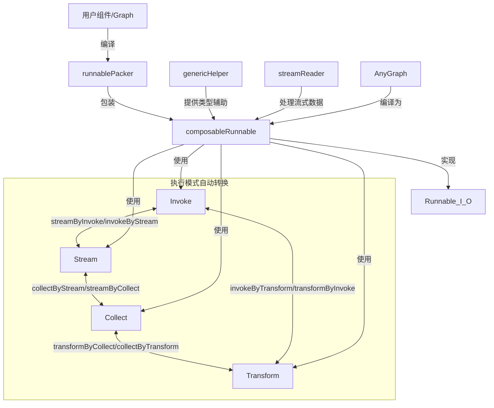
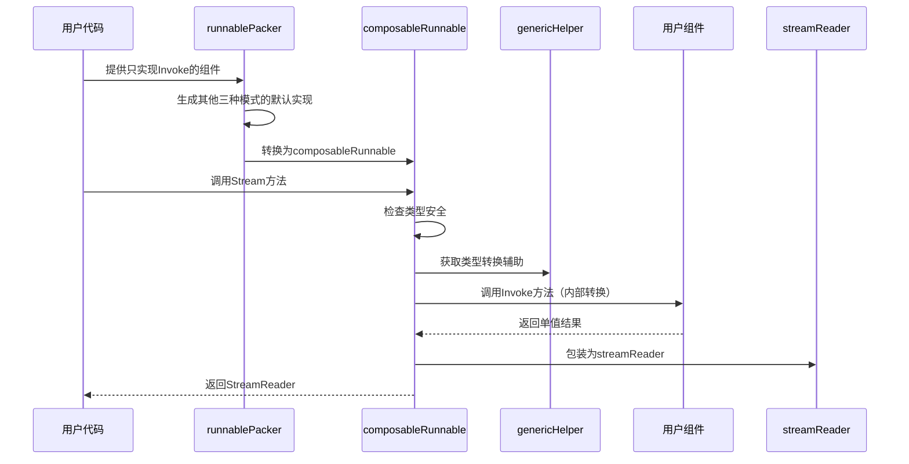

# Runnable 和类型系统

## 模块概览

在复杂的 AI 应用程序编排系统中，组件交互面临着两大核心挑战：**数据流式与批量处理的互操作性** 和 **类型安全与动态组合的平衡**。`runnable_and_type_system` 模块正是为解决这些挑战而设计的核心基础设施。

想象一下：你有一个 LLM 组件，它只实现了流式输出（`Stream`），但你的业务逻辑需要等待完整结果才能继续；或者你有一个工具链，其中一些组件处理单值输入，另一些处理流式输入，但你希望它们能无缝连接。`Runnable` 抽象就是为了解决这些问题而存在的。

这个模块提供了一个统一的执行抽象层，将不同执行模式（Invoke/Stream/Collect/Transform）统一在 `Runnable` 接口下，实现了四种数据流模式的自动降级兼容。这意味着即使一个组件只实现了其中一种方法，你也可以调用其他方法，系统会自动进行适配转换。

## 核心抽象与心智模型

### 四模式执行模型

该模块的核心洞察是：**任何数据处理组件都可以通过四种基本模式来描述其执行方式**，并且这些模式之间可以互相转换：

- **Invoke**: 单值输入 → 单值输出（`ping => pong`）
- **Stream**: 单值输入 → 流式输出（`ping => stream output`）
- **Collect**: 流式输入 → 单值输出（`stream input => pong`）
- **Transform**: 流式输入 → 流式输出（`stream input => stream output`）

这种设计允许组件只实现它们最自然的执行模式，而系统会自动提供其他三种模式的实现。

### 类型层与执行层分离

系统采用了两层设计：
1. **类型安全层**（`Runnable[I, O]` 接口）：提供编译时类型检查
2. **动态执行层**（`composableRunnable` 结构体）：处理运行时的类型适配和组件组合

这种分离使得系统既可以享受 Go 语言的类型安全，又能处理动态组件编排的需求。

**心智模型类比**：
可以把这个系统想象成一个**万能电源适配器**：
- `Runnable` 接口是标准的插座规格
- `composableRunnable` 是具体的适配器
- `runnablePacker` 是适配器工厂，能根据你有的插头类型生成合适的适配器
- 四种执行模式就像不同的插头类型，适配器能在它们之间自动转换

## 架构与数据流

让我们通过一个架构图来理解组件之间的关系：



### 架构图解析

这个架构图展示了 `runnable_and_type_system` 模块的核心组件和它们之间的关系：

1. **上层**：用户组件或 Graph 通过编译过程，由 `runnablePacker` 包装成 `composableRunnable`
2. **核心层**：`composableRunnable` 是系统的核心，它实现了 `Runnable[I, O]` 接口
3. **辅助层**：`genericHelper` 提供类型辅助功能，`streamReader` 处理流式数据
4. **执行模式层**：展示了四种执行模式之间的自动转换关系

**数据流**：
- 从用户组件开始，经过包装和编译，最终通过统一的 `Runnable` 接口执行
- 执行过程中，根据需要在四种模式之间自动转换
- 类型安全由 `genericHelper` 保证，流式数据由 `streamReader` 处理

### 端到端数据流示例

为了更好地理解模块的工作原理，让我们通过一个具体的例子来追踪数据流：



**数据流解析**：
1. 用户提供一个只实现了 `Invoke` 方法的组件
2. `runnablePacker` 为其生成 `Stream`、`Collect`、`Transform` 的默认实现
3. 转换为 `composableRunnable`，保存类型信息
4. 用户调用 `Stream` 方法（虽然组件只实现了 `Invoke`）
5. `composableRunnable` 进行类型检查
6. 内部通过 `streamByInvoke` 转换，先调用 `Invoke` 获取单值结果
7. 将单值结果包装为 `streamReader` 返回给用户

### 核心组件解析

让我们详细分析每个核心组件的设计和实现：

#### Runnable[I, O] 接口

这是整个系统的公共 API，定义了四种执行模式：

```go
type Runnable[I, O any] interface {
    Invoke(ctx context.Context, input I, opts ...Option) (output O, err error)
    Stream(ctx context.Context, input I, opts ...Option) (output *schema.StreamReader[O], err error)
    Collect(ctx context.Context, input *schema.StreamReader[I], opts ...Option) (output O, err error)
    Transform(ctx context.Context, input *schema.StreamReader[I], opts ...Option) (output *schema.StreamReader[O], err error)
}
```

**设计意图**：提供统一的执行接口，允许调用者以任何方便的模式与组件交互，而不必关心组件内部实际实现了哪种模式。这是整个模块的"门面"，对外暴露简洁的 API，内部处理复杂的适配逻辑。

**为什么这四种模式**：
- 这四种模式覆盖了数据处理的所有可能组合：单值/流输入 × 单值/流输出
- 它们形成了一个完整的转换图，可以在任意两种模式之间转换

#### runnablePacker 结构体

```go
type runnablePacker[I, O, TOption any] struct {
    i Invoke[I, O, TOption]
    s Stream[I, O, TOption]
    c Collect[I, O, TOption]
    t Transform[I, O, TOption]
}
```

**职责**：
1. 接收用户提供的任何子集的执行模式实现
2. 自动补全缺失的执行模式（通过转换函数）
3. 包装回调函数（如果启用）

**关键函数 `newRunnablePacker`**：这是执行模式自动补全的核心，它实现了一个优先级决策树：
- 对于 `Invoke`：优先使用用户提供的实现，否则尝试从 `Stream` 转换，然后是 `Collect`，最后是 `Transform`
- 类似的逻辑适用于其他三种模式

**设计决策**：为什么这样的优先级？
- 优先选择用户直接实现的模式，因为这通常是最高效的
- 其次选择转换步骤最少的模式，减少性能开销
- 例如，`Stream` → `Invoke` 只需要收集流，而 `Transform` → `Invoke` 需要先将单值包装为流，然后 `Transform`，最后再收集

#### composableRunnable 结构体

```go
type composableRunnable struct {
    i invoke
    t transform
    
    inputType  reflect.Type
    outputType reflect.Type
    optionType reflect.Type
    
    *genericHelper
    
    isPassthrough bool
    
    meta *executorMeta
    
    // 仅在 Graph 节点中可用
    nodeInfo *nodeInfo
}
```

**职责**：
1. 提供类型擦除后的执行接口（使用 `any` 类型）
2. 持有类型元数据，用于运行时类型检查
3. 集成 `genericHelper` 处理复杂的类型转换
4. 支持图节点的特殊功能（如输入/输出键映射）

**关键实现**：
- `i` 和 `t` 字段：类型擦除后的 `Invoke` 和 `Transform` 函数（系统的两个"基础"模式，其他模式可通过它们构建）
- 类型断言和 nil 处理的特殊逻辑：专门处理 Go 中 `any` 类型的 nil 值丢失类型信息的问题

**为什么只有 i 和 t**：
- 因为从这两个模式可以推导出其他所有模式
- `Stream` 可以通过 `Transform` 实现（将单值包装为流）
- `Collect` 可以通过 `Invoke` 实现（先收集流为单值）
- 这样设计减少了内部需要处理的特殊情况

#### genericHelper 结构体

```go
type genericHelper struct {
    inputStreamFilter, outputStreamFilter streamMapFilter
    inputConverter, outputConverter handlerPair
    inputFieldMappingConverter, outputFieldMappingConverter handlerPair
    inputStreamConvertPair, outputStreamConvertPair streamConvertPair
    
    inputZeroValue, outputZeroValue func() any
    inputEmptyStream, outputEmptyStream func() streamReader
}
```

**职责**：
1. 处理所有与泛型相关的辅助功能，避免代码重复
2. 提供流式数据的键过滤（用于图中键值对数据的传递）
3. 提供类型转换器（用于运行时类型检查和转换）
4. 支持字段映射（用于将 map 输入转换为结构体）
5. 提供流与非流数据的互转（用于检查点）

**设计亮点**：
- `forMapInput()` 和 `forMapOutput()` 方法：创建一个新的 `genericHelper`，专门处理 map 类型的输入或输出
- 针对 passthrough 节点的特殊处理方法：`forPredecessorPassthrough()` 和 `forSuccessorPassthrough()`

**为什么需要这么多转换器**：
- 图节点之间的数据传递有多种场景：直接传递、按键过滤、字段映射等
- 每种场景需要不同的转换逻辑
- 将这些逻辑集中在 `genericHelper` 中，避免了代码重复

#### streamReader 接口

```go
type streamReader interface {
    copy(n int) []streamReader
    getType() reflect.Type
    getChunkType() reflect.Type
    merge([]streamReader) streamReader
    withKey(string) streamReader
    close()
    toAnyStreamReader() *schema.StreamReader[any]
    mergeWithNames([]streamReader, []string) streamReader
}
```

**职责**：
1. 类型擦除的流式数据读取器接口
2. 支持流式数据的复制、合并、键包装等操作
3. 作为 `schema.StreamReader[T]` 的动态包装

**实现细节**：
- `streamReaderPacker[T]`：具体实现，包装 `schema.StreamReader[T]`
- `packStreamReader` 和 `unpackStreamReader`：在类型化和非类型化表示之间转换的工具函数

**关键功能解析**：
- `copy(n int)`：创建 n 个独立的流副本，这在需要将一个流分发给多个下游节点时非常有用
- `merge([]streamReader)`：合并多个流，用于处理 fan-in 场景
- `withKey(string)`：将流中的每个值包装为 `map[string]any{key: value}`，用于图中的键值对数据传递
- `mergeWithNames([]streamReader, []string)`：合并多个流，并保留每个流的来源名称

#### AnyGraph 接口

```go
type AnyGraph interface {
    getGenericHelper() *genericHelper
    compile(ctx context.Context, options *graphCompileOptions) (*composableRunnable, error)
    inputType() reflect.Type
    outputType() reflect.Type
    component() component
}
```

**职责**：
1. 作为所有可组合图（Graph、Chain 等）的统一标识
2. 提供图编译为可运行组件的接口
3. 暴露类型信息，用于图之间的类型兼容性检查

**设计意图**：
- 这是一个"标记"接口，让系统可以识别哪些类型是可编译的图
- 同时提供了必要的方法，让编译过程可以获取所需的信息
- 通过这个接口，Graph、Chain 等不同的图实现可以统一处理

## 关键设计决策与权衡

### 执行模式的自动转换：灵活性 vs 性能

**决策**：系统自动在四种执行模式之间转换，即使这意味着有时会有性能开销。

**推理**：
- 简化组件开发：组件开发者只需实现最自然的执行模式
- 提高组合性：任意组件都可以与任意其他组件连接，不管它们的执行模式
- 性能权衡：有时会进行不必要的流-数组-流转换，但这在大多数 AI 应用场景中是可接受的，因为计算瓶颈通常在模型推理而不是数据格式转换

**替代方案**：
- 要求所有组件实现所有四种模式：会大大增加组件开发负担
- 在编译时检查执行模式兼容性：会使图构建 API 变得复杂

**数据流中的实际影响**：
- 当你调用一个只实现了 `Stream` 的组件的 `Invoke` 方法时，系统会先调用 `Stream` 获取流，然后收集所有流数据作为单个结果返回
- 这种转换对调用者是透明的，但会有等待所有流数据的延迟

### 类型安全与动态组合：编译时检查 vs 运行时灵活性

**决策**：使用两层设计 - 类型安全的公共 API 和类型擦除的内部实现。

**推理**：
- 公共 API 提供了良好的开发体验和编译时类型检查
- 内部实现可以处理动态图构建和执行的复杂性
- 通过反射和类型断言在边界处进行类型检查，确保运行时安全性

**权衡**：
- 增加了一定的实现复杂性
- 类型错误有时会在运行时才暴露，而不是编译时
- 但获得了极大的灵活性，允许动态构建和组合组件

**实际例子**：
- 当你构建一个图时，你可以使用类型安全的 API 来添加节点和连接边
- 但在内部，图的编译和执行使用类型擦除的 `composableRunnable`
- 这种设计允许你在运行时动态构建图，同时保持编译时的类型安全

### Invoke 和 Transform 作为基础模式

**决策**：系统内部主要依赖 `Invoke` 和 `Transform` 两种模式，其他模式可以通过它们构建。

**推理**：
- 这两种模式代表了数据处理的两个基本方式：批量处理和流式处理
- 从这两种模式可以相对高效地推导出其他模式
- 简化了内部实现，减少了需要处理的特殊情况

**为什么选择这两个模式**：
- `Invoke` 代表了最简单的处理模式：输入一个值，输出一个值
- `Transform` 代表了最通用的处理模式：输入一个流，输出一个流
- 其他所有模式都可以通过这两个模式的组合来实现

### nil 处理的特殊逻辑

**决策**：实现了专门的逻辑来处理 `any` 类型的 nil 值，因为在 Go 中 `any(nil)` 会丢失原始类型信息。

**代码示例**：
```go
if input == nil && reflect.TypeOf((*I)(nil)).Elem().Kind() == reflect.Interface {
    var i I
    in = i
}
```

**推理**：
- 这是 Go 语言中一个众所周知的棘手问题
- 不处理这种情况会导致在组件传递 nil 接口值时出现意外的类型断言失败
- 虽然增加了一些复杂性，但大大提高了系统的鲁棒性

**实际场景**：
- 假设你有一个组件，它的输入类型是某个接口 `MyInterface`
- 如果你传递一个 `nil` 给它，在 Go 中这个 `nil` 会被包装为 `any(nil)`，失去了 `MyInterface` 的类型信息
- 系统会检测这种情况，并显式创建一个 `MyInterface` 类型的 nil 值，确保类型断言成功

## 使用指南与常见模式

### 将组件包装为 Runnable

使用 `runnableLambda` 函数将您的组件包装为 `Runnable`：

```go
// 假设您有一个只实现了 Invoke 的组件
myInvokeFunc := func(ctx context.Context, input string, opts ...MyOption) (string, error) {
    // 您的实现
    return "processed: " + input, nil
}

// 包装为 Runnable
r := runnableLambda(myInvokeFunc, nil, nil, nil, true)

// 现在您可以使用任何执行模式！
result, err := r.Invoke(ctx, "hello")
stream, err := r.Stream(ctx, "hello")
// ... 等等
```

**内部工作原理**：
- `runnableLambda` 会创建一个 `runnablePacker`
- `runnablePacker` 会为缺失的执行模式生成默认实现
- 最后转换为 `composableRunnable`

### 在图中使用带键的输入输出

当您将组件添加到图中时，可以指定输入和输出键：

```go
// 假设我们有一个图
g := NewGraph(...)

// 添加节点，指定从 "user_input" 键读取输入，输出到 "processed" 键
g.AddNode("processor", myRunnable, 
    WithInputKey("user_input"),
    WithOutputKey("processed"))
```

内部实现中，这会使用 `inputKeyedComposableRunnable` 和 `outputKeyedComposableRunnable` 函数包装您的 `composableRunnable`。

**数据流**：
- 输入：从 `map[string]any` 中提取指定键的值，传递给组件
- 输出：将组件的输出包装为 `map[string]any{key: output}`

### 创建 Passthrough 节点

有时您需要一个简单地将输入传递到输出的节点：

```go
passthrough := composablePassthrough()
```

这在图中作为连接点或占位符时非常有用。

**使用场景**：
- 作为图中的连接点，将多个输入路由到多个输出
- 作为占位符，在开发过程中临时替代某个组件
- 用于测试图的结构，而不需要实际的组件实现

## 边缘情况与注意事项

### nil 接口值处理

如前所述，系统对 nil 接口值有特殊处理。但仍需注意：
- 当传递 nil 给期望接口类型的组件时，确保类型兼容性
- 如果可能，尽量避免在组件之间传递 nil 值
- 当您看到 "unexpected input type" 错误时，首先检查是否有 nil 值传递问题

**调试提示**：
- 如果怀疑是 nil 接口值问题，可以在传递前检查值是否为 nil
- 使用 `reflect.TypeOf` 来查看值的实际类型

### 性能考虑

虽然系统提供了执行模式的自动转换，但在性能关键路径上：
- 尽量匹配组件的执行模式，避免不必要的转换
- 特别是在处理大量数据时，流-数组-流的转换可能会变得昂贵
- 如果您发现性能瓶颈，可以考虑直接实现所需的执行模式，而不是依赖自动转换

**性能优化建议**：
- 对于高频调用的组件，尽量实现所有四种执行模式
- 对于处理大量数据的组件，优先使用流式模式（`Stream` 和 `Transform`）
- 使用性能分析工具（如 pprof）来识别性能瓶颈

### 类型断言的运行时错误

由于内部实现使用了类型擦除，某些类型错误只能在运行时捕获：
- 确保图中连接的组件具有兼容的输入输出类型
- 在测试中覆盖典型的数据流程，以尽早发现类型不匹配问题
- 当您看到类型断言失败的 panic 时，检查图中节点的连接是否正确

**测试策略**：
- 为每个图编写单元测试，测试典型的输入输出场景
- 测试边缘情况，如空输入、nil 值等
- 使用集成测试来测试整个图的执行流程

### 流式数据的生命周期

使用流式输出时，注意：
- 始终确保在使用完毕后关闭 `StreamReader`
- 注意 `streamReader.copy()` 的语义，它会创建多个独立的流副本
- 当合并多个流时，确保所有流都被正确消费

**资源管理最佳实践**：
- 使用 `defer` 来确保 `StreamReader` 被关闭
- 注意流的消费速度，避免生产速度远快于消费速度导致的内存问题
- 如果不再需要某个流的副本，确保关闭它以释放资源

## 与其他模块的关系

`runnable_and_type_system` 模块是整个 Compose Graph Engine 的核心基础设施，与以下模块有紧密关系：

- **[Schema Stream](schema_stream.md)**：提供底层流式数据结构 `StreamReader` 和 `StreamWriter`，被 `streamReader` 接口包装使用
- **[Graph Construction and Compilation](graph_construction_and_compilation.md)**：使用 `AnyGraph` 接口和 `composableRunnable` 进行图的编译
- **[Runtime Execution Engine](runtime_execution_engine.md)**：使用 `Runnable` 接口执行图节点
- **[Callbacks System](callbacks_system.md)**：通过 `runnablePacker` 集成到执行流程中
- **[Component Interfaces](component_interfaces.md)**：定义的组件接口会被包装为 `composableRunnable`

**模块依赖关系**：
- `runnable_and_type_system` 模块依赖于 `schema` 模块的 `StreamReader`
- `compose` 模块的其他部分（如图、工作流等）依赖于 `runnable_and_type_system` 模块
- 整个系统的组件通过 `runnable_and_type_system` 模块实现互操作

## 总结

`runnable_and_type_system` 模块是整个编排系统的基石，它通过巧妙的设计解决了组件互操作性和类型安全的挑战。其核心价值在于：

1. **执行模式统一**：四种执行模式的自动转换，大大简化了组件开发和组合
2. **类型安全与灵活性的平衡**：两层设计既提供了编译时类型安全，又保留了运行时灵活性
3. **为图编排而生**：专门的功能（如键映射、passthrough 节点）支持复杂的图结构
4. **鲁棒性设计**：对边缘情况（如 nil 接口值）的周到处理
5. **流式数据处理**：统一的流式数据抽象，支持复制、合并等高级操作

虽然这种设计引入了一定的内部复杂性，但对于构建一个灵活、强大且易用的 AI 应用编排系统来说，这是一个值得的权衡。

**作为新贡献者，记住**：
- 理解 `Runnable` 接口的四种执行模式及其转换关系
- 掌握 `composableRunnable` 和 `genericHelper` 的工作原理
- 注意 nil 接口值和类型安全的边缘情况
- 在性能敏感场景中，考虑执行模式转换的开销

通过掌握这些核心概念，你将能够有效地使用和扩展这个强大的编排系统。
