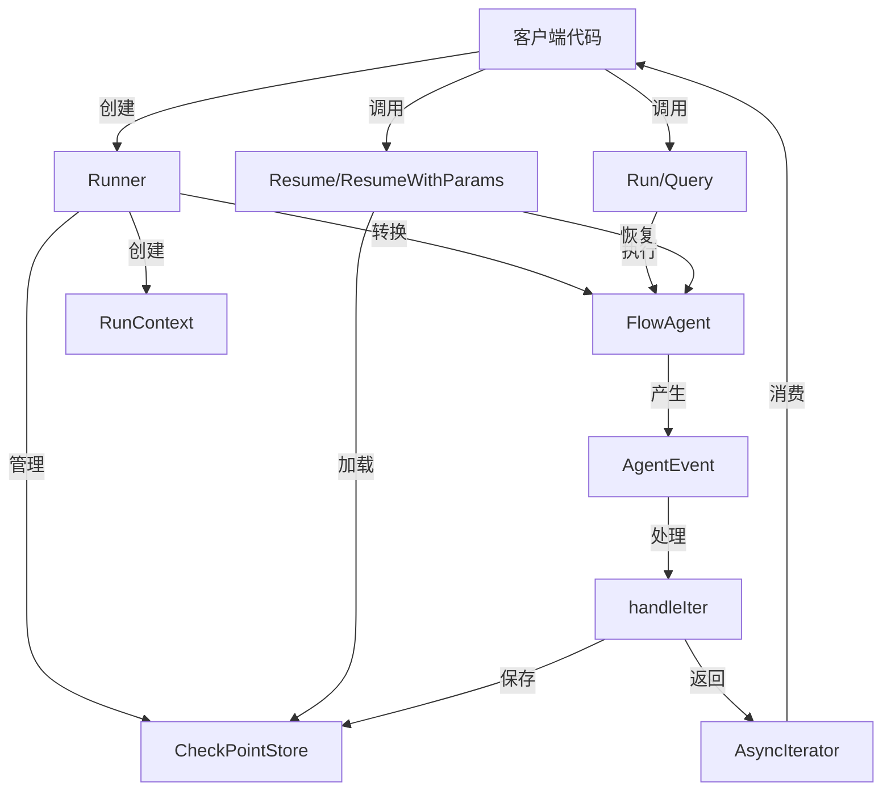

# runner_core 模块技术深度解析

## 1. 问题与解决方案

### 1.1 问题空间

在构建复杂的智能体（Agent）系统时，开发者面临几个核心挑战：

1. **执行生命周期管理**：智能体的执行不是简单的函数调用，而是一个可能包含多轮交互、工具调用和子智能体协作的复杂流程。需要一个统一的入口点来管理整个执行生命周期。

2. **中断与恢复机制**：在实际应用中，智能体执行可能因为各种原因被中断（如需要用户确认、外部资源缺失、错误处理等）。系统需要能够保存执行状态并在稍后恢复。

3. **流式与非流式执行**：不同场景下，用户可能需要立即获得完整结果，或者逐步接收执行过程中的事件流。需要统一的方式来处理这两种模式。

4. **检查点持久化**：为了支持跨进程、跨设备的执行恢复，需要将执行状态持久化到外部存储。

### 1.2 设计洞察

`runner_core` 模块的核心设计洞察是将**智能体执行与执行控制分离**。它不直接实现智能体的业务逻辑，而是作为一个"执行容器"，提供：
- 统一的执行入口
- 状态管理与检查点机制
- 中断-恢复基础设施
- 事件流处理

这种设计使得智能体开发者可以专注于业务逻辑，而不必关心复杂的执行控制细节。

## 2. 核心概念与心智模型

### 2.1 核心抽象

`runner_core` 模块围绕以下几个核心抽象构建：

1. **Runner**：执行引擎的主入口，负责协调智能体执行、状态管理和检查点操作。
2. **Agent**：可执行的智能体接口，定义了智能体的基本行为。
3. **AsyncIterator**：异步事件迭代器，用于流式返回执行过程中的事件。
4. **CheckPointStore**：检查点存储接口，定义了如何持久化和恢复执行状态。
5. **InterruptSignal**：中断信号，包含了中断时的完整状态信息。
6. **ResumeParams**：恢复参数，用于指定从哪个检查点恢复以及如何恢复。

### 2.2 心智模型

可以将 `Runner` 想象成一个**智能体执行的"容器与调度器"**：

- **Runner 作为容器**：它包裹着一个 Agent，提供了执行环境和基础设施。
- **Runner 作为调度器**：它管理执行流程，处理中断，保存状态，并在需要时恢复执行。
- **事件流作为"执行窗口"**：通过 AsyncIterator，用户可以观察执行过程中的每一个事件，就像通过一个窗口观察智能体的思考和行动过程。
- **检查点作为"时间快照"**：当中断发生时，Runner 会拍摄一张执行状态的"快照"并保存；恢复时，它会从这张快照重新启动执行。

## 3. 架构与数据流

### 3.1 核心架构图



### 3.2 组件职责与数据流

#### 3.2.1 核心组件职责

1. **Runner**
   - 作为执行的主入口点
   - 管理智能体的生命周期
   - 协调检查点的保存和加载
   - 处理中断信号

2. **FlowAgent**
   - 内部将 Agent 接口转换为可执行的流处理组件
   - 实际执行智能体逻辑
   - 产生 AgentEvent 事件流

3. **RunContext**
   - 保存执行的上下文信息
   - 包括输入消息、运行路径、会话状态等
   - 通过 context 传递给整个执行链

4. **CheckPointStore**
   - 定义了检查点持久化的接口
   - 实际实现可以是内存、文件、数据库等

5. **AsyncIterator**
   - 提供异步迭代的方式消费执行事件
   - 支持流式处理和响应式编程模式

#### 3.2.2 执行流程详解

**新执行流程（Run/Query）：**

1. **初始化阶段**
   - 客户端创建 Runner，配置 Agent、是否启用流式、检查点存储
   - 调用 Run 或 Query 方法，传入消息和选项

2. **准备阶段**
   - 解析选项，获取公共配置
   - 将 Agent 转换为内部 FlowAgent
   - 创建 AgentInput，包含消息和流式设置
   - 创建新的 RunContext 并设置到 context 中
   - 添加会话值到 context

3. **执行阶段**
   - 调用 FlowAgent.Run 启动执行
   - 如果没有配置检查点存储，直接返回事件迭代器
   - 如果配置了检查点存储，创建新的迭代器对，启动 handleIter 协程

4. **事件处理阶段**（handleIter）
   - 消费 FlowAgent 产生的事件
   - 检测中断事件
   - 如果发生中断，保存检查点
   - 将事件转发给客户端

**恢复执行流程（Resume/ResumeWithParams）：**

1. **初始化阶段**
   - 验证检查点存储是否配置
   - 加载检查点数据

2. **准备阶段**
   - 解析选项，获取公共配置
   - 恢复会话状态
   - 设置 RunContext 到 context
   - 如果有恢复数据，通过 core.BatchResumeWithData 设置到 context

3. **执行阶段**
   - 调用 FlowAgent.Resume 恢复执行
   - 后续流程与新执行相同

## 4. 核心组件深度解析

### 4.1 Runner 结构体

```go
type Runner struct {
    a               Agent          // 要执行的智能体
    enableStreaming bool           // 是否启用流式模式
    store           CheckPointStore// 检查点存储，nil表示禁用检查点
}
```

**设计意图**：
- Runner 是一个**不可变配置**结构体，创建后不会修改内部状态
- 所有执行状态都保存在 context 和外部存储中，使得 Runner 本身是线程安全的
- 通过组合而非继承的方式，提供了灵活的功能扩展

**关键设计决策**：
- 将 Agent 作为字段而非通过方法参数传递，使得 Runner 与特定 Agent 绑定
- 流式模式在创建时确定，而非每次执行时确定，简化了 API
- 检查点存储是可选的，使得简单场景下可以不使用持久化

### 4.2 Run 方法

```go
func (r *Runner) Run(ctx context.Context, messages []Message, opts ...AgentRunOption) *AsyncIterator[*AgentEvent]
```

**功能**：
- 启动新的智能体执行
- 接收消息作为输入
- 返回事件迭代器

**内部实现细节**：
1. **选项处理**：调用 `getCommonOptions` 解析选项，提取共享会话、检查点ID等配置
2. **Agent 转换**：通过 `toFlowAgent` 将外部 Agent 接口转换为内部可执行的流组件
3. **输入准备**：创建 `AgentInput`，包含消息和流式设置
4. **上下文设置**：
   - 创建新的 `RunContext` 并设置到 context
   - 添加会话值到 context
5. **执行启动**：调用 FlowAgent.Run 获取事件迭代器
6. **检查点包装**：如果配置了检查点存储，创建新的迭代器对，启动 handleIter 协程处理事件流

**为什么这样设计？**：
- 将选项解析与核心逻辑分离，使得代码更清晰
- 通过 context 传递执行上下文，避免了全局状态
- 使用协程处理事件流，实现了非阻塞的流式返回

### 4.3 Resume 与 ResumeWithParams 方法

```go
func (r *Runner) Resume(ctx context.Context, checkPointID string, opts ...AgentRunOption) (*AsyncIterator[*AgentEvent], error)
func (r *Runner) ResumeWithParams(ctx context.Context, checkPointID string, params *ResumeParams, opts ...AgentRunOption) (*AsyncIterator[*AgentEvent], error)
```

**功能**：
- 从检查点恢复执行
- 支持简单恢复和带参数恢复两种模式

**设计意图**：
- 提供两种恢复方式，满足不同场景需求
- Resume 方法采用"隐式恢复所有"策略，适用于简单场景
- ResumeWithParams 方法提供更精细的控制，允许指定恢复目标和数据

**ResumeWithParams 的深度设计**：

这个方法是整个模块中最复杂也最强大的部分，它体现了几个重要的设计思想：

1. **地址化恢复目标**：通过 `params.Targets` 映射，使用组件地址作为键，可以精确指定要恢复的组件
2. **分层恢复策略**：
   - 被明确指定的组件收到 `isResumeFlow = true`
   - 未被指定的组件需要自己决定如何处理
   - 叶子组件通常应该重新中断自己以保持状态
   - 复合组件应该作为管道，让恢复信号流向子组件

3. **可扩展参数结构**：`ResumeParams` 结构体设计允许未来添加新字段而不破坏 API

### 4.4 handleIter 方法

```go
func (r *Runner) handleIter(ctx context.Context, aIter *AsyncIterator[*AgentEvent], gen *AsyncGenerator[*AgentEvent], checkPointID *string)
```

**功能**：
- 处理 FlowAgent 产生的事件流
- 检测中断信号
- 保存检查点
- 转发事件给客户端

**内部实现细节**：
1. **Panic 恢复**：使用 defer 和 recover 捕获 panic，确保不会导致整个程序崩溃
2. **事件循环**：持续从 aIter 中获取事件，直到迭代器结束
3. **中断处理**：
   - 检测到中断事件时，提取中断信号
   - 转换中断信号为用户友好的中断上下文
   - 保存检查点（如果配置了检查点ID）
   - 转换事件并转发
4. **事件转发**：将处理后的事件发送给客户端

**关键设计决策**：
- **先保存检查点，再发送事件**：确保当用户收到中断事件时，检查点已经保存，可以立即恢复
- **只处理一个中断**：假设最多只有一个中断事件发生，多个中断会被视为编程错误
- **使用 internalInterrupted 传递原始信号**：保持内部信号的完整性，同时提供用户友好的视图

## 5. 依赖关系分析

### 5.1 依赖的模块

`runner_core` 模块依赖以下核心模块：

1. **[adk.interface](adk_interface.md)**：定义了 Agent、AgentInput、AgentOutput、AgentEvent 等核心接口和类型
2. **[adk.runctx](adk_runctx.md)**：提供了执行上下文管理
3. **[adk.call_option](adk_call_option.md)**：定义了执行选项
4. **[adk.interrupt](adk_interrupt.md)**：定义了中断和恢复相关类型
5. **[internal.core](internal_core.md)**：提供了核心的中断和检查点功能
6. **[schema](schema.md)**：提供了消息等基础数据结构

### 5.2 被依赖的模块

`runner_core` 模块通常被以下模块依赖：

1. **客户端代码**：直接使用 Runner 来执行智能体
2. **高级智能体框架**：可能基于 Runner 构建更高级的抽象

### 5.3 数据契约

`runner_core` 模块与其他模块之间的关键数据契约：

1. **Agent 接口**：
   - 必须实现 `Name` 和 `Description` 方法
   - 必须实现 `Run` 方法，返回 `AsyncIterator[*AgentEvent]`
   - 如果支持恢复，必须实现 `ResumableAgent` 接口

2. **AgentEvent 契约**：
   - 事件中的 MessageStream 必须是独占的且可以直接接收
   - 建议对 MessageStream 使用 SetAutomaticClose()
   - RunPath 字段由框架管理，用户不能设置

3. **CheckPointStore 契约**：
   - Get 方法返回检查点数据、是否存在和错误
   - Set 方法保存检查点数据，返回错误
   - 实现必须是线程安全的

## 6. 设计决策与权衡

### 6.1 设计决策：使用 Context 传递状态

**决策**：大量使用 context.Context 来传递执行状态、会话信息、检查点数据等。

**原因**：
- Go 语言的标准做法
- 自动支持请求取消和超时
- 线程安全
- 无需全局状态

**权衡**：
- ✅ 优点：符合 Go 语言习惯，易于理解和使用
- ❌ 缺点：类型不安全，运行时才能发现类型错误；context 可能变得很大，影响性能

### 6.2 设计决策：异步迭代器模式

**决策**：使用 AsyncIterator 来返回执行事件，而非回调或阻塞式调用。

**原因**：
- 支持流式处理
- 可以按需消费事件
- 更好的控制流

**权衡**：
- ✅ 优点：灵活，支持响应式编程，非阻塞
- ❌ 缺点：学习曲线较陡，错误处理较复杂

### 6.3 设计决策：检查点存储是可选的

**决策**：CheckPointStore 字段可以为 nil，表示禁用检查点功能。

**原因**：
- 简单场景下不需要持久化
- 减少不必要的开销
- 降低使用门槛

**权衡**：
- ✅ 优点：灵活性高，简单场景更易用
- ❌ 缺点：需要在代码中处理 nil 情况，增加了一些条件判断

### 6.4 设计决策：两种恢复模式

**决策**：提供 Resume（隐式恢复所有）和 ResumeWithParams（精确恢复）两种方法。

**原因**：
- 满足不同场景的需求
- 简单场景使用简单 API，复杂场景使用强大 API
- 渐进式学习曲线

**权衡**：
- ✅ 优点：灵活性高，适用范围广
- ❌ 缺点：API 表面增大，用户需要理解两种模式的区别

### 6.5 设计决策：Runner 与特定 Agent 绑定

**决策**：Runner 在创建时就绑定到一个特定的 Agent，而非每次执行时指定。

**原因**：
- 简化 API
- 使得 Runner 可以作为 Agent 的"执行容器"
- 更容易进行生命周期管理

**权衡**：
- ✅ 优点：API 简洁，概念清晰
- ❌ 缺点：如果需要执行多个 Agent，需要创建多个 Runner

## 7. 使用指南与示例

### 7.1 基本使用

#### 创建 Runner

```go
// 创建一个基本的 Runner，不启用流式，不使用检查点
runner := adk.NewRunner(ctx, adk.RunnerConfig{
    Agent: myAgent,
})

// 创建启用流式的 Runner
runner := adk.NewRunner(ctx, adk.RunnerConfig{
    Agent:           myAgent,
    EnableStreaming: true,
})

// 创建带检查点的 Runner
store := NewMyCheckPointStore() // 实现 CheckPointStore 接口
runner := adk.NewRunner(ctx, adk.RunnerConfig{
    Agent:           myAgent,
    CheckPointStore: store,
})
```

#### 执行智能体

```go
// 使用消息执行
messages := []schema.Message{
    schema.UserMessage("你好，请帮我写一个 Go 函数"),
}
iter := runner.Run(ctx, messages)

// 使用 Query 便捷方法
iter := runner.Query(ctx, "你好，请帮我写一个 Go 函数")

// 消费事件
for {
    event, ok := iter.Next()
    if !ok {
        break
    }
    if event.Err != nil {
        // 处理错误
        log.Fatal(event.Err)
    }
    if event.Output != nil {
        // 处理输出
        fmt.Println(event.Output.MessageOutput)
    }
    if event.Action != nil && event.Action.Interrupted != nil {
        // 处理中断
        fmt.Println("执行被中断：", event.Action.Interrupted.Data)
    }
}
```

#### 恢复执行

```go
// 简单恢复（隐式恢复所有）
iter, err := runner.Resume(ctx, "checkpoint-123")
if err != nil {
    log.Fatal(err)
}

// 带参数恢复
iter, err := runner.ResumeWithParams(ctx, "checkpoint-123", &adk.ResumeParams{
    Targets: map[string]any{
        "agent1": "resume-data-1",
        "agent2": map[string]any{"key": "value"},
    },
})
```

### 7.2 高级用法

#### 自定义检查点存储

```go
type MyCheckPointStore struct {
    // 内部状态
}

func (s *MyCheckPointStore) Get(ctx context.Context, checkPointID string) ([]byte, bool, error) {
    // 实现获取检查点的逻辑
}

func (s *MyCheckPointStore) Set(ctx context.Context, checkPointID string, checkPoint []byte) error {
    // 实现保存检查点的逻辑
}

// 使用自定义存储
store := &MyCheckPointStore{}
runner := adk.NewRunner(ctx, adk.RunnerConfig{
    Agent:           myAgent,
    CheckPointStore: store,
})
```

#### 使用会话值

```go
// 设置会话值
iter := runner.Run(ctx, messages, adk.WithSessionValue("key", "value"))

// 在智能体中获取会话值
value := adk.GetSessionValue(ctx, "key")
```

## 8. 边界情况与陷阱

### 8.1 常见陷阱

1. **忘记处理错误**
   - 陷阱：AsyncIterator 中的事件可能包含 Err 字段，忘记检查会导致错误被忽略
   - 解决：始终检查 event.Err

2. **多个中断事件**
   - 陷阱：handleIter 假设最多只有一个中断事件，多个中断会导致 panic
   - 解决：确保智能体实现中不会产生多个中断事件

3. **检查点存储为 nil 时调用 Resume**
   - 陷阱：如果 Runner 没有配置 CheckPointStore，调用 Resume 会返回错误
   - 解决：在调用 Resume 前确保 CheckPointStore 已配置

4. **并发访问会话值**
   - 陷阱：会话值的 map 不是并发安全的，除非使用了 valuesMtx
   - 解决：使用 AddSessionValues 和 GetSessionValue 来安全访问

### 8.2 边界情况

1. **中断事件的顺序**
   - 系统保证先保存检查点，再发送中断事件，因此收到中断事件时可以安全恢复

2. **恢复时的会话处理**
   - 如果使用 sharedParentSession 选项，会共享父会话的值和互斥锁
   - 如果没有，会创建新的会话

3. **流式模式下的中断**
   - 流式模式下，中断时可能还有未消费完的流数据，需要确保正确处理

4. **Panic 恢复**
   - handleIter 中有 panic 恢复机制，确保单个 Runner 的 panic 不会影响整个程序

## 9. 总结

`runner_core` 模块是 eino 框架中智能体执行的核心入口点，它提供了统一的执行模型、中断-恢复机制和检查点功能。通过将执行控制与智能体逻辑分离，它使得智能体开发者可以专注于业务逻辑，而不必关心复杂的执行控制细节。

该模块的设计体现了几个重要的软件工程原则：
- **关注点分离**：执行控制与业务逻辑分离
- **可扩展性**：通过接口和选项模式提供灵活的扩展点
- **容错性**：内置 panic 恢复和错误处理机制
- **用户友好**：提供简单 API 满足常见需求，同时提供强大 API 处理复杂场景

对于新加入团队的开发者，理解这个模块的设计思想和实现细节，将有助于更好地使用整个框架，并为框架的扩展做出贡献。

## 10. 参考链接

- [adk.interface 模块](adk_interface.md) - 核心接口定义
- [adk.runctx 模块](adk_runctx.md) - 执行上下文管理
- [adk.interrupt 模块](adk_interrupt.md) - 中断与恢复
- [schema 模块](schema.md) - 消息和数据结构
- [internal.core 模块](internal_core.md) - 内部核心功能
