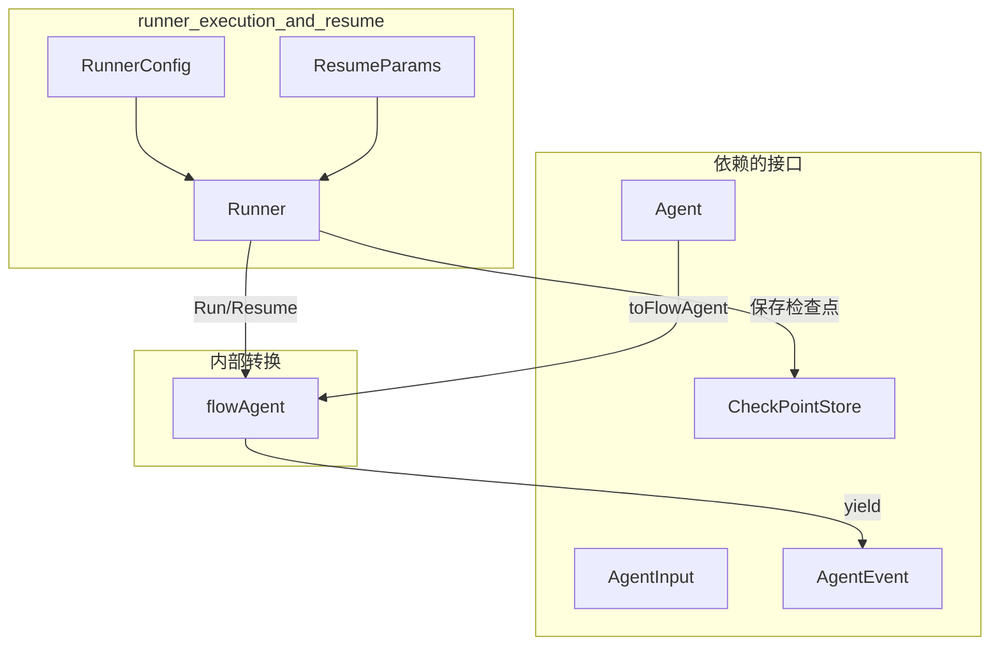

# runner_execution_and_resume 模块技术深度解析

## 概述

`runner_execution_and_resume` 模块是 ADK（Agent Development Kit）运行时的核心入口，负责管理 Agent 的完整生命周期。想象一下，它就像是乐团中的**指挥家**——负责启动演奏（Run）、在出现中断时保存演奏状态（Checkpoint），以及在合适的时候从中断处继续演奏（Resume）。

这个模块解决了一个根本性的问题：在 Agent 与用户交互的过程中，经常会出现需要暂停等待外部输入的情况——比如用户需要审批某个操作、提供额外信息、或者系统需要调用外部服务。传统的做法是彻底结束这次执行，用户再次发起请求时从头开始。但这样做会导致上下文丢失、重复计算用户体验极差。Runner 的设计让 Agent 可以在中断点"冻结"自己的状态，在用户准备好后无缝地恢复执行，就像视频游戏的存档功能一样。

---

## 架构设计

### 核心组件



### 组件职责

**Runner** 是整个模块的核心结构体，它持有三个关键字段：

```go
type Runner struct {
    a Agent                      // 要执行的 Agent
    enableStreaming bool         // 是否启用流式输出
    store CheckPointStore        // 状态持久化存储
}
```

`a` 是被管理的 Agent，可以是简单的单 Agent，也可以是复杂的 Agent 组合（如 SequentialAgent、ParallelAgent）。`enableStreaming` 决定了事件流的形式——在流式模式下，AgentEvent 会通过 `MessageStream` 实时推送；在非流式模式下，则等待完整结果。`store` 是检查点存储接口，如果为 `nil`，则表示不启用中断恢复功能，这对于不需要持久化的短期任务很有用。

**RunnerConfig** 是创建 Runner 的配置对象，采用配置对象的模式将所有启动参数封装在一起，便于扩展和传递：

```go
type RunnerConfig struct {
    Agent           Agent
    EnableStreaming bool
    CheckPointStore CheckPointStore
}
```

**ResumeParams** 则提供了恢复执行时的参数传递能力，其设计充分考虑了可扩展性：

```go
type ResumeParams struct {
    Targets map[string]any  // key: 组件地址, value: 恢复数据
}
```

`Targets` map 的键是中断点的地址（如 "agent:A;node:graph_a;tool:tool_call_123"），值是该中断点需要的恢复数据。这种设计允许精确控制恢复行为——可以选择性地只恢复某些中断点，让其他中断点重新触发。

---

## 核心流程解析

### 1. Run 方法：全新执行

当你调用 `Runner.Run()` 时，实际上启动了一个全新的 Agent 执行流程。让我追踪数据在其中的流动：

**第一步：准备输入**。用户传入的 `[]Message` 被包装成 `AgentInput` 结构，同时携带流式开关配置：

```go
input := &AgentInput{
    Messages:        messages,
    EnableStreaming: r.enableStreaming,
}
```

**第二步：构建执行上下文**。通过 `ctxWithNewRunCtx()` 创建新的运行上下文，这里面包含了会话状态、运行路径等运行时信息。`AddSessionValues()` 则将用户提供的会话级键值对注入到上下文中。

**第三步：转换为 FlowAgent**。代码中有 `fa := toFlowAgent(ctx, r.a)` 这一步，这是因为 ADK 的 Agent 接口需要被转换为内部的 `flowAgent` 类型才能执行。`flowAgent` 是 Agent 接口的实现者，它负责管理子 Agent、记录历史、处理 Transfer 等复杂逻辑。

**第四步：启动执行并包装迭代器**。如果配置了 `CheckPointStore`，Run 方法会创建一个新的 `AsyncIterator` 和 `AsyncGenerator` 对，启动一个 goroutine 来处理事件流。这个 goroutine 负责监听中断信号、保存检查点、并将事件转发给调用方：

```go
if r.store == nil {
    return iter
}
niter, gen := NewAsyncIteratorPair[*AgentEvent]()
go r.handleIter(ctx, iter, gen, o.checkPointID)
return niter
```

### 2. handleIter：中断拦截与检查点保存

`handleIter` 是 Runner 最核心的内部逻辑，它像一个**监听器**，持续监控 Agent 产生的事件流。当检测到中断事件时，它会：

1. **提取中断信号**：从 `AgentAction.internalInterrupted` 中获取 `InterruptSignal`
2. **转换中断上下文**：将内部的中断信号转换为用户友好的 `InterruptInfo`
3. **保存检查点**：在向用户发送中断事件之前，先将当前状态持久化到 `CheckPointStore`
4. **转发事件**：将处理后的事件通过 `gen.Send()` 推送给调用方

这种**先保存后推送**的顺序至关重要——它确保了当用户收到中断事件时，检查点已经成功保存，用户可以安全地进行恢复操作。

### 3. Resume 方法：恢复执行

恢复流程有两种模式，分别对应不同的使用场景。

**隐式恢复（Resume）**：这是"简单确认"模式。当你调用 `Runner.Resume(ctx, checkpointID)` 时，所有之前被中断的组件都会收到 `isResumeFlow = false` 的信号。这意味着它们只知道"之前被中断过"，但不知道具体是哪个点被恢复。这种模式适用于简单的场景——比如用户只是简单地确认"继续执行"，不需要传递额外数据。

**显式恢复（ResumeWithParams）**：这是"精确恢复"模式。通过 `ResumeParams.Targets` map，你可以精确指定：
- 哪些中断点需要恢复（key 在 map 中）——它们会收到 `isResumeFlow = true`
- 哪些中断点需要重新中断（key 不在 map 中）——它们会保持中断状态
- 每个恢复点需要传递什么数据（map 的 value）

这种设计支持复杂的工作流。比如在一个多步骤的表单填写流程中，用户可能只填完了第一步、第二步，第三步被中断了。恢复时，用户只需要提供第三步的数据，第一、二步可以自动继续执行。

---

## 数据流详解

### 执行路径

```
用户调用
    │
    ▼
Runner.Run(ctx, messages, opts...)
    │
    ├─► AgentInput 封装
    │       │
    │       ▼
    │   ctxWithNewRunCtx() + AddSessionValues()
    │       │
    │       ▼
    │   toFlowAgent() 转换
    │       │
    │       ▼
    │   flowAgent.Run()
    │       │
    │       ▼
    └─► handleIter() 包装
            │
            ├─► 正常事件 ──► gen.Send()
            │
            └─► 中断事件 ──► saveCheckPoint() ──► gen.Send()
```

### 恢复路径

```
用户调用
    │
    ▼
Runner.ResumeWithParams(ctx, checkpointID, params, opts...)
    │
    ▼
loadCheckPoint() ──► 获取保存的状态和中断信息
    │
    ▼
构建 ResumeInfo，设置 IsResumeTarget 标志
    │
    ▼
BatchResumeWithData() ──► 将 resumeData 注入到 context
    │
    ▼
flowAgent.Resume(ctx, resumeInfo, opts...)
    │
    ▼
handleIter() ──► 正常事件或重新中断
```

### 检查点存储契约

`CheckPointStore` 接口极其简洁，但这正是其设计巧妙之处：

```go
type CheckPointStore interface {
    Get(ctx context.Context, checkPointID string) ([]byte, bool, error)
    Set(ctx context.Context, checkPointID string, checkPoint []byte) error
}
```

`Get` 方法返回两个值：数据和是否存在。这让调用方可以区分"没有这个检查点"和"检查点存在但数据为空"两种情况。`Set` 方法接受字节数组，这意味着任何可以被序列化（Compose Graph 的状态、Agent 的运行时数据等）的数据都可以被持久化。实现者可以自由选择存储后端——内存、文件系统、Redis、数据库等等。

---

## 设计决策与权衡

### 1. 流式 vs 非流式：运行时决策

Runner 在创建时通过 `EnableStreaming` 字段决定整个执行的生命周期模式。这个设计将流式输出的复杂性封装在 Runner 内部，Agent 本身不需要关心这个问题。这种方式简化了 Agent 的实现，但代价是灵活性——你不能在运行时动态切换流式/非流式模式。

**权衡分析**：这种设计适合大多数场景，因为流式偏好通常在应用启动时就能确定。如果需要动态切换，需要创建多个 Runner 实例。

### 2. 检查点的可选性

Runner 允许 `CheckPointStore` 为 `nil`，此时所有中断恢复功能被禁用。这看似是一个"功能开关"，实际上是一个重要的架构决策——它解耦了核心执行逻辑和持久化逻辑。

**权衡分析**：这使得 Runner 可以用于：
- 短期任务（不需要中断恢复）
- 测试场景（不需要复杂的持久化）
- 简单应用（避免引入额外的存储依赖）

但同时也意味着调用方必须显式处理"不能恢复"的情况（参见 `Resume` 方法中对 `store == nil` 的检查）。

### 3. 恢复数据的两种策略

"隐式恢复 all" vs "显式恢复 with Params" 代表了两种截然不同的设计哲学：

- **隐式恢复**："所有中断点都继续，不需要额外数据"——简单，但能力有限
- **显式恢复**："精确控制每个中断点的行为"——强大，但使用复杂

**为什么需要两种？** 现实世界的需求是多样的。简单确认场景（如"继续执行"）占了大多数，显式恢复则是复杂业务流程的必需品。这种"渐进式复杂度"设计让 API 易于上手，同时不限制高级用法。

### 4. 中断上下文的双重表示

代码中同时存在两种中断表示：
- `internalInterrupted *core.InterruptSignal`：内部使用的信号，包含完整的状态信息
- `Interrupted *InterruptInfo`：用户面向的中断信息

`handleIter()` 方法负责将前者转换为后者：

```go
interruptContexts := core.ToInterruptContexts(interruptSignal, allowedAddressSegmentTypes)
event = &AgentEvent{
    // ...
    Action: &AgentAction{
        Interrupted: &InterruptInfo{
            Data:              event.Action.Interrupted.Data,
            InterruptContexts: interruptContexts,
        },
        internalInterrupted: interruptSignal,
    },
}
```

**设计意图**：内部信号包含运行时需要的所有信息（如精确的地址、完整的 interrupt state），但不适合直接暴露给用户。`InterruptInfo.InterruptContexts` 提供了用户友好的分层视图，让用户可以理清"谁在哪个层级被中断了"。

---

## 使用指南与最佳实践

### 创建 Runner

```go
runner := adk.NewRunner(ctx, adk.RunnerConfig{
    Agent:           myAgent,
    EnableStreaming: true,
    CheckPointStore: myCheckPointStore,  // 可以为 nil
})
```

### 执行并处理中断

```go
iter := runner.Run(ctx, []adk.Message{
    schema.UserMessage("帮我订一张机票"),
})

for {
    event, ok := iter.Next()
    if !ok {
        break
    }
    
    if event.Err != nil {
        // 处理错误
        return event.Err
    }
    
    if event.Action != nil && event.Action.Interrupted != nil {
        // 收到中断事件
        checkpointID := "flight_booking_001"  // 实际使用中应该由用户生成
        // 保存 checkpointID 到用户会话，以便后续恢复
        return saveToSession(checkpointID)
    }
    
    // 处理正常输出
    if event.Output != nil {
        fmt.Println(event.Output.Message)
    }
}
```

### 恢复执行

```go
// 简单恢复 - 所有中断点继续
iter, err := runner.Resume(ctx, checkpointID)

// 精确恢复 - 指定恢复点和数据
iter, err := runner.ResumeWithParams(ctx, checkpointID, &adk.ResumeParams{
    Targets: map[string]any{
        "agent:booking;tool:payment": paymentData,  // 只恢复支付步骤
    },
})
```

---

## 常见陷阱与注意事项

### 1. 检查点 ID 的管理

Runner 不会自动生成检查点 ID，它需要调用方提供。这意味着：
- 你需要一个可靠的机制来生成和存储检查点 ID
- 常见的做法是将检查点 ID 与用户会话关联
- ID 应该是唯一的，建议使用 UUID 或包含时间戳的字符串

### 2. 并发安全

`handleIter` 在独立的 goroutine 中运行，而 `gen.Send()` 和 `gen.Close()` 都不是线程安全的。如果你在多个 goroutine 中共享同一个 iterator 的结果，需要自己加锁。

### 3. 恢复时的 session 合并

当使用 `sharedParentSession` 选项时，Runner 会尝试合并父会话的值：

```go
if o.sharedParentSession {
    parentSession := getSession(ctx)
    if parentSession != nil {
        runCtx.Session.Values = parentSession.Values
        runCtx.Session.valuesMtx = parentSession.valuesMtx
    }
}
```

这意味着恢复时的会话状态可能与原始执行时的状态不同。如果你依赖会话值的完全一致性，需要注意这一点。

### 4. 嵌套中断的处理

Runner 假设最多只有一个中断 action 发生：

```go
if interruptSignal != nil {
    panic("multiple interrupt actions should not happen in Runner")
}
```

这个假设是基于 `CompositeInterrupt` 机制——多个中断会被合并为一个。如果你遇到了这个 panic，说明系统中有未预期的情况，需要检查 Agent 的实现。

### 5. 资源清理

`handleIter` 包含一个 defer 闭包来处理 panic：

```go
defer func() {
    panicErr := recover()
    if panicErr != nil {
        e := safe.NewPanicErr(panicErr, debug.Stack())
        gen.Send(&AgentEvent{Err: e})
    }
    gen.Close()
}()
```

这确保了即使 Agent 执行过程中发生 panic，generator 也会被正确关闭，资源不会泄露。

---

## 扩展与定制

### 自定义 CheckPointStore

任何实现 `CheckPointStore` 接口的类型都可以作为检查点存储。常见的实现包括：

- **内存存储**：适合单机测试
- **文件存储**：适合简单的持久化需求
- **Redis 存储**：适合分布式环境
- **数据库存储**：适合需要事务支持的企业应用

```go
type MyCheckPointStore struct {
    data sync.Map  // 内存实现示例
}

func (s *MyCheckPointStore) Get(ctx context.Context, checkPointID string) ([]byte, bool, error) {
    val, ok := s.data.Load(checkPointID)
    if !ok {
        return nil, false, nil
    }
    return val.([]byte), true, nil
}

func (s *MyCheckPointStore) Set(ctx context.Context, checkPointID string, checkPoint []byte) error {
    s.data.Store(checkPointID, checkPoint)
    return nil
}
```

### 集成工作流引擎

`ResumeWithParams` 的设计考虑了与 Compose Graph 的集成。`Targets` map 中的地址格式与 Graph 节点的地址格式兼容，这使得 Runner 可以统一管理 ADK Agent 和 Compose Graph 的中断恢复。

---

## 相关模块参考

- [agent_contracts_and_context](./agent_contracts_and_context.md) - Agent 接口定义和运行时上下文
- [flow_agent_orchestration](./flow_agent_orchestration.md) - FlowAgent 的编排逻辑
- [interrupt_resume_bridge](./interrupt_resume_bridge.md) - 中断与恢复的桥梁实现
- [checkpointing_and_rerun_persistence](./checkpointing_and_rerun_persistence.md) - Compose Graph 的检查点机制

---

## 总结

Runner 模块是 ADK 运行时的中枢神经系统，它将"执行 Agent"、"处理中断"、"保存状态"、"恢复执行"这些复杂的逻辑封装为简洁的 API。其设计体现了几个重要的软件工程原则：通过配置实现灵活性、通过接口实现可扩展性、通过双重模式（隐式/显式恢复）满足不同复杂度的场景需求。

理解这个模块的关键在于把握"检查点"这个核心概念——它不仅仅是一个存储机制，更是一种让 Agent 执行变得可暂停、可恢复的思维方式。当你设计需要用户交互的 Agent 应用时，Runner 就是你构建可靠用户体验的基石。