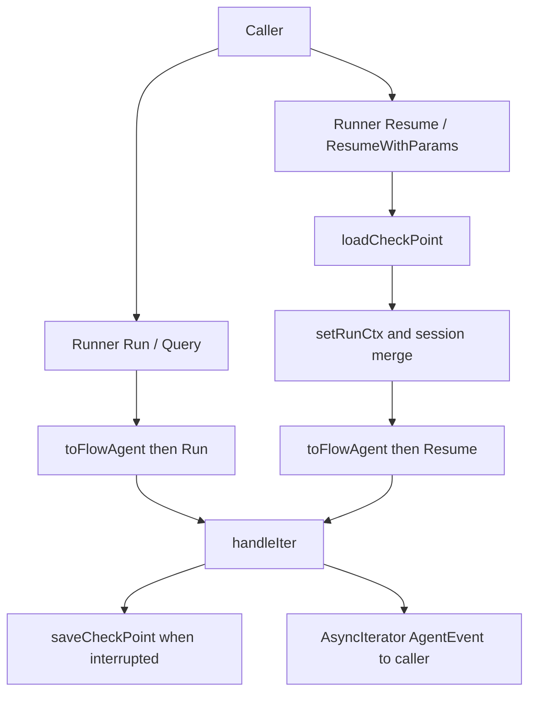

# runner_lifecycle_and_checkpointing

`runner_lifecycle_and_checkpointing`（`adk.runner`）是 ADK 里“把 Agent 真正跑起来”的入口层：它不关心具体业务推理，而是负责把一次运行的生命周期串起来——**启动、事件转发、中断捕获、检查点持久化、恢复继续执行**。如果把 Agent 看成一台会在中途“请求人工确认/外部输入”的机器，`Runner` 就像值班调度员：既要保证机器不停摆，也要在停机点留下可恢复的快照，避免“从头再来”。

很多初看似乎可以“直接 `agent.Run()` 就行”的实现，在真实系统里会很快失效：一旦出现中断、跨进程恢复、会话值共享、流式输出与错误并行处理，调用方就会被迫自己管理大量脆弱状态。这个模块存在的意义，就是把这些横切复杂度集中封装成一个稳定入口。

## 架构角色与数据流



从架构上看，`Runner` 不是业务执行器，而是**运行编排器（orchestrator）+ 生命周期网关（gateway）**。它位于调用方和具体 `Agent` 之间，拦截并增强运行过程：

- 向下，它依赖 [ADK Agent Interface](ADK Agent Interface.md) 的 `Agent`/`ResumableAgent`、`AgentInput`、`AgentEvent` 等契约，真正执行仍由 agent 实现。
- 向旁路，它依赖 `CheckPointStore`（别名 `core.CheckPointStore`）做持久化，依赖中断信号结构（`core.InterruptSignal`）做可恢复语义桥接。
- 向上，它向调用者暴露统一的 `Run/Query/Resume/ResumeWithParams`，始终返回 `*AsyncIterator[*AgentEvent]`（或恢复场景返回 `(*AsyncIterator[*AgentEvent], error)`），让上层只处理事件流而非底层状态机。

一次典型 `Run` 的主路径是：构建 `AgentInput` → 初始化 run context/session → 调用 agent 的 `Run` → 若启用 checkpoint，则包装迭代器并在 `handleIter` 中监听中断事件，保存检查点后再把事件发给用户。`Resume` 路径则先反序列化检查点恢复 `runContext` 与中断状态，再进入 `Agent.Resume`，其余流程复用同一套事件处理逻辑。

## 心智模型：把 Runner 当作“录播系统 + 断点续播控制器”

理解这个模块最有效的模型是：

- `Agent` 在持续输出事件，像“直播流”；
- `Interrupt` 是直播中插入的“暂停点”；
- `CheckPointStore` 是“录播快照”；
- `ResumeWithParams` 像“指定某些暂停点喂入额外参数后继续播”。

`Runner` 的关键价值不在“把事件搬运出来”，而在保证以下不变量：

1. 中断事件对用户可见前，若配置了存储，检查点必须先写入；
2. 恢复必须在正确的 `runContext`/session 上继续，而不是新跑一遍；
3. 中断语义从内部 `core.InterruptSignal` 转换为外部更稳定的 `InterruptInfo`/`InterruptContexts`；
4. 框架假设一次运行的最终中断动作是一个合并结果（`CompositeInterrupt`），因此顶层不应出现多个独立中断动作。

## 核心组件深潜

### `RunnerConfig`

`RunnerConfig` 是 `Runner` 的装配参数，字段非常克制：

- `Agent Agent`
- `EnableStreaming bool`
- `CheckPointStore CheckPointStore`

这种极简配置体现了设计取舍：`Runner` 不承载业务参数，只承载生命周期控制参数。好处是边界清晰，坏处是如果未来要引入更多策略（例如 checkpoint 写入策略、重试策略），要么扩展 `RunnerConfig`，要么通过 `AgentRunOption` 旁路注入。

### `ResumeParams`

`ResumeParams` 当前只有一个字段：`Targets map[string]any`。它的意义是“**可扩展恢复参数容器**”，而不是临时 map。注释明确写了 extensible：未来新增字段不破坏方法签名。

`Targets` 的 key 是中断点地址字符串，value 是对应恢复数据。这个设计把恢复动作从“全局继续”升级成“按地址定向继续”。如果你在多 agent / 图执行场景中只想放行某些叶子中断点，这个结构是必要的。

### `Runner`

`Runner` 内部状态只有三个：`a Agent`、`enableStreaming bool`、`store CheckPointStore`。这是典型“薄状态编排器”实现：

- 不缓存运行结果；
- 不维护跨请求复杂状态；
- 只在每次调用时通过 context + options 装配运行态。

这降低了并发下的共享状态复杂度，也让 `Runner` 更适合作为长生命周期对象复用。

### `NewRunner`

`NewRunner(_ context.Context, conf RunnerConfig) *Runner` 当前不使用 `context`。这在 API 设计上是一个“前向兼容钩子”：保留 ctx 参数，未来如果需要在构造阶段读取 tracing / env / callback manager，不需要改签名。

### `Run`

`Run(ctx, messages, opts...)` 的关键流程：

1. `getCommonOptions(nil, opts...)` 汇总调用选项；
2. `toFlowAgent(ctx, r.a)` 把 `Agent` 适配到 flow 运行形态；
3. 构造 `AgentInput{Messages, EnableStreaming}`；
4. `ctxWithNewRunCtx` 初始化新的运行上下文，并按 `sharedParentSession` 决定会话关系；
5. `AddSessionValues` 注入调用级会话值；
6. 调用 `fa.Run(ctx, input, opts...)` 得到底层事件迭代器；
7. 若 `store == nil` 直接返回；否则通过 `NewAsyncIteratorPair` + goroutine `handleIter` 包一层，增加中断持久化语义。

这里最关键的非显式设计意图是：**checkpoint 逻辑不侵入 agent 实现**。agent 只负责产出事件，`Runner` 负责在流经边界时做增强。

### `Query`

`Query` 只是 `Run` 的语法糖：把字符串转成 `[]Message{schema.UserMessage(query)}`。它的价值在于降低最常见“单轮问答”入口成本，但不引入新语义。

### `Resume` 与 `ResumeWithParams`

`Resume` 调用内部 `resume(..., nil, ...)`，是“隐式全恢复”策略。

`ResumeWithParams` 调用 `resume(..., params.Targets, ...)`，是“定向恢复”策略。注释里把行为边界讲得非常清楚：

- 在 `Targets` 中的中断点会收到“这是恢复目标”的语义；
- 不在 `Targets` 中但曾中断的叶子组件应重新中断，以保留状态一致性；
- 组合型 agent 通常应继续向下传递恢复流，由子节点决定是否重新中断。

这是一个很成熟的分层恢复模型：顶层只做路由，叶子负责状态正确性。

### `resume`（内部实现）

`resume` 是真正的恢复路径实现，关键点比 `Run` 多很多：

- 没有 `store` 直接报错：`failed to resume: store is nil`。这是硬约束，因为恢复必须依赖持久化状态。
- `loadCheckPoint` 一次性恢复 `ctx, runCtx, resumeInfo`，失败会包装错误返回。
- `sharedParentSession` 为真时，会把父 session 的 `Values` 与 `valuesMtx` 挂到恢复的 `runCtx.Session`，实现恢复后与父调用共享可变会话。
- 随后兜底初始化 `valuesMtx` 与 `Values`，避免 nil map / nil mutex。
- 若 `resumeData` 非空，调用 `core.BatchResumeWithData(ctx, resumeData)` 注入地址到数据的批量映射。
- 调用 `fa.Resume(ctx, resumeInfo, opts...)`，并复用 `handleIter` 做事件增强。

值得注意的是它在恢复路径里再次检查 `r.store == nil` 并直返 `aIter`。逻辑上该分支几乎不可达（前面已判空返回错误），更像防御式冗余。

### `handleIter`

`handleIter` 是整个模块的“关键热路径”。它负责消费底层 `aIter`，并把增强后的事件推给上层 `gen`。

核心机制有三层：

第一层是健壮性：`defer recover` 捕获 panic，包装成 `safe.NewPanicErr(..., debug.Stack())` 后作为 `AgentEvent{Err: e}` 发送，最后 `gen.Close()`。这保证调用方不会因内部 panic 永久挂住迭代器。

第二层是中断语义转换：当检测到 `event.Action.internalInterrupted != nil`，会把内部中断信号转成用户可消费结构：

- `core.ToInterruptContexts(interruptSignal, allowedAddressSegmentTypes)` 生成结构化中断链；
- 重新构造一个 `AgentEvent`，保留 `AgentName/RunPath/Output`，并设置 `Action.Interrupted` 为公开 `InterruptInfo`。

第三层是 checkpoint 时序保障：如果有 `checkPointID`，先 `saveCheckPoint(...)`，再 `gen.Send(event)`。也就是说用户“看见”中断事件时，系统承诺已经有可恢复快照。

另外有一个显式不变量：如果同一次 `handleIter` 里出现多个中断动作会 `panic("multiple interrupt actions should not happen in Runner")`。这不是偶然，而是顶层对 `CompositeInterrupt` 合并语义的契约性依赖。

## 依赖与契约分析

从调用关系看，这个模块的关键依赖面是四块：

它调用 agent 侧接口：`Agent.Run`/`ResumableAgent.Resume`（经 `toFlowAgent` 适配），并依赖 [ADK Agent Interface](ADK Agent Interface.md) 中 `AgentEvent` 可安全修改的约定（代码里会重建 event）。如果下游 agent 破坏“事件可修改/流独占”契约，上层包装可能出现竞态或重复消费问题。

它调用运行上下文与选项系统（`ctxWithNewRunCtx`、`setRunCtx`、`getCommonOptions`、`AddSessionValues`），对应 [run_context_session_and_event_lanes](run_context_session_and_event_lanes.md) 与 [agent_run_option_system](agent_run_option_system.md)。`Runner` 假设这些 helper 能正确处理 session 共享和 option 过滤。

它调用中断与检查点底层：`core.InterruptSignal`、`core.BatchResumeWithData`、`CheckPointStore.Get/Set`，并桥接到 ADK 层 `InterruptInfo`/`ResumeInfo`。与 [Compose Checkpoint](Compose Checkpoint.md)、[Compose Interrupt](Compose Interrupt.md)、[address_and_resume_routing](address_and_resume_routing.md) 的契约一致性直接决定恢复正确性。

它被应用层直接调用（`NewRunner` + `Run/Resume`），也常作为各类 agent（如 chatmodel/workflow/flow 族）统一执行入口。上层期望它提供稳定的“可流式、可中断、可恢复”运行语义，而不是裸 agent 调用。

## 关键设计取舍

这个模块大量设计都在“把复杂度放在哪一层”上做权衡。

第一，选择在 `Runner` 边界做 checkpoint，而不是侵入每个 agent。这样大幅降低 agent 实现负担，统一行为一致性；代价是 `Runner` 必须理解中断内部结构（`internalInterrupted`），形成一定层间耦合。

第二，恢复参数采用 `map[string]any`（高灵活）而非强类型结构（高安全）。这让不同组件可自定义恢复 payload，但也把类型校验推迟到各中断点，错误更晚暴露。

第三，显式支持 session 共享（`sharedParentSession`）并共享同一个 `valuesMtx`。这让父子运行共享状态变得简单直接，但也意味着你拿到的是可变共享内存模型，必须自行管理键空间冲突与并发语义。

第四，`handleIter` 对多中断直接 panic，选择了“尽早暴露框架不变量被破坏”而不是“容错合并”。这偏 correctness over availability：宁可失败也不悄悄产生不可预测恢复语义。

## 使用方式与示例

最小运行：

```go
runner := NewRunner(ctx, RunnerConfig{
    Agent:           myAgent,
    EnableStreaming: true,
    CheckPointStore: myStore, // 可为 nil
})

iter := runner.Query(ctx, "你好")
for {
    ev, ok := iter.Next()
    if !ok {
        break
    }
    if ev.Err != nil {
        // handle error
    }
    // handle output / action
}
```

恢复（隐式全恢复）：

```go
iter, err := runner.Resume(ctx, checkPointID)
if err != nil {
    // store nil 或 checkpoint 读取失败等
}
_ = iter
```

恢复（定向恢复）：

```go
params := &ResumeParams{
    Targets: map[string]any{
        "agent:root;tool:approval_1": map[string]any{"approved": true},
    },
}

iter, err := runner.ResumeWithParams(ctx, checkPointID, params)
if err != nil {
    // handle
}
_ = iter
```

## 新贡献者最该注意的坑

最容易踩坑的是把 `ResumeWithParams` 当成“只恢复这些点，其他点自动忽略”。实际上，未被 target 的叶子中断点通常应重新中断，否则可能丢失原始等待状态。这个行为是跨模块契约，不是 `Runner` 单点逻辑。

第二个坑是 checkpoint 时序：`handleIter` 明确先保存再发中断事件。如果你改动顺序，客户端可能收到“可恢复”提示却找不到 checkpoint，形成严重一致性 bug。

第三个坑是并发会话：`sharedParentSession` 下是共享 `Values` map + 同一把 `valuesMtx`。如果新代码绕过锁直接读写，race 非常隐蔽。

第四个坑是中断合并不变量。`Runner` 假设顶层最多一个中断动作；如果你在上游 agent/graph 层引入新的中断聚合策略，必须同步评估这里的 panic 逻辑。

最后，`handleIter` 会重建包含中断的事件对象。若你后续在 `AgentEvent` 增加新字段，这里可能需要同步透传，否则会出现“字段在中断事件路径丢失”的兼容性问题。

## 相关模块

- [ADK Agent Interface](ADK Agent Interface.md)
- [run_context_session_and_event_lanes](run_context_session_and_event_lanes.md)
- [agent_run_option_system](agent_run_option_system.md)
- [Compose Checkpoint](Compose Checkpoint.md)
- [Compose Interrupt](Compose Interrupt.md)
- [address_and_resume_routing](address_and_resume_routing.md)
