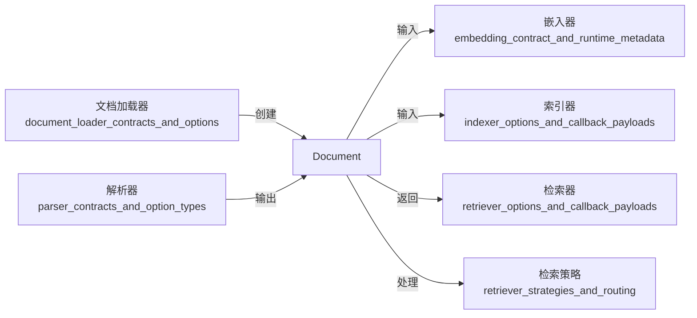

# document_schema 模块技术深度解析

## 1. 问题域与模块定位

在构建基于 AI 的应用系统时，我们需要处理各种文本数据——从原始文档到检索结果，从知识库条目到对话上下文。这些数据虽然形态各异，但都有一个核心共同点：它们都是"带有元数据的文本"。

如果没有统一的抽象，每个组件都会定义自己的数据结构：检索器返回 `SearchResult`，加载器输出 `RawDocument`，嵌入器接受 `TextWithEmbedding`……这会导致组件之间需要大量的转换代码，形成"数据胶水"的泥潭。

`document_schema` 模块的核心使命就是**提供一个统一、简洁、可扩展的数据结构**，作为整个系统中文本数据的"通用语言"。

## 2. 核心抽象与心智模型

### 2.1 核心抽象

`Document` 是这个模块的唯一核心抽象，它可以被想象为一个"智能信封"：
- **信封本身**：`ID` —— 唯一标识符，用于追踪和引用
- **信件内容**：`Content` —— 实际的文本数据
- **信封上的备注**：`MetaData` —— 各种附加信息，如分数、向量、索引信息等

### 2.2 设计洞察

这个设计采用了**"核心+元数据"的模式**：
- 核心字段（ID、Content）保持稳定，确保基本兼容性
- 元数据字段（MetaData）提供无限扩展性，容纳未来需求
- 通过类型安全的 getter/setter 方法，在灵活性和类型安全之间取得平衡

## 3. 架构与数据流



### 3.1 数据流分析

`Document` 在系统中扮演着**数据载体**的角色，数据流如下：

1. **创建阶段**：文档加载器或解析器从外部来源（文件、网页、数据库）读取数据，创建 `Document` 对象
2. **丰富阶段**：各种处理组件（嵌入器、索引器）向 `Document` 的 `MetaData` 中添加信息（如向量、分数）
3. **消费阶段**：检索器、策略组件等使用 `Document` 中的信息进行决策或展示

### 3.2 典型使用流程

```
原始文本 → Document → WithDenseVector() → WithScore() → 检索结果
```

## 4. 核心组件深度解析

### 4.1 Document 结构体

```go
type Document struct {
    ID       string         `json:"id"`
    Content  string         `json:"content"`
    MetaData map[string]any `json:"meta_data"`
}
```

**设计意图**：
- **ID**：提供唯一标识，支持文档追踪和引用
- **Content**：存储核心文本内容，保持简洁
- **MetaData**：使用 `map[string]any` 提供最大灵活性，容纳各种类型的元数据

**为什么选择 `map[string]any` 而不是具体的结构体字段**：
- 元数据的种类和类型在不同场景下差异很大，无法预先定义
- 使用 map 可以避免结构体字段的膨胀
- 通过 getter/setter 方法提供类型安全的访问

### 4.2 元数据访问方法

模块提供了一系列类型安全的元数据访问方法，每个方法都遵循相同的模式：

```go
// 设置方法
func (d *Document) WithScore(score float64) *Document {
    if d.MetaData == nil {
        d.MetaData = make(map[string]any)
    }
    d.MetaData[docMetaDataKeyScore] = score
    return d
}

// 获取方法
func (d *Document) Score() float64 {
    if d.MetaData == nil {
        return 0
    }
    score, ok := d.MetaData[docMetaDataKeyScore].(float64)
    if ok {
        return score
    }
    return 0
}
```

**设计特点**：
1. **链式调用**：设置方法返回 `*Document`，支持流畅的 API 设计
2. **防御式编程**：自动处理 `MetaData` 为 nil 的情况
3. **类型安全**：获取方法进行类型断言，失败时返回默认值
4. **常量键名**：使用私有常量定义元数据键，避免拼写错误

**支持的元数据类型**：

| 元数据类型 | 设置方法 | 获取方法 | 用途 |
|-----------|---------|---------|------|
| 子索引 | `WithSubIndexes` | `SubIndexes` | 搜索引擎子索引 |
| 分数 | `WithScore` | `Score` | 检索相关性分数 |
| 额外信息 | `WithExtraInfo` | `ExtraInfo` | 自定义额外信息 |
| DSL信息 | `WithDSLInfo` | `DSLInfo` | 查询 DSL 相关信息 |
| 密集向量 | `WithDenseVector` | `DenseVector` | 嵌入向量 |
| 稀疏向量 | `WithSparseVector` | `SparseVector` | 稀疏表示向量 |

## 5. 设计决策与权衡

### 5.1 灵活性 vs 类型安全

**决策**：使用 `map[string]any` 存储元数据，配合类型安全的 getter/setter

**权衡分析**：
- ✅ **优点**：极大的灵活性，可以容纳任何类型的元数据
- ✅ **优点**：通过 getter/setter 提供类型安全的访问
- ❌ **缺点**：运行时类型检查，编译期无法发现类型错误
- ❌ **缺点**：类型断言有轻微的性能开销

**为什么这样选择**：
在 AI 应用场景中，元数据的种类和类型变化很快，灵活性是首要考虑。通过提供标准的 getter/setter 方法，我们在保持灵活性的同时，将类型安全的责任交给了模块本身，而不是调用者。

### 5.2 可变性 vs 不可变性

**决策**：采用可变设计，`With*` 方法修改并返回自身

**权衡分析**：
- ✅ **优点**：内存效率高，不需要创建副本
- ✅ **优点**：链式调用自然流畅
- ❌ **缺点**：可能导致意外的副作用（如果多个地方引用同一个 Document）
- ❌ **缺点**：不适合函数式编程风格

**为什么这样选择**：
在典型的数据流中，Document 通常是单向流动的，从创建到消费不会被多个地方共享。可变设计在这种场景下提供了更好的性能和更自然的 API。

### 5.3 最小核心 vs 丰富功能

**决策**：保持核心结构极简，通过元数据和方法扩展功能

**权衡分析**：
- ✅ **优点**：核心结构稳定，不容易发生破坏性变更
- ✅ **优点**：可以适应未预见的使用场景
- ❌ **缺点**：一些常见功能需要通过元数据访问，不够直观
- ❌ **缺点**：元数据的使用需要遵循约定，否则可能冲突

**为什么这样选择**：
这是一个经典的"内核与扩展"设计模式。通过保持核心极简，我们确保了模块的长期稳定性，同时通过元数据机制提供了无限的扩展能力。

## 6. 使用指南与最佳实践

### 6.1 基本使用

```go
// 创建文档
doc := &schema.Document{
    ID:      "doc-001",
    Content: "这是文档内容",
}

// 链式设置元数据
doc.WithScore(0.95).
    WithExtraInfo("补充信息").
    WithDenseVector([]float64{0.1, 0.2, 0.3})

// 访问数据
fmt.Println(doc.Content)          // 直接访问核心字段
fmt.Println(doc.Score())          // 通过方法访问元数据
fmt.Println(doc.DenseVector())    // 通过方法访问元数据
```

### 6.2 自定义元数据

虽然模块提供了标准的元数据访问方法，但你也可以直接操作 `MetaData`：

```go
// 设置自定义元数据
if doc.MetaData == nil {
    doc.MetaData = make(map[string]any)
}
doc.MetaData["custom_field"] = "自定义值"

// 读取自定义元数据
if val, ok := doc.MetaData["custom_field"].(string); ok {
    fmt.Println(val)
}
```

**注意**：自定义元数据键名应该避免使用下划线开头，以免与内置键冲突。

### 6.3 最佳实践

1. **始终使用提供的方法访问标准元数据**：不要直接操作内置的元数据键
2. **处理默认值**：getter 方法在元数据不存在或类型不匹配时会返回默认值，要考虑这种情况
3. **避免在多个 goroutine 中并发修改**：Document 不是并发安全的
4. **使用 ID 进行文档标识**：不要依赖 Content 来唯一标识文档

## 7. 边缘情况与注意事项

### 7.1 元数据类型断言失败

当元数据存在但类型不匹配时，getter 方法会返回默认值：

```go
doc.MetaData[docMetaDataKeyScore] = "不是浮点数" // 错误的类型
fmt.Println(doc.Score()) // 输出 0，而不是 panic
```

**这是设计决策**：我们选择了"优雅降级"而不是"失败 fast"，因为在 AI 应用中，元数据的缺失或错误通常不应该导致整个流程崩溃。

### 7.2 MetaData 为 nil

所有方法都能安全处理 `MetaData` 为 nil 的情况：

```go
doc := &schema.Document{ID: "doc-001", Content: "内容"}
// MetaData 为 nil
fmt.Println(doc.Score()) // 安全，返回 0
doc.WithScore(0.95)      // 安全，会自动创建 MetaData
```

### 7.3 向量数据的处理

密集向量和稀疏向量是大型数据结构，要注意内存使用：

```go
// 密集向量可能很大
doc.WithDenseVector(make([]float64, 1536)) // 1536维的向量

// 稀疏向量使用 map[int]float64，适合大部分值为 0 的情况
sparseVec := map[int]float64{10: 0.5, 100: 0.8, 1000: 0.3}
doc.WithSparseVector(sparseVec)
```

## 8. 依赖关系与模块交互

### 8.1 被依赖关系

`document_schema` 是一个**底层基础模块**，被多个上层模块依赖：

- [document_ingestion_and_parsing](../components_core-document_ingestion_and_parsing.md)：创建和解析 Document
- [embedding_indexing_and_retrieval_primitives](../components_core-embedding_indexing_and_retrieval_primitives.md)：处理 Document 的向量和索引
- [retriever_strategies_and_routing](../flow_agents_and_retrieval-retriever_strategies_and_routing.md)：使用 Document 进行检索策略

### 8.2 模块契约

`Document` 在模块间传递时遵循以下隐式契约：

1. **ID 应该是唯一的**：在同一个上下文中，不同的 Document 应该有不同的 ID
2. **Content 应该是可打印的文本**：虽然没有强制限制，但 Content 通常是人类可读的文本
3. **元数据键的命名空间**：下划线开头的键保留给系统使用

## 9. 扩展与演进

### 9.1 添加新的元数据类型

如果需要添加新的标准元数据类型，遵循以下模式：

1. 添加新的常量键名
2. 实现 `WithXxx` 设置方法
3. 实现 `Xxx` 获取方法

### 9.2 未来可能的演进方向

- 添加验证方法，确保 Document 的完整性
- 支持序列化和反序列化的扩展点
- 添加文档分片和合并的辅助方法

## 总结

`document_schema` 模块看似简单，实则体现了深刻的设计智慧。它通过"核心+元数据"的模式，在简洁性和扩展性之间取得了完美平衡。作为整个系统的"数据通用语"，它让不同组件能够无缝协作，避免了数据转换的泥潭。

理解这个模块的关键在于：不要把它看作一个"数据结构"，而要看作一个"协议"——一个让整个系统能够围绕文本数据协同工作的协议。
