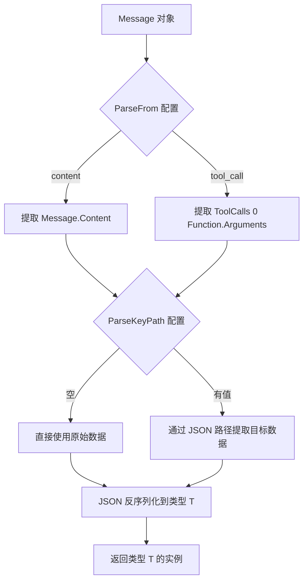

# core_parser 模块技术深度解析

## 1. 问题背景与模块定位

在构建基于 LLM 的 Agent 系统时，我们经常需要处理模型返回的非结构化或半结构化文本，并将其转换为程序可以处理的强类型数据。这个过程面临几个核心挑战：

1. **数据源多样性**：模型输出可能出现在消息内容（Content）中，也可能嵌入在工具调用（ToolCall）的参数里
2. **数据嵌套性**：JSON 数据往往不是扁平的，我们需要从嵌套结构中提取特定字段
3. **类型安全性**：我们希望在 Go 语言的类型系统约束下工作，避免频繁的类型断言和运行时错误

core_parser 模块正是为了解决这些问题而设计的。它提供了一种统一、类型安全的方式，从 Message 对象中解析出我们需要的数据结构。

## 2. 核心抽象与心智模型

可以把 core_parser 想象成一个**"数据萃取器"**，它的工作流程类似于：

1. **选择数据源**：决定从消息的哪个部分提取数据（内容还是工具调用）
2. **定位目标数据**：如果数据嵌套在 JSON 结构中，通过路径导航找到目标
3. **类型转换**：将 JSON 数据反序列化为指定的 Go 类型

这个模块的核心设计理念是**"配置驱动的解析"**——通过简单的配置对象，而不是复杂的代码，来描述解析逻辑。

### 核心组件

#### MessageParser[T any] 接口
这是模块的核心抽象，定义了解析器的统一契约：
```go
type MessageParser[T any] interface {
    Parse(ctx context.Context, m *Message) (T, error)
}
```
使用泛型确保了类型安全，不同的解析器实现可以返回不同的类型，但都遵循相同的接口。

#### MessageJSONParseConfig 结构体
配置解析行为的结构体，包含两个关键字段：
- `ParseFrom`：指定从消息的哪个部分解析数据（内容或工具调用）
- `ParseKeyPath`：JSON 路径表达式，用于从嵌套结构中提取特定字段

#### MessageJSONParser[T any] 结构体
`MessageParser` 接口的具体实现，使用 JSON 反序列化来解析数据。

## 3. 数据流程与架构

让我们通过一个典型的使用场景来追踪数据流动：



### 详细流程解析

1. **数据源选择**：根据 `ParseFrom` 配置，决定是从 `Message.Content` 还是 `Message.ToolCalls[0].Function.Arguments` 中提取原始数据
2. **数据提取（可选）**：如果配置了 `ParseKeyPath`，则使用 sonic 库的 JSON 路径功能从原始数据中提取目标字段
3. **反序列化**：将最终的 JSON 数据反序列化为指定的类型 T

## 4. 设计决策与权衡

### 4.1 泛型 vs 接口{}

**决策**：使用泛型 `MessageParser[T any]` 而不是返回 `interface{}`

**原因**：
- 提供编译时类型安全，避免运行时类型断言
- 使 API 更清晰，调用者知道会返回什么类型
- 减少样板代码

**权衡**：
- 增加了一定的复杂性，特别是对于不熟悉 Go 泛型的开发者
- 每种目标类型都需要创建一个新的解析器实例

### 4.2 配置对象 vs 函数参数

**决策**：使用 `MessageJSONParseConfig` 结构体来配置解析器，而不是使用多个函数参数

**原因**：
- 更易于扩展，添加新配置项不会破坏现有 API
- 配置可以预先创建和复用
- 更清晰，特别是当配置项增多时

**权衡**：
- 简单使用场景下可能显得有些繁琐
- 需要额外的结构体初始化代码

### 4.3 sonic 库 vs 标准库 encoding/json

**决策**：使用 sonic 库进行 JSON 处理

**原因**：
- sonic 提供了更强大的 JSON 路径查询功能
- 性能更好，特别是对于大型 JSON 数据
- 提供了更友好的 API

**权衡**：
- 引入了外部依赖
- 对于极其简单的场景，可能有些过度设计

## 5. 使用指南与最佳实践

### 基本使用

#### 从消息内容解析
```go
type UserData struct {
    Name string `json:"name"`
    Age  int    `json:"age"`
}

config := &schema.MessageJSONParseConfig{
    ParseFrom: schema.MessageParseFromContent,
}
parser := schema.NewMessageJSONParser[UserData](config)
data, err := parser.Parse(ctx, message)
```

#### 从工具调用解析
```go
type GetUserParam struct {
    UserID string `json:"user_id"`
}

config := &schema.MessageJSONParseConfig{
    ParseFrom: schema.MessageParseFromToolCall,
}
parser := schema.NewMessageJSONParser[GetUserParam](config)
param, err := parser.Parse(ctx, message)
```

#### 从嵌套结构提取数据
```go
type Address struct {
    City string `json:"city"`
}

config := &schema.MessageJSONParseConfig{
    ParseFrom:    schema.MessageParseFromContent,
    ParseKeyPath: "user.address",
}
parser := schema.NewMessageJSONParser[Address](config)
address, err := parser.Parse(ctx, message)
```

### 最佳实践

1. **复用解析器配置**：如果多个地方使用相同的解析逻辑，创建一个共享的配置对象
2. **错误处理**：总是检查 Parse 方法返回的错误，特别是在处理不可信的模型输出时
3. **类型设计**：为解析目标定义清晰的结构体，使用 JSON 标签来映射字段
4. **避免过度嵌套**：如果可能，尽量让模型返回扁平的 JSON 结构，减少 ParseKeyPath 的使用

## 6. 边界情况与注意事项

### 工具调用解析
- 当 `ParseFrom` 设置为 `MessageParseFromToolCall` 时，确保 `Message.ToolCalls` 不为空，否则会返回错误
- 当前实现只解析第一个工具调用（`ToolCalls[0]`），如果有多个工具调用，需要额外处理

### JSON 路径
- `ParseKeyPath` 使用点号分隔的路径表达式，如 `field.sub_field`
- 如果路径不存在，会返回错误，而不是零值
- 路径表达式不支持数组索引，如 `users[0]`

### 类型安全
- 虽然使用了泛型，但如果 JSON 数据与目标类型不匹配，仍然会在运行时返回错误
- 确保目标类型的字段标签与 JSON 数据的字段名完全匹配（包括大小写）

## 7. 依赖关系

core_parser 模块是一个相对独立的组件，主要依赖：
- `github.com/bytedance/sonic`：用于高性能 JSON 处理
- 内部的 `schema` 包：特别是 `Message` 类型（虽然我们没有看到其完整定义）

这个模块被设计为可以在整个系统中广泛使用，任何需要从 Message 中提取结构化数据的地方都可以使用它。

## 总结

core_parser 模块是一个小巧但强大的工具，它通过配置驱动的方式，为从 Message 对象中解析结构化数据提供了类型安全的解决方案。它的设计体现了 Go 语言的简洁性和现代性，特别是泛型的使用，使得 API 既安全又易用。

虽然这个模块相对简单，但它在整个系统中扮演着重要的角色，连接了模型的非结构化输出和程序的结构化处理逻辑。
