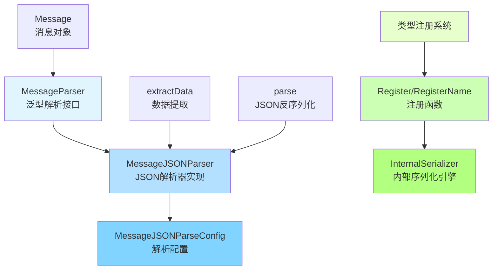

# message_parsing_and_serialization_support 模块技术深度解析

## 模块概览

在 AI 代理系统中，消息是智能体之间、智能体与工具之间、以及智能体与用户之间通信的核心载体。`message_parsing_and_serialization_support` 模块就像是这个通信系统的"翻译官"和"打包员"——它解决了两个关键问题：**如何从半结构化的消息中提取强类型数据**，以及**如何安全地序列化和反序列化复杂的数据结构**。

想象一下，你有一个智能体，它接收的消息可能是自由文本内容，也可能是包含工具调用参数的结构化数据。你需要把这些数据转换成代码中可以直接操作的结构体，同时还要确保这些数据可以在系统的不同组件之间可靠地传递和存储。这就是这个模块存在的意义。

## 核心组件与架构

### 架构图



### 架构解析

这个模块由两个相对独立但又协同工作的子系统组成：

1. **消息解析子系统**：
   - `MessageParser[T]` 接口：定义了通用的消息解析契约
   - `MessageJSONParser[T]`：基于 JSON 的具体实现
   - `MessageJSONParseConfig`：配置解析行为的选项

2. **序列化支持子系统**：
   - `Register/RegisterName` 函数：类型注册机制
   - 与内部序列化引擎的集成：确保复杂类型可以被正确序列化

### 数据流动

让我们追踪一次典型的消息解析流程：

1. **入口**：调用者创建一个 `MessageJSONParser[T]` 实例，指定目标类型 `T` 和解析配置
2. **解析触发**：调用 `Parse(ctx, message)` 方法
3. **数据源选择**：根据配置决定从 `Message.Content` 还是 `Message.ToolCalls[0].Function.Arguments` 提取原始数据
4. **数据提取**：如果配置了 `ParseKeyPath`，使用 JSON 路径提取嵌套数据
5. **反序列化**：将 JSON 字符串反序列化为目标类型 `T`
6. **结果返回**：返回强类型的解析结果或错误

## 设计决策与权衡

### 1. 泛型接口 vs 反射

**选择**：使用 Go 1.18+ 的泛型特性定义 `MessageParser[T]` 接口

**为什么这样设计**：
- **类型安全**：编译时就能发现类型不匹配的问题，而不是运行时
- **清晰的契约**：接口定义明确表达了"解析成什么类型"的意图
- **更好的开发体验**：IDE 可以提供准确的代码补全和类型提示

**权衡**：
- ✅ **优点**：类型安全、代码清晰、IDE 支持好
- ❌ **缺点**：在运行时需要通过类型参数实例化，对于动态类型场景不够灵活

### 2. 数据源可配置

**选择**：提供 `ParseFrom` 配置项，支持从 `content` 或 `tool_call` 解析

**为什么这样设计**：
- **灵活性**：AI 代理场景中，数据可能出现在消息的不同位置
  - 自由文本响应通常在 `content` 中
  - 工具调用参数通常在 `tool_call` 中
- **统一接口**：同一个解析器可以处理两种场景，无需创建不同的解析器类型

**权衡**：
- ✅ **优点**：灵活、统一、减少代码重复
- ❌ **缺点**：当从 `tool_call` 解析时，目前只支持第一个工具调用，这是一个有意的简化

### 3. JSON 路径支持

**选择**：提供 `ParseKeyPath` 配置，支持点分隔的 JSON 路径

**为什么这样设计**：
- **聚焦目标数据**：通常我们只关心消息中的一部分数据，而不是整个 JSON 结构
- **避免中间类型**：不需要先解析成一个大的结构体，再手动提取字段
- **简单实用**：点分隔路径比完整的 JSONPath 简单，但覆盖了大多数常见场景

**权衡**：
- ✅ **优点**：简单、实用、覆盖常见场景
- ❌ **缺点**：不支持数组索引、通配符等高级 JSONPath 特性

### 4. 显式类型注册

**选择**：要求用户显式注册需要序列化的类型

**为什么这样设计**：
- **Gob 序列化的要求**：Go 的 gob 包需要知道如何编码/解码自定义类型
- **安全性**：显式注册可以防止反序列化未预期的类型
- **控制**：让开发者明确知道哪些类型会被序列化

**权衡**：
- ✅ **优点**：安全、明确、符合 gob 的设计
- ❌ **缺点**：增加了使用时的仪式感，忘记注册会导致运行时错误

## 子模块详解

本模块由两个主要子模块组成，每个子模块负责特定的功能领域：

1. **[message_parsing_engine](schema_models_and_streams-message_parsing_and_serialization_support-message_parsing_engine.md)**：负责消息解析的核心引擎，包括 `MessageJSONParser` 和配置选项
2. **[serialization_support](schema_models_and_streams-message_parsing_and_serialization_support-serialization_support.md)**：提供类型注册和序列化支持功能

## 核心组件详解

### MessageParser[T] 接口

```go
type MessageParser[T any] interface {
    Parse(ctx context.Context, m *Message) (T, error)
}
```

这是模块的核心抽象。它定义了一个简单的契约：给定一个 `Message`，返回一个类型为 `T` 的值或错误。这种设计遵循了"面向接口编程"的原则，使得我们可以轻松替换解析器的实现，或者创建装饰器来增强功能。

### MessageJSONParser[T] 实现

这是 `MessageParser[T]` 的 JSON 特定实现。它的工作流程可以分为三个步骤：

1. **选择数据源**：根据 `ParseFrom` 配置决定从哪里获取原始 JSON 字符串
2. **提取数据**：如果配置了 `ParseKeyPath`，使用 sonic 库的 JSON 路径功能提取嵌套数据
3. **反序列化**：使用 sonic 库将 JSON 字符串反序列化为目标类型 `T`

**设计亮点**：
- 使用 [sonic](https://github.com/bytedance/sonic) 库进行 JSON 处理，这是一个高性能的 JSON 库
- 支持切片类型的解析
- 支持指针类型的解析

### 类型注册系统

类型注册系统与 `internal_serialization_engine` 模块紧密协作。它解决了 gob 序列化中的一个关键问题：如何让 gob 知道如何处理自定义类型，特别是那些包含接口字段的类型。

**工作原理**：
1. 调用 `Register[T]()` 或 `RegisterName[T](name)` 注册类型
2. 这些函数内部会调用 `gob.Register` 或 `gob.RegisterName`
3. 同时，它们也会与内部序列化引擎协调，确保类型可以被正确处理

## 使用指南与最佳实践

### 消息解析示例

#### 1. 从消息内容解析

```go
type UserProfile struct {
    Name string `json:"name"`
    Age  int    `json:"age"`
}

parser := NewMessageJSONParser[UserProfile](&MessageJSONParseConfig{
    ParseFrom: MessageParseFromContent,
})

message := &Message{
    Content: `{"name": "Alice", "age": 30}`,
}

profile, err := parser.Parse(ctx, message)
```

#### 2. 从工具调用参数解析

```go
type SearchParams struct {
    Query  string `json:"query"`
    Limit  int    `json:"limit"`
}

parser := NewMessageJSONParser[SearchParams](&MessageJSONParseConfig{
    ParseFrom: MessageParseFromToolCall,
})

message := &Message{
    ToolCalls: []ToolCall{
        {
            Function: FunctionCall{
                Arguments: `{"query": "golang best practices", "limit": 10}`,
            },
        },
    },
}

params, err := parser.Parse(ctx, message)
```

#### 3. 使用 JSON 路径提取嵌套数据

```go
type Address struct {
    City  string `json:"city"`
    Street string `json:"street"`
}

parser := NewMessageJSONParser[Address](&MessageJSONParseConfig{
    ParseFrom:    MessageParseFromContent,
    ParseKeyPath: "user.address",
})

message := &Message{
    Content: `{
        "user": {
            "name": "Bob",
            "address": {
                "city": "Beijing",
                "street": "Main St"
            }
        }
    }`,
}

address, err := parser.Parse(ctx, message)
```

### 类型注册示例

#### 1. 基本注册

```go
type MyData struct {
    Field1 string
    Field2 int
}

// 注册类型
Register[MyData]()

// 或者使用自定义名称注册
RegisterName[MyData]("my_custom_data")
```

#### 2. 注册包含接口的类型

```go
type ComplexData struct {
    Metadata any
    Items    []any
}

Register[ComplexData]()
Register[[]Message]() // 注册可能作为接口值的具体类型
```

## 常见陷阱与注意事项

### 1. 工具调用数量

当前实现中，当从 `tool_call` 解析时，只会使用第一个工具调用。如果消息中有多个工具调用，其他的会被忽略。

**解决方案**：如果你需要处理多个工具调用，需要在调用解析器之前手动选择正确的工具调用。

### 2. JSON 路径的限制

`ParseKeyPath` 只支持简单的点分隔路径，不支持数组索引（如 `items[0]`）或通配符。

**解决方案**：如果需要更复杂的 JSON 路径功能，可以先将整个 JSON 解析成一个 `map[string]any`，然后手动提取数据。

### 3. 类型注册的必要性

对于包含 `any` 类型字段的结构体，不仅要注册结构体本身，还要注册可能作为 `any` 值的所有具体类型。

**解决方案**：在程序初始化阶段，集中注册所有可能需要序列化的类型。

### 4. 并发安全

类型注册不是并发安全的，应该在程序启动时的单线程环境中完成。

**解决方案**：在 `init` 函数或 `main` 函数的开始阶段完成所有类型注册。

## 模块关系与依赖

### 依赖关系

- **依赖于**：
  - `internal_runtime_and_mocks/internal_serialization_engine`：提供底层序列化能力
  - `schema_models_and_streams/message_schema_and_templates`：定义 `Message` 类型
  - `github.com/bytedance/sonic`：高性能 JSON 处理库

- **被依赖于**：
  - 其他需要解析消息或序列化数据的模块（如 agent runtime、tool calling 等）

### 与其他模块的协作

这个模块是一个典型的"支持性模块"——它不直接实现业务逻辑，而是为其他模块提供基础设施。当一个 agent 需要处理工具调用参数时，当工作流需要持久化状态时，或者当任何组件需要从消息中提取结构化数据时，都会依赖这个模块。

## 总结

`message_parsing_and_serialization_support` 模块是 AI 代理系统中的一个关键基础设施组件。它通过提供类型安全的消息解析和灵活的序列化支持，解决了智能体通信中的两个核心问题。

这个模块的设计体现了几个重要的原则：
- **类型安全优先**：使用泛型确保编译时类型检查
- **简单实用**：提供的功能覆盖大多数常见场景，但不过度设计
- **明确配置**：通过配置对象而不是无数个参数来控制行为
- **与现有系统协作**：建立在 gob 和内部序列化引擎之上，而不是重新发明轮子

对于新加入团队的开发者来说，理解这个模块的设计思想和使用方式，将有助于你更高效地构建和调试 AI 代理系统。
