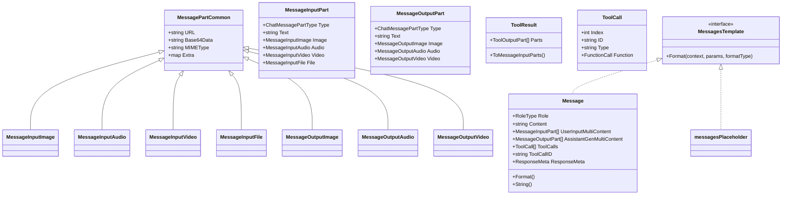

# message_schema_and_templates 模块技术深度解析

## 1. 问题空间与模块定位

### 1.1 模块解决的核心问题

在构建 LLM 应用时，我们面临几个核心挑战：
1. **消息格式的多样性**：不同模型提供商（OpenAI、Anthropic、本地模型）有不同的消息格式规范
2. **多模态内容的复杂性**：现代模型不仅处理文本，还需要处理图像、音频、视频、文件等多种模态
3. **流式输出的聚合**：模型通常以流式方式输出内容，需要将多个 chunk 聚合为完整消息
4. **提示模板的灵活性**：需要支持多种模板格式（FString、Go Template、Jinja2）来满足不同开发习惯
5. **工具调用的标准化**：需要统一的方式表示工具调用和工具结果

### 1.2 模块的核心定位

这个模块是整个框架的**"通用语言"**，它定义了：
- 模型输入输出的标准化数据结构
- 多模态内容的统一表示方式
- 流式数据的聚合机制
- 提示模板的渲染接口
- 工具调用和结果的契约

可以将它想象成框架的**"通信协议"**——所有组件（模型、代理、工具、工作流）都通过这个协议进行对话。

## 2. 核心抽象与架构

### 2.1 核心数据结构



### 2.2 架构设计理念

这个模块采用了**"分层统一"**的设计思想：

1. **基础层**：定义通用的部分类型（`MessagePartCommon`），通过组合支持多种模态
2. **输入输出分离**：区分用户输入（`MessageInputPart`）和模型输出（`MessageOutputPart`）
3. **工具调用闭环**：从 `ToolCall` 到 `ToolResult` 形成完整的工具交互流程
4. **模板渲染抽象**：通过 `MessagesTemplate` 接口统一不同模板格式的渲染方式

### 2.3 核心设计模式

1. **组合模式**：通过 `MessagePartCommon` 组合出多种模态类型
2. **策略模式**：通过 `FormatType` 支持多种模板渲染策略
3. **工厂模式**：提供 `SystemMessage()`、`UserMessage()`、`AssistantMessage()`、`ToolMessage()` 等便捷构造函数
4. **接口隔离**：`MessagesTemplate` 接口只定义核心的 `Format()` 方法

## 3. 核心组件深度解析

### 3.1 Message 结构体

**设计意图**：作为整个模块的核心，`Message` 统一了所有与模型交互的消息格式。

**关键设计决策**：
1. **RoleType 枚举**：明确区分四种角色（User、Assistant、System、Tool）
2. **Content + MultiContent 双字段**：
   - `Content`：处理简单文本场景
   - `UserInputMultiContent`/`AssistantGenMultiContent`：处理多模态场景
   - 保留了向后兼容的 `MultiContent`（已废弃）
3. **ToolCalls 字段**：专门用于 Assistant 消息表示工具调用
4. **ToolCallID/ToolName**：专门用于 Tool 消息关联工具调用

**为什么这样设计？**
- 不是所有场景都需要多模态，保持简单场景的简洁性
- 输入和输出的多模态需求不同（输入需要更多控制，输出需要更多解析）
- 工具调用和结果需要明确的关联机制

### 3.2 多模态内容表示

**设计意图**：通过统一的结构表示多种模态，同时保持类型安全。

**核心组件**：
- `MessagePartCommon`：所有模态的公共基础（URL、Base64Data、MIMEType、Extra）
- `MessageInputImage/Audio/Video/File`：用户输入的多模态内容
- `MessageOutputImage/Audio/Video`：模型输出的多模态内容
- `ToolOutputImage/Audio/Video/File`：工具输出的多模态内容

**设计亮点**：
1. **URL + Base64Data 双支持**：既支持远程资源，也支持内联数据
2. **类型安全的多态**：通过 `Type` 字段和对应的指针字段实现
3. **统一的 Extra 字段**：为扩展性预留空间

**为什么区分输入、输出和工具输出？**
- 用户输入可能需要额外参数（如 `ImageURLDetail`）
- 模型输出通常更简洁
- 工具输出需要特殊的处理逻辑（如 `ToMessageInputParts()`）

### 3.3 工具调用与结果

**设计意图**：标准化工具调用的表示和结果的返回。

**关键组件**：
- `ToolCall`：表示模型发起的工具调用
- `ToolResult`：表示工具执行的结果
- `ToolArgument`：工具调用的输入参数

**核心流程**：
1. Assistant 消息包含 `ToolCalls`
2. 系统执行工具，生成 `ToolResult`
3. 将 `ToolResult` 转换为 Tool 消息（通过 `ToMessageInputParts()`）
4. 将 Tool 消息返回给模型

**为什么需要 ToolResult？**
- 工具可能返回多模态内容，不仅仅是文本
- 需要统一的方式将工具输出转换为模型可理解的输入

### 3.4 MessagesTemplate 接口

**设计意图**：提供统一的模板渲染接口，支持多种模板格式。

**核心组件**：
- `MessagesTemplate` 接口：定义 `Format()` 方法
- `Message` 实现：渲染单个消息的内容
- `messagesPlaceholder` 实现：渲染消息占位符

**支持的格式类型**：
- `FString`：Python 风格的格式化字符串（`{name}`）
- `GoTemplate`：Go 标准库的模板格式
- `Jinja2`：流行的 Python 模板语言

**设计亮点**：
- 统一的接口，不同的实现
- 支持占位符，便于构建对话历史
- 禁用了 Jinja2 的危险操作（include、extends、import、from）

**为什么支持多种格式？**
- 不同开发者有不同的习惯和背景
- FString 简单直接，适合简单场景
- GoTemplate 是 Go 开发者熟悉的
- Jinja2 功能强大，适合复杂场景

### 3.5 流式数据聚合

**设计意图**：将模型输出的多个流式 chunk 聚合为完整消息。

**核心函数**：
- `ConcatMessages()`：聚合多个 Message 为一个
- `ConcatMessageArray()`：聚合多个 Message 数组
- `ConcatToolResults()`：聚合多个 ToolResult
- `ConcatMessageStream()`：从 StreamReader 读取并聚合

**聚合规则**：
1. **文本内容**：简单拼接
2. **工具调用**：按 Index 分组，拼接 Arguments
3. **多模态内容**：
   - 文本部分：拼接连续的文本
   - 非文本部分：保持原样，但同一类型不能出现在多个 chunk
4. **元数据**：保留最后一个有值的 FinishReason，累加 TokenUsage

**为什么需要这些规则？**
- 流式输出是分块的，需要重建完整内容
- 工具调用可能被分割到多个 chunk
- 多模态内容的流式输出有特殊约束

## 4. 数据流程分析

### 4.1 典型的消息生命周期

```
用户输入 → Message 构造 → 模板渲染 → 模型输入 → 模型输出 → 
流式 chunk → 聚合处理 → 完整 Message → 工具调用 → ToolResult → 
转换为 Message → 下一轮对话
```

### 4.2 模板渲染流程

```
1. 创建包含模板的 Message
2. 准备参数 map[string]any
3. 调用 Message.Format(ctx, params, formatType)
   ├─ 格式化 Content 字段
   ├─ 格式化 UserInputMultiContent（如果有）
   └─ 返回渲染后的 Message 数组
```

### 4.3 流式聚合流程

```
1. 从 StreamReader 接收 Message chunk
2. 将所有 chunk 收集到数组
3. 调用 ConcatMessages(msgs)
   ├─ 验证所有 chunk 的 Role、Name、ToolCallID 一致
   ├─ 拼接 Content 和 ReasoningContent
   ├─ 聚合 ToolCalls（按 Index 分组）
   ├─ 聚合多模态内容
   ├─ 合并 ResponseMeta
   └─ 合并 Extra 字段
4. 返回完整的 Message
```

### 4.4 工具结果转换流程

```
1. 工具执行生成 ToolResult
2. 调用 ToolResult.ToMessageInputParts()
   ├─ 遍历每个 ToolOutputPart
   ├─ 根据 Type 转换为对应的 MessageInputPart
   └─ 验证必要字段不为 nil
3. 将转换后的 parts 放入 Message.UserInputMultiContent
4. 创建 Tool 消息返回给模型
```

## 5. 设计决策与权衡

### 5.1 多模态内容的表示方式

**选择**：使用 Type 字段 + 对应指针字段的组合

**替代方案**：
1. **接口 + 具体类型**：更面向对象，但序列化/反序列化更复杂
2. **完全动态的 map**：最灵活，但失去类型安全
3. **分离的字段**：每个模态一个字段，结构更清晰但字段数量多

**权衡**：
- ✅ 类型安全，编译时能发现部分错误
- ✅ 序列化友好，JSON 映射清晰
- ✅ 易于扩展，添加新模态只需增加字段和类型
- ❌ 需要手动维护 Type 和字段的一致性
- ❌ 有一定的 boilerplate

### 5.2 模板格式的选择

**选择**：支持 FString、GoTemplate、Jinja2 三种格式

**替代方案**：
1. **只支持一种格式**：简化实现，但限制用户选择
2. **自定义格式**：完全控制，但增加学习成本

**权衡**：
- ✅ 满足不同背景开发者的习惯
- ✅ FString 简单，Jinja2 强大，GoTemplate 熟悉
- ✅ 禁用了 Jinja2 的危险操作，保证安全
- ❌ 增加了维护成本
- ❌ 三种格式的功能不完全一致

### 5.3 流式聚合的策略

**选择**：严格验证一致性，智能聚合内容

**替代方案**：
1. **宽松聚合**：忽略不一致，只拼接能拼接的
2. **不聚合**：让用户自己处理流式数据

**权衡**：
- ✅ 保证数据一致性，避免静默错误
- ✅ 智能合并工具调用和多模态内容
- ✅ 提供便捷的 StreamReader 接口
- ❌ 严格验证可能导致某些边界场景失败
- ❌ 聚合逻辑相对复杂

### 5.4 向后兼容性的处理

**选择**：保留废弃字段，添加新字段

**替代方案**：
1. **完全替换**：直接删除旧字段，强制迁移
2. **版本化**：创建 v2 版本的结构

**权衡**：
- ✅ 现有代码不会立即破坏
- ✅ 有时间逐步迁移
- ❌ 代码中有废弃的部分，增加认知负担
- ❌ 新老字段共存可能导致混淆

## 6. 使用指南与最佳实践

### 6.1 创建消息

**文本消息**：
```go
// 简单方式
userMsg := schema.UserMessage("Hello, what's your name?")
systemMsg := schema.SystemMessage("You are a helpful assistant.")
assistantMsg := schema.AssistantMessage("My name is AI Assistant.", nil)

// 完整方式
msg := &schema.Message{
    Role:    schema.User,
    Content: "Hello, what's your name?",
}
```

**多模态消息**：
```go
// 图像 + 文本
imageURL := "https://example.com/image.jpg"
msg := &schema.Message{
    Role: schema.User,
    UserInputMultiContent: []schema.MessageInputPart{
        {
            Type: schema.ChatMessagePartTypeText,
            Text: "What's in this image?",
        },
        {
            Type: schema.ChatMessagePartTypeImageURL,
            Image: &schema.MessageInputImage{
                MessagePartCommon: schema.MessagePartCommon{
                    URL: &imageURL,
                },
                Detail: schema.ImageURLDetailHigh,
            },
        },
    },
}
```

**工具消息**：
```go
// 工具调用（来自 Assistant）
toolCall := schema.ToolCall{
    ID:   "call_123",
    Type: "function",
    Function: schema.FunctionCall{
        Name:      "search",
        Arguments: `{"query": "weather in Beijing"}`,
    },
}
assistantMsg := schema.AssistantMessage("", []schema.ToolCall{toolCall})

// 工具结果
toolMsg := schema.ToolMessage(`{"temperature": 25, "condition": "sunny"}`, "call_123", 
    schema.WithToolName("search"))
```

### 6.2 使用模板

**FString 格式**：
```go
msg := schema.UserMessage("Hello, {name}! How can I help you with {topic}?")
rendered, err := msg.Format(ctx, map[string]any{
    "name":  "Alice",
    "topic": "Go programming",
}, schema.FString)
// rendered[0].Content = "Hello, Alice! How can I help you with Go programming?"
```

**Go Template 格式**：
```go
msg := schema.UserMessage("Hello, {{.Name}}! You have {{.Count}} messages.")
rendered, err := msg.Format(ctx, map[string]any{
    "Name":  "Bob",
    "Count": 5,
}, schema.GoTemplate)
```

**Jinja2 格式**：
```go
msg := schema.UserMessage("Hello, {{ name }}! URGENT: {{ message }}")
rendered, err := msg.Format(ctx, map[string]any{
    "name":    "Charlie",
    "urgent":  true,
    "message": "Please review the PR",
}, schema.Jinja2)
```

**消息占位符**：
```go
// 在提示模板中使用
chatTemplate := prompt.FromMessages(
    schema.SystemMessage("You are a helpful assistant."),
    schema.MessagesPlaceholder("history", false), // 从 params 获取 "history"
    schema.UserMessage("{query}"),
)

// 渲染
msgs, err := chatTemplate.Format(ctx, map[string]any{
    "history": []*schema.Message{...},
    "query":   "How to use templates?",
})
```

### 6.3 处理流式输出

**基础聚合**：
```go
// 从流读取并聚合
fullMsg, err := schema.ConcatMessageStream(stream)
if err != nil {
    // 处理错误
}

// 手动聚合
var chunks []*schema.Message
for {
    msg, err := stream.Recv()
    if err == io.EOF {
        break
    }
    if err != nil {
        // 处理错误
    }
    chunks = append(chunks, msg)
}
fullMsg, err := schema.ConcatMessages(chunks)
```

**工具结果聚合**：
```go
var resultChunks []*schema.ToolResult
// ... 收集 chunks ...
fullResult, err := schema.ConcatToolResults(resultChunks)
```

### 6.4 工具结果转换

```go
// 假设工具返回了 ToolResult
toolResult := &schema.ToolResult{
    Parts: []schema.ToolOutputPart{
        {
            Type: schema.ToolPartTypeText,
            Text: "Here's the image you requested:",
        },
        {
            Type:  schema.ToolPartTypeImage,
            Image: &schema.ToolOutputImage{...},
        },
    },
}

// 转换为 MessageInputParts
inputParts, err := toolResult.ToMessageInputParts()
if err != nil {
    // 处理错误
}

// 创建 Tool 消息
toolMsg := &schema.Message{
    Role:                 schema.Tool,
    ToolCallID:           "call_123",
    ToolName:             "image_generator",
    UserInputMultiContent: inputParts,
}
```

## 7. 边界情况与常见陷阱

### 7.1 多模态内容的常见错误

**陷阱 1：忘记设置 Type 字段**
```go
// 错误：只设置了 Image，但 Type 还是默认值
part := schema.MessageInputPart{
    Image: &schema.MessageInputImage{...},
}

// 正确：同时设置 Type 和对应的字段
part := schema.MessageInputPart{
    Type:  schema.ChatMessagePartTypeImageURL,
    Image: &schema.MessageInputImage{...},
}
```

**陷阱 2：同时设置 URL 和 Base64Data**
```go
// 不推荐：同时设置两个字段，行为可能不确定
image := &schema.MessageInputImage{
    MessagePartCommon: schema.MessagePartCommon{
        URL:        &url,
        Base64Data: &base64data,
    },
}

// 推荐：只设置一个
image := &schema.MessageInputImage{
    MessagePartCommon: schema.MessagePartCommon{
        URL: &url, // 或者 Base64Data
    },
}
```

### 7.2 模板渲染的常见错误

**陷阱 1：模板与格式类型不匹配**
```go
// 错误：使用 FString 格式但模板是 Jinja2 语法
msg := schema.UserMessage("Hello, {{ name }}!")
rendered, err := msg.Format(ctx, map[string]any{"name": "Alice"}, schema.FString)
// 结果："Hello, {{ name }}!"（没有渲染）

// 正确：匹配格式类型
rendered, err := msg.Format(ctx, map[string]any{"name": "Alice"}, schema.Jinja2)
```

**陷阱 2：缺少必要的参数**
```go
// 错误：缺少参数
msg := schema.UserMessage("Hello, {name}! You are {age} years old.")
rendered, err := msg.Format(ctx, map[string]any{"name": "Alice"}, schema.FString)
// 结果：错误（GoTemplate/Jinja2）或未渲染（FString）

// 正确：提供所有必要参数
rendered, err := msg.Format(ctx, map[string]any{"name": "Alice", "age": 30}, schema.FString)
```

### 7.3 流式聚合的常见错误

**陷阱 1：聚合不同 Role 的消息**
```go
// 错误：尝试聚合不同 Role 的消息
chunks := []*schema.Message{
    {Role: schema.User, Content: "Hello"},
    {Role: schema.Assistant, Content: "Hi there"},
}
fullMsg, err := schema.ConcatMessages(chunks)
// 结果：错误

// 正确：只聚合相同 Role 的消息
userChunks := []*schema.Message{
    {Role: schema.User, Content: "Hello"},
    {Role: schema.User, Content: " world"},
}
fullMsg, err := schema.ConcatMessages(userChunks)
```

**陷阱 2：非文本多模态内容出现在多个 chunk**
```go
// 错误：图像内容出现在多个 chunk
chunks := []*schema.ToolResult{
    {Parts: []schema.ToolOutputPart{{Type: schema.ToolPartTypeImage, ...}}},
    {Parts: []schema.ToolOutputPart{{Type: schema.ToolPartTypeImage, ...}}},
}
fullResult, err := schema.ConcatToolResults(chunks)
// 结果：错误

// 正确：非文本内容只出现在一个 chunk
chunks := []*schema.ToolResult{
    {Parts: []schema.ToolOutputPart{{Type: schema.ToolPartTypeText, Text: "First part"}}},
    {Parts: []schema.ToolOutputPart{{Type: schema.ToolPartTypeText, Text: "Second part"}}},
    {Parts: []schema.ToolOutputPart{{Type: schema.ToolPartTypeImage, ...}}},
}
```

### 7.4 工具调用关联的常见错误

**陷阱 1：Tool 消息缺少 ToolCallID**
```go
// 错误：Tool 消息没有 ToolCallID
toolMsg := &schema.Message{
    Role:    schema.Tool,
    Content: "Result here",
}

// 正确：设置 ToolCallID
toolMsg := &schema.Message{
    Role:       schema.Tool,
    Content:    "Result here",
    ToolCallID: "call_123",
}
```

**陷阱 2：ToolResult 转换时缺少内容**
```go
// 错误：ToolPartTypeImage 但 Image 字段是 nil
toolResult := &schema.ToolResult{
    Parts: []schema.ToolOutputPart{
        {Type: schema.ToolPartTypeImage}, // Image 是 nil
    },
}
inputParts, err := toolResult.ToMessageInputParts()
// 结果：错误

// 正确：设置所有必要字段
toolResult := &schema.ToolResult{
    Parts: []schema.ToolOutputPart{
        {
            Type:  schema.ToolPartTypeImage,
            Image: &schema.ToolOutputImage{...},
        },
    },
}
```

## 8. 扩展点与自定义

### 8.1 扩展多模态类型

虽然模块没有直接提供扩展多模态类型的接口，但你可以通过以下方式扩展：

1. **使用 Extra 字段**：
   ```go
   part := schema.MessageInputPart{
       Type: schema.ChatMessagePartTypeText,
       Text: "Custom data",
       Extra: map[string]any{
           "custom_type": "my_type",
           "custom_data": ...,
       },
   }
   ```

2. **在框架外处理**：
   - 在模型适配器中处理自定义类型
   - 在调用模型前后进行转换

### 8.2 自定义模板格式

虽然模块只支持三种内置格式，但你可以：

1. **预处理模板**：
   ```go
   // 在调用 Format 前预处理模板
   customTemplate := preprocessCustomTemplate(myTemplate)
   msg := schema.UserMessage(customTemplate)
   rendered, err := msg.Format(ctx, params, schema.FString) // 或其他格式
   ```

2. **实现自己的 MessagesTemplate**：
   ```go
   type CustomTemplate struct {
       // 你的字段
   }
   
   func (ct *CustomTemplate) Format(ctx context.Context, vs map[string]any, formatType FormatType) ([]*schema.Message, error) {
       // 你的渲染逻辑
   }
   
   // 然后在 prompt.FromMessages 中使用
   chatTemplate := prompt.FromMessages(
       schema.SystemMessage("..."),
       &CustomTemplate{...},
   )
   ```

### 8.3 自定义流式聚合

如果内置的聚合逻辑不满足需求，你可以：

1. **预处理 chunk**：
   ```go
   var processedChunks []*schema.Message
   for _, chunk := range rawChunks {
       processed := preprocessChunk(chunk)
       processedChunks = append(processedChunks, processed)
   }
   fullMsg, err := schema.ConcatMessages(processedChunks)
   ```

2. **完全自定义聚合**：
   ```go
   func customConcatMessages(msgs []*schema.Message) (*schema.Message, error) {
       // 你的聚合逻辑
   }
   ```

## 9. 相关模块与依赖

### 9.1 依赖的模块

- **internal_runtime_and_mocks**：提供流式处理的基础设施
- **components_core/model_and_prompting**：使用此模块的消息结构

### 9.2 被依赖的模块

几乎所有与模型交互的模块都依赖这个模块，包括：
- **adk_runtime/agent_contracts_and_context**：定义代理契约
- **adk_runtime/chatmodel_react_and_retry_runtime**：实现 ReAct 模式
- **flow_agents_and_retrieval**：构建代理和检索系统

### 9.3 相关文档

- [components_core-model_and_prompting](components_core-model_and_prompting.md)：了解如何在提示中使用消息
- [schema_models_and_streams-streaming_core_and_reader_writer_combinators](schema_models_and_streams-streaming_core_and_reader_writer_combinators.md)：了解流式处理的更多细节

## 10. 总结

`message_schema_and_templates` 模块是整个框架的基石，它通过精心设计的数据结构和接口，解决了 LLM 应用开发中的几个核心问题：

1. **统一性**：提供了标准化的消息格式，屏蔽了不同模型提供商的差异
2. **灵活性**：支持多种模态、多种模板格式、多种使用场景
3. **可扩展性**：通过 Extra 字段和接口设计，为未来扩展预留空间
4. **实用性**：提供了便捷的构造函数、流式聚合、模板渲染等功能

虽然设计中有一些权衡（如多模态表示的 boilerplate、多种模板格式的维护成本），但总体来说，这些权衡是值得的，因为它们换来的是更好的开发体验和更广泛的适用性。

对于新加入团队的开发者，理解这个模块是理解整个框架的第一步——一旦掌握了消息的表示、流转和处理，其他模块就容易理解了。
