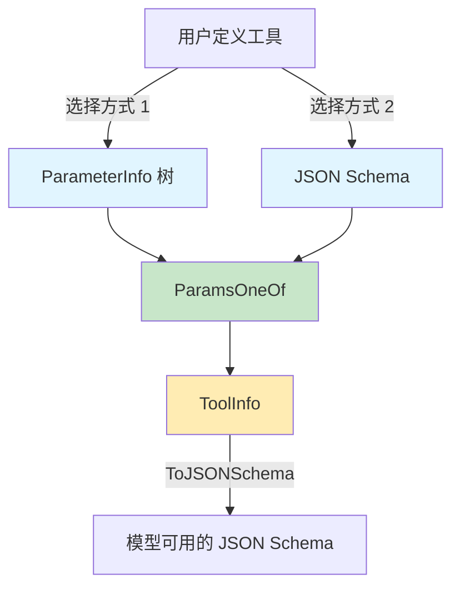

# `tool_metadata_schema` 模块技术深潜

## 1. 模块概述

`tool_metadata_schema` 模块是整个系统的核心元数据定义层，专门负责定义和管理工具（tool）的元数据结构。它解决了一个关键问题：如何以一种既符合 LLM（大语言模型）生态标准，又对开发者友好的方式来描述工具的能力和参数要求？

在没有这个模块之前，开发者可能需要直接操作原始的 JSON Schema，这既繁琐又容易出错。这个模块提供了一个中间抽象层——你可以选择用简洁的参数信息结构来定义工具，也可以选择用完整的 JSON Schema 来获得最大灵活性，而这两种方式最终都能被系统正确地转换成模型需要的格式。

## 2. 核心架构与数据流程

### 2.1 架构图



### 2.2 数据流程解析

整个模块的数据流设计体现了"多入口、单出口"的原则：

1. **输入层**：开发者有两种方式描述工具参数
   - 方式一：通过 `ParameterInfo` 构建直观的参数树结构
   - 方式二：直接提供完整的 `jsonschema.Schema` 对象

2. **统一包装层**：`ParamsOneOf` 作为联合类型容器，确保这两种方式不会被同时使用（互斥）

3. **工具信息聚合**：`ToolInfo` 聚合了工具的名称、描述、额外信息和参数描述

4. **转换输出层**：`ToJSONSchema()` 方法将内部表示统一转换为模型可消费的 JSON Schema 格式

## 3. 核心组件深度解析

### 3.1 `DataType` - 类型系统的基础

```go
type DataType string
```

**设计意图**：这是一个类型安全的字符串枚举，将 JSON Schema 的类型系统具体化。为什么不直接用字符串？因为编译器可以帮你捕获拼写错误，比如把 `"object"` 写成 `"objet"`。

**核心约束**：严格对应 JSON Schema 规范中的类型定义，确保与生态系统的兼容性。

### 3.2 `ToolChoice` - 控制模型行为的开关

```go
type ToolChoice string
```

**设计意图**：这是对 OpenAI 风格工具选择的抽象封装。它允许你控制模型在响应用户时是否使用工具：
- `ToolChoiceForbidden`：模型必须直接回答，不能使用任何工具
- `ToolChoiceAllowed`：模型可以自主选择直接回答或使用工具
- `ToolChoiceForced`：模型必须使用工具

**为什么这样设计**：通过语义化的命名（`forbidden`/`allowed`/`forced`）替代了 OpenAI 原始的 `none`/`auto`/`required`，使意图更加清晰。

### 3.3 `ParameterInfo` - 参数描述的原子单位

```go
type ParameterInfo struct {
    Type       DataType
    ElemInfo   *ParameterInfo  // 仅用于数组类型
    SubParams  map[string]*ParameterInfo  // 仅用于对象类型
    Desc       string
    Enum       []string  // 仅用于字符串类型
    Required   bool
}
```

**设计理念**：这是一个递归的数据结构，允许你构建任意深度的参数树。它的设计体现了"树状描述"的思想——每个参数既可以是基本类型，也可以是数组（有元素类型）或对象（有子参数）。

**关键特性**：
- **类型条件字段**：`ElemInfo` 和 `SubParams` 的使用取决于 `Type` 字段，这是一种"联合类型"的 Go 实现方式
- **递归转换**：`paramInfoToJSONSchema` 函数通过递归遍历这个结构，将其转换为 JSON Schema

**为什么不用接口**：考虑到参数描述主要是数据结构而非行为，使用结构体加上条件字段比接口更简单直观，特别是对于序列化场景。

### 3.4 `ParamsOneOf` - 灵活与规范的平衡点

```go
type ParamsOneOf struct {
    params     map[string]*ParameterInfo
    jsonschema *jsonschema.Schema
}
```

**设计洞察**：这是整个模块最精妙的设计之一。它解决了一个常见的权衡问题——简单性 vs 灵活性。

**核心思想**：
- 对于 80% 的常见场景，开发者可以使用 `params` 字段，通过 `ParameterInfo` 树快速定义参数
- 对于 20% 的复杂场景（需要 JSON Schema 的高级特性如 pattern、minimum 等），开发者可以直接使用 `jsonschema` 字段

**互斥约束**：这两个字段是互斥的——设置其中一个意味着另一个应该为 nil。这种设计类似于 Go 标准库中的 `json.RawMessage`，在统一的接口下提供多种实现方式。

**转换魔法**：`ToJSONSchema()` 方法是这个结构的核心，它将内部的两种表示统一转换为模型可消费的格式。

### 3.5 `ToolInfo` - 工具的完整描述

```go
type ToolInfo struct {
    Name        string
    Desc        string
    Extra       map[string]any
    *ParamsOneOf
}
```

**设计角色**：这是工具元数据的顶级容器，聚合了工具的所有必要信息。

**嵌入模式**：通过嵌入 `*ParamsOneOf`，`ToolInfo` 获得了参数描述能力，同时保持了清晰的关注点分离——工具的基本信息和参数描述是两个不同的概念。

## 4. 关键转换流程：`ToJSONSchema`

这个方法是模块的核心，让我们深入看看它是如何工作的：

```go
func (p *ParamsOneOf) ToJSONSchema() (*jsonschema.Schema, error) {
    // ...
}
```

### 4.1 从 `ParameterInfo` 树到 JSON Schema

当使用 `params` 方式时，转换过程如下：

1. 创建顶层对象 schema（类型固定为 `object`）
2. **排序键值**：这里有一个重要的细节——代码对参数名进行了排序！
   ```go
   keys := make([]string, 0, len(p.params))
   for k := range p.params {
       keys = append(keys, k)
   }
   sort.Strings(keys)
   ```
   **为什么排序**：因为 Go 的 map 遍历顺序是随机的，排序确保了生成的 JSON Schema 具有确定性，这对于测试和缓存非常重要。

3. 递归转换每个参数：`paramInfoToJSONSchema` 函数会处理嵌套的数组和对象类型

### 4.2 递归转换函数 `paramInfoToJSONSchema`

这个函数展示了如何处理递归数据结构：

- 基本类型：直接设置 `Type` 和 `Description`
- 枚举类型：添加 `Enum` 字段
- 数组类型：递归处理 `ElemInfo` 并设置 `Items`
- 对象类型：递归处理 `SubParams` 并设置 `Properties` 和 `Required`

**有序映射的使用**：注意代码使用了 `orderedmap` 而不是普通的 Go map：
```go
js.Properties = orderedmap.New[string, *jsonschema.Schema]()
```
这确保了生成的 JSON Schema 中属性的顺序是稳定的，这对于 LLM 理解工具参数有时会有微妙的影响。

## 5. 设计决策与权衡

### 5.1 两种参数描述方式的选择

**决策**：同时支持简化的 `ParameterInfo` 方式和完整的 JSON Schema 方式

**权衡分析**：
- ✅ **优点**：满足不同层次的需求，从简单到复杂
- ❌ **缺点**：增加了 API 表面面积，需要维护两种路径的转换逻辑

**为什么不强制使用 JSON Schema**：对于大多数场景，JSON Schema 过于冗长和复杂。`ParameterInfo` 提供了一个"80%解决方案"，让开发者可以快速定义工具。

### 5.2 结构体嵌入 vs 组合

**决策**：`ToolInfo` 嵌入 `*ParamsOneOf` 而不是将其作为命名字段

**权衡分析**：
- ✅ **优点**：API 更简洁，用户可以直接在 `ToolInfo` 上调用 `ToJSONSchema()`
- ❌ **缺点**：结构关系不够明显，可能会让新用户困惑

### 5.3 确定性输出的重要性

**决策**：对参数名进行排序，使用有序映射

**为什么重要**：
- 测试友好：生成的 JSON Schema 是可预测的
- 缓存友好：相同的输入总是产生相同的输出
- 调试友好：当出现问题时，稳定的输出更容易对比

## 6. 使用指南与常见模式

### 6.1 基本用法：使用 `ParameterInfo`

```go
// 定义一个简单的查询工具参数
params := map[string]*schema.ParameterInfo{
    "query": {
        Type:     schema.String,
        Desc:     "The search query",
        Required: true,
    },
    "limit": {
        Type:     schema.Integer,
        Desc:     "Maximum number of results",
        Required: false,
    },
}

tool := &schema.ToolInfo{
    Name:        "search",
    Desc:        "Search for information",
    ParamsOneOf: schema.NewParamsOneOfByParams(params),
}
```

### 6.2 嵌套对象与数组

```go
params := map[string]*schema.ParameterInfo{
    "filters": {
        Type: schema.Object,
        SubParams: map[string]*schema.ParameterInfo{
            "status": {
                Type: schema.String,
                Enum: []string{"active", "inactive", "pending"},
            },
            "tags": {
                Type: schema.Array,
                ElemInfo: &schema.ParameterInfo{
                    Type: schema.String,
                },
            },
        },
    },
}
```

### 6.3 高级场景：直接使用 JSON Schema

```go
// 当需要 JSON Schema 的高级特性时
js := &jsonschema.Schema{
    Type: "object",
    Properties: orderedmap.New[string, *jsonschema.Schema](),
    // 设置 pattern、minimum、maximum 等高级特性
}

tool := &schema.ToolInfo{
    Name:        "complex_tool",
    Desc:        "A tool with complex validation rules",
    ParamsOneOf: schema.NewParamsOneOfByJSONSchema(js),
}
```

## 7. 注意事项与陷阱

### 7.1 互斥约束的违反

**陷阱**：同时设置 `params` 和 `jsonschema` 字段

**后果**：当前实现会优先使用 `params`，完全忽略 `jsonschema`，这可能导致意外行为。

**正确做法**：始终使用构造函数 `NewParamsOneOfByParams` 或 `NewParamsOneOfByJSONSchema`，而不是手动创建 `ParamsOneOf` 结构体。

### 7.2 类型与字段的不匹配

**陷阱**：为非数组类型设置 `ElemInfo`，或为非对象类型设置 `SubParams`

**后果**：虽然当前代码不会崩溃，但这些字段会被默默忽略，导致描述不完整。

### 7.3 无参数工具的表示

**注意**：如果工具不需要参数，将 `ParamsOneOf` 设为 `nil` 即可，这会被正确地解释为"无参数"。

## 8. 模块关系与依赖

这个模块是系统中的基础定义模块，被多个高层模块依赖：

- **被依赖方**：[tool_contracts_and_options](components_core-tool_contracts_and_options.md)、[tool_function_adapters](components_core-tool_function_adapters.md)
- **依赖方**：`github.com/eino-contrib/jsonschema`、`github.com/wk8/go-ordered-map/v2`

作为元数据定义层，它几乎没有业务逻辑，是一个典型的"数据定义模块"。

## 9. 总结

`tool_metadata_schema` 模块通过精心设计的抽象，在简单性和灵活性之间找到了平衡点。它的核心思想是：

1. **提供选择**：让开发者根据场景选择合适的参数描述方式
2. **统一出口**：无论选择哪种方式，最终都转换为标准的 JSON Schema
3. **注重细节**：排序、有序映射等细节确保了输出的确定性和可靠性

这个模块虽然代码量不大，但它是整个工具系统的基础，体现了"让简单的事情保持简单，让复杂的事情成为可能"的设计理念。
