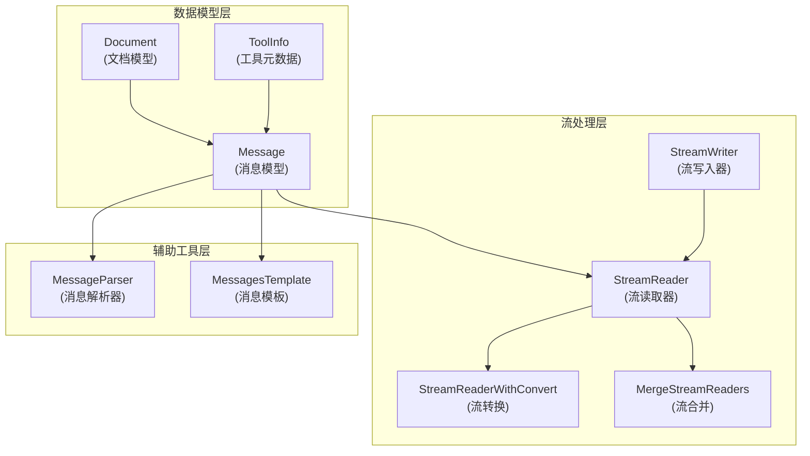

# schema_models_and_streams 模块深度解析

## 概述

`schema_models_and_streams` 模块是整个系统的基础数据模型和流处理核心，它定义了系统中所有关键数据结构和流处理原语。这个模块就像是系统的"骨架"和"血液循环系统"——骨架提供了数据结构的支撑，而流处理则确保了数据能够高效地在各个组件之间流动。

在 LLM 应用开发中，我们经常需要处理多种类型的数据：对话消息、文档、工具调用、流式输出等。这个模块的核心价值在于将这些多样化的数据统一到一套一致的模型中，并提供了灵活的流处理机制，使得开发者可以专注于业务逻辑而不是数据格式和传输细节。

## 架构总览



这个架构图展示了模块的核心组件及其关系。数据模型层定义了基本的数据结构，流处理层提供了数据流动的基础设施，而辅助工具层则提供了数据解析和模板化的能力。

## 核心设计理念

### 1. 统一的数据模型

该模块的第一个核心设计理念是**统一数据模型**。在 LLM 应用中，我们需要处理来自不同来源、格式各异的数据：
- 用户输入的文本和多模态内容
- 模型输出的文本、工具调用和多模态内容
- 工具返回的结构化和非结构化结果
- 检索系统返回的文档

通过定义 `Message`、`Document`、`ToolInfo` 等核心数据结构，模块将这些多样化的数据统一到一套一致的模型中，使得数据可以在系统的不同组件之间无缝流动。

### 2. 流式处理优先

第二个核心设计理念是**流式处理优先**。LLM 应用的一个关键特性是流式输出——模型可以在生成完整响应之前就开始返回部分结果。这个模块通过 `StreamReader` 和 `StreamWriter` 等抽象，将流式处理作为一等公民，使得开发者可以轻松地构建支持流式输出的应用。

流式处理不仅仅是为了更好的用户体验，它还能带来内存效率的提升——不需要等待完整响应生成就可以开始处理，这对于处理长文本或大文档尤为重要。

### 3. 可组合性

第三个核心设计理念是**可组合性**。模块提供了多种流处理原语，如 `StreamReaderWithConvert`（流转换）、`MergeStreamReaders`（流合并）、`Copy`（流复制）等，这些原语可以组合使用，构建出复杂的流处理管道。

这种设计类似于 Unix 管道的哲学——每个组件做一件事并做好，然后通过组合完成复杂任务。

## 核心组件详解

### 1. Document：文档模型

`Document` 是一个带元数据的文本数据结构，它是检索系统和文档处理的基础。

**设计意图**：
- 将文本内容与其元数据统一管理
- 提供标准化的元数据访问接口
- 支持多种检索相关的元数据（如分数、向量、子索引等）

**核心特性**：
```go
type Document struct {
    ID       string                 // 文档唯一标识
    Content  string                 // 文档内容
    MetaData map[string]any         // 元数据存储
}
```

`Document` 通过 `With*` 和 `*` 方法对提供了类型安全的元数据访问，例如：
- `WithScore(score float64)` / `Score()`：管理检索分数
- `WithDenseVector(vector []float64)` / `DenseVector()`：管理密集向量
- `WithSparseVector(sparse map[int]float64)` / `SparseVector()`：管理稀疏向量

这种设计既保持了元数据的灵活性（通过 `map[string]any`），又提供了类型安全的访问方式，避免了直接操作 `map[string]any` 带来的类型断言错误。

### 2. Message：消息模型

`Message` 是整个系统中最重要的数据结构之一，它定义了模型输入输出的统一格式。

**设计意图**：
- 统一用户输入、模型输出、工具调用和结果的表示
- 支持纯文本和多模态内容
- 提供流式处理的支持

**核心结构**：
```go
type Message struct {
    Role                    RoleType               // 消息角色（user/assistant/system/tool）
    Content                 string                 // 文本内容
    UserInputMultiContent   []MessageInputPart     // 用户输入的多模态内容
    AssistantGenMultiContent []MessageOutputPart   // 模型生成的多模态内容
    ToolCalls               []ToolCall             // 工具调用
    ToolCallID              string                 // 工具调用ID（仅工具消息）
    ToolName                string                 // 工具名称（仅工具消息）
    ResponseMeta            *ResponseMeta          // 响应元数据
    ReasoningContent        string                 // 推理内容
    Extra                   map[string]any         // 额外信息
}
```

**设计亮点**：

1. **角色系统**：通过 `RoleType` 区分不同来源的消息，使得对话历史的管理变得清晰。

2. **多模态支持**：
   - `UserInputMultiContent`：用户输入的多模态内容（文本、图片、音频、视频、文件）
   - `AssistantGenMultiContent`：模型生成的多模态内容
   - 这种分离设计使得输入和输出可以有不同的多模态能力

3. **工具调用集成**：`ToolCalls` 和 `ToolResult` 直接集成在消息结构中，使得工具调用的流程变得自然。

4. **流式合并支持**：提供了 `ConcatMessages` 函数，可以将流式输出的多个消息片段合并成一个完整消息。

### 3. 流处理系统

流处理系统是这个模块的另一个核心，它提供了一套完整的流处理原语。

#### StreamReader 和 StreamWriter

这是流处理的基础抽象，类似于 Go 语言中的 `io.Reader` 和 `io.Writer`，但是专为类型安全的流式数据传输设计。

**设计意图**：
- 提供类型安全的流式数据传输
- 支持背压（通过带缓冲的通道）
- 支持优雅关闭

**核心用法**：
```go
// 创建一个带缓冲的流
sr, sw := schema.Pipe[string](3)

// 发送数据
go func() {
    defer sw.Close()
    for i := 0; i < 10; i++ {
        sw.Send(fmt.Sprintf("chunk %d", i), nil)
    }
}()

// 接收数据
defer sr.Close()
for {
    chunk, err := sr.Recv()
    if errors.Is(err, io.EOF) {
        break
    }
    // 处理数据
}
```

#### 流处理原语

模块提供了多种流处理原语，可以组合使用：

1. **流转换** (`StreamReaderWithConvert`)：将一个流的元素转换为另一种类型
2. **流合并** (`MergeStreamReaders`)：将多个流合并为一个流
3. **流复制** (`Copy`)：将一个流复制为多个独立的流
4. **数组流转** (`StreamReaderFromArray`)：将数组转换为流

**设计亮点**：

1. **类型安全**：通过 Go 的泛型实现，确保流处理的类型安全
2. **自动关闭**：支持 `SetAutomaticClose()`，利用 Go 的终结器机制防止资源泄漏
3. **错误传播**：流中可以传递错误，使得错误处理变得自然
4. **灵活组合**：各种流处理原语可以灵活组合，构建复杂的流处理管道

### 4. 工具元数据模型

`ToolInfo` 和相关结构定义了工具的元数据，使得工具可以被模型理解和调用。

**设计意图**：
- 提供工具的描述信息，使得模型可以理解工具的用途
- 定义工具的参数结构，支持参数验证
- 兼容不同模型的工具调用格式

**核心结构**：
```go
type ToolInfo struct {
    Name        string                 // 工具名称
    Desc        string                 // 工具描述
    Extra       map[string]any         // 额外信息
    *ParamsOneOf                      // 参数定义（两种方式可选）
}

type ParamsOneOf struct {
    params      map[string]*ParameterInfo  // 直观的参数定义方式
    jsonschema  *jsonschema.Schema         // 完整的JSON Schema方式
}
```

**设计亮点**：

1. **双重参数定义方式**：
   - `ParameterInfo` 方式：直观易用，覆盖大多数场景
   - `JSON Schema` 方式：功能完整，适合复杂场景

2. **自动转换**：`ToJSONSchema()` 方法可以将 `ParameterInfo` 自动转换为 JSON Schema，兼容需要 JSON Schema 的模型

## 关键设计决策

### 1. 为什么使用方法对管理元数据？

在 `Document` 结构中，元数据是通过 `With*` 和 `*` 方法对来管理的，而不是直接暴露字段。

**选择理由**：
- **类型安全**：避免了直接操作 `map[string]any` 带来的类型断言错误
- **向后兼容**：如果将来需要改变元数据的存储方式，只需要修改方法实现，不影响外部代码
- **默认值处理**：方法可以提供合理的默认值（例如 `Score()` 在没有设置时返回 0）

**权衡**：
- 增加了一些代码量
- 对于新的元数据类型，需要添加新的方法

### 2. 为什么分离用户输入和模型输出的多模态内容？

在 `Message` 结构中，用户输入的多模态内容和模型输出的多模态内容是分开的两个字段。

**选择理由**：
- **能力差异**：用户输入和模型输出可能支持不同的多模态类型
- **清晰度**：分离使得消息结构更加清晰，避免混淆
- **验证**：可以更容易地验证输入和输出的格式

**权衡**：
- 增加了字段数量
- 在某些情况下可能需要在两种格式之间转换

### 3. 为什么使用泛型实现流处理？

流处理系统是通过 Go 的泛型实现的，而不是使用 `interface{}`。

**选择理由**：
- **类型安全**：编译时类型检查，避免运行时类型断言错误
- **性能**：不需要类型断言和装箱/拆箱，性能更好
- **可读性**：代码更加清晰，不需要到处都是类型断言

**权衡**：
- 增加了一些实现复杂度
- 在 Go 1.18 之前不可用（但现在已经不是问题）

## 数据流程示例

让我们通过一个典型的 RAG（检索增强生成）场景来看看数据如何在这个模块中流动：

1. **文档准备**：
   - 创建 `Document` 对象，包含内容和元数据
   - 将文档添加到检索系统

2. **用户查询**：
   - 创建用户 `Message`，包含查询内容
   - 将消息传递给对话系统

3. **检索**：
   - 检索系统使用查询从文档库中检索相关文档
   - 返回的文档被转换为消息上下文中的内容

4. **模型调用**：
   - 完整的消息历史（包括用户查询和检索到的文档）被发送给模型
   - 模型返回流式响应

5. **流式处理**：
   - 模型的流式响应通过 `StreamReader` 接收
   - 可能使用 `StreamReaderWithConvert` 对响应进行转换
   - 最终响应通过 `ConcatMessages` 合并为完整消息

6. **工具调用（如果需要）**：
   - 如果模型返回工具调用，会创建工具调用消息
   - 执行工具后，创建工具结果消息
   - 将工具结果消息添加到对话历史，再次调用模型

## 使用指南和注意事项

### 1. 正确使用 Message 结构

- **纯文本消息**：使用 `Content` 字段即可
- **多模态输入**：使用 `UserInputMultiContent` 字段
- **多模态输出**：使用 `AssistantGenMultiContent` 字段
- **不要混用**：避免同时使用旧的 `MultiContent` 字段和新的多模态字段

### 2. 流处理最佳实践

- **总是关闭流**：使用 `defer sr.Close()` 确保流被正确关闭
- **考虑使用自动关闭**：对于容易忘记关闭的流，使用 `SetAutomaticClose()`
- **合理设置缓冲区大小**：根据生产和消费速度设置合适的缓冲区大小
- **错误处理**：总是检查 `Recv()` 返回的错误

### 3. 工具定义建议

- **优先使用 ParameterInfo**：对于大多数场景，`ParameterInfo` 已经足够
- **使用 JSON Schema 处理复杂情况**：对于需要高级验证的复杂参数，使用 JSON Schema
- **提供清晰的描述**：工具和参数的描述应该清晰明了，帮助模型理解如何使用

### 4. 常见陷阱

- **忘记关闭流**：这会导致资源泄漏
- **混用多模态字段**：旧的 `MultiContent` 字段已经弃用，应该使用新的字段
- **错误处理不完整**：流处理中的错误应该被正确处理，而不是忽略
- **类型断言不安全**：避免直接对 `map[string]any` 进行类型断言，使用提供的方法

## 子模块概览

本模块包含以下子模块，每个子模块都有详细的文档：

- [document_schema](./schema_models_and_streams-document_schema.md)：文档数据模型的详细说明
- [message_schema_and_templates](./schema_models_and_streams-message_schema_and_templates.md)：消息模型和模板系统的深入解析
- [message_parsing_and_serialization_support](./schema_models_and_streams-message_parsing_and_serialization_support.md)：消息解析和序列化支持
- [streaming_core_and_reader_writer_combinators](./schema_models_and_streams-streaming_core_and_reader_writer_combinators.md)：流式处理核心和读写器组合子
- [tool_metadata_schema](./schema_models_and_streams-tool_metadata_schema.md)：工具元数据模式

## 与其他模块的关系

`schema_models_and_streams` 是一个基础模块，被系统中的许多其他模块依赖：

- **components_core** 模块中的各个子模块使用 `Message`、`Document` 和 `ToolInfo` 作为数据交换格式
- **compose_graph_engine** 模块使用流处理系统来实现图执行的数据流
- **adk_runtime** 模块中的各个子模块构建在这些数据模型和流处理原语之上

可以说，`schema_models_and_streams` 是整个系统的"通用语言"，它定义了各个组件之间如何交换数据。

## 总结

`schema_models_and_streams` 模块是整个系统的基础，它提供了：

1. **统一的数据模型**：`Message`、`Document`、`ToolInfo` 等结构，使得不同组件可以无缝交换数据
2. **强大的流处理系统**：类型安全、可组合的流处理原语，支持构建高效的流式应用
3. **灵活的工具定义**：支持直观和完整两种方式定义工具参数

这个模块的设计体现了几个重要的原则：类型安全、可组合性、向后兼容。它不是一个"业务逻辑"模块，而是一个"基础设施"模块——它不解决具体的业务问题，而是为解决业务问题提供了坚实的基础。
