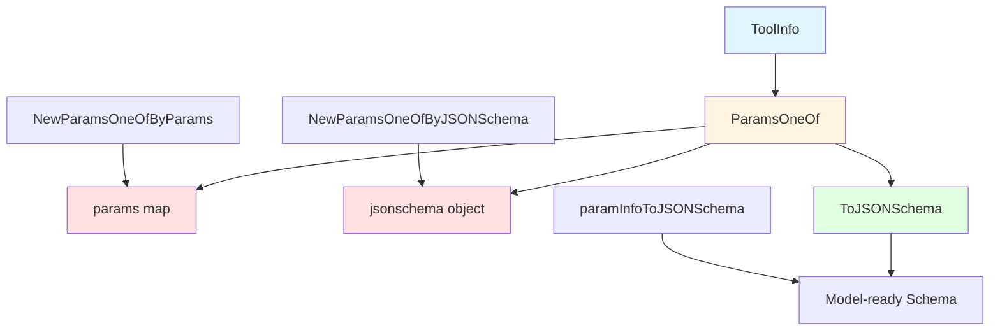

# schema_tool 模块技术深度解析

## 1. 什么是 schema_tool 模块？

**schema_tool** 模块是 Eino 框架中定义工具调用规范的核心基础设施。它提供了一套标准化的数据结构，用于描述 LLM 可调用工具的元信息、参数结构和调用行为控制。

在 AI Agent 系统中，工具定义是连接自然语言接口与具体业务逻辑的关键桥梁。如果没有统一的工具描述机制，不同模型提供商的工具接口差异会导致代码高度耦合，难以维护和扩展。schema_tool 通过抽象出一套独立于具体模型实现的工具描述语言，解决了这个问题。

这个模块的核心价值在于：
- **统一描述层**：提供与模型无关的工具定义 API
- **灵活参数表达**：支持从简单到复杂的参数结构描述
- **JSON Schema 桥接**：能将抽象定义转换为模型可识别的标准格式

## 2. 核心概念与架构

### 2.1 关键抽象

schema_tool 模块围绕三个核心概念构建：

1. **ToolInfo（工具信息）**：完整的工具描述，包括名称、功能说明和参数定义
2. **ParameterInfo（参数信息）**：单个参数的类型、结构、约束等元数据
3. **ParamsOneOf（参数定义二选一）**：灵活的参数定义方式选择器

### 2.2 架构设计



### 2.3 设计思路

这个模块的设计体现了"简单问题简单处理，复杂问题精确处理"的原则：

- **简单场景**：使用 `ParameterInfo` 树结构，通过嵌套的方式描述大多数常见参数
- **复杂场景**：直接提供完整的 JSON Schema，满足特殊或高级需求
- **转换层**：统一的 `ToJSONSchema()` 方法，确保无论使用哪种方式，最终都能为模型提供标准格式

## 3. 核心组件详解

### 3.1 DataType 与 ToolChoice 枚举

```go
type DataType string

const (
    Object  DataType = "object"
    Number  DataType = "number"
    Integer DataType = "integer"
    String  DataType = "string"
    Array   DataType = "array"
    Null    DataType = "null"
    Boolean DataType = "boolean"
)
```

**设计意图**：这些常量直接映射到 JSON Schema 规范中的类型定义。通过枚举而非自由字符串，在编译期就能捕获类型拼写错误，这是类型安全的典型实践。

```go
type ToolChoice string

const (
    ToolChoiceForbidden ToolChoice = "forbidden" // 对应 OpenAI 的 "none"
    ToolChoiceAllowed   ToolChoice = "allowed"   // 对应 OpenAI 的 "auto"
    ToolChoiceForced    ToolChoice = "forced"    // 对应 OpenAI 的 "required"
)
```

**设计意图**：工具选择控制采用了语义化命名而非直接复用 OpenAI 的术语。这样做有两个好处：
1. 更清晰地表达意图（"allowed" 比 "auto" 更直白）
2. 解耦于特定提供商，未来扩展其他模型时无需改变 API

### 3.2 ToolInfo 结构体

```go
type ToolInfo struct {
    Name        string                 // 工具的唯一名称
    Desc        string                 // 工具功能描述
    Extra       map[string]any         // 额外信息
    *ParamsOneOf                        // 参数定义（二选一方式）
}
```

**核心职责**：作为工具的完整描述容器。设计上采用了组合模式，嵌入 `ParamsOneOf` 而非直接包含字段，这样可以自然地复用参数定义逻辑。

**关键点**：
- `Name` 是工具的标识符，必须唯一且清晰表达用途
- `Desc` 是 LLM 理解工具功能的关键，建议包含使用场景和示例
- `Extra` 用于存储模型特定的扩展信息，保持核心结构简洁
- `ParamsOneOf` 指针允许为 `nil`，表示工具不需要参数

### 3.3 ParameterInfo 结构体

```go
type ParameterInfo struct {
    Type      DataType             // 参数类型
    ElemInfo  *ParameterInfo       // 数组元素类型（仅 array 类型使用）
    SubParams map[string]*ParameterInfo // 对象子参数（仅 object 类型使用）
    Desc      string               // 参数描述
    Enum      []string             // 枚举值（仅 string 类型使用）
    Required  bool                 // 是否必需
}
```

**设计意图**：这是一个递归定义的树状结构，能够描述嵌套的复杂参数。每个节点可以是基本类型，也可以是包含子节点的对象或数组。

**关键设计点**：
- **递归结构**：`ElemInfo` 和 `SubParams` 都是 `ParameterInfo` 类型，允许描述任意深度的嵌套结构
- **选择性字段**：不同类型使用不同字段（如数组用 `ElemInfo`，对象用 `SubParams`），避免了冗余
- **约束表达**：通过 `Enum` 和 `Required` 等字段，能表达基本的参数约束

**使用场景**：适用于 80% 的常见工具参数定义，提供了比手写 JSON Schema 更友好的 API。

### 3.4 ParamsOneOf 结构体

```go
type ParamsOneOf struct {
    params     map[string]*ParameterInfo  // 方式1: 使用 ParameterInfo 树
    jsonschema *jsonschema.Schema         // 方式2: 直接提供 JSON Schema
}
```

**设计思想**：这是"二选一"模式的实现——用户必须且只能选择一种方式来定义参数。这种设计既满足了大多数场景的易用性需求，又保留了处理复杂情况的灵活性。

**关键方法**：

#### NewParamsOneOfByParams
```go
func NewParamsOneOfByParams(params map[string]*ParameterInfo) *ParamsOneOf
```
**用途**：为大多数简单场景提供的便捷构造函数。

#### NewParamsOneOfByJSONSchema
```go
func NewParamsOneOfByJSONSchema(s *jsonschema.Schema) *ParamsOneOf
```
**用途**：为需要精确控制或复杂约束的场景准备的逃生舱口。

#### ToJSONSchema
```go
func (p *ParamsOneOf) ToJSONSchema() (*jsonschema.Schema, error)
```
**核心转换逻辑**：这是整个模块的关键方法，它将内部表示转换为模型可理解的格式。

**转换流程**：
1. 检查是否为 `nil`——无参数时返回 `nil`
2. 如果设置了 `params`，将 `ParameterInfo` 树递归转换为 JSON Schema
3. 如果设置了 `jsonschema`，直接返回
4. 注意：设计上确保两种方式互斥，不会同时设置

**重要细节**：转换时会对参数名按字母顺序排序，这是为了确保生成的 JSON Schema 具有确定性，避免不必要的变更。

## 4. 数据流动与转换过程

### 4.1 典型数据流程

让我们追踪一个工具从定义到被模型使用的完整路径：

```
开发者定义工具
    |
    ▼
ToolInfo 实例
(使用 ParameterInfo)
    |
    ▼
ToJSONSchema()
+ paramInfoToJSONSchema()
    |
    ▼
*jsonschema.Schema
(模型就绪格式)
    |
    ▼
模型适配器层
(如 OpenAI)
```

### 4.2 转换示例

让我们看一个具体例子，从定义到转换：

**定义阶段**：
```go
toolInfo := &schema.ToolInfo{
    Name: "search_web",
    Desc: "搜索网络获取最新信息",
    ParamsOneOf: schema.NewParamsOneOfByParams(map[string]*schema.ParameterInfo{
        "query": {
            Type: schema.String,
            Desc: "搜索关键词",
            Required: true,
        },
        "options": {
            Type: schema.Object,
            SubParams: map[string]*schema.ParameterInfo{
                "limit": {
                    Type: schema.Integer,
                    Desc: "返回结果数量",
                },
                "lang": {
                    Type: schema.String,
                    Desc: "语言偏好",
                    Enum: []string{"en", "zh", "ja"},
                },
            },
        },
    }),
}
```

**转换阶段**：
```go
js, err := toolInfo.ToJSONSchema()
```

**结果**：
```json
{
  "type": "object",
  "properties": {
    "query": {
      "type": "string",
      "description": "搜索关键词"
    },
    "options": {
      "type": "object",
      "properties": {
        "limit": {
          "type": "integer",
          "description": "返回结果数量"
        },
        "lang": {
          "type": "string",
          "description": "语言偏好",
          "enum": ["en", "zh", "ja"]
        }
      }
    }
  },
  "required": ["query"]
}
```

## 5. 设计决策与权衡

### 5.1 二选一模式 vs 统一接口

**选择**：采用 `ParamsOneOf` 二选一模式，而非单一的参数描述方式。

**理由**：
- **易用性**：对于 80% 的简单场景，`ParameterInfo` 树比手写 JSON Schema 更直观
- **表达力**：对于剩下 20% 的复杂场景，直接提供 JSON Schema 可以满足所有需求
- **渐进式**：用户可以从简单方式开始，需要时无缝切换到复杂方式

**权衡**：
- 优点：兼顾了易用性和灵活性
- 缺点：API 表面更大，需要用户理解两种方式的区别

### 5.2 类型安全的枚举 vs 自由字符串

**选择**：为 `DataType` 和 `ToolChoice` 使用类型化的枚举。

**理由**：
- **编译期检查**：拼写错误会在编译时被发现，而非运行时
- **自动补全**：IDE 可以提供更好的代码补全
- **文档自包含**：枚举值本身就是文档

**权衡**：
- 优点：提高了代码的健壮性和开发体验
- 缺点：添加新类型需要修改代码（尽管 JSON Schema 类型已经相对稳定）

### 5.3 排序属性确保确定性

**选择**：在转换为 JSON Schema 时对属性名按字母顺序排序。

**理由**：
- **可重复性**：相同的输入总是产生相同的输出
- **可测试性**：测试可以简单地比较字符串
- **版本控制友好**：减少无意义的变更

**权衡**：
- 优点：提高了可测试性和稳定性
- 缺点：可能与用户期望的顺序不同（但 JSON Schema 规范不保证顺序）

### 5.4 指针字段允许 nil

**选择**：`ParamsOneOf` 在 `ToolInfo` 中是指针，允许为 `nil`。

**理由**：
- **无参数工具**：自然表达不需要参数的工具
- **可选性**：与显式设置空对象相比，`nil` 更清晰地表达"无"的概念

**权衡**：
- 优点：语义清晰
- 缺点：需要调用方处理 `nil` 情况

## 6. 使用指南与常见模式

### 6.1 简单工具（无参数）

```go
tool := &schema.ToolInfo{
    Name: "get_current_time",
    Desc: "获取当前时间",
    // ParamsOneOf 为 nil，表示无参数
}
```

### 6.2 基本参数工具

```go
tool := &schema.ToolInfo{
    Name: "calculate",
    Desc: "执行数学计算",
    ParamsOneOf: schema.NewParamsOneOfByParams(map[string]*schema.ParameterInfo{
        "expression": {
            Type: schema.String,
            Desc: "数学表达式，如 '2 + 2 * 3'",
            Required: true,
        },
    }),
}
```

### 6.3 复杂嵌套参数

```go
tool := &schema.ToolInfo{
    Name: "send_email",
    Desc: "发送邮件",
    ParamsOneOf: schema.NewParamsOneOfByParams(map[string]*schema.ParameterInfo{
        "to": {
            Type: schema.Array,
            ElemInfo: &schema.ParameterInfo{
                Type: schema.String,
                Desc: "收件人邮箱",
            },
            Desc: "收件人列表",
            Required: true,
        },
        "content": {
            Type: schema.Object,
            SubParams: map[string]*schema.ParameterInfo{
                "subject": {
                    Type: schema.String,
                    Desc: "邮件主题",
                    Required: true,
                },
                "body": {
                    Type: schema.String,
                    Desc: "邮件正文",
                    Required: true,
                },
                "format": {
                    Type: schema.String,
                    Desc: "内容格式",
                    Enum: []string{"plain", "html"},
                },
            },
            Required: true,
        },
    }),
}
```

### 6.4 使用原始 JSON Schema

当 `ParameterInfo` 不足以表达复杂约束时：

```go
import "github.com/eino-contrib/jsonschema"

// 构建复杂的 JSON Schema
complexSchema := &jsonschema.Schema{
    Type: "object",
    Properties: orderedmap.New[string, *jsonschema.Schema](),
    // ... 设置复杂约束，如 oneOf, anyOf, pattern, minLength 等
}

tool := &schema.ToolInfo{
    Name: "advanced_tool",
    Desc: "需要复杂参数验证的工具",
    ParamsOneOf: schema.NewParamsOneOfByJSONSchema(complexSchema),
}
```

## 7. 注意事项与常见陷阱

### 7.1 类型与字段匹配

**陷阱**：设置了与类型不匹配的字段，如为 `string` 类型设置 `ElemInfo`。

**当前行为**：`paramInfoToJSONSchema` 会忽略不相关的字段，但这可能导致预期外的结果。

**建议**：确保只设置与当前类型相关的字段。

### 7.2 ParamsOneOf 的互斥性

**陷阱**：试图同时设置 `params` 和 `jsonschema`。

**当前行为**：`params` 优先，`jsonschema` 会被忽略。

**建议**：使用构造函数（`NewParamsOneOfByParams` 或 `NewParamsOneOfByJSONSchema`）而非直接创建结构体，这样可以避免这类错误。

### 7.3 递归结构的终止

**陷阱**：创建递归的 `ParameterInfo` 结构（如 A 包含 B，B 又包含 A）。

**当前行为**：`ToJSONSchema()` 会无限递归，导致栈溢出。

**建议**：避免创建递归的参数结构，JSON Schema 本身也不鼓励这样做。

### 7.4 必需字段的处理

**陷阱**：忘记在对象类型的参数中设置 `Required` 字段，导致所有参数都是可选的。

**建议**：明确标记哪些参数是必需的，这能帮助 LLM 更好地理解工具使用方式。

## 8. 与其他模块的关系

schema_tool 模块是整个系统的基础设施，被多个上层模块依赖：

- **[schema_message](schema_message.md)**：工具调用和工具结果消息结构
- **[tool_interfaces](tool_interfaces.md)**：工具组件的定义和实现
- **[ADK ChatModel Agent](ADK ChatModel Agent.md)**：Agent 开发套件中工具集成部分

作为核心定义模块，它不依赖其他 Eino 模块，仅依赖外部 JSON Schema 库。

## 9. 总结

schema_tool 模块通过精心设计的抽象，成功地平衡了易用性和灵活性。它的核心价值在于：

1. **提供了与模型无关的工具描述语言**
2. **支持从简单到复杂的参数结构**
3. **确保能转换为标准的 JSON Schema 格式**

对于大多数场景，`ParameterInfo` 树结构提供了直观易用的 API；对于复杂场景，直接使用 JSON Schema 的逃生舱口确保了表达力不受限制。这种设计使得该模块既能满足日常开发需求，又能适应未来的扩展。
