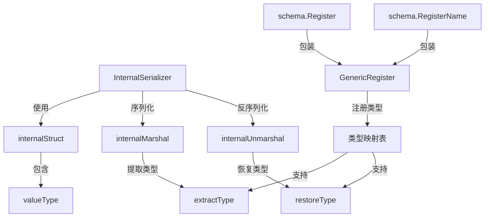

# Serialization 模块技术深度解析

## 1. 为什么这个模块存在？

在构建分布式系统和持久化数据时，我们经常需要将复杂的 Go 数据结构转换为可存储或传输的格式，然后再恢复回来。标准库的 `encoding/json` 虽然强大，但它有几个关键局限性：

1. **类型信息丢失**：当序列化接口类型时，JSON 只保存值，不保存类型，反序列化时无法恢复原始类型
2. **复杂类型支持有限**：对于包含指针、嵌套结构体、自定义映射键类型等复杂结构的处理不够灵活
3. **扩展性不足**：难以在不修改代码的情况下支持新的类型

这个模块的核心设计洞察是：**在序列化数据的同时，保留完整的类型元数据**，从而实现真正的"无损"序列化和反序列化。

在整个系统中，这个模块主要被 [Schema](schema.md) 模块包装，并通过 [Compose Checkpoint](compose_checkpoint.md)、[ADK Interrupt](adk_interrupt.md) 等模块使用，用于状态持久化和恢复。

---

## 2. 核心心智模型

想象一下这个模块就像一个**精密的包装系统**：

- **类型注册**：就像给每种货物分配一个唯一的条形码
- **序列化**：将货物装箱，同时在箱子外面贴上详细的标签（类型信息）
- **反序列化**：根据标签信息，找到正确的货物类型，然后精确地还原货物

这个系统的核心是 `internalStruct` 和 `valueType` 这两个结构，它们构成了序列化数据的"骨架"，保存了重建原始对象所需的所有信息。

---

## 3. 架构设计与数据流程

### 3.1 核心组件关系图



### 3.2 数据流程详解

#### 序列化流程：
1. 调用 `InternalSerializer.Marshal(v any)`
2. `internalMarshal` 递归遍历数据结构，提取类型信息和值
3. 对于接口类型，从类型映射表中查找注册的类型键
4. 构建 `internalStruct` 结构，包含 `valueType`（类型元数据）和实际值
5. 使用 `sonic`（高性能 JSON 库）将 `internalStruct` 序列化为字节

#### 反序列化流程：
1. 调用 `InternalSerializer.Unmarshal(data []byte, v any)`
2. 先用 `sonic` 解析成 `internalStruct`
3. `internalUnmarshal` 根据 `valueType` 恢复类型信息
4. 从类型映射表中查找对应的 Go 类型
5. 递归构建原始数据结构并赋值给目标

---

## 4. 核心组件深度解析

### 4.1 InternalSerializer

这是模块的入口点，提供了标准的 Marshal/Unmarshal 接口，同时实现了 [Compose Checkpoint](compose_checkpoint.md) 中的 `Serializer` 接口。

```go
type InternalSerializer struct{}

func (i *InternalSerializer) Marshal(v any) ([]byte, error)
func (i *InternalSerializer) Unmarshal(data []byte, v any) error
```

**设计意图**：提供简洁的 API 接口，隐藏复杂的类型处理逻辑。它是整个序列化系统的"门面"。

### 4.2 internalStruct

这是序列化数据的核心容器结构。

```go
type internalStruct struct {
    Type        *valueType          `json:",omitempty"`
    JSONValue   json.RawMessage     `json:",omitempty"`
    MapValues   map[string]*internalStruct `json:",omitempty"`
    SliceValues []*internalStruct   `json:",omitempty"`
}
```

**设计意图**：
- `Type`：保存类型元数据，用于反序列化时重建类型
- `JSONValue`：用于简单类型和实现了 json.Marshaler 的类型
- `MapValues`：用于结构体和映射类型，保存字段/键值对
- `SliceValues`：用于切片和数组类型

### 4.3 valueType

这是类型信息的结构化表示。

```go
type valueType struct {
    PointerNum    uint32     `json:",omitempty"`
    SimpleType    string     `json:",omitempty"`
    StructType    string     `json:",omitempty"`
    MapKeyType    *valueType `json:",omitempty"`
    MapValueType  *valueType `json:",omitempty"`
    SliceValueType *valueType `json:",omitempty"`
}
```

**设计意图**：
- `PointerNum`：指针层数，支持 `***int` 这样的多级指针
- `SimpleType`：基本类型的注册键
- `StructType`：结构体类型的注册键
- `MapKeyType/MapValueType`：映射的键和值类型
- `SliceValueType`：切片的元素类型

### 4.4 GenericRegister

这是类型注册机制的核心。

```go
func GenericRegister[T any](key string) error
```

**设计意图**：建立类型字符串标识与 Go 类型之间的双向映射。这是实现接口类型序列化的关键。

**注意**：通常不直接使用这个函数，而是通过 [Schema](schema.md) 模块提供的 `schema.Register` 或 `schema.RegisterName` 来注册类型。

---

## 5. 依赖分析

### 5.1 本模块依赖的其他模块

- **`github.com/bytedance/sonic`**：高性能 JSON 序列化库，用于最终的字节转换
- **标准库 `encoding/json`**：用于处理实现了 json.Marshaler/Unmarshaler 的类型
- **标准库 `reflect`**：核心依赖，用于运行时类型检查和值操作

### 5.2 依赖本模块的模块

从模块树和代码分析可以看到，这个模块是内部工具模块，主要通过以下方式被使用：
- [Schema](schema.md) 模块：提供公共的类型注册接口
- [Compose Checkpoint](compose_checkpoint.md)：用于状态持久化
- [ADK Interrupt](adk_interrupt.md)：用于中断信息的序列化
- [ADK ChatModel Agent](adk_chatmodel_agent.md)：用于状态恢复

### 5.3 数据契约

这个模块与调用者之间有一个重要的契约：**所有需要序列化的自定义类型必须先注册**。如果没有注册，序列化接口类型时会报错。

---

## 6. 设计决策与权衡

### 6.1 类型信息 vs 数据大小

**决策**：在序列化数据中嵌入完整的类型信息

**权衡**：
- ✅ 优点：可以完美恢复原始类型，支持接口类型
- ❌ 缺点：序列化后的体积更大，因为包含了类型元数据

**为什么这样选择**：在这个系统的使用场景中，正确性和功能完整性比数据大小更重要。

### 6.2 类型注册机制 vs 自动类型发现

**决策**：使用显式的类型注册机制

**权衡**：
- ✅ 优点：类型映射明确，避免类型名冲突，性能更好
- ❌ 缺点：需要手动注册，使用稍微繁琐

**为什么这样选择**：显式注册提供了更好的可控性和可预测性，避免了自动类型发现可能带来的意外行为。

### 6.3 自定义序列化 vs 标准 JSON 扩展

**决策**：构建完整的自定义序列化系统

**权衡**：
- ✅ 优点：完全控制序列化过程，支持更多类型
- ❌ 缺点：实现复杂，代码量大

**为什么这样选择**：标准 JSON 无法满足接口类型序列化的需求，这是系统的核心功能。

### 6.4 sonic vs 标准 encoding/json

**决策**：使用 sonic 作为底层 JSON 库

**权衡**：
- ✅ 优点：性能更高，特别是对于大型数据结构
- ❌ 缺点：增加了外部依赖

**为什么这样选择**：序列化是系统的核心路径，性能优化很重要。

---

## 7. 使用指南与最佳实践

### 7.1 基本使用（通过 Schema 模块）

通常不需要直接使用这个内部模块，而是通过 [Schema](schema.md) 模块提供的接口：

```go
// 注册类型（在 init() 中）
schema.Register[MyType]()

// 或使用自定义名称
schema.RegisterName[MyType]("myapp.MyType")
```

### 7.2 直接使用 InternalSerializer（不推荐）

只有在特殊情况下才直接使用：

```go
// 创建序列化器
serializer := &serialization.InternalSerializer{}

// 序列化
data, err := serializer.Marshal(myObject)
if err != nil {
    // 处理错误
}

// 反序列化
var result MyType
err = serializer.Unmarshal(data, &result)
if err != nil {
    // 处理错误
}
```

### 7.3 最佳实践

1. **使用 Schema 模块的接口**：优先使用 `schema.Register` 而不是直接使用 `GenericRegister`
2. **类型键命名约定**：如果使用 `RegisterName`，使用包名 + 类型名的格式，如 `"mypackage.MyType"`
3. **集中注册**：在一个 `init()` 函数中集中注册所有需要序列化的类型
4. **错误处理**：注册时的错误会通过 panic 抛出，确保在程序启动时就能发现问题
5. **指针类型**：不需要单独注册指针类型，系统会自动处理指针层级

---

## 8. 边缘情况与潜在陷阱

### 8.1 未导出字段

**问题**：序列化器会忽略未导出的字段（小写开头的字段）

**原因**：`reflect` 包无法访问未导出字段

**解决方案**：确保需要序列化的字段都是导出的

### 8.2 循环引用

**问题**：如果数据结构包含循环引用，序列化会导致栈溢出

**原因**：`internalMarshal` 是递归实现的，没有循环检测

**解决方案**：避免序列化包含循环引用的数据结构

### 8.3 忘记注册类型

**问题**：序列化接口类型时出现 "unknown type" 错误

**原因**：没有注册该类型

**解决方案**：确保所有需要序列化的自定义类型都已通过 `schema.Register` 注册

### 8.4 映射键类型限制

**问题**：映射键类型必须能被 JSON 序列化

**原因**：映射键在 `internalStruct` 中被序列化为字符串键

**解决方案**：使用基本类型作为映射键，或确保自定义键类型实现了合理的 JSON 序列化

### 8.5 并发安全

**问题**：类型映射表是全局变量，没有并发保护

**原因**：`m` 和 `rm` 是包级别的 map，没有使用互斥锁

**解决方案**：在程序启动阶段完成所有类型注册，不要在运行时动态注册

---

## 9. 总结

这个 `serialization` 模块是一个精心设计的类型感知序列化系统，它解决了标准 JSON 序列化在处理接口类型和复杂数据结构时的局限性。

核心价值：
1. **类型完整性**：保存并恢复完整的类型信息
2. **灵活性**：支持指针、嵌套结构、自定义映射键等复杂类型
3. **可扩展性**：通过类型注册机制支持任意自定义类型

设计哲学：在正确性和功能完整性优先的前提下，尽可能优化性能和易用性。

对于大多数使用者，建议通过 [Schema](schema.md) 模块提供的接口来使用这个序列化系统，而不是直接使用内部 API。
