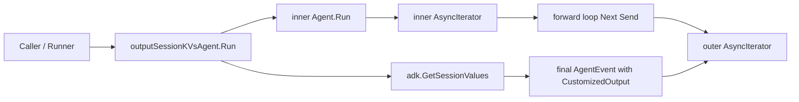

# session_kv_output_wrapper

`session_kv_output_wrapper` 的存在，可以用一句话概括：**给一个普通 `adk.Agent` 套一层“收尾钩子”，在事件流结束时额外吐出一次完整的 Session KV 快照**。如果没有这层包装，调用方只能看到 agent 过程中的消息/动作事件，却拿不到执行后沉淀在 session 里的结构化状态（例如 `Plan`、`ExecutedSteps`）。而在 `plan-execute-replan` 这类工作流里，最终状态往往比中间消息更关键。

这不是“多发一个 event”这么简单。它解决的是一个边界问题：**原始 agent 的输出契约是流式事件，不保证显式携带 session 全量状态；而上层某些调试、验证、编排逻辑需要在 run 结束时拿到状态快照**。`outputSessionKVsAgent` 用装饰器方式把这两个世界接起来，且不侵入被包装 agent 的实现。

## 架构角色与数据流



把它想象成“直播转播 + 赛后统计”的组合：前半段是实时转播（原始事件逐条透传），后半段是在比赛结束哨声后补一条统计面板（session kv 快照）。

`Run` 的执行路径非常直接：先创建一对新的 `AsyncIterator/Generator`，然后启动内部 agent 的 `Run`；在 goroutine 里循环读取内部 iterator，每拿到一个 event 就原样 `Send` 到外层 generator。内部流结束后，调用 `adk.GetSessionValues(ctx)` 取当前上下文里的 session map，构造成一个 `AgentEvent`，把 `AgentOutput.CustomizedOutput` 设为这份 kvs，再发送一次，最后关闭 generator。调用方拿到的是一个“和原始流几乎一致，但末尾多一帧状态快照”的迭代器。

## 心智模型：它是“非侵入式输出增强器”

更准确地说，这个模块不是业务执行器，而是**输出通道适配器（output adapter）**。核心抽象是 `outputSessionKVsAgent struct { adk.Agent }`：通过组合（embedding）持有一个现成 `adk.Agent`，并只重写 `Run`。这意味着：

1. 它不关心 planner/executor/replanner 的内部算法。
2. 它不改写任何中间事件语义，只做转发。
3. 它把“补发 session 快照”固定在流结束时刻，形成稳定后置行为。

这种设计和中间件很像：不是替代内核，而是在入口/出口加横切逻辑。这里选择的是出口增强。

## 组件深潜

### `type outputSessionKVsAgent struct { adk.Agent }`

这是一个极简装饰器。字段只有一个嵌入的 `adk.Agent`，目的是复用被包装对象的 `Name`、`Description`、`Run` 之外的行为，并只在 `Run` 链路上做增强。

设计意图上，这是在“继承 vs 组合”里的典型组合派：Go 没有传统继承，这种 embedding 让包装成本低、语义清晰，也减少了对 `adk.Agent` 新方法变更的脆弱性。

### `func (o *outputSessionKVsAgent) Run(...) *adk.AsyncIterator[*adk.AgentEvent]`

这是模块核心。它做三件事：

```go
iterator, generator := adk.NewAsyncIteratorPair[*adk.AgentEvent]()
iterator_ := o.Agent.Run(ctx, input, options...)
go func() {
    defer generator.Close()
    for {
        event, ok := iterator_.Next()
        if !ok { break }
        generator.Send(event)
    }

    kvs := adk.GetSessionValues(ctx)
    generator.Send(&adk.AgentEvent{
        Output: &adk.AgentOutput{CustomizedOutput: kvs},
    })
}()
return iterator
```

内部机制上的关键点是“**先透传，后补帧**”：它不会抢跑去读 session，也不会在每条事件后同步读一次 kv（那会带来性能成本和时序噪声）。而是把 session 读取放到内部流关闭后，作为终态快照输出。对于 planexecute 场景，这正好匹配“最终状态检查”的需求。

副作用方面，它额外创建一个 goroutine，并向外层事件流增加一条 event。没有显式错误分支（`GetSessionValues(ctx)` 不返回 error），因此若内部 agent 正常结束，外层总会尝试发送这条快照 event。

### `func agentOutputSessionKVs(ctx context.Context, agent adk.Agent) (adk.Agent, error)`

这是包内工厂函数，返回 `&outputSessionKVsAgent{Agent: agent}`。当前实现总是 `nil error`，接口上保留 `error` 更像是为未来扩展预留（例如未来根据 `ctx` 或 agent 类型做校验时可返回错误）。

## 依赖分析与契约

这个模块向下只依赖 `adk` 的三类能力：

- `adk.Agent`：被包装对象的统一运行接口。
- `adk.NewAsyncIteratorPair` / `AsyncIterator.Next` / generator `Send`：流式事件桥接。
- `adk.GetSessionValues(ctx)`：读取上下文中的 session kv 全量快照。

向上它暴露的仍是 `adk.Agent` 契约，因此对调用者是透明替换：只要能消费 `*adk.AsyncIterator[*adk.AgentEvent]`，就能无缝接入。

在当前包代码中，`agentOutputSessionKVs` 是内部函数；从已提供源码可确认其在测试 `TestReplannerRunWithPlan` 中用于包装 `rp`（replanner）以断言 session 演化结果。也就是说，这个 wrapper 在现状更偏向“内部工具/测试辅助”，而非公开 API。

数据契约上最重要的是最后那条 event：

- `event.Output != nil`
- `event.Output.CustomizedOutput` 持有 `map[string]any`（来自 `GetSessionValues`）

消费者需要知道这是一条“自定义输出事件”，并自行断言/转换其中的值类型（例如 `PlanSessionKey -> *defaultPlan`，`ExecutedStepsSessionKey -> []ExecutedStep`）。

## 设计取舍

这里最明显的取舍是“**简单确定的终态快照**”优先于“**全程状态可观测性**”。

如果每次事件都附带 session diff，会更实时，但会增加开销、事件复杂度和消费负担；当前方案只在结束时给一次全量，成本低且语义稳定。对于 planexecute 的主要诉求（验证最终计划/执行记录）是合理的。

第二个取舍是“**耦合 context session 实现**”。wrapper 直接依赖 `adk.GetSessionValues(ctx)`，这让它非常高效直接，但也意味着它假设 session 都挂在同一个 `ctx` 上下文体系里；如果未来 session 存储机制变化，这里需要同步调整。

第三个取舍是“**保序透传 + 尾部追加**”。它保证原事件顺序不变，这对上游消费者最友好；代价是调用方必须意识到流结束前还有一条“额外帧”，否则可能在逻辑上把这条帧误当普通模型输出。

## 使用方式与示例

由于 `agentOutputSessionKVs` 是包内函数，典型使用发生在 `planexecute` 包内部，例如测试场景：

```go
rp, err := NewReplanner(ctx, conf)
if err != nil { /* ... */ }

rp, err = agentOutputSessionKVs(ctx, rp)
if err != nil { /* ... */ }

runner := adk.NewRunner(ctx, adk.RunnerConfig{Agent: rp})
iterator := runner.Run(ctx, []adk.Message{schema.UserMessage("no input")},
    adk.WithSessionValues(map[string]any{ /* ... */ }),
)

for {
    event, ok := iterator.Next()
    if !ok { break }
    // 末尾会多一条 event.Output.CustomizedOutput = session kvs
}
```

消费端通常应把“普通事件”与“session 快照事件”分开处理，避免把 `CustomizedOutput` 当模型回复文本。

## 新贡献者最该注意的点（gotchas）

第一，`Run` 中没有 `recover`。如果内部 `iterator_.Next()` 或后续逻辑 panic，这个 goroutine 会异常退出。对比同包 `planner/replanner` 里带 `safe.NewPanicErr` 的模式，这里更轻量，但健壮性策略不一致。是否要补齐，需要看团队对 panic 传播策略的统一要求。

第二，快照读取时机是“内部流结束后”。如果调用方中途停止消费外层 iterator，可能看不到最后的 kv event。这不是 bug，而是流式消费的行为约束：**要拿到快照，必须读到流尾**。

第三，`CustomizedOutput` 是 `any`，类型断言失败会在消费端暴露。写新逻辑时建议显式判空与类型检查，不要直接强转。

第四，这个 wrapper 不是并发隔离层。它读取的是同一 `ctx` 上的 session 视图，如果其他组件也在共享 context 上写入 session，快照内容会反映最终合并结果，可能比你预期“更全”。

## 参考

- [ADK Agent Interface](ADK Agent Interface.md)：`adk.Agent`、`AgentEvent`、`AgentOutput` 基础契约。
- [runner_lifecycle_and_checkpointing](runner_lifecycle_and_checkpointing.md)：`Runner` 如何驱动 agent 并消费事件流。
- [ADK ChatModel Agent](ADK ChatModel Agent.md)：session key/output key 在 agent 执行过程中的常见写入方式。
- planexecute 主流程文档建议同时阅读 `plan_execute_orchestration_core`（若已生成对应文档），理解 `PlanSessionKey/ExecutedStepsSessionKey` 的生产与消费链路。
