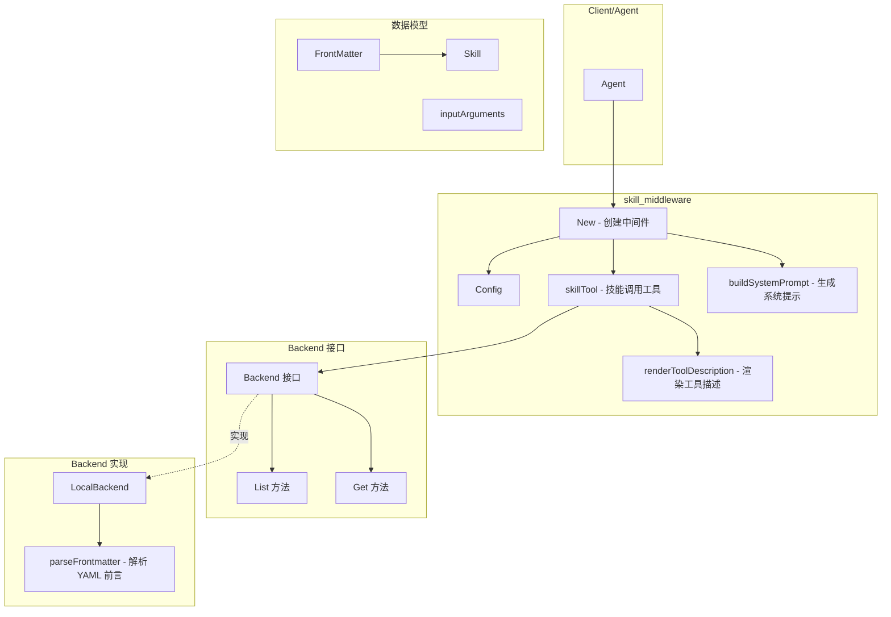

# skill_middleware 模块

## 概述

`skill_middleware` 是 ADK 运行时中的一个中间件模块，它为 Agent 提供了一种**按需加载技能（Skill）**的机制。想象一下这个场景：一个通用的 AI Agent 在处理用户请求时，遇到需要特定领域知识或专业技能的任务（比如处理 PDF 文档、操作 Excel 文件、调用特定 API），它不再需要预先"记住"所有可能的技能，而是可以动态地"查询"和"加载"所需的技能。

这个模块的核心价值在于**解耦**：将Agent的通用推理能力与特定领域的专业知识分离。技能作为独立的内容单元存储在文件系统或远程存储中，Agent 在运行时根据需要获取相应技能，然后将技能内容作为上下文继续执行任务。这就像一个特工随身携带的"技能卡册"——平时只携带索引，需要时抽出对应的卡片获得详细指导。

## 架构概览



### 组件职责

| 组件 | 职责 | 关键操作 |
|------|------|----------|
| **Config** | 中间件配置 | 包含 Backend、SkillToolName、UseChinese |
| **New** | 工厂函数 | 创建 AgentMiddleware 实例 |
| **skillTool** | 技能调用工具 | 暴露给 Agent 的工具，实现 `InvokableTool` 接口 |
| **Backend** | 存储抽象 | 定义技能查询接口 (List/Get) |
| **LocalBackend** | 文件系统实现 | 从本地目录加载 SKILL.md 文件 |
| **FrontMatter** | 技能元数据 | 包含 Name 和 Description |
| **Skill** | 技能完整数据 | 包含元数据、Content 和 BaseDirectory |

## 数据流分析

### 流程 1：中间件初始化

当开发者创建 skill middleware 时，数据流如下：

```
Config {Backend, SkillToolName, UseChinese}
        ↓
    New(ctx, config)
        ↓
┌───────────────────────────────────────────────┐
│ 1. 验证配置 (config != nil, Backend != nil)   │
│ 2. 确定工具名称 (默认 "skill")                 │
│ 3. buildSystemPrompt(toolName, useChinese)    │
│ 4. 创建 skillTool 实例                        │
└───────────────────────────────────────────────┘
        ↓
返回 AgentMiddleware {
    AdditionalInstruction: 系统提示词,
    AdditionalTools: [skillTool]
}
```

**关键设计决策**：系统在初始化时**不加载**技能列表。技能列表是在 Agent 每次查询工具信息时动态加载的（即调用 `skillTool.Info()` 时）。这样做的好处是：
- 初始化速度快
- 支持动态添加/修改技能而无需重启 Agent
- 缺点是每次调用 `Info()` 都有 I/O 开销

### 流程 2：Agent 查询可用技能

```
Agent 调用 tool.Info(ctx)
        ↓
skillTool.Info(ctx)
        ↓
backend.List(ctx)  ──→ 读取文件系统中的技能列表
        ↓
renderToolDescription(skills)  ──→ 渲染为 XML 格式的技能描述
        ↓
返回 ToolInfo {
    Name: "skill",
    Desc: "<available_skills>...",
    ParamsOneOf: {skill: {Type: String, Required: true}}
}
```

返回的工具描述格式如下（英文版）：

```
skill

<available_skills>
<skill>
<name>
pdf
</name>
<description>
处理 PDF 文档的技能
</description>
</skill>
<skill>
<name>
xlsx
</name>
<description>
处理 Excel 文件的技能
</description>
</skill>
</available_skills>
```

### 流程 3：Agent 调用技能

```
Agent 调用 tool.InvokableRun(ctx, `{"skill": "pdf"}`)
        ↓
skillTool.InvokableRun(ctx, arguments)
        ↓
解析 JSON 获取 skill 名称
        ↓
backend.Get(ctx, "pdf")  ──→ 读取 SKILL.md 文件
        ↓
返回格式化结果:
"Launching skill: pdf
Base directory for this skill: /path/to/skills/pdf

[SKILL.md 内容]"
```

## 核心设计决策与权衡

### 决策 1：Backend 接口抽象

**选择**：定义 `Backend` 接口而非直接绑定文件系统实现

```go
type Backend interface {
    List(ctx context.Context) ([]FrontMatter, error)
    Get(ctx context.Context, name string) (Skill, error)
}
```

**权衡分析**：
- **灵活性**：可以轻松实现远程 Backend（如从数据库、API、远程服务获取技能）
- **复杂度**：增加了接口抽象层，需要维护接口契约
- **当前实现**：只提供了 `LocalBackend`，但理论上可以扩展

**为何合理**：对于一个技能管理系统，存储后端确实可能是多变的。今天用文件系统，明天可能就需要从远程仓库拉取。接口抽象为这种变化预留了扩展空间。

### 决策 2：技能文件格式选择（Markdown + YAML Frontmatter）

**选择**：每个技能是一个目录，包含 `SKILL.md` 文件，格式为：

```markdown
---
name: pdf
description: 处理 PDF 文档的技能
---
# PDF 处理技能

这里详细描述如何使用这个技能...
```

**替代方案分析**：
- **纯 JSON**：结构化但不适合包含长文本内容
- **纯 Markdown**：缺少元数据，无法快速索引
- **独立配置文件 + 内容文件**：增加了文件数量，管理复杂

**优势**：
- 人可读、可编辑
- 标准化格式（YAML frontmatter 是常见做法）
- 单一文件同时包含元数据和内容

### 决策 3：运行时动态加载技能列表

**选择**：在 `skillTool.Info()` 调用时动态加载，而非初始化时缓存

**权衡分析**：
- **优势**：支持热更新，技能目录变化无需重启
- **劣势**：每次工具描述查询都有文件系统 I/O

**当前缓解**：通过 LocalBackend 的实现，每次 List 调用会扫描整个 baseDir。对于少量技能（数十个），这个开销可接受。如果技能数量增长到数千级别，可能需要引入缓存机制。

### 决策 4：双语言支持

**选择**：通过 `UseChinese` 配置控制提示词语言

```go
type Config struct {
    // ...
    UseChinese bool
}
```

**支持的国际化内容**：
- 系统提示词（告知 Agent 如何使用 skill 工具）
- 工具参数描述
- 技能调用结果格式

**设计意图**：这个模块可能服务于中文用户群体，提供本地化支持是合理的。但注意：技能的内容（Content）本身不翻译，只翻译框架生成的提示文字。

## 子模块说明

### 1. skill_middleware_local_backend

`LocalBackend` 是 `Backend` 接口的默认文件系统实现。它：

- 扫描指定目录下的所有子目录
- 每个子目录应包含 `SKILL.md` 文件
- 解析 YAML frontmatter 提取元数据
- 返回完整的 Skill 对象（包含内容全文和基础目录路径）

**关键特性**：
- 验证目录存在性
- 容错处理（跳过不包含 SKILL.md 的目录）
- 绝对路径解析（确保 BaseDirectory 是完整路径）

### 2. skill_middleware_core_types

核心类型定义：

- `FrontMatter`：技能元数据（name, description）
- `Skill`：完整技能（FrontMatter + Content + BaseDirectory）
- `Config`：中间件配置
- `inputArguments`：工具调用参数结构

### 3. skill_middleware_tool_implementation

技能工具的实现细节：

- `skillTool`：实现 `InvokableTool` 接口
- `Info()`：动态列出所有可用技能
- `InvokableRun()`：根据名称加载并返回技能内容
- 模板渲染生成工具描述

## 依赖关系

### 上游依赖

| 模块/包 | 依赖原因 |
|---------|----------|
| `adk.chatmodel.AgentMiddleware` | 返回中间件结构，需符合 Agent 集成接口 |
| `components.tool` | 工具定义需要实现 tool.BaseTool 和 tool.InvokableTool |
| `schema.ToolInfo` | 工具元数据结构 |
| `pyfmt` | 字符串模板格式化（系统提示词） |

### 下游使用

- 通过 `AgentMiddleware` 被集成到 Agent 运行时
- skill 工具被添加到 Agent 的工具列表中

### 被依赖关系图

```
skill_middleware
    │
    ├──→ adk.chatmodel.AgentMiddleware (返回类型)
    ├──→ components.tool.BaseTool (实现接口)
    ├──→ components.tool.InvokableTool (实现接口)  
    └──→ schema (ToolInfo, ParameterInfo, String 等)
```

## 使用示例

### 1. 基本用法

```go
import (
    "context"
    "github.com/cloudwego/eino/adk/middlewares/skill"
)

// 创建本地文件后端
backend, err := skill.NewLocalBackend(&skill.LocalBackendConfig{
    BaseDir: "/path/to/skills",
})
if err != nil {
    // 处理错误
}

// 创建中间件
middleware, err := skill.New(ctx, &skill.Config{
    Backend: backend,
})
if err != nil {
    // 处理错误
}

// middleware 可以传递给 Agent
// agent := chatmodel.NewAgent(ctx, &chatmodel.Config{
//     Middlewares: []chatmodel.AgentMiddleware{middleware},
//     // ...其他配置
// })
```

### 2. 自定义工具名称和语言

```go
name := "load_skill"
middleware, err := skill.New(ctx, &skill.Config{
    Backend:       backend,
    SkillToolName: &name,  // 自定义工具名称
    UseChinese:    true,   // 使用中文提示词
})
```

### 3. 创建技能文件

目录结构：
```
/path/to/skills/
    ├── pdf/
    │   └── SKILL.md
    ├── xlsx/
    │   └── SKILL.md
    └── email/
        └── SKILL.md
```

`/path/to/skills/pdf/SKILL.md`:
```markdown
---
name: pdf
description: 处理 PDF 文档的技能
---

# PDF 处理指南

## 概述
此技能用于读取和处理 PDF 文档。

## 使用方法
1. 使用 pdf 处理工具打开文件
2. 提取文本内容进行分析
3. 根据需求进行内容转换

## 注意事项
- 确保文件路径正确
- 大文件可能需要分块处理
```

## 注意事项与陷阱

### 1. 路径问题

**问题**：`LocalBackend` 在加载技能时会解析绝对路径存入 `BaseDirectory`。如果技能内容中使用了相对路径，需要注意工作目录。

**建议**：在技能内容中引用其他文件时，尽量使用绝对路径或明确说明基于 BaseDirectory。

### 2. Frontmatter 格式严格性

**问题**：YAML frontmatter 解析对格式敏感。

```markdown
---
name: pdf
description: 处理 PDF 文档
---
```

错误的写法会导致解析失败：
- 缺少开始或结束的 `---`
- 缩进不正确
- 包含不支持的 YAML 特性

### 3. 技能名称唯一性

**问题**：`LocalBackend.Get()` 方法使用线性搜索查找技能。如果存在同名技能，只返回第一个匹配的结果。

**建议**：确保技能目录名（也是 SKILL.md 所在的目录名）与 frontmatter 中的 name 保持一致，并保证唯一性。

### 4. Info() 调用的性能

**问题**：每次 Agent 查询工具信息时都会调用 `backend.List()`，这意味着每次都会扫描文件系统。

**影响**：在技能数量较多时，这可能成为性能瓶颈。

**缓解策略**：
- 技能数量控制在合理范围内（建议 < 100）
- 如需大量技能，考虑实现带缓存的 Backend

### 5. 技能内容不翻译

**注意**：`UseChinese` 选项只影响框架生成的提示文字（如"Launching skill"），技能的实际内容（SKILL.md 的 body 部分）不会被翻译。

如果需要支持多语言技能，需要为每种语言创建独立的技能文件。

### 6. 错误处理

当技能不存在时：
```go
skill, err := backend.Get(ctx, "nonexistent")
// err: "skill not found: nonexistent"
```

Agent 端会收到类似错误信息，需要在 Agent 层面处理（重试或告知用户）。