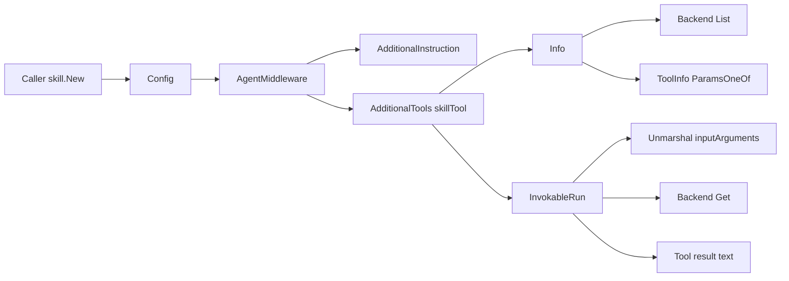

# skill_middleware_core

`skill_middleware_core` 的本质，是把“技能库（skills）”变成一个可被 LLM 主动调用的工具入口。你可以把它想象成给 Agent 增加了一位“图书管理员”：模型平时只看目录（技能名 + 描述），只有真的需要时才去借阅某本技能手册（完整 `SKILL.md` 内容）。这解决了一个关键问题：如果把全部技能正文直接塞进 system prompt，会非常臃肿、昂贵且不稳定；而完全不暴露技能又会导致模型不知道自己“有这本手册可查”。本模块采用“渐进式披露（progressive disclosure）”把两者平衡起来。

## 这个模块解决了什么问题（Why）

在 Agent 体系里，技能通常是高质量、结构化、可复用的任务执行方法（例如如何做 web research、如何处理 pdf/xlsx 等）。朴素方案是：启动时把所有技能全文拼到系统提示词里。这在技能数量增长后会立刻遇到三个问题：第一，token 成本高；第二，模型注意力被大量暂时无关内容稀释；第三，技能更新会导致提示词频繁变大变乱。

`skill_middleware_core` 的设计洞察是：**把技能分成“索引层”和“内容层”**。索引层通过工具描述暴露（`Info` 阶段列出技能名和简述）；内容层通过工具调用按需加载（`InvokableRun` 阶段返回特定技能正文 + 基础目录）。这样，模型先“知道有什么”，再“按需读取细节”。

## 心智模型（Mental Model）

建议用“机场安检 + 登机口信息屏”的类比理解：

信息屏（tool description）不会显示每个目的地的完整旅游指南，只显示“城市名 + 简介”；当你决定去某个城市时，才在登机口（tool call）拿到完整材料。这里：

- `Backend.List` = 信息屏数据源（技能目录）
- `skillTool.Info` = 生成给模型看的“可用技能列表 + 使用规则”
- `Backend.Get` + `skillTool.InvokableRun` = 取回某个技能的全文
- `AdditionalInstruction` = 告诉模型“何时必须先去查技能”

这套抽象把“技能存储在哪里”与“模型如何消费技能”解耦：存储由 `Backend` 决定，消费协议由 `skillTool` 固定。

## 架构与数据流



从调用链看，本模块是一个“能力注入层（middleware capability injector）”：`New` 返回 `adk.AgentMiddleware`，通过 `AdditionalInstruction` 和 `AdditionalTools` 同时影响模型行为。前者塑造策略（何时使用技能），后者提供执行通道（真正读取技能）。

在运行时有两条热点路径：

第一条是 `Info` 路径。模型在工具编排阶段会读取工具信息，`skillTool.Info` 调用 `Backend.List`，再用 `renderToolDescription` 把 `[]FrontMatter` 渲染成 `<available_skills>` 模板文本，并拼接到 `toolDescriptionBase`（或中文版本）后返回 `schema.ToolInfo`。

第二条是 `InvokableRun` 路径。模型决定调用工具后，传入 JSON 参数；`InvokableRun` 解析到 `inputArguments{Skill string}`，通过 `Backend.Get` 拉取完整 `Skill`，最后返回“启动提示 + BaseDirectory + Skill Content”的纯文本结果。

## 组件深潜（Component Deep-Dive）

## `FrontMatter`

`FrontMatter` 只包含 `Name` 和 `Description`（带 `yaml` tag），它是技能的最小公开元数据。设计上它故意“瘦身”：给模型的目录信息只需可识别名和意图描述，不需要正文。这样能降低 `Info` 响应体积，并强化渐进式披露模式。

## `Skill`

`Skill` 由嵌入的 `FrontMatter`、`Content`、`BaseDirectory` 组成。这里的关键是 `BaseDirectory`：模块明确把“路径解析责任”传给技能调用结果，避免模型在处理技能里相对路径时缺乏锚点。`prompt.go` 中的说明也反复强调“转换为绝对路径”。

## `Backend`（interface）

```go
type Backend interface {
    List(ctx context.Context) ([]FrontMatter, error)
    Get(ctx context.Context, name string) (Skill, error)
}
```

这是本模块最重要的扩展点。`skillTool` 完全依赖该接口，不关心底层是本地文件、远程仓库还是数据库。这个边界选择了“最小能力集”：列目录 + 按名取详情，足够支撑渐进式加载，不额外暴露搜索、分页等复杂语义。

## `Config`

`Config` 有三个控制面：

- `Backend`：必填，决定技能数据来源
- `SkillToolName *string`：可选覆盖默认工具名 `skill`
- `UseChinese bool`：切换中英文提示模板与结果文案

值得注意的是 `SkillToolName` 使用指针区分“未设置”与“设置为空字符串”。代码只判断是否为 `nil`，因此传入 `&""` 会得到空工具名，这在运行上可能造成不可用配置（见“Gotchas”）。

## `New(ctx, config)`

`New` 是模块入口：校验 `config` 与 `config.Backend` 非空后，构造并返回 `adk.AgentMiddleware`。它不直接执行技能读取，只注入两件事：

1. `AdditionalInstruction`：来自 `buildSystemPrompt`，指导模型识别并优先调用技能工具
2. `AdditionalTools`：单元素数组，装入 `*skillTool`

这是一种“声明式装配”风格：初始化阶段只定义规则和工具，不做重 I/O。

## `buildSystemPrompt(skillToolName, useChinese)`

该函数在 `systemPrompt/systemPromptChinese` 之间切换，并通过 `pyfmt.Must` 填充 `{tool_name}`。设计原因是保证 prompt 与工具名强一致：即使改了 `SkillToolName`，提示词中的调用示例仍正确。

## `skillTool`

`skillTool` 是具体工具实现，字段为 `b Backend`、`toolName string`、`useChinese bool`。它通过实现 `Info` + `InvokableRun` 满足 `tool.InvokableTool`。

### `(*skillTool).Info`

`Info` 的职责不是返回静态描述，而是**动态生成可用技能目录**：

- 调 `b.List(ctx)` 拿 `[]FrontMatter`
- 调 `renderToolDescription` 生成 `<available_skills>` 片段
- 拼接语言版本基础描述
- 返回 `schema.ToolInfo`，其中 `ParamsOneOf` 只声明一个必填字符串参数 `skill`

这个设计让技能列表在每次读取工具信息时可反映后端最新状态，代价是 `List` 可能被频繁调用。

### `inputArguments`

只定义一个字段：`Skill string 'json:"skill"'`。这是工具参数契约的代码化表达，与 `Info` 中 `ParamsOneOf` 一一对应。

### `(*skillTool).InvokableRun`

执行阶段流程非常直接：

- `json.Unmarshal(argumentsInJSON, &args)`
- `b.Get(ctx, args.Skill)`
- 按语言模板拼接返回文本

返回值是 `string`，不返回结构化对象。这样做兼容性高、接入成本低，但也意味着后续如果要做机器可解析的富结构输出，需要调整协议。

## `renderToolDescription`

使用 `text/template` + `descriptionTemplateHelper{Matters}` 渲染技能列表。helper struct 只是模板数据容器，避免直接把 slice 裸传入模板时可读性下降。

## 依赖关系分析（调用谁、被谁调用）

基于当前可见代码，依赖关系可归纳为：

本模块向外调用：

- `adk.AgentMiddleware`：作为中间件注入协议载体（`New` 返回）
- `tool.BaseTool` / `tool.InvokableTool`：工具接口契约
- `schema.ToolInfo`、`schema.ParameterInfo`、`schema.NewParamsOneOfByParams`：工具元信息与参数 schema
- `pyfmt.Must`：对系统提示做占位符替换
- `encoding/json`、`text/template`：参数解析与描述渲染

谁会调用本模块：

- 业务侧会在 Agent 组装阶段调用 `skill.New(...)`，并把结果放入 `ChatModelAgentConfig.Middlewares`
- 运行时由 Agent/模型工具机制调用 `skillTool.Info` 与 `skillTool.InvokableRun`

核心数据契约：

- `Backend.List` 必须返回可展示给模型的 `FrontMatter` 列表
- `Backend.Get(name)` 必须返回对应 `Skill`，尤其要提供可靠 `BaseDirectory`
- 工具参数 JSON 必须是 `{"skill":"..."}` 形态

## 设计决策与权衡

这个模块整体偏向“简单且可替换”的设计。

它在灵活性与简单性之间，选择了最小接口 `Backend(List/Get)`。好处是实现成本很低，`LocalBackend` 之类实现自然；代价是如果后续需要标签过滤、权限、版本化加载，接口可能要扩展。

在性能与新鲜度之间，它偏向新鲜度：`Info` 每次都 `List` + 渲染，而不是缓存结果。这样技能变更能及时反映，但高频工具信息拉取时会给后端带来压力。

在结构化与兼容性之间，它偏向兼容性：`InvokableRun` 返回纯文本，能被大多数模型直接消费；代价是下游无法稳定提取字段，只能依赖文本约定。

在自治与耦合之间，它有意将“行为策略”耦合进 prompt（`systemPrompt`/`toolDescriptionBase`），强制模型“相关时先调工具”。这对提升执行一致性很有效，但也意味着 prompt 文案本身成为行为控制面的关键资产。

## 使用方式与示例

最常见用法是配合本地后端（见 [local_backend_filesystem](local_backend_filesystem.md)）：

```go
ctx := context.Background()

backend, err := skill.NewLocalBackend(&skill.LocalBackendConfig{BaseDir: "./skills"})
if err != nil {
    panic(err)
}

mw, err := skill.New(ctx, &skill.Config{
    Backend:       backend,
    UseChinese:    true,
    SkillToolName: nil, // 默认 "skill"
})
if err != nil {
    panic(err)
}

cfg := &adk.ChatModelAgentConfig{
    // ... Name / Model / ToolsConfig ...
    Middlewares: []adk.AgentMiddleware{mw},
}
_ = cfg
```

如果你要接自定义后端，实现 `Backend` 即可：

```go
type MyBackend struct{}

func (b *MyBackend) List(ctx context.Context) ([]skill.FrontMatter, error) {
    return []skill.FrontMatter{{Name: "pdf", Description: "Handle PDF workflows"}}, nil
}

func (b *MyBackend) Get(ctx context.Context, name string) (skill.Skill, error) {
    return skill.Skill{
        FrontMatter:   skill.FrontMatter{Name: name, Description: "..."},
        Content:       "# steps...",
        BaseDirectory: "/abs/path/to/skill",
    }, nil
}
```

## 边界条件与新贡献者注意事项

首先，`Config` 只校验了 `Backend` 非空，不校验 `SkillToolName` 内容是否为空字符串。空字符串工具名会通过构造阶段，但在模型工具调用阶段可能产生不可预期行为。

其次，`InvokableRun` 不检查 `args.Skill` 是否为空，直接交给 `Backend.Get`。因此错误语义依赖后端实现。建议后端统一返回可诊断错误，便于排查。

再者，`Info` 每次都会调用 `List`。如果你的后端是远程存储，建议在后端内部做缓存或快照，而不是在 `skillTool` 层做缓存（当前核心模块无缓存钩子）。

另外，`InvokableRun` 的 `opts ...tool.Option` 目前未使用。若你计划引入超时、追踪、实验开关等，可在这里作为未来扩展入口。

最后，`renderToolDescription` 使用模板直接插入 `Name/Description` 文本；如果后端数据可被外部用户控制，需要关注提示注入风险（例如恶意 description 影响模型行为）。当前核心代码没有做内容清洗。

## 参考文档

- [ADK ChatModel Agent](ADK%20ChatModel%20Agent.md)：`AgentMiddleware` 如何被 Agent 吸收并参与执行循环。
- [local_backend_filesystem](local_backend_filesystem.md)：`Backend` 的本地文件系统实现。
- [Component Interfaces](Component%20Interfaces.md)：`tool.BaseTool` / `tool.InvokableTool` 接口定义。
- [Schema Core Types](Schema%20Core%20Types.md)：`schema.ToolInfo` 与参数 schema 相关类型。
