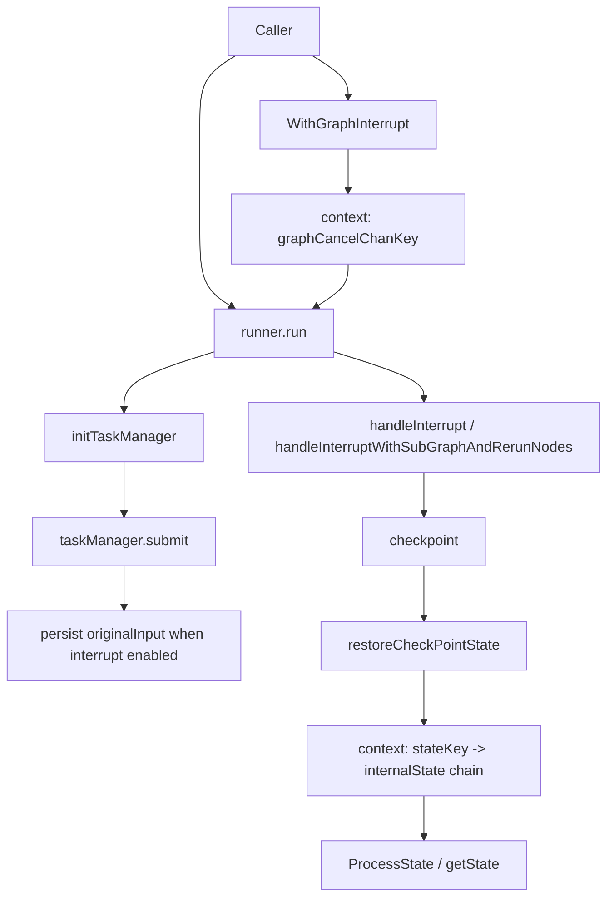

# state_and_call_control 深度解析

`state_and_call_control` 是 Compose Graph 运行时里一层“隐形的交通管制系统”。图在跑的时候，节点可能并发执行、可能被外部打断、可能从 checkpoint 恢复，还可能嵌套子图；如果没有一套统一的状态访问与调用控制机制，最容易出现三类问题：状态并发写坏、恢复后输入丢失、调用参数在不同节点污染。这个模块的价值就在于：它不参与业务计算，但它决定了“图在复杂运行条件下是否还能正确、可恢复、可控”。

## 先讲问题：为什么需要这个模块

从直觉看，图执行似乎只要把 `context.Context` 往下传，再给每个节点一个共享结构体就够了。但在真实运行时，这个 naive 方案会很快失效。第一，图是并发调度的，多个节点同时改同一份状态，数据竞争几乎不可避免。第二，子图需要访问父图状态，同时又可能定义自己的同类型状态；没有“作用域链”，你很难定义到底该拿哪一份。第三，外部中断（`WithGraphInterrupt`）发生时机不可预测，节点可能正执行到一半，如果不提前保存输入，恢复时就无法保证 rerun 拿到的是“原始输入”。

因此，这个模块解决的不是“如何把值存起来”，而是“如何在并发 + 嵌套 + 中断恢复条件下，仍保持状态语义和调用语义一致”。

## 心智模型：两条主线，一条是“状态作用域链”，一条是“调用控制信号线”

可以把它想成一个带楼层的控制塔。

状态管理是“楼层化”的：每一层图有一份 `internalState`，里面有真实 `state`、互斥锁 `mu`、以及指向外层的 `parent`。查状态时按楼层往上找，先找到先用——这就是词法遮蔽（inner shadows outer）。

调用控制是“信号线化”的：调用方通过 `WithGraphInterrupt` 往 `context` 里放一个取消通道（`graphCancelChanVal.ch`），运行时从 `getGraphCancel` 拿到它，把任务管理器切到“可中断模式”，并触发输入持久化逻辑。中断信号进来后，运行时把当前可恢复信息写入 checkpoint，后续再恢复。

这两条线在 `runner.run` 汇合：一边做任务调度，一边在恰当时机提取/恢复状态与中断语义。

## 架构与数据流



### 数据如何走（端到端）

典型外部中断路径是这样的：调用方先用 `WithGraphInterrupt(parent)` 得到新 `ctx` 和 `interrupt` 函数。这个 `ctx` 被传给图执行入口，`runner.run` 会通过 `getGraphCancel(ctx)` 检测到取消通道并传给 `initTaskManager`。`taskManager` 看到可中断模式后把 `persistRerunInput` 置为 true；之后在 `taskManager.submit` 里，每个 task 在真正执行前会保存 `originalInput`（流输入会复制两份）。

一旦中断（或超时等导致 rerun），`runner` 会进入 `handleInterrupt` 或 `handleInterruptWithSubGraphAndRerunNodes`：把 channels、待执行输入、状态快照、子图中断信息等组装到 `checkpoint`。对于 rerun 节点，优先使用 `originalInput` 回填 `cp.Inputs`，确保恢复后拿到与首次执行一致的输入。

恢复时，`restoreCheckPointState` 会加载 checkpoint，并把 `cp.State` 注入 `context.WithValue(ctx, stateKey{}, &internalState{...})`。如果当前上下文里已有状态，会作为 `parent` 串起来。后续节点通过 `ProcessState`/`getState` 访问状态，即可自动获得“从内到外”的作用域查找与互斥保护。

## 组件深潜

### `stateKey` 与 `internalState`

`stateKey` 是 context key 占位类型；真正关键是 `internalState`：

- `state any`：当前层图的状态对象
- `mu sync.Mutex`：该层状态的并发保护
- `parent *internalState`：父图状态引用

这个设计故意不做全局单锁，而是“每层一把锁”。好处是不同层状态可并行访问，不必串行化整个图；代价是调用者要理解跨层访问时拿到的是哪一层锁。

### `getState[S]`：类型驱动的作用域查找

`getState[S]` 从 `ctx.Value(stateKey{})` 取当前 `internalState`，沿 `parent` 链向上做类型断言 `interState.state.(S)`，命中即返回状态实例和对应层的 mutex。若未设置状态，报 `have not set state`；若链上无目标类型，报 `cannot find state with type ...`。

非显而易见的一点是：它按类型匹配，而不是按名字匹配。这使 API 简洁，但也引入隐式契约：状态类型本身就是“命名空间”。同类型在内外层并存时，内层会遮蔽外层。

### `ProcessState[S]`

`ProcessState` 是推荐入口。它包住“取状态 + 加锁 + 执行业务 handler + 解锁”完整流程，避免节点作者忘记锁或拿错层级。这个函数本质上把状态访问标准化成一个临界区。

实践上，它比直接调 `getState` 更安全，因为锁范围与错误包装都统一了（`get state from context fail: ...`）。

### 状态前后处理器转换函数

`convertPreHandler`、`convertPostHandler`、`streamConvertPreHandler`、`streamConvertPostHandler` 这四个函数做同一件事：把“带 state 参数的 handler”适配成 `*composableRunnable`。它们内部同样先 `getState` + 加锁，再调用用户 handler。

这里的设计意图是：状态能力不是“另一套执行系统”，而是嵌进现有 runnable 管线，复用调度框架。代价是如果你在 `StatePreHandler`/`StatePostHandler` 上处理流，注释已明确会读取并合并流块，这可能影响真正 streaming 的延迟表现。

### `graphCancelChanKey` / `graphCancelChanVal` / `graphInterruptOptions`

这一组结构是“外部中断控制面”。`graphCancelChanVal` 持有 `chan *time.Duration`，中断函数把 timeout 选项写入通道并关闭。运行时拿到这个通道后，能感知“是否请求中断”以及“是否带强制超时”。

`graphInterruptOptions` 当前只有 `timeout`，用函数式 option（`GraphInterruptOption`）封装，保留了以后扩展中断策略的余地。

### `WithGraphInterrupt` 与 `WithGraphInterruptTimeout`

`WithGraphInterrupt` 的关键不只是“返回一个 interrupt 函数”，而是它改变了运行时策略：启用自动输入持久化（包括 root graph 与 subgraph）。这是对“外部中断不可预知”这一现实问题的直接回应。

`WithGraphInterruptTimeout` 则补上“等待当前任务完成多久”的控制。超过超时时间，unfinished task 在恢复时会 rerun。

### `Option`（图调用期选项容器）

`Option` 把调用层配置汇总在一起：组件 `options`、`callbacks`、`paths`（节点定向）、`maxRunSteps`，以及 checkpoint 相关字段（`checkPointID`、`writeToCheckPointID`、`forceNewRun`、`stateModifier`）。

几个值得注意的点：

`DesignateNode` / `DesignateNodeWithPath` 提供“按节点路径定向生效”的能力，适合同类组件多实例场景。注释明确“`DesignateNode` 只在 top graph 生效”，这是一条容易踩坑的边界。

`withComponentOption` 与 `convertOption[T]` 采用“先存 `[]any`，后按目标类型转换”的两阶段策略。它牺牲了一点编译期类型安全，换来统一 Option 容器与跨组件扩展性；类型不匹配会在运行时报错（`unexpected component option type`）。

## 依赖分析：它被谁调用，它又影响谁

从现有调用链看，这个模块是运行时的“基础设施层”，被上层编排引擎高频依赖。

`state` 侧：`runner.restoreCheckPointState` 会构建 `internalState` 链并写回 context；业务节点、状态处理器以及用户自定义逻辑再通过 `ProcessState`/`getState` 取用。也就是说，状态模块不主动驱动流程，但它定义了所有状态读写的并发与作用域契约。

`call control` 侧：`runner.run` 调用 `getGraphCancel`，并把结果传给 `initTaskManager`。`taskManager.submit` 根据 `persistRerunInput` 决定是否保存 `originalInput`。随后中断处理函数 `handleInterrupt*` 把这些信息写入 [Compose Checkpoint](compose_checkpoint.md) 对应的数据结构。恢复时再经 `restoreCheckPointState` 回流。

这条链路还和 [runtime_execution_engine](runtime_execution_engine.md)、[channel_and_task_management](channel_and_task_management.md)、[Compose Interrupt](compose_interrupt.md) 有强耦合：接口一旦变化（例如 checkpoint 字段语义变更），这里的行为会直接受影响。

## 关键设计取舍

这个模块整体偏向“正确性与恢复语义优先”，在多个点上都体现了这一选择。

第一，状态访问使用互斥锁包裹 handler，全程独占，简化了并发正确性推理；代价是临界区过大时可能影响吞吐。它不是最高性能方案，但对图编排场景更稳。

第二，状态查找采用按类型 + 作用域链。它让嵌套图继承状态非常自然，但也带来类型遮蔽的隐式性。团队需要在状态类型命名上有纪律。

第三，外部中断开启后自动持久化输入。这明显增加了运行时开销（尤其流复制），但换来“任意时刻可恢复”的强保证。注释也解释了为何不默认对内部中断启用：会破坏依赖 `input == nil` 的既有逻辑兼容性。

第四，`Option` 采用 `[]any` 聚合，提升了组件扩展弹性；但开发者必须接受部分错误后移到运行时（`convertOption` 报错）。

## 使用方式与示例

```go
ctx2, interrupt := compose.WithGraphInterrupt(ctx)

go func() {
    // 某个时机触发中断，并设置等待超时
    interrupt(compose.WithGraphInterruptTimeout(2 * time.Second))
}()

out, err := runnable.Invoke(ctx2, input,
    compose.WithRuntimeMaxSteps(20),
    compose.WithChatModelOption(model.WithTemperature(0.7)).DesignateNode("llm_node"),
)
```

```go
// 在自定义节点中安全读写状态
err := compose.ProcessState[*MyState](ctx, func(ctx context.Context, s *MyState) error {
    s.Counter++
    return nil
})
if err != nil {
    return "", err
}
```

如果是子图节点，需要访问父图状态，直接用父状态类型调用 `ProcessState[*OuterState]`；若子图也有同类型状态，默认命中子图（遮蔽规则）。

## 新贡献者最该注意的坑

最常见误区是把 `context` 当成“线程安全 map”。在这里，`context` 只是状态链入口，线程安全靠 `ProcessState`/mutex 保证。直接把可变对象从 `ctx.Value` 取出来裸改，等同绕过整个并发契约。

另一个坑是忽略中断模式差异。只有 `WithGraphInterrupt` 路径会自动输入持久化；内部 `compose.Interrupt()` 并不会自动保存输入，节点作者要自行管理恢复所需数据。

再一个是 `Option` 的节点定向范围。`DesignateNode` 文档写明只在 top graph 生效；需要子图精确命中时要用 `DesignateNodeWithPath` + `NodePath`。

最后，`convertOption` 的类型检查在运行时触发。如果你把错误组件 option 混入 `Option.options`，问题不会在编译期暴露，而会在图运行阶段失败。

## 参考阅读

- [runtime_execution_engine](runtime_execution_engine.md)
- [channel_and_task_management](channel_and_task_management.md)
- [Compose Checkpoint](compose_checkpoint.md)
- [Compose Interrupt](compose_interrupt.md)
- [node_abstraction_and_options](node_abstraction_and_options.md)
