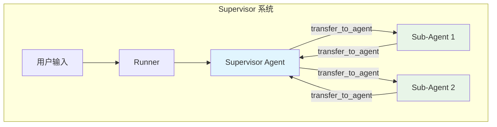
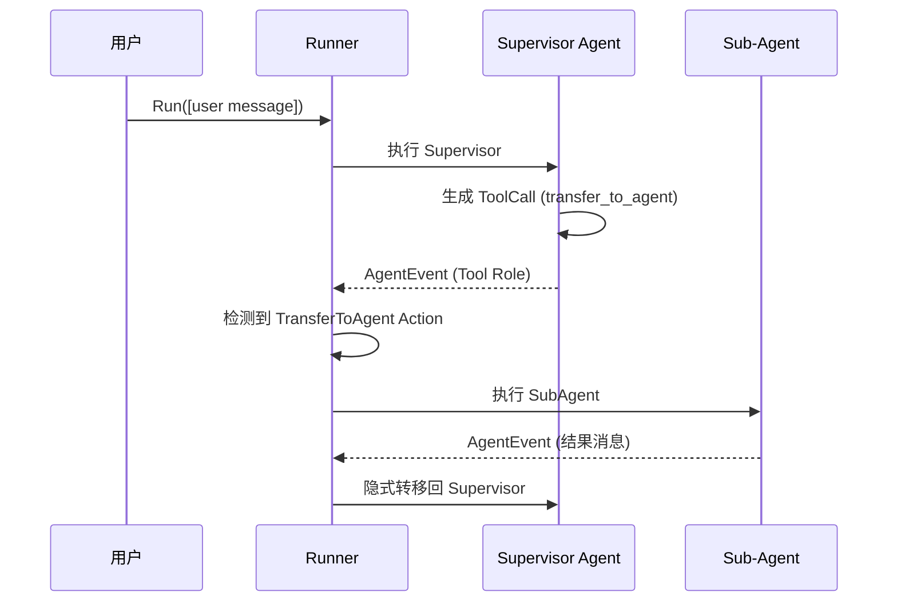

# supervisor_agent_configuration_and_tests 模块详解

## 概述

`supervisor_agent_configuration_and_tests` 模块实现了 **Supervisor 模式（监督者模式）**，这是多智能体系统（Multi-Agent System）中的一种核心架构模式。在这个模式中，一个指定的"监督者"（Supervisor）智能体负责协调和调度多个"子智能体"（Sub-Agent）的工作。

**Supervisor 模式的核心价值**在于：它为复杂的多智能体协作提供了一个**清晰的分层结构**。想象一个公司组织——CEO（Supervisor）不需要亲自处理每一项具体任务，而是将任务分配给各个部门经理（Sub-Agents），每个部门完成工作后向 CEO 汇报。这种"分而治之"的策略使得系统可以处理远超单个智能体能力范围的复杂任务。

## 架构概览



### 核心组件

#### 1. Config 结构体

```go
type Config struct {
    Supervisor adk.Agent  // 监督者智能体
    SubAgents  []adk.Agent // 子智能体列表
}
```

`Config` 是整个 Supervisor 模式的配置入口。它定义了：
- **Supervisor**: 负责协调的"大脑"智能体，它来决定何时将任务分配给哪个子智能体
- **SubAgents**: 受监督者调度的子智能体集合，它们各自承担特定的职责

#### 2. New 函数

```go
func New(ctx context.Context, conf *Config) (adk.ResumableAgent, error)
```

`New` 函数是 Supervisor 系统的工厂方法。它完成了两个关键操作：

1. **为每个子智能体包装确定性转移**：通过 `AgentWithDeterministicTransferTo`，子智能体被限制为只能将控制权转移回监督者，而不能直接转移到其他子智能体。这确保了通信始终经过监督者，避免了子智能体之间的"私下勾结"。

2. **设置子智能体关系**：通过 `SetSubAgents`，在 `flowAgent` 中建立父子关系，使得监督者能够通过 `getAgent` 方法找到任何一个子智能体。

### 关键设计决策

#### 决策一：为什么子智能体只能转移回监督者？

**设计选择**：每个子智能体被 `AgentWithDeterministicTransferTo` 包装后，只能将控制权转移回监督者。

**设计原因**：
- **简化通信模型**：所有子智能体之间的信息交换都必须通过监督者，这使得系统的行为更容易理解和调试
- **防止状态不一致**：如果子智能体可以直接相互转移，可能会导致消息丢失或状态混乱
- **支持监督者决策**：监督者需要知道子智能体何时完成工作，以便协调下一步操作

** tradeoff 分析**：
- ✅ 简化了调试和追踪
- ✅ 强制了清晰的通信模式
- ❌ 增加了监督者的通信开销（所有消息都要经过它）
- ❌ 不适合需要子智能体直接协作的场景

#### 决策二：为什么要用 AsyncIterator 返回事件流？

**设计选择**：所有 Agent 的 `Run` 和 `Resume` 方法都返回 `*AsyncIterator[*AgentEvent]`

**设计原因**：
- **流式处理**：智能体的执行可能是长时间运行的，流式返回让用户可以尽早看到中间结果
- **事件驱动**：每个事件都代表执行过程中的一个有意义的状态变化（工具调用、消息生成、转移动作等）
- **非阻塞**：调用方可以异步处理事件，不会阻塞执行

#### 决策三：如何支持嵌套的 Supervisor？

**设计选择**：Supervisor 本身也是一个 Agent，可以作为另一个 Supervisor 的 Sub-Agent。

**实现机制**：
1. 嵌套的 Supervisor 系统通过 `New()` 创建后，返回的是一个 `ResumableAgent`
2. 这个返回的 Agent 可以作为父 Supervisor 的 Sub-Agent
3. `flowAgent` 的 `getAgent` 方法支持通过名称查找子智能体（包括嵌套的 Supervisor 系统）

**示例层级**：
```
headquarters (顶层 Supervisor)
  └── company_coordinator (Supervisor Agent)
        └── payment_department (嵌套的 Supervisor 系统)
              └── payment_supervisor (Supervisor Agent)
                    └── payment_worker (Worker Agent)
```

## 数据流分析

### 基本执行流程

当用户输入触发 Supervisor 系统时，事件流如下：



### 关键事件类型

| 事件类型 | 描述 | 处理方式 |
|---------|------|---------|
| `Assistant` | 模型生成的消息 | 记录到 Session 历史 |
| `Tool` | 工具调用请求 | 执行工具并返回结果 |
| `TransferToAgent` | 转移到另一个 Agent | 调用目标 Agent 的 Run |
| `Interrupt` | 中断执行等待外部输入 | 保存 Checkpoint，暂停执行 |
| `Exit` | 退出当前 Agent | 不再转移回父 Agent |

### 事件传播机制

1. **Supervisor 内部执行**：Supervisor Agent 运行，产生事件
2. **检测 Transfer Action**：`flowAgent.run()` 方法检测到 `TransferToAgent` action
3. **查找目标 Agent**：通过 `getAgent(ctx, destName)` 查找目标子智能体
4. **执行子智能体**：调用子智能体的 `Run` 方法
5. **事件转发**：子智能体的事件通过 `generator.Send()` 转发给用户
6. **隐式转移**：子智能体执行完毕后，如果没有 Exit action，会自动生成 Transfer 事件转回 Supervisor

## 核心实现分析

### 子智能体的确定性转移包装

```go
for _, subAgent := range conf.SubAgents {
    subAgents = append(subAgents, adk.AgentWithDeterministicTransferTo(ctx, &adk.DeterministicTransferConfig{
        Agent:        subAgent,
        ToAgentNames: []string{supervisorName},  // 只能转移回监督者
    }))
}
```

`AgentWithDeterministicTransferTo` 做了什么：
1. 包装原 Agent 为 `agentWithDeterministicTransferTo`
2. 在原 Agent 执行完毕后，如果没有中断或退出，自动生成 Transfer 事件
3. Transfer 的目标被限制为 `ToAgentNames` 列表（本例中只有监督者）

### Supervisor 的执行循环

`flowAgent.run()` 方法的核心逻辑：

```go
for {
    event, ok := aIter.Next()
    if !ok { break }
    
    // 记录事件到 Session
    if exactRunPathMatch(runCtx.RunPath, event.RunPath) {
        runCtx.Session.addEvent(event)
    }
    
    // 发送事件给用户
    generator.Send(event)
    
    // 记住最后一个 action
    lastAction = event.Action
}

// 处理最后的 action
if lastAction.TransferToAgent != nil {
    // 查找并执行目标 Agent
    agentToRun := a.getAgent(ctx, destName)
    subAIter := agentToRun.Run(ctx, nil, opts...)
    // 转发所有子事件...
}
```

## 测试覆盖分析

模块的测试覆盖了多个关键场景：

### 1. 基本功能测试 (`TestNewSupervisor`)

验证：
- Supervisor 可以创建并返回正确的 Agent
- Supervisor 可以将任务转移给 SubAgent1
- SubAgent1 执行完成后可以转回 Supervisor
- Supervisor 可以继续将任务转移给 SubAgent2
- 最终完成执行

### 2. 嵌套 Supervisor 测试 (`TestNestedSupervisorInterruptResume`)

验证：
- 多层嵌套的 Supervisor 结构可以正常工作
- 工具中断（Interrupt）可以穿透多层 Supervisor 边界
- Checkpoint 可以正确保存和恢复嵌套执行状态
- Resume 可以正确处理多层嵌套的恢复

### 3. 退出行为测试 (`TestSupervisorExit`, `TestNestedSupervisorExit`)

验证：
- SubAgent 发出 Exit action 后，不会转移回 Supervisor
- 嵌套的 Supervisor 中，任何层级的 Exit 都会终止整个链路
- Exit action 正确地中断了执行流程

### 4. 内部事件 Exit 测试 (`TestChatModelAgentInternalEventsExit`)

验证：
- 当 Sub-Agent 被作为 AgentTool 嵌入时，内部的 Exit 不会影响外部 Agent
- `EmitInternalEvents` 配置可以控制内部事件的传播

## 依赖关系

本模块依赖以下关键组件：

| 依赖组件 | 作用 | 依赖类型 |
|---------|------|---------|
| `adk.Agent` | 智能体接口 | 核心抽象 |
| `adk.ResumableAgent` | 可恢复的智能体 | 核心抽象 |
| `adk.Runner` | 执行入口 | 运行时环境 |
| `adk.flowAgent` | 多智能体协调 | 核心实现 |
| `adk.AgentWithDeterministicTransferTo` | 确定性转移包装 | 关键工具 |
| `adk.SetSubAgents` | 设置子智能体 | 关键工具 |
| `compose.ToolsNodeConfig` | 工具配置 | 配置 |
| `schema.Message` | 消息类型 | 数据模型 |
| `tool.BaseTool` | 工具接口 | 工具扩展 |

## 新贡献者注意事项

### 注意事项一：RunPath 的作用

`RunPath` 是一个关键但容易混淆的概念。它记录了事件从根 Agent 到当前事件源的完整路径。

**为什么重要**：
- 它用于区分"属于当前 Agent 的事件"和"属于子 Agent 的事件"
- 只有 `exactRunPathMatch` 的事件才会被记录到 Session 历史
- 只有精确匹配的事件才能触发控制流动作（Exit, Transfer, Interrupt）

**常见陷阱**：
- 如果你在实现自定义 Agent 时错误地设置了 RunPath，可能导致事件不被正确记录
- 嵌套 Agent 时，RunPath 会被自动继承和扩展

### 注意事项二：中断（Interrupt）的跨边界传播

Supervisor 模式的一个强大特性是 **中断可以穿透多层 Agent 边界**。

**机制**：
- 工具级别的中断会生成 `InterruptSignal`
- `flowAgent` 会将中断包装为 `CompositeInterrupt`
- 中断信息会一直传递到最顶层，最终由 `Runner` 处理
- 恢复时，`ResumeWithParams` 可以针对任意深度的中断点提供恢复数据

**测试验证**：
```go
// TestNestedSupervisorInterruptResume 展示了：
// headquarters -> company_coordinator -> payment_department 
// -> payment_supervisor -> payment_worker -> process_payment tool
// 
// 工具中断可以从最底层穿透到最顶层
```

### 注意事项三：Exit 与 Transfer 的区别

这是一个容易混淆的点：

| Action | 含义 | 后续行为 |
|--------|------|---------|
| `Exit` | 当前 Agent 终止，不会再转移回父 Agent | 执行链路结束 |
| `TransferToAgent` | 转移控制权到另一个 Agent | 目标 Agent 执行后可能转回 |

**关键区别**：Exit 是"单向的"，一旦发出就不会再回来；Transfer 是"双向的"，子 Agent 完成后会转回（除非子 Agent 也发出 Exit）。

### 注意事项四：Checkpoint 存储

当 Supervisor 系统用于生产环境时，应该配置 `CheckPointStore`：

```go
runner := adk.NewRunner(ctx, adk.RunnerConfig{
    Agent:           supervisorAgent,
    CheckPointStore: myCheckpointStore,  // 重要：用于中断恢复
})
```

**否则**：
- 中断发生时状态不会被持久化
- 无法使用 `ResumeWithParams` 恢复执行

## 扩展点

### 1. 自定义 History Rewriter

可以通过 `WithHistoryRewriter` 自定义消息历史如何传递给子智能体：

```go
adk.AgentWithOptions(ctx, supervisorAgent, 
    adk.WithHistoryRewriter(func(entries []*adk.HistoryEntry) ([]adk.Message, error) {
        // 自定义历史处理逻辑
    }))
```

### 2. 阻止转移到父 Agent

使用 `WithDisallowTransferToParent` 可以阻止子智能体转移回父 Agent：

```go
adk.AgentWithOptions(ctx, subAgent, 
    adk.WithDisallowTransferToParent())
```

### 3. 嵌套 Supervisor 的命名

可以使用 `namedAgent` 包装来为嵌套的 Supervisor 系统提供更友好的名称：

```go
wrapped := &namedAgent{
    ResumableAgent: supervisorSystem,
    name:           "payment_department",
    description:    "负责支付相关操作的部门",
}
```

## 相关文档

- [Flow Agent 多智能体协调](flow_agent_orchestration.md)
- [确定性转移模式](deterministic-transfer-wrappers.md)
- [运行时中断与恢复](flow_runner_interrupt_and_transfer-interrupt_resume_bridge.md)
- [ChatModel Agent 核心实现](chatmodel-agent-core-runtime.md)