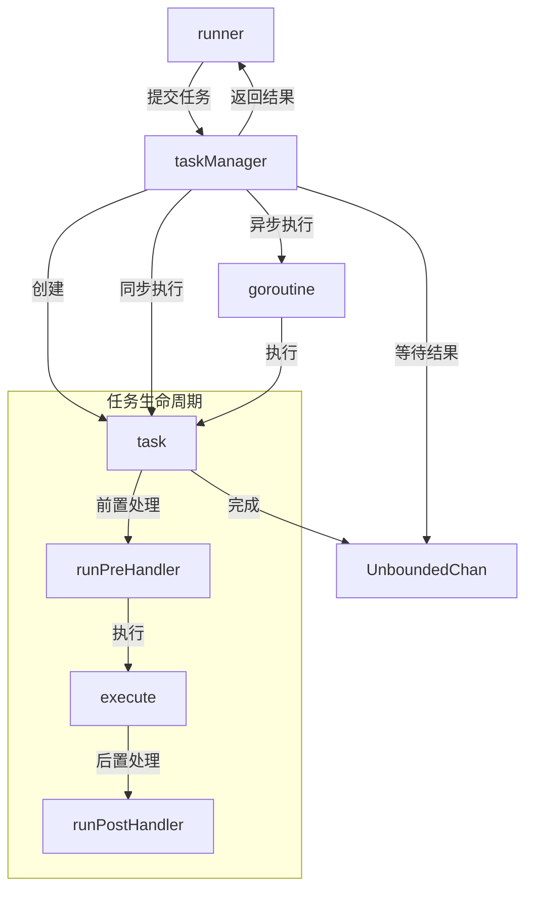

# task_management 模块深度解析

## 1. 问题空间：为什么需要任务管理？

在构建图执行引擎时，我们面临着一个核心挑战：如何**高效、可靠地协调多个并发执行的节点**，同时处理同步/异步执行、取消、超时、错误恢复等复杂场景。

想象一个典型的图执行场景：
- 节点之间存在复杂的依赖关系
- 有些节点需要并行执行，有些需要顺序执行
- 需要支持任务取消和超时机制
- 需要处理节点执行过程中的 panic 和错误
- 有时需要保留原始输入用于重试或恢复

一个简单的 goroutine 池无法满足这些需求——我们需要一个专门的任务管理层来封装这些复杂性，让图执行引擎的其他部分可以专注于业务逻辑。

## 2. 核心抽象与心智模型

### 2.1 关键抽象

**`task`**：图节点执行的封装单元
- 包含执行上下文、输入输出、错误信息
- 维护原始输入（用于重试场景）
- 跟踪是否需要跳过前置处理器

**`taskManager`**：任务生命周期的指挥中心
- 管理任务的提交、执行和结果收集
- 处理同步/异步执行策略
- 实现取消和超时机制
- 跟踪运行中的任务状态

### 2.2 心智模型

可以把 `taskManager` 想象成一个**机场塔台**：
- 每个 `task` 是一架待起飞或正在飞行的飞机
- 塔台决定哪些飞机同步起飞（立即执行），哪些异步起飞（后台 goroutine）
- 塔台监控所有飞机的状态，处理紧急情况（取消、超时）
- 飞机降落（任务完成）后，塔台收集结果并调度下一批

## 3. 架构与数据流

### 3.1 核心组件关系



### 3.2 数据流详解

让我们通过一个完整的任务执行流程来理解数据流：

1. **任务提交阶段**
   - `runner` 准备好可执行的节点，创建 `task` 对象
   - 调用 `taskManager.submit()` 提交任务列表
   - `taskManager` 决定哪些任务同步执行，哪些异步执行

2. **任务执行阶段**
   - 对于每个任务，首先运行前置处理器（`runPreHandler`）
   - 然后执行节点的核心逻辑（`execute`）
   - 执行成功后运行后置处理器（`runPostHandler`）
   - 所有阶段都有 panic 恢复机制

3. **结果收集阶段**
   - 根据 `needAll` 配置，`taskManager` 决定是等待一个任务完成还是所有任务完成
   - 任务完成后通过 `UnboundedChan` 传递结果
   - 处理取消和超时场景

## 4. 核心组件深度解析

### 4.1 `task` 结构体

```go
type task struct {
    ctx            context.Context
    nodeKey        string
    call           *chanCall
    input          any
    originalInput  any
    output         any
    option         []any
    err            error
    skipPreHandler bool
}
```

**设计意图**：
- `originalInput` 字段的存在是为了支持**重试和中断恢复**场景。当 `persistRerunInput` 为 true 时，会保存输入的副本，特别是对于流类型的输入，会创建两个副本：一个用于执行，一个保留用于可能的重试。
- `skipPreHandler` 允许绕过前置处理器，这在某些恢复场景中很有用。

### 4.2 `taskManager` 结构体

```go
type taskManager struct {
    runWrapper runnableCallWrapper
    opts       []Option
    needAll    bool

    num          uint32
    done         *internal.UnboundedChan[*task]
    runningTasks map[string]*task

    cancelCh chan *time.Duration
    canceled bool
    deadline *time.Time

    persistRerunInput bool
}
```

**关键字段解析**：
- `needAll`：控制执行策略 - true 表示等待所有任务完成，false 表示只要有一个任务完成就返回
- `done`：使用无界通道（`UnboundedChan`）而不是普通 channel，是为了避免在高并发场景下的阻塞问题
- `cancelCh`、`canceled`、`deadline`：共同实现了灵活的取消机制，支持立即取消和带超时的取消
- `persistRerunInput`：控制是否保存原始输入用于重试

### 4.3 关键方法解析

#### `submit()` - 智能任务调度

```go
func (t *taskManager) submit(tasks []*task) error
```

**设计亮点**：
1. **选择性同步执行**：当满足以下条件时，会选择一个任务同步执行：
   - 当前没有运行中的任务（`t.num == 0`）
   - 要么只有一个新任务，要么 `needAll` 为 true
   - 图不支持用户中断（`t.cancelCh == nil`）
   
   这种设计在常见的单任务场景下避免了 goroutine 调度开销，同时保持了并发能力。

2. **预执行前置处理器**：在调度任务前先执行前置处理器，如果前置处理器失败，直接标记任务失败，不进入执行队列。

3. **输入持久化**：当 `persistRerunInput` 为 true 时，会保存原始输入的副本。

#### `execute()` - 安全执行封装

```go
func (t *taskManager) execute(currentTask *task)
```

**核心机制**：
- 使用 defer + recover 捕获 panic，确保任务执行的异常不会导致整个程序崩溃
- panic 被转换为 `safe.PanicErr` 类型，包含堆栈信息便于调试
- 无论成功失败，任务都会被发送到 `done` 通道

#### `wait()` 和 `waitOne()` / `waitAll()` - 灵活的结果收集

这组方法实现了两种结果收集策略：

1. **`needAll = false`**（竞态模式）：
   - 等待第一个成功完成的任务
   - 如果已取消但未超时，等待所有任务完成
   - 如果取消且超时，返回所有运行中的任务作为取消任务

2. **`needAll = true`**（批量模式）：
   - 等待所有任务完成
   - 返回成功任务和取消任务的分离列表

#### `receive()` 系列 - 复杂的取消逻辑

```go
func (t *taskManager) receive(recv func() (*task, bool)) (ta *task, closed bool, canceled bool)
func receiveWithDeadline(recv func() (*task, bool), deadline time.Time) (...)
func receiveWithListening(recv func() (*task, bool), cancel chan *time.Duration) (...)
```

这些方法实现了**分层的取消机制**：
1. 无取消：普通接收
2. 已设置截止时间：带超时的接收
3. 已取消但无超时：继续接收直到完成
4. 未取消但监听取消：同时监听结果和取消信号

## 5. 设计决策与权衡

### 5.1 同步 vs 异步执行策略

**决策**：选择性地同步执行第一个任务，其余任务异步执行

**权衡分析**：
- ✅ 优点：在常见的单任务场景下避免 goroutine 调度开销，提高性能
- ✅ 优点：保持了并发处理多任务的能力
- ⚠️ 缺点：增加了代码复杂度
- ⚠️ 缺点：在可中断的图中禁用此优化，因为同步执行会阻塞取消信号的处理

### 5.2 无界通道的使用

**决策**：使用 `internal.UnboundedChan` 而不是普通的 Go channel

**权衡分析**：
- ✅ 优点：不会因为缓冲区满而阻塞发送方，提高系统稳定性
- ✅ 优点：在任务突增场景下表现更好
- ⚠️ 缺点：内存使用不可控，如果任务生产速度远大于消费速度，可能导致 OOM
- ⚠️ 缺点：不是标准库，增加了维护成本

### 5.3 取消机制的设计

**决策**：实现了三层取消机制（无取消/立即取消/带超时取消）

**权衡分析**：
- ✅ 优点：灵活性高，满足不同场景需求
- ✅ 优点：带超时的取消允许任务有时间清理资源
- ⚠️ 缺点：代码复杂度显著增加
- ⚠️ 缺点：需要调用方正确处理取消任务的清理工作

### 5.4 输入持久化策略

**决策**：可选地保存原始输入副本，特别是对流类型进行特殊处理

**权衡分析**：
- ✅ 优点：支持重试和中断恢复
- ✅ 优点：流类型的复制确保了原始输入不会被消耗
- ⚠️ 缺点：内存使用增加，特别是对于大输入
- ⚠️ 缺点：流复制有性能开销

## 6. 与其他模块的关系

### 6.1 依赖关系

**task_management 依赖**：
- [`internal.channel.UnboundedChan`](internal_channel.md)：无界通道实现
- [`internal.safe.panic`](internal_safe.md)：panic 处理工具
- [`compose.graph_run.runner`](compose_graph_run.md)：图执行器，使用 taskManager

**被依赖**：
- [`compose.graph_run`](compose_graph_run.md)：整个图执行引擎的核心

### 6.2 数据契约

task_management 模块与外部的交互主要通过以下契约：

1. **输入契约**：
   - `task` 对象必须包含有效的 `ctx`、`nodeKey` 和 `call`
   - `input` 可以是任意类型，但如果是 `streamReader`，会被特殊处理

2. **输出契约**：
   - 完成的任务通过 `done` 通道返回
   - 错误信息存储在 `task.err` 字段
   - panic 被转换为 `safe.PanicErr` 类型

## 7. 使用指南与常见模式

### 7.1 创建 taskManager

```go
tm := &taskManager{
    runWrapper:        myRunWrapper,
    opts:              myOptions,
    needAll:           false, // 或 true，根据需求
    done:              internal.NewUnboundedChan[*task](),
    runningTasks:      make(map[string]*task),
    persistRerunInput: true, // 如果需要重试支持
}
```

### 7.2 提交和等待任务

```go
// 创建任务
tasks := []*task{
    {
        ctx:     ctx,
        nodeKey: "node1",
        call:    chanCall1,
        input:   input1,
    },
    // 更多任务...
}

// 提交任务
err := tm.submit(tasks)
if err != nil {
    // 处理错误
}

// 等待结果
completed, canceled, canceledTasks := tm.wait()
```

### 7.3 实现取消功能

```go
// 创建带取消通道的 taskManager
tm.cancelCh = make(chan *time.Duration, 1)

// 稍后取消任务，带 5 秒超时
timeout := 5 * time.Second
tm.cancelCh <- &timeout

// 或者立即取消
tm.cancelCh <- nil
```

## 8. 边缘情况与陷阱

### 8.1 常见陷阱

1. **忘记关闭流输入**：
   - 如果 `persistRerunInput` 为 true，`originalInput` 中的流需要手动关闭
   - 代码中已经处理了成功和非中断错误的情况，但中断错误情况下需要调用方处理

2. **同步执行阻塞取消**：
   - 当任务同步执行时，取消信号无法被处理
   - 这就是为什么在 `cancelCh != nil` 时禁用同步执行优化

3. ** panic 在后置处理器中**：
   - 后置处理器中的 panic 会被捕获并转换为任务错误
   - 这意味着即使节点执行成功，后置处理器的失败也会导致任务失败

### 8.2 性能考虑

1. **`needAll` 模式的延迟**：
   - 在 `needAll = true` 模式下，总延迟等于最慢任务的延迟
   - 如果有一个任务特别慢，会拖慢整个流程

2. **过多的 goroutine**：
   - 每个异步任务都会创建一个 goroutine
   - 在任务数量非常大的情况下，可能导致 goroutine 泄漏或内存压力

3. **流复制开销**：
   - 当 `persistRerunInput` 为 true 时，流输入会被复制
   - 对于大流量场景，这可能带来显著的性能和内存开销

## 9. 总结

task_management 模块是图执行引擎的关键组成部分，它通过精心设计的抽象和机制，解决了并发任务管理的复杂性：

- **任务封装**：`task` 结构体将节点执行的所有相关信息打包在一起
- **智能调度**：`taskManager` 实现了同步/异步混合执行策略
- **可靠执行**：完整的 panic 恢复和错误处理机制
- **灵活控制**：支持取消、超时、重试等高级特性
- **性能优化**：选择性同步执行、无界通道等设计提高了性能

虽然这些设计带来了一定的复杂性，但它们为上层的图执行引擎提供了强大而可靠的基础，使得构建复杂的工作流变得更加简单和安全。
