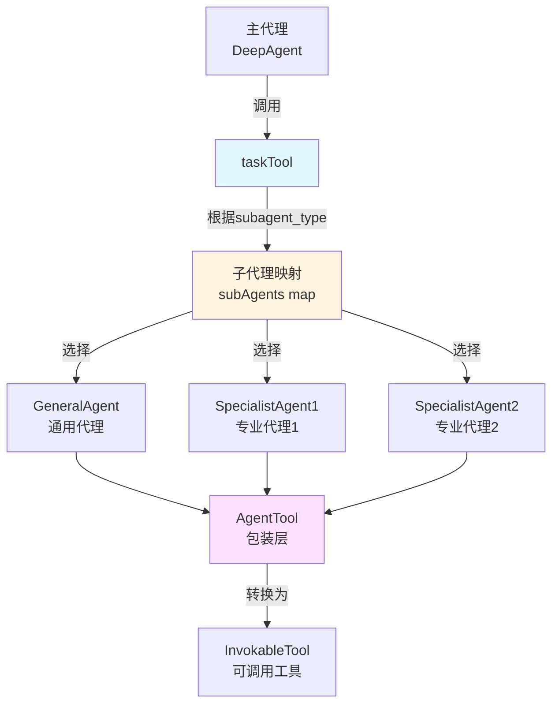

# Task Tool Module 技术深潜

## 1. 模块概述

`task_tool_module` 是 Deep Research 代理系统中的一个关键组件，它的核心作用是将多个子代理（sub-agents）封装成一个统一的工具接口，供主代理调用。这个模块解决了一个关键问题：**如何让一个主代理能够灵活地委托任务给不同的专业子代理，同时保持统一的工具调用界面**。

想象一下，你是一个项目经理，手下有多个专业团队（前端、后端、设计等）。你不需要知道每个团队的具体工作流程，只需要知道"把这个任务交给前端团队"或者"让后端团队处理这个API"。`task_tool_module` 就扮演了这样的角色——它是主代理和各个子代理之间的"任务分发器"。

## 2. 核心架构



### 核心组件说明

1. **`taskTool`**：整个模块的核心，实现了 `tool.InvokableTool` 接口
   - 维护子代理到工具的映射关系
   - 处理工具调用请求的分发
   - 动态生成工具描述

2. **`taskToolArgument`**：定义了工具调用的参数结构
   - `subagent_type`：指定要调用的子代理类型
   - `description`：传递给子代理的任务描述

3. **子代理包装层**：通过 `adk.NewAgentTool` 将 `adk.Agent` 转换为 `tool.BaseTool`

## 3. 数据流程

让我们追踪一次完整的工具调用流程：

1. **初始化阶段**：
   - `newTaskTool` 创建 `taskTool` 实例
   - 将配置的子代理和通用代理（如启用）包装成 `tool.InvokableTool`
   - 建立 `subagent_type` 到具体工具的映射

2. **工具信息获取**：
   - 主代理调用 `Info()` 方法获取工具元数据
   - `taskTool` 使用 `descGen` 函数生成动态描述
   - 返回包含可用子代理信息的 `schema.ToolInfo`

3. **工具调用执行**：
   ```
   主代理调用 InvokableRun()
       ↓
   解析 JSON 参数到 taskToolArgument
       ↓
   根据 subagent_type 查找对应的子代理工具
       ↓
   重新封装参数为 {"request": description}
       ↓
   调用子代理工具的 InvokableRun()
       ↓
   返回子代理的执行结果
   ```

## 4. 核心组件深度解析

### 4.1 `taskTool` 结构体

```go
type taskTool struct {
    subAgents     map[string]tool.InvokableTool  // 子代理名称到工具的映射
    subAgentSlice []adk.Agent                     // 子代理列表（用于生成描述）
    descGen       func(ctx context.Context, subAgents []adk.Agent) (string, error) // 描述生成函数
}
```

**设计意图**：
- `subAgents` map 提供 O(1) 的子代理查找效率
- `subAgentSlice` 保留原始顺序，用于生成有序的工具描述
- `descGen` 函数指针允许自定义工具描述的生成逻辑，提供灵活性

### 4.2 `Info()` 方法

```go
func (t *taskTool) Info(ctx context.Context) (*schema.ToolInfo, error) {
    desc, err := t.descGen(ctx, t.subAgentSlice)
    if err != nil {
        return nil, err
    }
    return &schema.ToolInfo{
        Name: taskToolName,
        Desc: desc,
        ParamsOneOf: schema.NewParamsOneOfByParams(map[string]*schema.ParameterInfo{
            "subagent_type": { Type: schema.String },
            "description": { Type: schema.String },
        }),
    }, nil
}
```

**关键设计决策**：
- **动态描述生成**：工具描述不是静态的，而是根据当前可用的子代理动态生成的。这使得系统可以灵活地添加或移除子代理而无需修改代码。
- **简单的参数结构**：只定义了两个核心参数，保持接口简洁，子代理的具体参数由其自身处理。

### 4.3 `InvokableRun()` 方法

```go
func (t *taskTool) InvokableRun(ctx context.Context, argumentsInJSON string, opts ...tool.Option) (string, error) {
    input := &taskToolArgument{}
    err := json.Unmarshal([]byte(argumentsInJSON), input)
    if err != nil {
        return "", fmt.Errorf("failed to unmarshal task tool input json: %w", err)
    }
    a, ok := t.subAgents[input.SubagentType]
    if !ok {
        return "", fmt.Errorf("subagent type %s not found", input.SubagentType)
    }

    params, err := sonic.MarshalString(map[string]string{
        "request": input.Description,
    })
    if err != nil {
        return "", err
    }

    return a.InvokableRun(ctx, params, opts...)
}
```

**核心逻辑**：
1. **参数解析**：将 JSON 字符串解析为结构化参数
2. **代理路由**：根据 `subagent_type` 查找对应的子代理工具
3. **参数转换**：将原始描述重新包装为子代理期望的格式 `{"request": "..."}`
4. **委托执行**：将实际执行委托给子代理工具

**设计亮点**：
- **参数格式适配**：巧妙地将简单的 `description` 字段转换为子代理期望的 `request` 格式，实现了接口适配
- **错误透明传递**：子代理的错误直接返回给调用者，保持错误信息的完整性
- **选项透传**：`opts...` 确保工具调用选项能够传递给子代理

### 4.4 `defaultTaskToolDescription` 函数

```go
func defaultTaskToolDescription(ctx context.Context, subAgents []adk.Agent) (string, error) {
    subAgentsDescBuilder := strings.Builder{}
    for _, a := range subAgents {
        name := a.Name(ctx)
        desc := a.Description(ctx)
        subAgentsDescBuilder.WriteString(fmt.Sprintf("- %s: %s\n", name, desc))
    }
    return pyfmt.Fmt(taskToolDescription, map[string]any{
        "other_agents": subAgentsDescBuilder.String(),
    })
}
```

**设计意图**：
- **自描述系统**：通过遍历所有子代理并收集它们的名称和描述，生成一个全面的工具使用说明
- **模板化**：使用 `pyfmt.Fmt` 将收集到的信息填充到预定义模板中，保持描述格式的一致性

## 5. 依赖分析

### 5.1 输入依赖

| 依赖组件 | 用途 | 接口契约 |
|---------|------|---------|
| `adk.Agent` | 子代理的核心接口 | 必须实现 `Name()`, `Description()`, `Run()` 方法 |
| `model.ToolCallingChatModel` | 用于创建通用子代理 | 提供工具调用能力的聊天模型 |
| `adk.ToolsConfig` | 子代理的工具配置 | 定义子代理可用的工具 |

### 5.2 输出依赖

| 被调用组件 | 用途 | 数据流向 |
|-----------|------|---------|
| `adk.NewAgentTool` | 将 Agent 转换为 Tool | Agent → BaseTool |
| `tool.InvokableTool` | 子代理的工具接口 | taskTool 调用其 InvokableRun() |

### 5.3 隐式契约

1. **子代理名称唯一性**：所有子代理的 `Name()` 必须返回唯一值，否则后注册的代理会覆盖先注册的
2. **参数格式约定**：子代理工具期望接收 `{"request": "任务描述"}` 格式的 JSON 参数
3. **上下文传递**：`ctx` 必须包含所有必要的调用上下文，包括超时、认证信息等

## 6. 设计决策与权衡

### 6.1 中心化路由 vs 分散式工具

**选择**：使用单一的 `taskTool` 作为所有子代理的统一入口，而不是将每个子代理作为独立工具暴露

**理由**：
- **简化主代理的工具选择**：主代理只需要学习一个工具的用法，而不是 N 个
- **一致的调用界面**：所有子代理调用通过相同的参数模式
- **集中的控制点**：可以在 `taskTool` 层统一添加日志、监控、限流等横切关注点

**权衡**：
- 增加了一层间接性，有微小的性能开销
- 主代理需要学习"选择子代理"的概念，而不是直接调用特定工具

### 6.2 动态描述生成 vs 静态描述

**选择**：工具描述根据可用子代理动态生成

**理由**：
- **自适应性**：子代理列表变化时，工具描述自动更新
- **信息完整性**：描述中包含所有可用子代理的具体信息，帮助模型做出更好的选择

**权衡**：
- 每次获取工具信息都有计算开销
- 描述可能变得很长，消耗更多的 token

### 6.3 通用子代理的可选性

**选择**：通过 `withoutGeneralSubAgent` 参数控制是否添加通用子代理

**理由**：
- **灵活性**：允许系统根据需求配置是否需要"兜底"的通用代理
- **专业化场景**：在某些专业场景下，可能不希望有通用代理干扰专业代理的工作

**权衡**：
- 增加了配置复杂度
- 如果没有通用代理，某些模糊任务可能无法处理

## 7. 使用指南与最佳实践

### 7.1 基本使用

```go
// 创建子代理
subAgent1 := createSpecializedAgent1()
subAgent2 := createSpecializedAgent2()

// 创建 taskTool 中间件
middleware, err := newTaskToolMiddleware(
    ctx,
    nil,  // 使用默认描述生成器
    []adk.Agent{subAgent1, subAgent2},
    false,  // 包含通用子代理
    chatModel,
    instruction,
    toolsConfig,
    maxIteration,
    nil,  // 无额外中间件
)

// 将中间件应用到主代理
```

### 7.2 自定义描述生成器

```go
customDescGen := func(ctx context.Context, subAgents []adk.Agent) (string, error) {
    // 自定义描述生成逻辑
    var desc string
    for _, agent := range subAgents {
        // 自定义格式
        desc += fmt.Sprintf("✦ %s: %s\\n", agent.Name(ctx), agent.Description(ctx))
    }
    return fmt.Sprintf("可用的专业代理:\\n%s", desc), nil
}

middleware, err := newTaskToolMiddleware(
    ctx,
    customDescGen,  // 使用自定义描述生成器
    subAgents,
    // ... 其他参数
)
```

### 7.3 最佳实践

1. **子代理命名**：使用清晰、描述性的名称，有助于模型理解其用途
2. **子代理描述**：撰写详细的子代理描述，包括其能力范围和最佳使用场景
3. **避免子代理重叠**：确保每个子代理有明确的职责边界，避免功能重叠
4. **考虑 token 消耗**：如果子代理很多，自定义描述生成器以保持描述简洁

## 8. 边缘情况与注意事项

### 8.1 子代理名称冲突

如果两个子代理返回相同的名称，后注册的会覆盖先注册的。解决方法：
- 确保子代理名称唯一性
- 在注册前检查名称冲突

### 8.2 参数格式不匹配

如果子代理期望的参数格式不是 `{"request": "..."}`，需要：
- 自定义 `taskTool` 的参数转换逻辑
- 或者在子代理层做适配

### 8.3 上下文传递

确保传递给 `InvokableRun` 的 `ctx` 包含：
- 必要的认证信息
- 合适的超时设置
- 回调处理器（如果需要）

### 8.4 错误处理

`taskTool` 会直接返回子代理的错误，调用者需要：
- 准备处理各种可能的子代理错误
- 考虑实现统一的错误包装逻辑

## 9. 相关模块参考

- [ADK Agent Interface](adk_agent_interface.md)：了解 Agent 接口的定义
- [ADK ChatModel Agent](adk_chatmodel_agent.md)：了解 ChatModelAgent 的实现
- [ADK Agent Tool](adk_agent_tool.md)：了解如何将 Agent 转换为 Tool
- [Deep Research Core](deep_research_core.md)：了解 Deep 代理的整体架构
