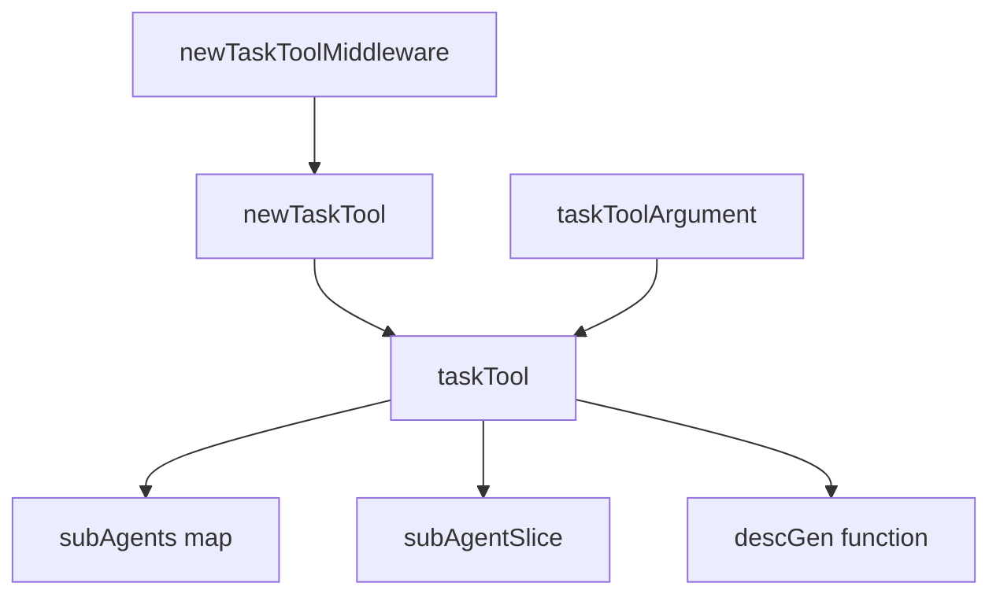
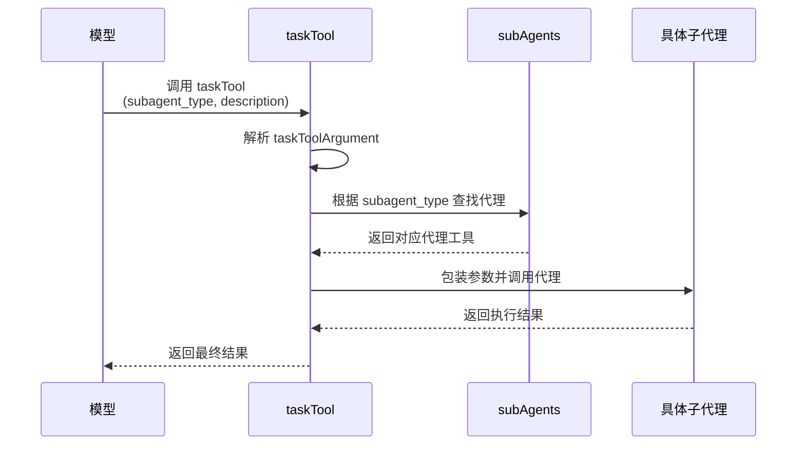

# 任务工具编排 (Task Tool Orchestration)

## 概述

`task_tool_orchestration` 模块是深度研究（Deep Research）功能的核心组成部分，它提供了一种优雅的机制来协调和管理多个子代理（Sub-Agent）的任务执行。该模块解决了在复杂研究任务中如何动态分配、调度和协调不同专业领域代理的问题，使得系统能够像人类研究团队一样协同工作。

## 问题空间

在构建能够执行复杂研究任务的智能系统时，我们面临几个关键挑战：

1. **任务分解与分配**：大型研究任务需要分解为多个子任务，每个子任务可能需要不同专业知识的代理来处理
2. **代理协调**：需要一种机制来选择最合适的代理来处理特定子任务
3. **动态描述生成**：代理的功能描述需要根据可用代理动态生成，以便模型能够理解如何选择
4. **统一接口**：不同类型的代理需要通过统一的接口被调用，简化系统设计

传统的硬编码代理选择逻辑无法灵活适应代理组合的变化，而让大模型直接处理所有代理选择又会增加模型的复杂度和不确定性。`task_tool_orchestration` 模块通过将代理选择和调用封装为一个统一的工具，优雅地解决了这些问题。

## 架构设计

### 核心组件



### 数据流程



## 核心组件详解

让我们深入了解这个模块的关键组件，理解它们的设计意图和工作原理。

### taskTool 结构体

`taskTool` 是模块的核心，它实现了 `tool.InvokableTool` 接口，将多个子代理封装为一个统一的工具。

```go
type taskTool struct {
    subAgents     map[string]tool.InvokableTool  // 子代理名称到工具的映射
    subAgentSlice []adk.Agent                      // 子代理切片（用于描述生成）
    descGen       func(ctx context.Context, subAgents []adk.Agent) (string, error)  // 描述生成函数
}
```

**设计意图**：
- `subAgents` 映射提供 O(1) 时间复杂度的代理查找
- `subAgentSlice` 保留原始代理顺序，用于生成一致的描述
- `descGen` 支持自定义描述生成逻辑，增强灵活性

### taskToolArgument 结构体

```go
type taskToolArgument struct {
    SubagentType string `json:"subagent_type"`  // 要调用的子代理类型/名称
    Description  string `json:"description"`     // 传递给子代理的任务描述
}
```

这个简单的结构体定义了与 `taskTool` 交互的接口，将代理选择和任务描述清晰分离。

### 关键方法

#### Info 方法

```go
func (t *taskTool) Info(ctx context.Context) (*schema.ToolInfo, error)
```

**功能**：动态生成工具的描述信息，包括可用子代理的列表和说明。

**设计亮点**：
- 使用 `descGen` 函数动态生成描述，而非硬编码
- 描述中包含所有可用子代理的名称和功能，使模型能够做出明智的选择
- 支持自定义描述生成逻辑，适应不同的使用场景

#### InvokableRun 方法

```go
func (t *taskTool) InvokableRun(ctx context.Context, argumentsInJSON string, opts ...tool.Option) (string, error)
```

**执行流程**：
1. 解析 JSON 参数到 `taskToolArgument` 结构体
2. 根据 `SubagentType` 查找对应的子代理工具
3. 将 `Description` 包装为子代理所需的参数格式
4. 调用子代理的 `InvokableRun` 方法
5. 返回子代理的执行结果

**错误处理**：
- 参数解析失败时返回清晰的错误信息
- 子代理未找到时提供有用的错误反馈

## 工厂函数

### newTaskTool

```go
func newTaskTool(
    ctx context.Context,
    taskToolDescriptionGenerator func(ctx context.Context, subAgents []adk.Agent) (string, error),
    subAgents []adk.Agent,
    withoutGeneralSubAgent bool,
    Model model.ToolCallingChatModel,
    Instruction string,
    ToolsConfig adk.ToolsConfig,
    MaxIteration int,
    middlewares []adk.AgentMiddleware,
) (tool.InvokableTool, error)
```

**功能**：创建并配置 `taskTool` 实例。

**关键逻辑**：
1. 初始化基础的 `taskTool` 结构
2. 如果未禁用通用子代理，创建并添加通用代理
3. 将所有传入的子代理转换为工具并添加到映射中
4. 返回配置完成的 `taskTool` 实例

**设计决策**：
- 自动添加通用子代理，确保即使没有专业代理也能处理基本任务
- 使用 `adk.NewAgentTool` 将代理转换为工具，保持接口一致性

### newTaskToolMiddleware

```go
func newTaskToolMiddleware(
    ctx context.Context,
    taskToolDescriptionGenerator func(ctx context.Context, subAgents []adk.Agent) (string, error),
    subAgents []adk.Agent,
    withoutGeneralSubAgent bool,
    cm model.ToolCallingChatModel,
    instruction string,
    toolsConfig adk.ToolsConfig,
    maxIteration int,
    middlewares []adk.AgentMiddleware,
) (adk.AgentMiddleware, error)
```

**功能**：创建包含 `taskTool` 的代理中间件。

**设计意图**：
- 将 `taskTool` 包装为中间件，便于集成到代理系统中
- 自动添加任务提示（`taskPrompt`），指导模型如何使用该工具

## 默认描述生成器

### defaultTaskToolDescription

```go
func defaultTaskToolDescription(ctx context.Context, subAgents []adk.Agent) (string, error)
```

**功能**：生成默认的工具描述，列出所有可用子代理。

**实现特点**：
- 遍历所有子代理，收集名称和描述
- 使用 `pyfmt` 格式化描述模板
- 生成清晰的列表格式，便于模型理解

## 设计模式与原则

### 1. 适配器模式

`taskTool` 本质上是一个适配器，它将多个不同的 `adk.Agent` 接口统一适配为 `tool.InvokableTool` 接口，使得它们可以通过统一的方式被调用。

### 2. 工厂模式

使用 `newTaskTool` 和 `newTaskToolMiddleware` 工厂函数封装复杂的创建逻辑，提供简洁的创建接口。

### 3. 策略模式

通过 `descGen` 字段支持可插拔的描述生成策略，允许在运行时动态更改描述生成逻辑。

### 4. 单一职责原则

每个组件都有明确的职责：
- `taskTool`：代理协调和调用
- `taskToolArgument`：参数定义和解析
- `newTaskTool`：实例创建和配置

## 依赖分析

### 被依赖模块

- [adk (Agent Development Kit)](./ADK_Agent_Interface.md)：提供 `adk.Agent`、`adk.AgentMiddleware`、`adk.NewAgentTool` 等核心接口和函数
- [components/model](./model_interfaces.md)：提供 `model.ToolCallingChatModel` 接口
- [components/tool](./tool_interfaces.md)：提供 `tool.InvokableTool`、`tool.BaseTool`、`tool.Option` 等接口
- [schema](./Schema_Core_Types.md)：提供 `schema.ToolInfo`、`schema.ParameterInfo` 等数据结构

### 依赖本模块的模块

- [deep_research_core](./deep_research_core.md)：深度研究核心模块使用此模块来协调子代理

## 使用示例

### 基本使用

```go
// 创建子代理
subAgents := []adk.Agent{
    researcherAgent,
    analystAgent,
    writerAgent,
}

// 创建任务工具中间件
middleware, err := newTaskToolMiddleware(
    ctx,
    nil,  // 使用默认描述生成器
    subAgents,
    false,  // 包含通用子代理
    chatModel,
    "Your research instruction here",
    adk.ToolsConfig{},
    10,  // 最大迭代次数
    nil,  // 中间件
)
if err != nil {
    // 处理错误
}

// 将中间件应用到代理
agent.WithMiddleware(middleware)
```

### 自定义描述生成器

```go
customDescGen := func(ctx context.Context, subAgents []adk.Agent) (string, error) {
    // 自定义描述生成逻辑
    var desc strings.Builder
    desc.WriteString("可用的研究助手：\n")
    for _, agent := range subAgents {
        desc.WriteString(fmt.Sprintf("- %s: %s\n", 
            agent.Name(ctx), 
            strings.ToUpper(agent.Description(ctx))))
    }
    return desc.String(), nil
}

middleware, err := newTaskToolMiddleware(
    ctx,
    customDescGen,  // 使用自定义描述生成器
    subAgents,
    // 其他参数...
)
```

## 设计权衡与决策

### 1. 通用子代理的自动添加

**决策**：默认自动添加通用子代理，除非显式禁用。

**理由**：
- 确保系统在没有专业代理的情况下也能工作
- 提供一个"万能"代理来处理不确定的任务
- 简化了基础使用场景的配置

**权衡**：
- 增加了系统的默认复杂度
- 可能导致模型在有更专业代理的情况下仍然选择通用代理

### 2. 描述生成的灵活性

**决策**：通过函数字段支持自定义描述生成逻辑。

**理由**：
- 不同的应用场景可能需要不同风格的描述
- 允许根据子代理的特性动态调整描述
- 保持核心逻辑的简洁性

**权衡**：
- 增加了接口的复杂度
- 需要用户理解描述生成的重要性

### 3. 参数格式的转换

**决策**：将 `description` 字段包装为 `{"request": "..."}` 格式传递给子代理。

**理由**：
- 与 `adk.AgentTool` 的期望格式保持一致
- 为未来可能的参数扩展留出空间

**权衡**：
- 这种硬编码的转换限制了灵活性
- 如果子代理期望不同的参数格式，需要额外的适配层

## 注意事项与陷阱

### 1. 子代理名称唯一性

确保所有子代理的名称唯一，因为 `subAgents` 映射使用名称作为键。如果有重复名称，后面的代理会覆盖前面的。

### 2. 子代理实现的一致性

所有子代理应该实现 `adk.Agent` 接口，并且能够处理 `{"request": "..."}` 格式的输入参数。

### 3. 描述生成的重要性

工具描述的质量直接影响模型选择合适子代理的能力。确保描述清晰、准确，并包含足够的信息帮助模型做出决策。

### 4. 错误处理

当模型选择不存在的子代理时，`taskTool` 会返回错误。建议在更上层的逻辑中处理这种情况，或者确保工具描述中只包含实际存在的子代理。

### 5. 上下文传递

`taskTool` 在调用子代理时会传递原始的上下文，这意味着上下文取消、超时和值都会正确传播。

## 扩展点

1. **自定义描述生成器**：通过提供自定义的 `taskToolDescriptionGenerator` 函数，可以完全控制工具描述的生成方式。

2. **子代理过滤**：可以在 `newTaskTool` 工厂函数中添加逻辑，根据某些条件过滤或排序子代理。

3. **参数转换逻辑**：可以修改 `InvokableRun` 方法中的参数转换逻辑，以支持更复杂的参数传递方式。

4. **代理调用包装**：可以在调用子代理前后添加额外的逻辑，如日志记录、性能监控或结果后处理。

## 与深度研究系统的集成

`task_tool_orchestration` 模块是 [ADK Prebuilt Deep Research](./ADK_Prebuilt_Deep_Research.md) 系统的关键组成部分，它与其他模块协作，共同构建完整的深度研究功能：

1. **与 [deep_core](./deep_core.md) 集成**：作为核心协调组件，它实现了研究任务的分解和分配
2. **与 [agent_runtime_and_orchestration](./agent_runtime_and_orchestration.md) 协作**：通过 `adk.AgentTool` 接口与代理运行时无缝集成
3. **利用 [Callbacks System](./Callbacks_System.md)**：可以通过回调机制监控和记录子代理的执行过程

这种模块化设计使得 `task_tool_orchestration` 不仅可以用于深度研究场景，还可以被复用到其他需要多代理协作的场景中。

## 总结

`task_tool_orchestration` 模块提供了一种优雅、灵活的方式来协调多个子代理的工作。通过将代理选择和调用封装为一个统一的工具，它简化了复杂研究系统的设计，同时保持了高度的可扩展性。

该模块的核心价值在于：
- **解耦**：将代理选择逻辑与主研究流程分离
- **统一**：提供一致的接口来访问不同类型的子代理
- **动态**：支持根据可用代理动态生成工具描述
- **可扩展**：提供多个扩展点来适应不同的使用场景

该模块的设计体现了良好的软件工程原则，如适配器模式、工厂模式和策略模式的应用，以及对灵活性和易用性之间平衡的精心考虑。对于构建需要多代理协作的复杂系统，`task_tool_orchestration` 提供了一个经过深思熟虑的解决方案。
