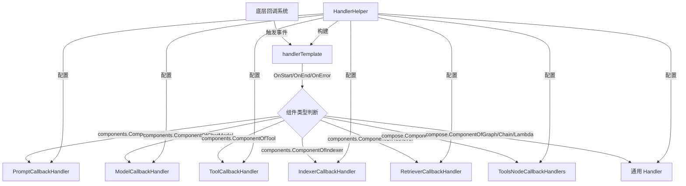

# Callbacks Template 模块技术深潜

## 1. 问题空间与模块定位

想象一下，你正在构建一个复杂的 AI 应用，其中包含了多个组件：模型、提示模板、工具、索引器、检索器等等。你想要监控这些组件的执行过程——记录日志、追踪性能指标、收集调试信息、或者在特定事件发生时执行自定义逻辑。

但是，每个组件都有自己的输入输出类型，回调接口也各不相同。如果你直接使用底层的 `callbacks.Handler` 接口，你需要：
- 处理通用的 `CallbackInput` 和 `CallbackOutput` 类型
- 手动进行类型断言和转换
- 为每个组件类型编写冗长的 switch-case 分支
- 自己管理回调的启用/禁用逻辑

这就是 `utils/callbacks/template` 模块要解决的问题。它提供了一套类型安全、易于使用的回调处理器模板，让你能够以声明式的方式为不同组件类型注册回调，而不需要处理底层的类型转换和分发逻辑。

## 2. 核心概念与心智模型

这个模块的设计可以类比为**事件分发器**：

- **HandlerHelper** 是一个**构建器**，允许你为不同的组件类型"安装"对应的回调处理器
- **handlerTemplate** 是**事件路由器**，它接收来自底层回调系统的事件，根据组件类型将事件分发给对应的处理器
- 各种具体的 CallbackHandler（如 ModelCallbackHandler、ToolCallbackHandler）是**事件监听器**，它们定义了在特定事件发生时要执行的逻辑

从数据流的角度看：
```
底层回调系统 → handlerTemplate → 类型转换 → 具体 CallbackHandler → 用户逻辑
```

## 3. 架构与数据流向

让我们通过 Mermaid 图表来理解这个模块的架构：



### 关键组件解析

#### HandlerHelper
`HandlerHelper` 是整个模块的入口点，它采用**构建器模式**让你可以流畅地配置各种回调处理器。它的主要职责是：
- 持有所有组件类型的回调处理器引用
- 提供链式 API 来设置这些处理器
- 最终构建出一个实现了 `callbacks.Handler` 接口的 `handlerTemplate` 实例

#### handlerTemplate
`handlerTemplate` 是实际实现 `callbacks.Handler` 接口的结构体。它的核心逻辑是：
1. 接收底层回调系统的事件
2. 根据 `RunInfo.Component` 判断组件类型
3. 将通用的 `CallbackInput`/`CallbackOutput` 转换为组件特定的类型
4. 调用对应组件类型的回调处理器
5. 处理流输入输出的特殊情况

#### 具体 CallbackHandler 结构体
每个组件类型都有对应的回调处理器结构体，例如：
- `ModelCallbackHandler` - 处理模型相关的回调
- `ToolCallbackHandler` - 处理工具相关的回调
- `PromptCallbackHandler` - 处理提示模板相关的回调

这些结构体都遵循相同的模式：
- 包含 `OnStart`、`OnEnd`、`OnError` 等函数字段
- 有些还包含流处理相关的字段（如 `OnEndWithStreamOutput`）
- 提供 `Needed` 方法来检查特定时机是否需要触发回调

## 4. 核心组件深入分析

### HandlerHelper 的设计与使用

`HandlerHelper` 是构建回调处理器的核心，它的设计体现了**流畅接口**和**构建器模式**的结合。

```go
type HandlerHelper struct {
    promptHandler      *PromptCallbackHandler
    chatModelHandler   *ModelCallbackHandler
    embeddingHandler   *EmbeddingCallbackHandler
    // ... 其他处理器字段
    composeTemplates   map[components.Component]callbacks.Handler
}
```

每个设置方法都返回 `*HandlerHelper`，这样可以链式调用：

```go
helper := template.NewHandlerHelper().
    ChatModel(&modelHandler).
    Prompt(&promptHandler).
    Tool(&toolHandler).
    Handler()
```

### handlerTemplate 的事件分发逻辑

`handlerTemplate` 实现了 `callbacks.Handler` 接口的所有方法，每个方法都遵循相同的模式：

```go
func (c *handlerTemplate) OnStart(ctx context.Context, info *callbacks.RunInfo, input callbacks.CallbackInput) context.Context {
    switch info.Component {
    case components.ComponentOfPrompt:
        return c.promptHandler.OnStart(ctx, info, prompt.ConvCallbackInput(input))
    case components.ComponentOfChatModel:
        return c.chatModelHandler.OnStart(ctx, info, model.ConvCallbackInput(input))
    // ... 其他组件类型
    default:
        return ctx
    }
}
```

这里有几个关键点：
1. **类型转换**：使用组件特定的转换函数（如 `prompt.ConvCallbackInput`）将通用类型转换为组件特定类型
2. **安全调用**：只有当对应的处理器非空时才会调用（虽然代码中没有显式检查，但 `Needed` 方法会提前过滤）
3. **上下文传递**：返回修改后的上下文，允许回调在上下文中存储信息

### 流处理的特殊处理

对于支持流输出的组件（如模型和工具），`handlerTemplate` 提供了特殊的处理逻辑：

```go
func (c *handlerTemplate) OnEndWithStreamOutput(ctx context.Context, info *callbacks.RunInfo, output *schema.StreamReader[callbacks.CallbackOutput]) context.Context {
    switch info.Component {
    case components.ComponentOfChatModel:
        return c.chatModelHandler.OnEndWithStreamOutput(ctx, info,
            schema.StreamReaderWithConvert(output, func(item callbacks.CallbackOutput) (*model.CallbackOutput, error) {
                return model.ConvCallbackOutput(item), nil
            }))
    // ... 其他组件类型
    }
}
```

这里使用了 `schema.StreamReaderWithConvert` 来创建一个转换流，将通用的 `CallbackOutput` 流转换为组件特定的类型流。

## 5. 依赖关系分析

`utils/callbacks/template` 模块处于回调系统的中间层，它依赖于：

### 上游依赖
- **callbacks 包**：提供了底层的 `Handler` 接口、`RunInfo` 类型等
- **components 包**：定义了各种组件类型的常量
- **各个组件包**（model、prompt、tool、indexer、retriever、document、embedding）：提供了组件特定的回调输入输出类型和转换函数
- **compose 包**：提供了图、链、Lambda 等组合组件的类型
- **schema 包**：提供了流处理相关的类型

### 下游使用者
- **应用层代码**：直接使用 `HandlerHelper` 来构建回调处理器
- **其他框架模块**：可能在内部使用这些模板来实现默认的回调逻辑

### 数据契约
模块依赖于以下隐式契约：
1. 每个组件类型必须提供对应的 `ConvCallbackInput` 和 `ConvCallbackOutput` 函数
2. 回调处理器的函数字段可以为 nil，此时该事件会被忽略
3. 流转换函数不能返回错误（从代码中可以看到，转换函数总是返回 nil 错误）

## 6. 设计决策与权衡

### 设计决策 1：使用结构体+函数字段而不是接口

**选择**：每个回调处理器都是一个结构体，包含可选的函数字段，而不是定义一个接口。

**原因**：
- 灵活性：用户可以只实现他们关心的回调函数，而不需要实现整个接口
- 易用性：不需要创建新的结构体类型，只需要实例化一个结构体并设置需要的字段
- 兼容性：添加新的回调时机不会破坏现有代码

**权衡**：
- 失去了编译时的接口完整性检查
- 需要 `Needed` 方法来检查是否需要触发回调
- 代码稍微冗长一些

### 设计决策 2：构建器模式+流畅接口

**选择**：使用 `HandlerHelper` 作为构建器，提供链式 API。

**原因**：
- 可读性：代码清晰地表达了"为 X 组件设置 Y 处理器"的意图
- 可组合性：可以灵活地组合不同组件的处理器
- 类型安全：每个设置方法都接受特定类型的处理器

**权衡**：
- 需要创建一个额外的构建器类型
- 构建过程是可变的（虽然最终构建出的处理器是不可变的）

### 设计决策 3：集中式事件分发

**选择**：在 `handlerTemplate` 中集中处理所有组件类型的事件分发。

**原因**：
- 单一职责：所有的事件分发逻辑都在一个地方
- 一致性：确保所有组件类型的处理方式一致
- 易于维护：添加新的组件类型只需要修改一个地方

**权衡**：
- `handlerTemplate` 可能会变得很大
- 与所有组件类型的耦合度较高

### 设计决策 4：流转换时忽略错误

**选择**：在流转换函数中总是返回 nil 错误。

**原因**：
- 简化 API：不需要用户处理流转换错误
- 实际情况：类型转换应该总是成功的，因为底层回调系统会保证类型正确性

**权衡**：
- 如果类型转换失败，错误会被静默忽略
- 调试可能会更困难

## 7. 使用指南与最佳实践

### 基本使用示例

```go
// 创建一个模型回调处理器
modelHandler := &template.ModelCallbackHandler{
    OnStart: func(ctx context.Context, runInfo *callbacks.RunInfo, input *model.CallbackInput) context.Context {
        log.Printf("Model started: %v", runInfo.Name)
        return ctx
    },
    OnEnd: func(ctx context.Context, runInfo *callbacks.RunInfo, output *model.CallbackOutput) context.Context {
        log.Printf("Model ended: %v", output.Response)
        return ctx
    },
    OnError: func(ctx context.Context, runInfo *callbacks.RunInfo, err error) context.Context {
        log.Printf("Model error: %v", err)
        return ctx
    },
}

// 创建一个工具回调处理器
toolHandler := &template.ToolCallbackHandler{
    OnStart: func(ctx context.Context, info *callbacks.RunInfo, input *tool.CallbackInput) context.Context {
        log.Printf("Tool started: %v", input)
        return ctx
    },
}

// 构建回调处理器
handler := template.NewHandlerHelper().
    ChatModel(modelHandler).
    Tool(toolHandler).
    Handler()

// 使用回调处理器
result, err := runnable.Invoke(ctx, input, compose.WithCallbacks(handler))
```

### 流处理示例

```go
streamHandler := &template.ModelCallbackHandler{
    OnEndWithStreamOutput: func(ctx context.Context, runInfo *callbacks.RunInfo, output *schema.StreamReader[*model.CallbackOutput]) context.Context {
        // 处理流式输出
        go func() {
            defer output.Close()
            for {
                item, err := output.Recv(ctx)
                if err != nil {
                    break
                }
                // 处理每个流项目
                log.Printf("Stream item: %v", item)
            }
        }()
        return ctx
    },
}
```

### 最佳实践

1. **只设置需要的回调**：不需要为每个时机都设置回调，只设置你关心的即可。
2. **保持回调函数轻量**：回调函数应该快速执行，不要在回调中进行耗时操作。
3. **正确处理上下文**：如果在回调中修改了上下文，记得返回修改后的上下文。
4. **错误处理**：在 `OnError` 回调中，你可以记录错误、修改错误、或者在上下文中存储错误信息。
5. **避免阻塞**：在流处理回调中，避免阻塞主流程，应该使用 goroutine 来处理流。

## 8. 边缘情况与注意事项

### 处理器为 nil 的情况

如果某个组件类型的处理器为 nil，那么该组件的所有回调都会被忽略。`handlerTemplate` 的 `Needed` 方法会正确处理这种情况，不会尝试调用 nil 处理器的方法。

### 类型转换失败

虽然框架保证类型转换应该总是成功的，但如果出现类型转换失败的情况，转换函数会返回 nil。你的回调函数应该准备好处理 nil 输入的情况。

### 流处理中的资源管理

在 `OnEndWithStreamOutput` 回调中，你需要负责关闭流读取器。如果不关闭，可能会导致资源泄漏。

### 嵌套回调

回调函数中不应该再次触发可能导致同一回调被调用的操作，这可能会导致无限递归。

### 并发安全

回调函数可能会被并发调用，特别是在处理流的时候。确保你的回调函数是并发安全的，或者使用适当的同步机制。

## 9. 总结

`utils/callbacks/template` 模块是一个精心设计的回调处理框架，它通过提供类型安全、易于使用的模板，大大简化了为不同组件类型注册回调的过程。它的核心价值在于：

- **类型安全**：避免了手动类型断言和转换
- **易用性**：使用构建器模式和流畅接口，代码清晰易读
- **灵活性**：可以只实现需要的回调，不需要实现整个接口
- **完整性**：支持所有组件类型和所有回调时机，包括流处理

虽然它有一些权衡（如与组件类型的高耦合、没有编译时接口检查），但这些权衡在实际使用中是值得的，因为它们带来了更好的开发体验和更高的生产力。
