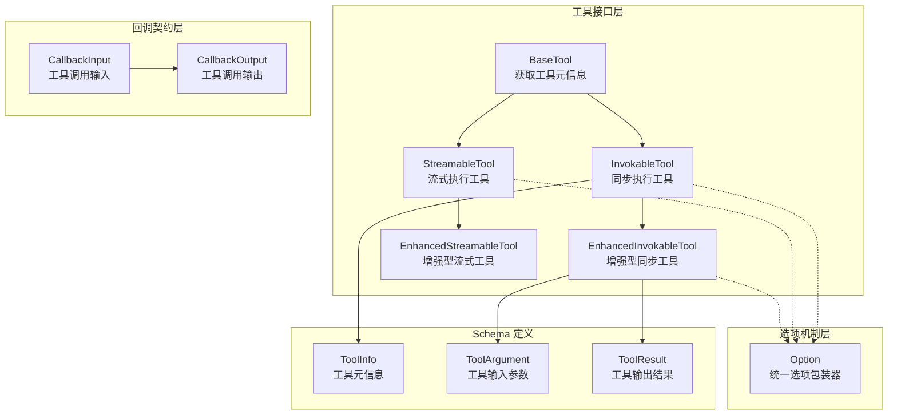
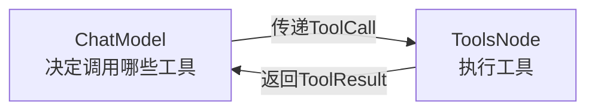

# tool_contracts_and_options 模块

## 概述

`tool_contracts_and_options` 模块是 Eino 框架的工具系统基石，它定义了 **AI Agent 如何与外部世界交互** 的契约。想象一下：当你告诉一个 AI Agent "帮我查一下北京今天的天气"时，框架需要一种标准化的方式来：

1. **告诉模型有哪些工具可用**（工具的描述和参数schema）
2. **执行模型选择的工具**（调用具体的工具实现）
3. **将工具执行结果返回给模型**（作为下一次推理的上下文）

这个模块就是完成这三件事的"标准化协议"——它不关心工具具体是查询天气、调用数据库还是发送 HTTP 请求，它只定义"怎么说"和"怎么做"的规范。

## 架构概览



### 接口层级设计

模块采用了 **渐进式能力增强** 的接口设计：

1. **`BaseTool`** — 最底层，仅提供工具元信息（名称、描述、参数schema），让模型知道"这个工具是干什么的"
2. **`InvokableTool`** — 在 BaseTool 基础上增加同步执行能力
3. **`StreamableTool`** — 在 BaseTool 基础上增加流式执行能力
4. **`EnhancedInvokableTool`** — 增强版，支持返回结构化的多模态结果（文本、图片、音频、视频、文件）
5. **`EnhancedStreamableTool`** — 增强版流式支持

这种设计的妙处在于：**每个工具实现只需要实现它真正需要的能力**。如果你的工具不支持流式输出，就没必要实现 `StreamableTool`；如果只需要返回字符串，就用 `InvokableTool` 而不是 `EnhancedInvokableTool`。

## 核心设计决策

### 1. 字符串参数 vs 结构化参数

**原始接口**（`InvokableTool`, `StreamableTool`）使用字符串传递参数：
```go
InvokableRun(ctx context.Context, argumentsInJSON string, opts ...Option) (string, error)
```

**增强接口**（`EnhancedInvokableTool`, `EnhancedStreamableTool`）使用结构体：
```go
InvokableRun(ctx context.Context, toolArgument *schema.ToolArgument, opts ...Option) (*schema.ToolResult, error)
```

**为什么这样设计？**

这反映了一个权衡：
- 字符串参数保持了与 OpenAI Function Calling 协议的兼容性，模型层不需要大改
- 结构化参数 (`ToolArgument`, `ToolResult`) 提供了更好的类型安全，并且支持多模态输出

实际使用中，框架会在内部进行转换，所以调用方通常感受不到差异。但对于需要自定义序列化逻辑的工具实现者来说，这是一个重要的选择点。

### 2. Option 模式的类型安全问题

```go
type Option struct {
    implSpecificOptFn any
}
```

这是 Go 语言中实现"泛型选项模式"的一个巧妙但有陷阱的设计：

**优点**：
- 单一 `Option` 类型可以携带任意工具的自定义配置
- 工具实现者可以定义自己的选项结构体和选项函数

**缺点**：
- **类型不安全**：如果你传入了错误类型的选项函数，框架只会静默忽略，不会报错
- 需要工具实现者正确使用 `GetImplSpecificOptions` 来提取选项

这是一个经典的 Go 权衡：**简单性 vs 类型安全**。选择 `any` 是为了避免为每个工具定义重复的接口，但这要求使用者格外小心。

### 3. 回调合约的灵活性

回调输入输出使用了"宽进严出"的策略：

```go
type CallbackInput struct {
    ArgumentsInJSON string
    Extra map[string]any
}

type CallbackOutput struct {
    Response string
    ToolOutput *schema.ToolResult
    Extra map[string]any
}
```

`Extra` 字段允许在不动接口的情况下传递额外信息，这是一种 **可扩展性设计**。同时，转换函数 `ConvCallbackInput` 和 `ConvCallbackOutput` 提供了多种输入类型的自动转换，让框架更友好。

## 子模块说明

| 子模块 | 职责 | 文档 |
|--------|------|------|
| `callback_extra` | 定义工具执行回调的输入输出结构 | [callback_extra.md](tool-contracts-and-options-callback_extra.md) |
| `interface` | 定义所有工具接口 (BaseTool, InvokableTool 等) | [interface.md](tool-contracts-and-options-interface.md) |
| `option` | 统一的选项包装和提取机制 | [option.md](tool-contracts-and-options-option.md) |
| `utils` | 工具创建辅助函数（从函数推断工具信息） | [tool-utils.md](tool-contracts-and-options-tool-utils.md) |

## 与其他模块的关系

### 上游：模型层



模型层（[model_interface](../model_and_prompting/model_interface.md)）通过工具接口获取 `ToolInfo`，用于构建发送给大模型的 prompt。模型返回的 tool call 由 ToolsNode 使用 `InvokableTool.InvokableRun()` 执行。

### 下游：工具实现

实际工具实现（如文件系统工具、API 调用工具）需要实现上述接口之一。具体可以参考：

- [tool_function_adapters](../tool_function_adapters.md) — 将普通函数转换为工具
- [agent_tool_adapter](../agent_tool_adapter.md) — Agent 工具适配器

### 回调系统集成

工具执行时会触发回调，这与 [callbacks_and_handler_templates](../callbacks_and_handler_templates.md) 模块集成，提供可观测性支持。

## 给新贡献者的注意事项

### 1. 接口实现的"里氏替换"

当你实现一个工具时，记住上层代码可能会把任何 `BaseTool` 当作 `InvokableTool` 来调用（如果它实现了的话）。确保：
- 你的 `InvokableRun` 真正实现了同步执行语义
- 不要在流式接口中阻塞等待完整结果

### 2. Option 静默失败

```go
// 假如你定义了自定义选项
type myOptions struct { timeout time.Duration }

func WithTimeout(t time.Duration) tool.Option {
    return tool.WrapImplSpecificOptFn(func(o *myOptions) {
        o.timeout = t
    })
}

// 但在获取时用错了类型...
opts := tool.GetImplSpecificOptions(&otherOptions{}) // ❌ 类型不匹配
// 这个函数会静默忽略错误的选项，不会报错！
```

**建议**：在单元测试中验证选项是否正确生效，或者使用更类型安全的方式（如直接在工具结构体中定义字段）。

### 3. 回调转换可能返回 nil

```go
func ConvCallbackInput(src callbacks.CallbackInput) *CallbackInput {
    switch t := src.(type) {
    case *CallbackInput:
        return t
    // ... 其他 case
    default:
        return nil  // 如果类型不匹配，返回 nil
    }
}
```

使用转换函数后，**一定要检查返回值是否为 nil**。

### 4. 增强接口的参数解包

```go
// EnhancedInvokableTool 的参数是 *schema.ToolArgument
// 这个结构体目前只有一个 Text 字段
type ToolArgument struct {
    Text string
}

// 实际调用时需要解包
func (e *enhancedInvokableTool[T]) InvokableRun(
    ctx context.Context, 
    toolArgument *schema.ToolArgument, 
    opts ...tool.Option,
) (*schema.ToolResult, error) {
    // 需要从 toolArgument.Text 中解析 JSON
    err = sonic.UnmarshalString(toolArgument.Text, &inst)
    // ...
}
```

这与原始接口直接接收 `string` 不同，记住解包。

## 总结

这个模块是 Eino 框架连接"AI 思考"和"现实行动"的桥梁。它通过清晰的接口契约，让：

- **模型** 知道有哪些工具可用、如何描述工具
- **运行时** 知道如何调用工具、传递参数、获取结果
- **监控系统** 能够拦截工具执行过程
- **开发者** 能够用熟悉的函数签名创建工具

理解这个模块的关键是记住三个核心概念：**接口层级**（Base → Invokable/Streamable → Enhanced）、**选项模式**（统一的配置传递）、**回调合约**（可观测性）。