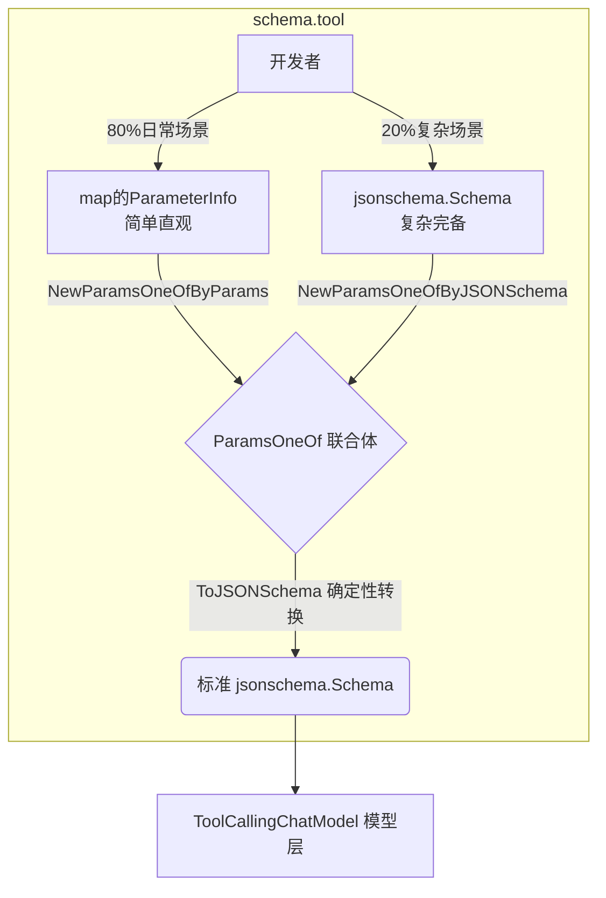

# Schema Tool 模块 (schema/tool)

## 1. 模块初识

`tool` 模块是系统与大型语言模型（LLM）之间关于“工具调用（Function Calling）”的契约声明与翻译中枢。LLM 本身被禁锢在沙盒中，要让它能够查天气、执行代码或访问数据库，我们需要将外部工具的能力精确地描述给它。由于各个 LLM 厂商（如 OpenAI、Anthropic）普遍采用 JSON Schema 作为描述工具参数的标准协议，但让开发者在 Go 语言中手写嵌套极深的 JSON Schema 是一场噩梦。

因此，这个模块的核心价值在于：它提供了一套高度符合 Go 语言直觉的参数定义抽象（`ParameterInfo`），允许开发者像写结构体标签一样轻松定义工具参数；同时它内部负责将这些轻量级定义“编译”为完全符合规范的、具有确定性的 JSON Schema，最终交由底层的聊天模型去消费。

## 2. 架构与核心心智模型

你可以把这个模块想象成一个“跨国政务服务大厅”。开发者是普通市民，需要提交“办事申请”（工具描述）；而 LLM 是外国审批官，只接受一种极其严格、格式死板的“官方表单”（JSON Schema）。

为了兼顾不同开发者的需求，大厅提供了两个通道：
1. **傻瓜式通道（直觉模型）**：你只需要填写一张极为简单的信息登记表（`ParameterInfo`），告诉工作人员“我需要一个叫 location 的字符串参数，它是必填的”，大厅内部系统会自动帮你打印出复杂的官方表单。
2. **专家通道（严格模型）**：如果你需要使用一些非常高级的 JSON Schema 特性（例如 `anyOf`, `pattern` 正则验证等），大厅也允许你直接带着自己写好的官方表单（`jsonschema.Schema`）来提交。

这两个通道最终都汇聚在 `ParamsOneOf` 这个收件箱中，对外提供统一的输出接口。



## 3. 核心组件深度解析

### ToolInfo：工具的身份档案
`ToolInfo` 包含了模型理解和决定是否调用该工具所需的全部上下文。
- **作用**：告诉模型这个工具叫什么 (`Name`)，它能干什么 (`Desc`)，以及它需要什么输入 (`ParamsOneOf`)。
- **设计细节**：描述 (`Desc`) 是重中之重。它不仅仅是人类可读的注释，更是给 LLM 的“系统提示词”。如果一个工具经常被模型误用，很多时候是因为 `Desc` 写得不够清晰。这里还提供了一个 `Extra` 字典，用于在跨层传递（如给中间件）时携带非模型的扩展元数据。

### ParamsOneOf：优雅的联合类型
在 Go 语言这种强类型且非函数式语言中，表达“参数要么是类型 A，要么是类型 B”是一个痛点。`ParamsOneOf` 采用经典的不透明联合体（Union）模式解决了这个问题。
- **内部机制**：包含两个私有字段 `params` 和 `jsonschema`。对外仅暴露明确的工厂方法（`NewParamsOneOfByParams` 和 `NewParamsOneOfByJSONSchema`），强制约束使用者只能选择其一进行初始化。
- **智能输出**：其核心方法 `ToJSONSchema()` 扮演着“降维打击”的角色。如果你走的是简单通道，它会在此处实时遍历将你的 `ParameterInfo` 编译成真正的 `jsonschema.Schema`。

### ParameterInfo：化繁为简的参数描述节点
这是为绝大多数工具开发准备的“直觉型结构”。通过积木般的组合，你可以描述几乎所有常见的参数结构。
- **自描述树状结构**：它被设计为一个递归结构。如果参数类型是 `Array`，你就在 `ElemInfo` 里塞入另一个 `ParameterInfo` 来描述数组元素；如果是 `Object`，就在 `SubParams` 里放一个子字典描述内部字段。
- **为什么不直接用结构体反射（Reflection）？**：反射虽然能进一步偷懒直接将 Go Struct 转为 Schema，但往往会丢失极具价值的自然语言字段描述（Desc），并且在跨微服务边界时表现较差。显式声明 `ParameterInfo` 是“代码即文档”的体现。

### ToolChoice：调用意图控制器
定义了三个常量 `ToolChoiceForbidden` (禁止调用)、`ToolChoiceAllowed` (模型自主决定)、`ToolChoiceForced` (强制调用工具)。这直接映射了大多数 LLM 厂商的 API 行为开关，使得开发者能够在特定业务流中（例如到了收集订单环节）强制打断模型的闲聊发散，逼迫其输出格式化的工具调用请求。

## 4. 数据流与依赖网络

`tool` 模块处于整个 Agent 和 Model 交互链路的关键枢纽位置。

**谁调用它（上游依赖）？**
- **上层工具封装层**：在 `adk.agent_tool` 或是 `components.tool` 的具体工具实现中，开发者或框架会实例化 `ToolInfo` 并组装对应的参数定义。
- **Agent 编排引擎**：诸如 `flow.agent.react` 的多轮对话代理会收集当前上下文中所有被激活的 `ToolInfo` 列表，为模型规划可用武器库。

**它调用谁（下游依赖）？**
- **JSONSchema 引擎**：依赖 `github.com/eino-contrib/jsonschema` 来构建真正的标准 schema 对象。
- **有序 Map 实现**：依赖 `github.com/wk8/go-ordered-map/v2` 来确保 JSON Schema 字段输出的有序性。

**数据流向（端到端）**：
在发起一轮带有工具库的对话时，包含多个 `ToolInfo` 的列表会被传递给支持工具调用的模型接口（如 `components.model.interface.ToolCallingChatModel`）。在组装底层 HTTP 网络请求前，模型驱动（Model Driver）的 Option 拦截器会调用 `tool.ParamsOneOf.ToJSONSchema()`，将领域特定的工具定义，序列化为 LLM 能看懂的 Payload 字典（比如 OpenAI 请求体中的 `tools` 字段）。如果 LLM 决定执行该工具，它会返回一个 `schema.message.ToolCall` 消息体，里面包含填好的 JSON 参数，最后交还给框架侧去物理执行。

## 5. 关键设计决策与权衡

### 权衡一：为了确定性序列化牺牲细微性能
阅读 `ToJSONSchema()` 方法你会发现，在遍历处理 `p.params` 和 `paramInfo.SubParams` 时，代码并没有直接 `for k, v := range map`，而是**先提取出所有 Key，使用 `sort.Strings(keys)` 进行按字典序排序，然后再填充到 `orderedmap` 中**。

这是一个深刻的架构考量：
- **问题背景**：Go 语言的原生 Map 遍历顺序是随机的。如果直接映射，每次进程重启或生成出来的 JSON Schema 字段顺序都会乱跳（比如这次是 `{name, age}`，下次是 `{age, name}`）。
- **深远影响**：对人类来说顺序无所谓，但现代 LLM 平台（如 Anthropic Prompt Caching 或 OpenAI）高度依赖精确的 Token 序列匹配来命中内部缓存。Schema 的乱序会导致缓存大面积穿透，既增加网络延迟，又会消耗大量无谓的 token 计费。此外，部分微调模型对输入参数的顺序是有隐含依赖的，严格一致的顺序有助于获得确定性的推理结果。
- **决策**：选择引入 `go-ordered-map` 并辅以字符串排序。牺牲几微秒的 CPU 排序性能开销，换取了宏观架构上的确定性（Determinism）以及极其重要的缓存友好性。

### 权衡二：双轨制参数定义 (Dual-path Definition)
- 框架完全可以强硬要求开发者手写 `jsonschema.Schema`，这样最贴近底层标准，也省去了转换代码的维护。
- 但是 JSON Schema 存在极大的心智负担，嵌套层级令人眼花缭乱（需要理解 properties, required array, types 等概念及其层级嵌套规范）。引入直白的 `ParameterInfo` 是向“开发者体验（DX）”的妥协。而保留原生 `jsonschema` 的选项，则是为了防止抽象漏水（Leaky Abstraction），保证不阻拦硬核开发者使用 `oneOf` 或高级条件校验 Schema 特性。

## 6. 使用模式与避坑指南

### 最佳实践示例

下面展示如何利用直觉式的 `ParameterInfo` 优雅地定义一个包含枚举和嵌套对象的复杂工具：

```go
// 场景：定义一个为用户预订酒店的 Tool
params := schema.NewParamsOneOfByParams(map[string]*schema.ParameterInfo{
    "location": {
        Type:     schema.String,
        Desc:     "预订酒店的城市，例如：上海、北京",
        Required: true,
    },
    "room_type": {
        Type:     schema.String,
        Desc:     "房间类型",
        Enum:     []string{"standard", "deluxe", "suite"}, // 合理运用枚举能有效抑制模型幻觉
        Required: true,
    },
    "guests": {
        Type:     schema.Array,
        Desc:     "入住人名单列表",
        Required: false,
        ElemInfo: &schema.ParameterInfo{ // 注意：Array 类型必须挂载 ElemInfo 说明元素结构
            Type: schema.String,
            Desc: "入住人姓名",
        },
    },
})

toolInfo := &schema.ToolInfo{
    Name:        "BookHotel",
    Desc:        "帮助用户预订特定城市的酒店房间。当你明确知道用户的目的地和房型时，必须调用此工具。",
    ParamsOneOf: params,
}
```

### 开发者避坑雷区

1. **类型与子结构的错配**
   - **坑点**：如果你的 `Type` 指定为 `schema.Array`，你**必须且只能**填充 `ElemInfo` 字段。如果指定为 `schema.Object`，你**必须且只能**填充 `SubParams` 字段。如果你在一个 `schema.String` 类型的节点里瞎塞了 `SubParams`，在 `ToJSONSchema` 转换时它会被错误地输出为带有 Properties 的 String，导致生成的 Schema 不合法，甚至会在大模型 API 网关处直接触发 HTTP 400 Bad Request 错误。
2. **必填项（Required）的思维扭转**
   - **坑点**：在 JSON Schema 官方标准中，“必填项”是一个存在于父级节点对象上的字符串数组（如 `"required": ["location", "room_type"]`）。但在本模块简化版的 `ParameterInfo` 抽象中，`Required` 被设计为一个直接挂在字段自身上的布尔值属性。开发者需要习惯这种更符合直觉的思维：你只需在自己对应的字段上打上 `Required: true`，转换引擎会自动在背后帮你把它们收集起来，并上浮提升到父 `jsonschema.Schema` 的 `Required` 列表数组中。
3. **无参数工具的优雅声明**
   - 如果你的工具类似一个纯净的触发器（比如 `GetServerStatus`），不需要任何参数输入。**请勿**传入一个空的 Map。正确的做法是，在构建 `ToolInfo` 时直接将 `ParamsOneOf` 赋值为 `nil`。底层的 `ToJSONSchema` 逻辑能够完美捕获这个 `nil`，向模型声明此工具函数不接受任何参数，避免引发无意义的空 Schema 校验异常。