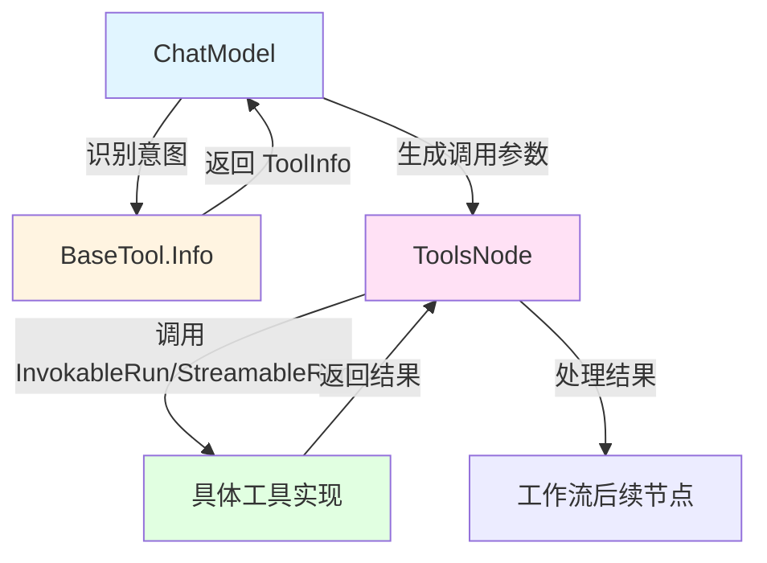

# tool_interfaces 模块技术深度解析

## 1. 什么是 tool_interfaces 模块？

`tool_interfaces` 模块定义了与 LLM 工具调用相关的核心接口，是连接大语言模型（LLM）与实际工具执行的桥梁。在构建智能代理和复杂工作流时，模型需要能够调用各种工具来完成任务，而这个模块就提供了标准化的工具接口定义。

### 问题背景
在没有统一接口的情况下，每个工具可能有不同的调用方式、参数格式和返回类型，这会导致：
- 模型难以理解和选择合适的工具
- 工具集成到工作流中需要大量适配代码
- 难以支持工具调用的流式输出
- 多模态工具结果的处理方式不统一

`tool_interfaces` 模块通过定义一组层次化的接口，解决了这些问题，使得工具可以被标准化地描述、调用和集成。

## 2. 核心概念与抽象层次

这个模块采用了分层设计的思想，从基础到高级，逐步增加功能。我们可以将这些接口看作是工具的"能力契约"：

```
BaseTool (基础描述)
    ├── InvokableTool (单次调用，字符串输入输出)
    │       └── EnhancedInvokableTool (单次调用，结构化多模态输入输出)
    └── StreamableTool (流式调用，字符串输出)
            └── EnhancedStreamableTool (流式调用，结构化多模态输出)
```

### 关键抽象：

1. **BaseTool** - 工具的"身份卡"
   只负责提供工具的元信息，让模型知道"有这个工具，它是做什么的"。

2. **InvokableTool** - 工具的"一次调用"
   在基础信息之上，增加了实际执行能力，但限制为简单的 JSON 字符串输入输出。

3. **StreamableTool** - 工具的"流式输出"
   适用于需要逐步返回结果的场景，比如文件下载、长文本生成等。

4. **EnhancedInvokableTool** 和 **EnhancedStreamableTool** - 工具的"多模态能力"
   支持更丰富的输入输出格式，如图像、音频、视频等多模态内容。

## 3. 架构与数据流向

让我们通过一个典型的工具调用流程来看数据是如何流动的：



### 关键流程解析：

1. **工具发现阶段**：
   - `ChatModel` 调用 `BaseTool.Info()` 获取工具的元信息
   - 元信息包括工具名称、描述、参数格式等，帮助模型理解工具用途

2. **工具调用阶段**：
   - 模型根据用户意图选择合适的工具并生成参数
   - `ToolsNode` 接收调用请求，根据工具类型选择调用方式：
     - 对于 `InvokableTool`：调用 `InvokableRun()`，传入 JSON 字符串参数
     - 对于 `StreamableTool`：调用 `StreamableRun()`，获取流式读取器
     - 对于增强版本：使用结构化的 `ToolArgument` 和 `ToolResult`

3. **结果处理阶段**：
   - 单次调用：直接获取字符串或结构化结果
   - 流式调用：通过 `StreamReader` 逐步读取结果
   - 结果被传递回工作流或模型进行下一步处理

## 4. 核心组件深度解析

### BaseTool 接口

```go
type BaseTool interface {
    Info(ctx context.Context) (*schema.ToolInfo, error)
}
```

**设计意图**：这是最基础的接口，只关注"工具是什么"，不关心"工具如何执行"。这种分离使得我们可以在不实际执行工具的情况下，向模型描述工具的能力。

**关键参数**：
- `ctx context.Context`：用于传递上下文信息，如超时控制、跟踪信息等
- 返回值 `*schema.ToolInfo`：包含工具的完整元数据

**schema.ToolInfo 结构**：
- `Name`：工具的唯一标识
- `Desc`：工具的描述，告诉模型何时以及如何使用这个工具
- `Extra`：额外的自定义信息
- `ParamsOneOf`：参数定义，可以通过两种方式描述：
  - 结构化参数：使用 `ParameterInfo` 树
  - JSON Schema：直接使用 JSON Schema 定义

### InvokableTool 接口

```go
type InvokableTool interface {
    BaseTool
    InvokableRun(ctx context.Context, argumentsInJSON string, opts ...Option) (string, error)
}
```

**设计意图**：在基础工具信息之上，增加了实际执行能力。选择 JSON 字符串作为输入输出格式是因为：
- 模型生成 JSON 是最常见的交互方式
- 简单的字符串格式易于处理和调试
- 适用于大多数简单工具场景

**使用场景**：
- 简单的 API 调用
- 数据库查询
- 文件读写操作
- 任何可以一次性返回结果的操作

### StreamableTool 接口

```go
type StreamableTool interface {
    BaseTool
    StreamableRun(ctx context.Context, argumentsInJSON string, opts ...Option) (*schema.StreamReader[string], error)
}
```

**设计意图**：支持流式输出，这对于处理大量数据或需要逐步展示结果的场景非常重要。

**为什么需要流式接口？**
- 大文件传输：可以边读边传，减少内存占用
- 长文本生成：用户可以看到部分结果而不必等待全部完成
- 实时数据流：如日志监控、实时搜索等

**StreamReader 的作用**：
提供了统一的流式数据读取接口，屏蔽了底层实现差异，让调用者可以用一致的方式处理不同来源的流式数据。

### EnhancedInvokableTool 接口

```go
type EnhancedInvokableTool interface {
    BaseTool
    InvokableRun(ctx context.Context, toolArgument *schema.ToolArgument, opts ...Option) (*schema.ToolResult, error)
}
```

**设计意图**：这是对 `InvokableTool` 的增强，核心变化是：
- 输入从简单的 JSON 字符串变为结构化的 `ToolArgument`
- 输出从简单的字符串变为结构化的 `ToolResult`

**ToolResult 的多模态能力**：
通过 `Parts` 字段，可以包含多种类型的输出：
- 文本内容
- 图片
- 音频
- 视频
- 文件

**使用场景**：
- 图像分析工具：返回文本描述 + 标记后的图像
- 文档处理工具：返回提取的文本 + 原始文件
- 多媒体生成工具：返回多种格式的结果

### EnhancedStreamableTool 接口

```go
type EnhancedStreamableTool interface {
    BaseTool
    StreamableRun(ctx context.Context, toolArgument *schema.ToolArgument, opts ...Option) (*schema.StreamReader[*schema.ToolResult], error)
}
```

**设计意图**：结合了流式输出和多模态能力，是功能最强大的接口。

**典型应用场景**：
- 视频分析：逐帧返回分析结果
- 大文件处理：分批返回处理状态和结果
- 实时多模态生成：逐步生成文本、图像等组合内容

## 5. 依赖关系分析

### 被依赖模块

`tool_interfaces` 模块依赖以下核心模块：

1. **schema.tool** 模块
   - `ToolInfo`：工具信息结构
   - `ParameterInfo`：参数描述结构
   - `ParamsOneOf`：参数定义容器

2. **schema.message** 模块
   - `ToolArgument`：增强版工具调用参数
   - `ToolResult`：增强版工具调用结果

3. **schema.stream** 模块
   - `StreamReader[T]`：通用流式数据读取器

### 依赖此模块的组件

1. **components.model.interface** 模块
   - `ToolCallingChatModel`：需要工具信息来让模型选择和调用工具

2. **compose.tool_node** 模块
   - 这是实际执行工具调用的节点，会使用这些接口

3. **adk.agent_tool** 模块
   - 用于将工具集成到 Agent 中的辅助模块

## 6. 设计决策与权衡

### 1. 接口分层设计 vs 单一复杂接口

**决策**：采用分层接口设计，从简单到复杂逐步增加功能。

**权衡分析**：
- ✅ 优点：
  - 工具实现者可以根据需要选择合适的接口级别
  - 简单工具不需要实现复杂的流式或多模态功能
  - 向后兼容性好，新增功能不会破坏现有实现
- ❌ 缺点：
  - 接口数量较多，理解成本稍高
  - 调用者需要根据接口类型进行分支处理

**为什么这样设计**：
工具的能力差异很大，从简单的计算到复杂的多模态处理都有。分层设计让每个工具只需要实现自己需要的能力，避免了强制实现不需要的功能。

### 2. JSON 字符串输入 vs 结构化输入

**决策**：基础版本使用 JSON 字符串，增强版本使用结构化参数。

**权衡分析**：
- JSON 字符串：
  - ✅ 简单直接，模型原生支持
  - ✅ 易于调试和日志记录
  - ❌ 类型安全差，需要手动解析
  - ❌ 不适合复杂的非文本数据
- 结构化参数：
  - ✅ 类型安全，编译时检查
  - ✅ 支持多模态数据
  - ❌ 增加了一层抽象

**为什么这样设计**：
通过两种方式并存，既保留了简单场景下的便利性，又支持了复杂场景下的灵活性。

### 3. 流式输出的抽象

**决策**：使用泛型 `StreamReader[T]` 作为流式输出的统一抽象。

**权衡分析**：
- ✅ 优点：
  - 统一的流式处理接口
  - 类型安全，支持任意数据类型
  - 屏蔽底层实现差异
- ❌ 缺点：
  - 增加了一层抽象，有微小的性能开销
  - 对于简单场景可能显得过度设计

**为什么这样设计**：
流式处理是一个常见需求，但实现方式差异很大。通过统一的 `StreamReader` 抽象，让工具调用者不必关心底层是如何实现流式的，只需关注数据本身。

## 7. 使用指南与最佳实践

### 选择合适的接口

根据你的工具特性选择合适的接口：

| 工具特性 | 推荐接口 |
|---------|---------|
| 简单功能，输入输出都是文本 | InvokableTool |
| 需要逐步返回结果 | StreamableTool |
| 需要处理或返回多模态内容 | EnhancedInvokableTool |
| 多模态 + 流式输出 | EnhancedStreamableTool |

### 实现示例

#### 简单工具实现 InvokableTool

```go
type CalculatorTool struct{}

func (c *CalculatorTool) Info(ctx context.Context) (*schema.ToolInfo, error) {
    return &schema.ToolInfo{
        Name: "calculator",
        Desc: "Perform basic arithmetic calculations",
        ParamsOneOf: schema.NewParamsOneOfByParams(map[string]*schema.ParameterInfo{
            "expression": {
                Type: schema.String,
                Desc: "The arithmetic expression to evaluate",
                Required: true,
            },
        }),
    }, nil
}

func (c *CalculatorTool) InvokableRun(ctx context.Context, argumentsInJSON string, opts ...tool.Option) (string, error) {
    // 解析参数
    var args struct {
        Expression string `json:"expression"`
    }
    if err := json.Unmarshal([]byte(argumentsInJSON), &args); err != nil {
        return "", err
    }
    
    // 执行计算（简化示例）
    result := calculate(args.Expression)
    return fmt.Sprintf("%f", result), nil
}
```

#### 多模态工具实现 EnhancedInvokableTool

```go
type ImageAnalyzer struct{}

func (i *ImageAnalyzer) Info(ctx context.Context) (*schema.ToolInfo, error) {
    return &schema.ToolInfo{
        Name: "image_analyzer",
        Desc: "Analyze images and return descriptions and tags",
        ParamsOneOf: schema.NewParamsOneOfByParams(map[string]*schema.ParameterInfo{
            "image_url": {
                Type: schema.String,
                Desc: "URL of the image to analyze",
                Required: true,
            },
        }),
    }, nil
}

func (i *ImageAnalyzer) InvokableRun(ctx context.Context, toolArgument *schema.ToolArgument, opts ...tool.Option) (*schema.ToolResult, error) {
    // 解析图像 URL
    var args struct {
        ImageURL string `json:"image_url"`
    }
    if err := json.Unmarshal([]byte(toolArgument.Text), &args); err != nil {
        return nil, err
    }
    
    // 分析图像
    description, annotatedImage := analyzeImage(args.ImageURL)
    
    // 返回多模态结果
    return &schema.ToolResult{
        Parts: []schema.ToolOutputPart{
            {
                Text: &description,
            },
            {
                Image: &schema.ToolOutputImage{
                    URL: annotatedImage.URL,
                },
            },
        },
    }, nil
}
```

### 最佳实践

1. **工具描述要清晰**
   - 在 `Info()` 中提供详细的工具描述
   - 包含使用示例，帮助模型理解何时使用该工具
   - 明确说明参数的含义和格式要求

2. **参数设计要合理**
   - 保持参数简洁，避免过多可选参数
   - 使用合理的默认值
   - 提供清晰的参数验证

3. **错误处理要友好**
   - 返回有意义的错误信息
   - 错误信息应该帮助模型理解问题并可能纠正
   - 考虑添加错误码以便程序处理

4. **流式工具要考虑背压**
   - 实现流式工具时要注意数据产生速率
   - 尊重 context 的取消信号
   - 确保资源正确释放

## 8. 常见陷阱与注意事项

### 1. 接口误用

**问题**：实现了错误的接口，比如实现了 `InvokableTool` 但方法签名不对。

**解决**：Go 的接口是隐式实现的，确保你的方法签名与接口完全一致。可以使用类型断言进行验证：

```go
var _ tool.InvokableTool = (*MyTool)(nil) // 编译时检查
```

### 2. JSON 序列化问题

**问题**：参数解析失败，特别是在处理复杂嵌套结构时。

**解决**：
- 保持参数结构简单扁平
- 使用明确的 JSON 标签
- 对输入进行严格验证
- 提供详细的解析错误信息

### 3. 流式资源泄漏

**问题**：在使用 `StreamReader` 时没有正确关闭，导致资源泄漏。

**解决**：
- 确保在读取完成后关闭流
- 使用 defer 语句
- 注意 context 取消时的清理工作

### 4. 多模态数据过大

**问题**：返回的多模态数据（如图像、视频）太大，影响性能。

**解决**：
- 考虑使用流式接口逐步返回
- 提供数据大小限制选项
- 考虑使用引用（URL）而非直接传递数据

### 5. 上下文传递

**问题**：没有正确使用 context，导致超时控制、追踪等功能失效。

**解决**：
- 始终传递 context 到下层调用
- 尊重 context 的 Done() 信号
- 不要在内部创建新的 context 替代传入的 context

## 9. 总结

`tool_interfaces` 模块通过精心设计的分层接口，为 LLM 工具调用提供了统一、灵活、可扩展的基础。它的核心价值在于：

1. **标准化**：定义了工具的描述、调用和结果返回的标准方式
2. **层次化**：从简单到复杂，满足不同工具的需求
3. **多模态支持**：不仅支持文本，还支持图像、音频、视频等多种格式
4. **流式能力**：支持逐步返回结果，适应各种场景

这个模块是构建智能代理和复杂工作流的基石，理解它的设计思想和使用方式对于高效开发高质量的 LLM 应用至关重要。

## 相关模块

- [Schema Core Types](./Schema%20Core%20Types.md) - 核心数据结构定义
- [Chat Model 接口规范](./model_interfaces.md) - 模型接口定义
- [Compose Graph Engine](./Compose%20Graph%20Engine.md) - 工作流编排引擎
