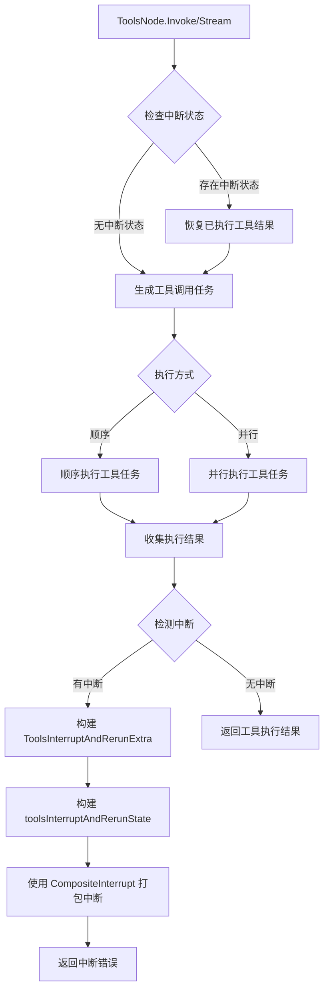

# tool_interrupt_and_rerun_state 模块深度解析

## 问题背景与模块定位

在构建复杂的工具调用和工作流系统时，我们经常会遇到这样的场景：一个工具节点需要并行或串行调用多个工具，而其中某些工具可能因为需要人工确认、等待外部事件、或者临时失败而需要中断执行。如果我们简单地让整个流程失败或者重新开始，就会导致已经成功执行的工具结果被浪费，增加系统的开销和延迟。

想象一下，你正在指挥一群工人完成一项任务，每个工人负责一个子任务。如果其中一个工人需要暂停等待材料，你不会让所有人都停下来重干，而是会让其他已完成的工人保持成果，只让需要暂停的工人在材料到达后继续工作。`tool_interrupt_and_rerun_state` 模块正是实现了这种"部分中断、部分保留"的能力。

## 核心概念与心智模型

这个模块的核心思想可以用"**任务检查点与选择性重跑**"来概括。它建立了以下几个关键抽象：

### 1. 中断状态（Interrupt State）
- 把中断看作是一种特殊的错误信号，而不是普通的失败
- 中断不仅包含"为什么中断"的信息，还包含"在哪里中断"和"中断时的状态"
- 可以从上下文中恢复中断状态，实现无缝衔接

### 2. 工具执行跟踪（Tool Execution Tracking）
- 区分"已执行工具"和"需要重跑的工具"
- 保留已执行工具的结果，避免重复计算
- 支持标准工具和增强型工具（多模态工具）两种类型

### 3. 复合中断（Composite Interrupt）
- 一个工具节点可能有多个工具同时中断
- 将多个中断信号打包成一个统一的中断错误
- 引擎可以解包并正确处理每个独立的中断点

### 类比说明
可以把这个模块想象成**视频游戏的存档系统**：
- 当你在游戏中遇到困难的 Boss 战前，可以先存档（创建检查点）
- 如果你战斗失败了，不需要从头开始玩游戏，只需要从存档点继续（选择性重跑）
- 你之前探索过的区域、获得的装备都会保留（已执行工具的结果）
- 你只需要重新挑战 Boss（只重跑失败或中断的部分）

## 架构与数据流

让我们通过一个 Mermaid 图来理解这个模块的架构和数据流向：



### 详细数据流向解析

1. **入口与状态恢复**
   - 当 `ToolsNode.Invoke` 或 `ToolsNode.Stream` 被调用时，首先会通过 `GetInterruptState` 检查上下文中是否存在中断状态
   - 如果存在之前保存的 `toolsInterruptAndRerunState`，则恢复：
     - 原始输入消息
     - 已执行工具的结果（标准工具和增强型工具）

2. **任务生成与执行**
   - `genToolCallTasks` 方法根据输入消息生成工具调用任务
   - 对于已经执行过的工具，直接标记为已执行并设置结果
   - 对于需要执行的工具，根据配置选择顺序或并行执行

3. **中断检测与信息收集**
   - 执行完成后，检查每个工具任务是否返回中断错误
   - 如果有中断，构建：
     - `ToolsInterruptAndRerunExtra`：包含面向用户的中断信息
     - `toolsInterruptAndRerunState`：包含引擎恢复执行所需的状态

4. **复合中断打包**
   - 使用 `CompositeInterrupt` 将所有子中断打包成一个统一的中断错误
   - 这个复合中断会被上层引擎捕获并处理

## 核心组件设计

### ToolsInterruptAndRerunExtra

这个结构体承载了工具节点重跑时的元数据，主要用于：
- 向用户展示中断相关信息
- 提供给上层应用进行决策

```go
type ToolsInterruptAndRerunExtra struct {
    ToolCalls             []schema.ToolCall      // 原始助手消息中的所有工具调用
    ExecutedTools         map[string]string      // 已执行的标准工具及其结果
    ExecutedEnhancedTools map[string]*schema.ToolResult  // 已执行的增强型工具及其结果
    RerunTools            []string               // 需要重跑的工具调用ID列表
    RerunExtraMap         map[string]any         // 每个需要重跑工具的额外元数据
}
```

**设计意图**：
- 区分"已执行"和"需重跑"，避免重复工作
- 支持两种工具类型，保证向后兼容和功能扩展
- `RerunExtraMap` 提供了灵活的扩展点，每个工具可以附加自定义信息

### toolsInterruptAndRerunState

这个结构体是内部使用的状态保存结构，用于：
- 保存恢复执行所需的所有信息
- 作为 checkpoint 的一部分被持久化

```go
type toolsInterruptAndRerunState struct {
    Input                 *schema.Message
    ExecutedTools         map[string]string
    ExecutedEnhancedTools map[string]*schema.ToolResult
    RerunTools            []string
}
```

**设计意图**：
- 保存原始输入，确保重跑时的一致性
- 不包含面向用户的信息（如 `RerunExtraMap`），保持状态精简
- 专注于引擎恢复执行的核心需求

### wrappedInterruptAndRerun

这个结构体负责包装旧版本的中断错误，添加执行地址信息：

```go
type wrappedInterruptAndRerun struct {
    ps    Address
    inner error
}
```

**设计意图**：
- 向后兼容旧的中断错误机制
- 添加上下文信息（执行地址），使引擎能够准确定位中断位置

### InterruptInfo

这个结构体聚合了复合或嵌套运行的中断元数据：

```go
type InterruptInfo struct {
    State             any
    BeforeNodes       []string
    AfterNodes        []string
    RerunNodes        []string
    RerunNodesExtra   map[string]any
    SubGraphs         map[string]*InterruptInfo
    InterruptContexts []*InterruptCtx
}
```

**设计意图**：
- 支持复杂的嵌套中断场景
- 提供灵活的节点级中断控制（BeforeNodes, AfterNodes）
- 支持子图中断，满足模块化设计需求

## 关键设计决策与权衡

### 1. 中断作为特殊错误 vs 独立控制流

**选择**：将中断实现为特殊类型的错误

**分析**：
- **优点**：
  - 可以利用现有的错误传播机制，不需要修改整个调用链
  - 与 Go 语言的惯用法一致
  - 可以通过 `errors.Is` 和 `errors.As` 进行类型检查和 unwrap
- **缺点**：
  - 中断本质上不是错误，可能会造成概念混淆
  - 需要小心区分真正的错误和中断信号
  - 在某些情况下可能会与正常的错误处理逻辑冲突

**为什么这个选择是合理的**：
在图执行引擎的上下文中，中断确实是一种"非正常"的控制流转移，使用错误机制是一种实用的选择。同时，通过提供清晰的 API（`Interrupt`, `StatefulInterrupt`, `CompositeInterrupt`），可以减少概念混淆。

### 2. 完整保存输入 vs 只保存差异

**选择**：完整保存原始输入消息

**分析**：
- **优点**：
  - 简单直接，不容易出错
  - 重跑时逻辑一致，不需要重构输入
  - 可以应对工具执行过程中输入可能被修改的情况
- **缺点**：
  - 如果输入消息很大，会占用更多的存储空间
  - 在某些场景下可能保存了不必要的信息

**为什么这个选择是合理的**：
对于大多数工具调用场景，输入消息的大小是可控的。完整性和简单性的优势超过了存储空间的考虑。

### 3. 并行执行 vs 顺序执行

**选择**：支持两种模式，由用户配置

**分析**：
- **并行执行**：
  - 优点：更快的总体执行时间
  - 缺点：更复杂的错误处理和中断管理，资源消耗更高
- **顺序执行**：
  - 优点：简单可控，资源消耗低
  - 缺点：总体执行时间较长

**为什么这个选择是合理的**：
不同的应用场景有不同的需求。通过提供 `ExecuteSequentially` 配置选项，用户可以根据自己的需求在性能和简单性之间进行权衡。

### 4. 分离用户可见信息和内部状态

**选择**：将 `ToolsInterruptAndRerunExtra` 和 `toolsInterruptAndRerunState` 分离

**分析**：
- **优点**：
  - 关注点分离：用户关心的信息 vs 引擎需要的信息
  - 可以独立演化两个结构，不会互相影响
  - 内部状态可以更精简，只包含必要的恢复信息
- **缺点**：
  - 有一些数据重复
  - 需要维护两个相似但不同的结构

**为什么这个选择是合理的**：
这种分离符合"接口与实现分离"的设计原则。`ToolsInterruptAndRerunExtra` 是面向用户的接口，而 `toolsInterruptAndRerunState` 是内部实现细节。这种分离使系统更加灵活，可以在不改变用户可见接口的情况下修改内部实现。

## 与其他模块的依赖关系

`tool_interrupt_and_rerun_state` 模块并不是孤立存在的，它与系统中的其他多个模块有紧密的交互：

1. **[internal_runtime_and_mocks - interrupt_and_addressing_runtime_primitives](internal_runtime_and_mocks-interrupt_and_addressing_runtime_primitives.md)**
   - 依赖 `core.InterruptSignal` 和 `core.Interrupt` 等底层中断原语
   - 使用 `Address` 和 `AddressSegment` 来定位执行位置

2. **[compose_graph_engine - graph_execution_runtime](compose_graph_engine-graph_execution_runtime.md)**
   - 中断错误会被图执行引擎捕获和处理
   - 图执行引擎负责 checkpoint 的保存和恢复

3. **[schema_models_and_streams](schema_models_and_streams.md)**
   - 依赖 `schema.Message`、`schema.ToolCall`、`schema.ToolResult` 等数据结构
   - 使用 `schema.StreamReader` 处理流式输出

4. **[components_core - tool_contracts_and_options](components_core-tool_contracts_and_options.md)**
   - 依赖工具接口定义和选项类型

## 使用指南与注意事项

### 正确使用中断 API

1. **标准中断**：对于不需要保存状态的简单中断场景
   ```go
   return compose.Interrupt(ctx, "需要用户确认")
   ```

2. **带状态的中断**：对于需要保存状态以便恢复的场景
   ```go
   state := map[string]any{"processed_items": items}
   return compose.StatefulInterrupt(ctx, "等待外部事件", state)
   ```

3. **复合中断**：对于管理多个子进程的复合节点
   ```go
   return compose.CompositeInterrupt(ctx, extraInfo, state, childErrs...)
   ```

### 新贡献者需要注意的陷阱

1. **忘记包装旧版中断错误**
   - 如果使用旧版的中断错误，必须先使用 `WrapInterruptAndRerunIfNeeded` 包装
   - 否则复合中断无法正确处理

2. **中断状态的类型安全**
   - 使用 `GetInterruptState` 时，类型断言必须正确
   - 建议使用类型参数版本的 API 来提高类型安全

3. **流式输出中的中断处理**
   - 在 `Stream` 方法中，中断检测前需要先消费并保存已执行工具的流式输出
   - 否则会导致已执行工具的结果丢失

4. **并行执行中的错误处理**
   - 并行执行时，需要正确处理 panic，使用 `safe.NewPanicErr` 包装
   - 注意 `WaitGroup` 的正确使用

5. **工具地址段的正确设置**
   - 在执行工具调用前，需要使用 `appendToolAddressSegment` 正确设置地址段
   - 这对于准确定位中断位置至关重要

## 子模块概述

为了更深入地理解 `tool_interrupt_and_rerun_state` 模块，我们将其拆分为两个核心子模块进行了详细解析：

### 1. [interrupt_core_components](compose_graph_engine-tool_node_execution_and_interrupt_control-tool_interrupt_and_rerun_state-interrupt_core_components.md)

这个子模块包含了中断机制的核心组件，主要关注：
- 通用的中断创建和处理机制
- 执行地址系统和精确定位
- 复合中断的处理方式
- 与旧版中断系统的向后兼容性

如果你想了解中断是如何在底层工作的，如何创建自定义中断，或者如何处理嵌套中断场景，这是你应该深入阅读的部分。

### 2. [tool_node_interrupt_components](compose_graph_engine-tool_node_execution_and_interrupt_control-tool_interrupt_and_rerun_state-tool_node_interrupt_components.md)

这个子模块专注于工具节点的中断和重跑机制，主要关注：
- 工具执行状态的保存和恢复
- 已执行工具和需要重跑工具的跟踪
- 流式工具调用的中断处理
- 标准工具和增强型工具的支持

如果你主要关心如何在工具节点级别处理中断，如何确保工具不会被重复执行，或者如何处理流式工具调用的中断，这部分会提供详细的解释。

## 总结

`tool_interrupt_and_rerun_state` 模块是一个精巧设计的组件，它解决了工具执行过程中的部分中断和选择性重跑问题。通过将中断建模为特殊错误、保存执行状态、支持复合中断等机制，它使得复杂的工具调用流程更加健壮和高效。

这个模块的设计体现了几个重要的软件工程原则：
- **关注点分离**：用户可见信息与内部状态分离
- **向后兼容**：支持旧版中断错误的包装和处理
- **灵活性**：同时支持顺序和并行执行，支持多种工具类型
- **实用主义**：将中断建模为错误，利用现有语言特性

对于新加入团队的开发者来说，理解这个模块的设计思想和实现细节，将有助于更好地理解整个图执行引擎的工作原理，并能够正确地使用和扩展工具执行功能。我们强烈建议深入阅读上述两个子模块的文档，以获得更全面的理解。
