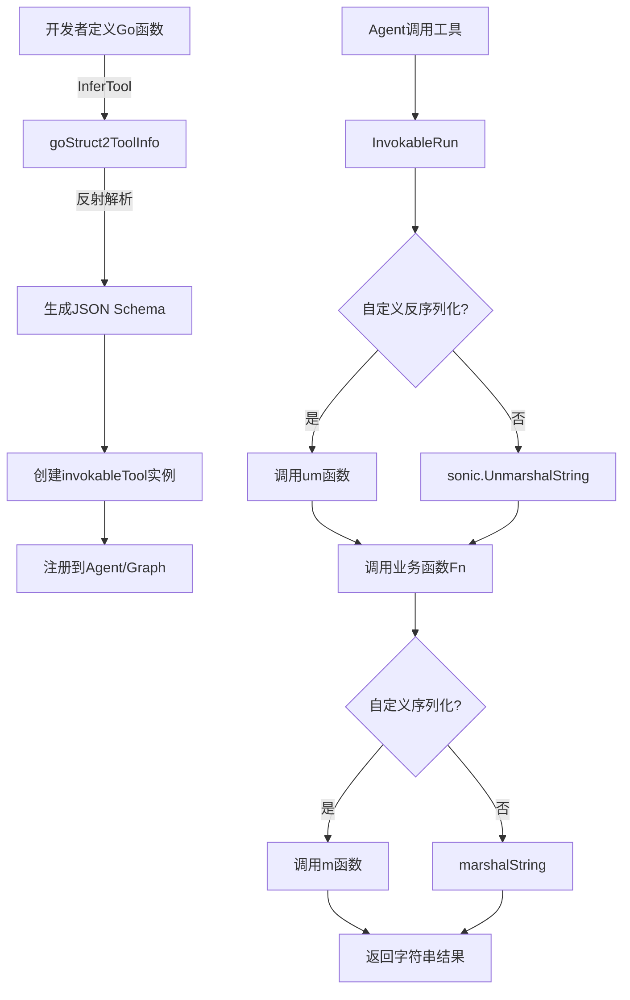

# Tool Options and Utilities (工具选项与扩展)

## 1. 什么问题？

在构建多Agent系统和LLM应用时，工具（Tool）是模型与外部世界交互的桥梁。然而，工具的实现面临着几个核心挑战：

### 1.1 问题空间
想象一下，你需要集成一个天气查询工具到Agent中。简单情况下，你只需要一个接收JSON字符串、返回JSON字符串的函数。但随着需求变得复杂：
- 工具需要支持流式输出（例如搜索结果的逐步返回）
- 工具需要返回多模态数据（图片、文件、音频），而不只是文本
- 不同工具需要传递各自特定的配置选项
- 你需要在工具执行前后插入日志、监控或中间件逻辑
- 你希望从Go结构体自动推断JSON Schema，而不需要手动编写

如果没有统一的抽象，你最终会得到一堆风格各异、难以维护的工具实现，每个都有自己的参数处理方式和输出格式。

### 1.2 设计洞察
`tool_options_and_callbacks` 模块的核心思想是：**将工具的"业务逻辑"与"基础设施"分离**。业务逻辑是开发者真正关心的"这个工具做什么"，而基础设施包括：
- JSON参数的序列化/反序列化
- 从Go结构体自动推断JSON Schema
- 统一的选项传递机制
- 流式输出的处理
- 多模态数据的包装
- 回调钩子的集成

## 2. 心智模型

可以把这个模块想象成一个**工具适配器工厂**：

```
原始Go函数 → [适配器包装] → 标准化工具接口
    ↑                                       ↓
业务逻辑                              系统可调用
```

这个工厂提供了四条主要的生产线：
1. **普通工具生产线**：将 `func(ctx, T) (D, error)` 转换为 `InvokableTool`
2. **增强工具生产线**：将 `func(ctx, T) (*ToolResult, error)` 转换为 `EnhancedInvokableTool`  
3. **流式工具生产线**：将 `func(ctx, T) (*StreamReader[D], error)` 转换为 `StreamableTool`
4. **增强流式生产线**：将 `func(ctx, T) (*StreamReader[*ToolResult], error)` 转换为 `EnhancedStreamableTool`

同时，工厂提供了三个关键的"配件"：
- **统一选项机制**：允许任何工具传递自定义配置
- **Schema推导器**：从Go结构体自动生成JSON Schema
- **回调输入/输出**：为工具执行提供可观测性钩子

## 3. 架构与数据流

让我们通过一个典型的使用场景来追踪数据流：

### 3.1 创建工具的完整流程



### 3.2 核心组件角色

#### 3.2.1 Option（components/tool/option.go）
这是一个**类型擦除的统一选项容器**。它的设计非常巧妙：不直接暴露工具特定的选项类型，而是通过 `WrapImplSpecificOptFn` 将工具特定的选项函数包装成统一的 `Option` 类型，然后在工具内部通过 `GetImplSpecificOptions` 还原。

这种设计实现了：
- 接口签名的统一性（所有工具都接受 `...Option`）
- 实现的灵活性（每个工具可以定义自己的选项结构体）
- 类型安全（在工具内部还原时进行类型断言）

#### 3.2.2 CallbackInput / CallbackOutput（components/tool/callback_extra.go）
这两个结构体为回调系统提供了**标准化的数据契约**。`CallbackInput` 包含工具的输入参数和额外信息，`CallbackOutput` 包含工具的响应（字符串或结构化的 `ToolResult`）和额外信息。

特别值得注意的是 `ConvCallbackInput` 和 `ConvCallbackOutput` 这两个转换函数——它们允许回调系统处理多种输入类型（字符串、`ToolArgument` 等），体现了框架的兼容性设计。

#### 3.2.3 invokableTool / enhancedInvokableTool（components/tool/utils/invokable_func.go）
这是模块的核心实现。`invokableTool` 包装了一个业务函数，处理：
- JSON参数的反序列化（可自定义）
- 业务函数的调用
- 结果的序列化（可自定义）
- 工具元数据的提供

`enhancedInvokableTool` 类似，但它直接处理 `ToolArgument` 输入和 `ToolResult` 输出，适合需要返回多模态数据的场景。

#### 3.2.4 streamableTool / enhancedStreamableTool（components/tool/utils/streamable_func.go）
流式版本的工具适配器。它们的特点是通过 `schema.StreamReaderWithConvert` 将业务函数返回的流式数据转换为标准化的字符串流或 `ToolResult` 流。

#### 3.2.5 toolOptions（components/tool/utils/create_options.go）
为工具创建过程提供配置选项：
- `WithUnmarshalArguments`：自定义参数反序列化
- `WithMarshalOutput`：自定义结果序列化  
- `WithSchemaModifier`：自定义JSON Schema生成过程

## 4. 关键设计决策与权衡

### 4.1 类型擦除 vs 泛型
**决策**：使用类型擦除的 `Option` 结构体，而不是在接口级别使用泛型。

**原因**：
- Go 接口不支持泛型方法
- 保持工具接口的简洁性和统一性
- 将类型复杂度封装在工具内部

**权衡**：
- ✅ 接口简单，所有工具签名一致
- ✅ 工具可以自由定义自己的选项类型
- ❌ 失去了编译时类型检查，错误只能在运行时发现
- ❌ 需要在工具内部进行类型断言

### 4.2 自动Schema推导 vs 手动定义
**决策**：提供 `InferTool` 系列函数，通过反射从Go结构体自动推导JSON Schema。

**原因**：
- 减少重复劳动，避免手动维护Schema
- 保持Go结构体与JSON Schema的一致性
- 允许通过 `WithSchemaModifier` 自定义推导过程

**权衡**：
- ✅ 开发效率高
- ✅ 减少人为错误
- ❌ 反射有运行时开销（但在工具创建时发生一次，可接受）
- ❌ 复杂的Schema可能需要额外的自定义

### 4.3 四种工具类型 vs 统一接口
**决策**：定义四种不同的工具接口（`InvokableTool`、`StreamableTool`、`EnhancedInvokableTool`、`EnhancedStreamableTool`）。

**原因**：
- 不同场景有不同的需求：简单文本 vs 多模态，一次性返回 vs 流式输出
- 保持每个接口的单一职责
- 让使用者明确知道他们在处理什么类型的工具

**权衡**：
- ✅ 接口清晰，职责明确
- ✅ 类型安全，不会混淆不同的输入输出
- ❌ 接口数量较多，学习曲线稍陡
- ❌ 在某些情况下需要进行类型转换

### 4.4 可选的自定义序列化 vs 默认行为
**决策**：提供默认的JSON序列化/反序列化，但允许通过选项覆盖。

**原因**：
- 80%的场景使用默认JSON就够了
- 20%的场景需要特殊处理（例如加密、压缩、自定义格式）
- 通过选项模式保持向后兼容

**权衡**：
- ✅ 默认情况下简单易用
- ✅ 复杂场景有足够的灵活性
- ❌ 增加了API表面
- ❌ 自定义序列化函数的错误处理需要特别注意

## 5. 依赖关系分析

### 5.1 该模块依赖什么
- **schema**：`ToolInfo`、`ToolResult`、`ToolArgument`、`StreamReader` 定义了工具的核心数据结构
- **jsonschema**：用于从Go结构体推导JSON Schema
- **sonic**：高性能JSON库，用于默认的序列化/反序列化
- **internal/generic**：提供泛型辅助函数（如 `NewInstance`）
- **callbacks**：回调系统的基础接口

### 5.2 谁依赖这个模块
- **compose.tool_node**：使用这些工具适配器在图中执行工具
- **adk.agent_tool**：可能使用这些工具创建Agent可用的工具
- **各种工具实现**：直接使用这些适配器包装自己的业务逻辑

### 5.3 数据契约
模块的关键数据契约包括：
1. **工具输入**：JSON字符串或 `ToolArgument`
2. **工具输出**：字符串、`ToolResult` 或它们的流式版本
3. **选项传递**：类型擦除的 `Option` 切片
4. **回调数据**：`CallbackInput` 和 `CallbackOutput`

## 6. 使用指南与最佳实践

### 6.1 基本使用：创建一个简单工具

```go
// 1. 定义输入结构体（带JSON标签）
type WeatherInput struct {
    City string `json:"city" desc:"城市名称"`
}

// 2. 定义业务函数
func GetWeather(ctx context.Context, input WeatherInput) (string, error) {
    // 实际的天气查询逻辑
    return fmt.Sprintf("天气晴朗，温度25°C"), nil
}

// 3. 创建工具
tool, err := utils.InferTool("get_weather", "查询天气", GetWeather)
if err != nil {
    // 处理错误
}
```

### 6.2 高级使用：自定义Schema和序列化

```go
// 自定义Schema修改器
func schemaModifier(jsonTagName string, t reflect.Type, tag reflect.StructTag, schema *jsonschema.Schema) {
    if jsonTagName == "city" {
        schema.Description = "要查询天气的城市名称，支持中英文"
    }
}

// 自定义反序列化
func customUnmarshal(ctx context.Context, args string) (any, error) {
    var input WeatherInput
    // 自定义解析逻辑
    return input, nil
}

// 创建带自定义选项的工具
tool, err := utils.InferTool(
    "get_weather", 
    "查询天气", 
    GetWeather,
    utils.WithSchemaModifier(schemaModifier),
    utils.WithUnmarshalArguments(customUnmarshal),
)
```

### 6.3 增强工具：返回多模态数据

```go
// 增强工具直接返回 *schema.ToolResult
func GetMap(ctx context.Context, input LocationInput) (*schema.ToolResult, error) {
    image := &schema.ToolOutputImage{
        URL: "https://example.com/map.png",
    }
    
    return &schema.ToolResult{
        Parts: []*schema.ToolOutputPart{
            {Image: image},
            {Text: "这是您要的地图"},
        },
    }, nil
}

// 创建增强工具
tool, err := utils.InferEnhancedTool("get_map", "获取地图", GetMap)
```

### 6.4 流式工具：逐步返回结果

```go
func SearchStream(ctx context.Context, input SearchInput) (*schema.StreamReader[string], error) {
    // 创建流式输出
    reader, writer := schema.NewStreamReader[string]()
    
    go func() {
        defer writer.Close()
        // 逐步写入搜索结果
        writer.Write("结果1")
        writer.Write("结果2")
    }()
    
    return reader, nil
}

// 创建流式工具
tool, err := utils.InferStreamTool("search", "搜索", SearchStream)
```

## 7. 边缘情况与陷阱

### 7.1 常见陷阱

1. **忘记处理JSON标签**：`InferTool` 依赖结构体的 `json` 标签，如果标签缺失或错误，生成的Schema会有问题。

2. **类型断言失败**：在自定义反序列化函数中，如果返回的类型与期望的 `T` 不匹配，会在运行时panic。

3. **流式输出忘记关闭**：如果创建了 `StreamWriter` 但忘记关闭，可能导致资源泄漏或下游阻塞。

4. **SchemaModifier中的特殊情况**：注意 `jsonTagName` 为 `_root` 的情况，以及数组字段会触发两次回调（一次字段本身，一次元素）。

### 7.2 隐式契约

- **Info方法**：应该快速返回，不应该有阻塞操作或网络调用。
- **错误包装**：所有错误都被包装了额外的上下文（工具名），在处理错误时可以通过 `errors.Unwrap` 获取原始错误。
- **GetType方法**：返回的是蛇形转驼峰的工具名，这个被用于某些类型识别场景。

## 8. 总结

`tool_options_and_callbacks` 模块是一个精心设计的工具抽象层，它成功地将工具的业务逻辑与基础设施 concerns 分离。通过提供统一的接口、自动的Schema推导、灵活的选项机制和完整的回调支持，它让开发者可以专注于工具"做什么"，而不是"如何包装"。

这个模块的设计体现了几个重要的软件工程原则：
- **接口隔离**：四种工具接口各司其职
- **开闭原则**：通过选项和修饰器支持扩展
- **关注点分离**：业务逻辑与基础设施分离
- **约定优于配置**：提供合理的默认行为，同时允许自定义

对于新加入团队的开发者，理解这个模块的关键是：不要被表面的泛型和反射吓到，抓住"适配器"这个核心概念——它只是把你的普通Go函数包装成系统可以调用的标准形式。
