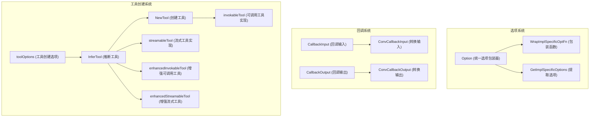

# tool_options_and_utilities 模块技术文档

## 概述

`tool_options_and_utilities` 模块是一个工具基础设施层，它解决了两个核心问题：

1. **工具选项的统一抽象**：允许每个工具定义自己的特定选项，同时通过统一的接口传递这些选项
2. **工具函数的快速包装**：将普通的 Go 函数转换为符合框架接口的工具组件，无需手动实现繁琐的序列化、反序列化和元数据管理

想象一下，这个模块就像一个"工具适配器工厂"——它接收普通的 Go 函数，给它们穿上统一的"制服"（接口实现），并提供一个灵活的"配置口袋"（选项系统），让每个工具都能携带自己的特定配置。

## 架构概览



这个模块由三个主要部分组成：

1. **选项系统**（`option.go`）：提供了一个类型安全的方式来传递工具特定的选项，同时保持接口的统一性
2. **回调系统**（`callback_extra.go`）：定义了工具执行前后回调的数据结构和转换函数
3. **工具创建系统**（`create_options.go`, `invokable_func.go`, `streamable_func.go`）：核心是一组工厂函数，能够从普通 Go 函数创建符合框架接口的工具组件

## 核心设计决策

### 1. 类型擦除的选项系统

**设计选择**：使用 `any` 类型存储实现特定的选项函数，而不是使用接口或泛型

**权衡分析**：
- ✅ **优点**：保持了工具接口的简洁性，所有工具都接受相同的 `...tool.Option` 参数
- ✅ **优点**：允许每个工具定义自己的选项结构体，无需遵循统一的选项接口
- ❌ **缺点**：失去了编译时类型检查，错误的选项类型只会在运行时被发现
- ❌ **缺点**：需要工具作者正确使用 `WrapImplSpecificOptFn` 和 `GetImplSpecificOptions`

**为什么这样设计**：框架需要支持各种不同的工具，每个工具可能有完全不同的配置需求。如果为每个工具定义不同的选项接口，会导致接口爆炸。通过类型擦除，我们在保持接口统一的同时，给予了工具实现者最大的灵活性。

### 2. 推断式工具创建

**设计选择**：提供 `InferTool` 等函数，通过反射从 Go 函数的参数类型推断工具的 JSON Schema

**权衡分析**：
- ✅ **优点**：极大地简化了工具创建过程，开发者只需关注业务逻辑
- ✅ **优点**：保持了 Go 结构体和 JSON Schema 的一致性，减少了维护成本
- ❌ **缺点**：反射带来了一定的运行时开销（虽然在工具创建时只执行一次）
- ❌ **缺点**：对于复杂的结构体，可能需要自定义 SchemaModifier 来处理特殊情况

**为什么这样设计**：这是一个典型的" Convention over Configuration"（约定优于配置）的设计。大多数工具的参数都是简单的结构体，通过反射可以满足 80% 的使用场景，而对于剩余的 20%，提供了 `WithSchemaModifier` 作为逃生舱。

### 3. 四种工具变体

**设计选择**：提供了四种工具类型：普通可调用、普通流式、增强可调用、增强流式

**权衡分析**：
- ✅ **优点**：满足了不同场景的需求，从简单的字符串输入输出到复杂的多模态结果
- ✅ **优点**：通过"增强"版本提供了逐步升级的路径
- ❌ **缺点**：增加了模块的复杂度，新使用者可能需要时间理解四种类型的区别
- ❌ **缺点**：代码中有一定的重复（虽然通过工厂函数减少了重复）

**为什么这样设计**：工具的使用场景差异很大。有些工具只需要返回简单的文本，有些需要返回结构化数据，还有些需要流式输出。通过提供这四种变体，框架可以在简单性和功能丰富性之间取得平衡。

## 数据流分析

让我们追踪一个工具从创建到执行的完整数据流：

### 工具创建流程

```
用户函数 → InferTool → goStruct2ToolInfo → goStruct2ParamsOneOf → jsonschema.Reflector
                                                            ↓
                                                    NewTool → invokableTool
```

1. 用户提供一个普通的 Go 函数和工具名称/描述
2. `InferTool` 使用反射从函数的输入参数类型推断 JSON Schema
3. 创建 `invokableTool` 结构体，包装用户函数和推断出的元数据

### 工具执行流程（可调用工具）

```
InvokableRun(arguments, opts...) 
    ↓
[可选] 自定义 UnmarshalArguments → 反序列化 arguments
    ↓
默认 sonic.UnmarshalString → 反序列化到结构体 T
    ↓
调用用户函数 Fn(ctx, inst, opts...)
    ↓
[可选] 自定义 MarshalOutput → 序列化输出
    ↓
默认 marshalString → 序列化为 JSON 字符串
    ↓
返回 output
```

### 工具执行流程（流式工具）

```
StreamableRun(arguments, opts...)
    ↓
[可选] 自定义 UnmarshalArguments → 反序列化 arguments
    ↓
默认 sonic.UnmarshalString → 反序列化到结构体 T
    ↓
调用用户函数 Fn(ctx, inst, opts...) → 获取 schema.StreamReader[D]
    ↓
使用 schema.StreamReaderWithConvert 包装
    ↓
对每个 D：
    [可选] 自定义 MarshalOutput → 序列化
    默认 marshalString → 序列化为 JSON
    ↓
返回 schema.StreamReader[string]
```

## 关键组件详解

### Option 结构体

`Option` 是一个简单但强大的抽象，它允许工具定义自己的特定选项，同时保持接口的统一性。

```go
type Option struct {
    implSpecificOptFn any
}
```

**工作原理**：
- 工具作者定义自己的选项结构体（如 `customOptions`）
- 使用 `WrapImplSpecificOptFn` 将修改该结构体的函数包装为 `Option`
- 在工具实现内部，使用 `GetImplSpecificOptions` 提取并应用这些选项

**使用示例**：
```go
// 工具作者定义选项
type customOptions struct {
    conf string
}

// 提供选项函数
func WithConf(conf string) tool.Option {
    return tool.WrapImplSpecificOptFn(func(o *customOptions) {
        o.conf = conf
    })
}

// 在工具实现中使用
func (t *myTool) InvokableRun(ctx context.Context, args string, opts ...tool.Option) (string, error) {
    // 提取选项，提供默认值
    defaultOpts := &customOptions{conf: "default"}
    customOpts := tool.GetImplSpecificOptions(defaultOpts, opts...)
    
    // 使用 customOpts.conf...
}
```

### invokableTool 结构体

`invokableTool` 是普通可调用工具的实现，它包装了用户的函数并处理序列化/反序列化。

**核心特性**：
- 泛型参数 `T`（输入类型）和 `D`（输出类型）
- 支持自定义的反序列化函数（`um`）和序列化函数（`m`）
- 自动处理 JSON 序列化/反序列化（使用 sonic 库）
- 提供有用的错误信息，包含工具名称

### enhancedInvokableTool 结构体

`enhancedInvokableTool` 是增强版的可调用工具，它直接使用 `schema.ToolResult` 作为输出，支持多模态结果。

**与普通版本的区别**：
- 输出是 `*schema.ToolResult` 而不是 `string`
- 输入是 `*schema.ToolArgument` 而不是 `string`
- 更灵活，可以返回结构化数据、图像、文件等多模态内容

### streamableTool 和 enhancedStreamableTool

这两个结构体是流式版本的工具实现，它们返回 `schema.StreamReader` 而不是单个值。

**核心特性**：
- 使用 `schema.StreamReaderWithConvert` 将用户函数返回的流转换为所需类型
- 保持了流的惰性特性，只在消费时才执行序列化
- 支持自定义的序列化函数

### CallbackInput 和 CallbackOutput

这两个结构体定义了工具回调系统的数据结构。

**CallbackInput 包含**：
- `ArgumentsInJSON`：JSON 格式的工具参数
- `Extra`：额外的信息，可以传递任意数据

**CallbackOutput 包含**：
- `Response`：工具的字符串响应
- `ToolOutput`：结构化的工具输出（用于多模态）
- `Extra`：额外的信息

**转换函数**：
- `ConvCallbackInput`：将通用的 `callbacks.CallbackInput` 转换为工具特定的输入
- `ConvCallbackOutput`：将通用的 `callbacks.CallbackOutput` 转换为工具特定的输出

## 使用指南

### 创建一个简单的可调用工具

```go
// 1. 定义输入结构体
type WeatherInput struct {
    City string `json:"city" desc:"城市名称"`
}

// 2. 定义输出结构体
type WeatherOutput struct {
    Temperature float64 `json:"temperature"`
    Condition   string  `json:"condition"`
}

// 3. 定义业务函数
func GetWeather(ctx context.Context, input WeatherInput) (WeatherOutput, error) {
    // 业务逻辑...
    return WeatherOutput{
        Temperature: 25.5,
        Condition:   "晴天",
    }, nil
}

// 4. 创建工具
tool, err := utils.InferTool("get_weather", "获取天气信息", GetWeather)
if err != nil {
    // 处理错误
}
```

### 创建带自定义选项的工具

```go
// 1. 定义选项结构体
type WeatherOptions struct {
    Unit string // "celsius" 或 "fahrenheit"
    APIKey string
}

// 2. 提供选项函数
func WithUnit(unit string) tool.Option {
    return tool.WrapImplSpecificOptFn(func(o *WeatherOptions) {
        o.Unit = unit
    })
}

func WithAPIKey(key string) tool.Option {
    return tool.WrapImplSpecificOptFn(func(o *WeatherOptions) {
        o.APIKey = key
    })
}

// 3. 定义带选项的业务函数
func GetWeatherWithOpts(ctx context.Context, input WeatherInput, opts ...tool.Option) (WeatherOutput, error) {
    // 提取选项
    defaultOpts := &WeatherOptions{Unit: "celsius"}
    weatherOpts := tool.GetImplSpecificOptions(defaultOpts, opts...)
    
    // 使用 weatherOpts.APIKey 和 weatherOpts.Unit...
}

// 4. 创建工具
tool, err := utils.InferOptionableTool("get_weather", "获取天气信息", GetWeatherWithOpts)
```

### 创建增强工具（支持多模态输出）

```go
// 1. 定义增强业务函数
func GetWeatherEnhanced(ctx context.Context, input WeatherInput) (*schema.ToolResult, error) {
    // 业务逻辑...
    
    // 返回多模态结果
    return &schema.ToolResult{
        ToolName: "get_weather",
        Content: []schema.ToolOutputPart{
            {
                Type: "text",
                Text: "天气信息：晴天，25.5°C",
            },
            {
                Type: "image",
                Image: &schema.ToolOutputImage{
                    URL: "https://example.com/weather-icon.png",
                },
            },
        },
    }, nil
}

// 2. 创建增强工具
tool, err := utils.InferEnhancedTool("get_weather", "获取天气信息", GetWeatherEnhanced)
```

### 创建流式工具

```go
// 1. 定义流式业务函数
func StreamWeatherUpdates(ctx context.Context, input WeatherInput) (*schema.StreamReader[WeatherOutput], error) {
    // 创建流
    reader, writer := schema.NewStreamReader[WeatherOutput]()
    
    // 在 goroutine 中发送数据
    go func() {
        defer writer.Close()
        
        // 发送多个更新
        updates := []WeatherOutput{
            {Temperature: 25.5, Condition: "晴天"},
            {Temperature: 26.0, Condition: "多云"},
            {Temperature: 24.5, Condition: "小雨"},
        }
        
        for _, update := range updates {
            select {
            case <-ctx.Done():
                return
            case writer.Chan() <- update:
            }
        }
    }()
    
    return reader, nil
}

// 2. 创建流式工具
tool, err := utils.InferStreamTool("stream_weather", "流式获取天气更新", StreamWeatherUpdates)
```

## 新贡献者注意事项

### 1. 选项类型安全

虽然选项系统提供了灵活性，但也失去了编译时类型检查。**务必**在工具实现中正确使用 `GetImplSpecificOptions`，并提供合理的默认值。

### 2. Schema 推断的限制

`InferTool` 使用 `github.com/eino-contrib/jsonschema` 库来推断 JSON Schema。对于复杂的结构体，可能需要使用 `WithSchemaModifier` 来自定义 schema 生成过程。

特别是：
- 递归结构体可能导致无限循环
- 某些 Go 类型（如 `interface{}`）可能无法正确推断
- 自定义验证规则需要通过 SchemaModifier 添加

### 3. 流式工具的资源管理

流式工具返回的 `schema.StreamReader` 需要正确管理资源。确保：
- 在流结束时调用 `Close()`
- 处理 context 取消，避免 goroutine 泄漏
- 不要在流关闭后继续发送数据

### 4. 错误信息的重要性

本模块提供的错误信息都包含了工具名称，这对调试非常重要。在自定义序列化/反序列化函数时，也应该遵循这个模式。

### 5. 增强工具 vs 普通工具

选择使用增强工具还是普通工具的关键因素：
- 如果只需要返回字符串，使用普通工具
- 如果需要返回结构化数据、多模态内容，或者需要更精确的控制，使用增强工具

## 与其他模块的关系

- **[Component Interfaces](component_interfaces.md)**：本模块实现了 `tool` 包中定义的接口（`InvokableTool`, `StreamableTool`, `EnhancedInvokableTool`, `EnhancedStreamableTool`）
- **[Schema Core Types](schema_core_types.md)**：依赖 `schema` 包中的 `ToolInfo`, `ToolResult`, `ToolArgument`, `StreamReader` 等类型
- **[Callbacks System](callbacks_system.md)**：通过 `CallbackInput` 和 `CallbackOutput` 与回调系统集成
- **[Compose Tool Node](compose_tool_node.md)**：本模块创建的工具可以被 Compose Tool Node 使用

## 总结

`tool_options_and_utilities` 模块是一个精心设计的工具基础设施层，它通过巧妙的抽象平衡了灵活性和简洁性。它的核心价值在于：

1. **统一的选项系统**：让每个工具都能携带自己的特定配置，同时保持接口一致性
2. **推断式工具创建**：极大地简化了工具开发流程，让开发者专注于业务逻辑
3. **多种工具变体**：满足不同场景的需求，从简单到复杂
4. **良好的错误处理**：提供详细的错误信息，便于调试

这个模块是框架中"让简单的事情保持简单，让复杂的事情成为可能"的设计哲学的典型体现。
