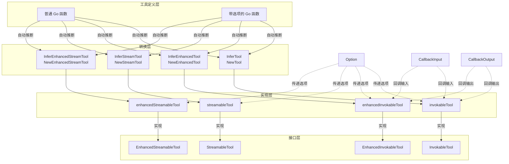

# tool_options_and_utilities 模块深度解析

## 概述

`tool_options_and_utilities` 模块是整个工具生态系统的"基础设施建设者"和"适配器"。它解决的核心问题是：如何让开发者以最小的代价将普通 Go 函数转换为符合系统接口规范的工具，同时保持灵活性和可扩展性。

想象一下这个场景：你有一个处理数据的 Go 函数，你希望它能被 AI 模型调用，或者在工作流中使用。但是系统要求工具必须实现特定的接口，处理 JSON 序列化/反序列化，支持流式输出，还要能传递自定义选项。这个模块就是为了解决这个"适配"问题而存在的——它就像一个万能插头转换器，让你的普通函数能够无缝接入整个系统。

## 架构概览



这个架构展示了模块的核心工作流程：
1. **工具定义层**：开发者提供普通的 Go 函数，这些函数可以是同步的、异步的、带选项的或不带选项的。
2. **转换层**：使用 `Infer*` 或 `New*` 系列函数，自动将普通函数转换为工具实现。
3. **实现层**：内部的结构体（如 `invokableTool`）实现了具体的工具逻辑，包括参数解析、函数调用、结果序列化等。
4. **接口层**：实现了系统定义的工具接口，使得这些工具可以在整个系统中被统一调用。

模块由三个主要部分组成：
1. **选项系统**（`option.go`）：提供了一个类型安全的方式来传递工具特定的选项，同时保持接口的统一性
2. **回调系统**（`callback_extra.go`）：定义了工具执行前后回调的数据结构和转换函数
3. **工具创建系统**（`create_options.go`, `invokable_func.go`, `streamable_func.go`）：核心是一组工厂函数，能够从普通 Go 函数创建符合框架接口的工具组件

## 核心设计理念

### 1. 类型安全与反射的平衡

这个模块的一个核心设计决策是如何在保持类型安全的同时提供灵活性。解决方案是：**使用泛型在编译时保证类型安全，使用反射在运行时推断 JSON Schema**。

例如，`InferTool` 函数使用泛型参数 `T` 和 `D` 来确保输入和输出类型的正确性，同时在内部使用反射来从 Go 结构体推断 JSON Schema。这种设计既避免了手动编写 Schema 的繁琐，又保证了类型安全。

### 2. 统一的选项传递机制

模块设计了 `Option` 结构体作为统一的选项传递机制。这个设计的巧妙之处在于：
- 它使用类型擦除（`any`）来隐藏实现细节
- 提供了 `WrapImplSpecificOptFn` 和 `GetImplSpecificOptions` 函数来进行类型安全的包装和提取
- 这种设计使得工具可以定义自己的选项类型，而不需要修改接口定义

### 3. 分层的工具能力

模块提供了四种不同的工具类型，形成了一个能力层次：
1. **InvokableTool**：基础的同步工具，输入输出都是 JSON 字符串
2. **EnhancedInvokableTool**：增强的同步工具，输出是结构化的 `ToolResult`
3. **StreamableTool**：基础的流式工具，输出是字符串流
4. **EnhancedStreamableTool**：增强的流式工具，输出是结构化的 `ToolResult` 流

这种分层设计使得开发者可以根据需要选择合适的工具类型，而不需要一次性实现所有功能。

## 核心设计决策

### 1. 类型擦除的选项系统

**设计选择**：使用 `any` 类型存储实现特定的选项函数，而不是使用接口或泛型

**权衡分析**：
- ✅ **优点**：保持了工具接口的简洁性，所有工具都接受相同的 `...tool.Option` 参数
- ✅ **优点**：允许每个工具定义自己的选项结构体，无需遵循统一的选项接口
- ❌ **缺点**：失去了编译时类型检查，错误的选项类型只会在运行时被发现
- ❌ **缺点**：需要工具作者正确使用 `WrapImplSpecificOptFn` 和 `GetImplSpecificOptions`

**为什么这样设计**：框架需要支持各种不同的工具，每个工具可能有完全不同的配置需求。如果为每个工具定义不同的选项接口，会导致接口爆炸。通过类型擦除，我们在保持接口统一的同时，给予了工具实现者最大的灵活性。

### 2. 推断式工具创建

**设计选择**：提供 `InferTool` 等函数，通过反射从 Go 函数的参数类型推断工具的 JSON Schema

**权衡分析**：
- ✅ **优点**：极大地简化了工具创建过程，开发者只需关注业务逻辑
- ✅ **优点**：保持了 Go 结构体和 JSON Schema 的一致性，减少了维护成本
- ❌ **缺点**：反射带来了一定的运行时开销（虽然在工具创建时只执行一次）
- ❌ **缺点**：对于复杂的结构体，可能需要自定义 SchemaModifier 来处理特殊情况

**为什么这样设计**：这是一个典型的" Convention over Configuration"（约定优于配置）的设计。大多数工具的参数都是简单的结构体，通过反射可以满足 80% 的使用场景，而对于剩余的 20%，提供了 `WithSchemaModifier` 作为逃生舱。

### 3. 四种工具变体

**设计选择**：提供了四种工具类型：普通可调用、普通流式、增强可调用、增强流式

**权衡分析**：
- ✅ **优点**：满足了不同场景的需求，从简单的字符串输入输出到复杂的多模态结果
- ✅ **优点**：通过"增强"版本提供了逐步升级的路径
- ❌ **缺点**：增加了模块的复杂度，新使用者可能需要时间理解四种类型的区别
- ❌ **缺点**：代码中有一定的重复（虽然通过工厂函数减少了重复）

**为什么这样设计**：工具的使用场景差异很大。有些工具只需要返回简单的文本，有些需要返回结构化数据，还有些需要流式输出。通过提供这四种变体，框架可以在简单性和功能丰富性之间取得平衡。

## 数据流程

让我们以一个普通的 Go 函数转换为 `InvokableTool` 并被调用的完整流程为例：

### 1. 工具创建阶段
```
开发者函数 → InferTool → goStruct2ToolInfo → invokableTool 实例
```

### 2. 工具调用阶段
```
JSON 参数字符串 → invokableTool.InvokableRun
  ↓
参数反序列化（使用自定义函数或默认的 JSON 反序列化）
  ↓
调用封装的 Go 函数
  ↓
结果序列化（使用自定义函数或默认的 JSON 序列化）
  ↓
返回 JSON 结果字符串
```

### 3. 选项传递流程
```
工具使用者 → WithXxx 选项函数 → WrapImplSpecificOptFn → Option 实例
  ↓
传递给 InvokableRun
  ↓
工具实现 → GetImplSpecificOptions → 提取自定义选项
```

### 工具执行流程（可调用工具）

```
InvokableRun(arguments, opts...) 
    ↓
[可选] 自定义 UnmarshalArguments → 反序列化 arguments
    ↓
默认 sonic.UnmarshalString → 反序列化到结构体 T
    ↓
调用用户函数 Fn(ctx, inst, opts...)
    ↓
[可选] 自定义 MarshalOutput → 序列化输出
    ↓
默认 marshalString → 序列化为 JSON 字符串
    ↓
返回 output
```

### 工具执行流程（流式工具）

```
StreamableRun(arguments, opts...)
    ↓
[可选] 自定义 UnmarshalArguments → 反序列化 arguments
    ↓
默认 sonic.UnmarshalString → 反序列化到结构体 T
    ↓
调用用户函数 Fn(ctx, inst, opts...) → 获取 schema.StreamReader[D]
    ↓
使用 schema.StreamReaderWithConvert 包装
    ↓
对每个 D：
    [可选] 自定义 MarshalOutput → 序列化
    默认 marshalString → 序列化为 JSON
    ↓
返回 schema.StreamReader[string]
```

## 核心组件详解

### Option 结构体

`Option` 是模块的基础构件之一，它的作用是提供一个统一的方式来传递工具特定的选项。

**设计意图**：
- 解决"如何在不修改接口的情况下让工具支持自定义选项"的问题
- 通过类型擦除隐藏实现细节，保持接口的简洁性
- 通过类型安全的包装和提取函数，确保运行时类型正确性

```go
type Option struct {
    implSpecificOptFn any
}
```

**工作原理**：
- 工具作者定义自己的选项结构体（如 `customOptions`）
- 使用 `WrapImplSpecificOptFn` 将修改该结构体的函数包装为 `Option`
- 在工具实现内部，使用 `GetImplSpecificOptions` 提取并应用这些选项

**使用模式**：
```go
// 工具作者定义选项
type customOptions struct {
    conf string
}

// 提供选项函数
func WithConf(conf string) tool.Option {
    return tool.WrapImplSpecificOptFn(func(o *customOptions) {
        o.conf = conf
    })
}

// 在工具实现中使用
func (t *myTool) InvokableRun(ctx context.Context, args string, opts ...tool.Option) (string, error) {
    // 提取选项，提供默认值
    defaultOpts := &customOptions{conf: "default"}
    customOpts := tool.GetImplSpecificOptions(defaultOpts, opts...)
    
    // 使用 customOpts.conf...
}
```

### invokableTool 结构体

`invokableTool` 是最基础的工具实现，它封装了一个普通的 Go 函数，处理参数解析、函数调用和结果序列化。

**内部工作流程**：
1. **参数解析**：将 JSON 字符串参数反序列化为类型 `T` 的实例
2. **函数调用**：调用封装的 Go 函数，传入解析后的参数和选项
3. **结果序列化**：将函数返回的结果序列化为 JSON 字符串

**设计亮点**：
- 支持自定义的参数反序列化和结果序列化函数
- 使用泛型确保类型安全
- 提供详细的错误信息，包括工具名称，便于调试

### enhancedInvokableTool 结构体

`enhancedInvokableTool` 是 `invokableTool` 的增强版本，它的输出是结构化的 `ToolResult` 而不是简单的 JSON 字符串。

**设计意图**：
- 支持多模态输出（文本、图像、音频、视频等）
- 提供更丰富的元数据信息
- 与系统的其他部分（如回调系统）更好地集成

### streamableTool 和 enhancedStreamableTool 结构体

这两个结构体实现了流式工具的功能，它们的核心特点是：
- 输出是一个流，而不是单个值
- 支持实时处理和增量输出
- 与系统的流处理机制无缝集成

**设计亮点**：
- 使用 `schema.StreamReader` 来封装流，提供统一的流处理接口
- 支持自定义的流元素转换函数
- 保持与同步工具相似的 API 设计，降低学习成本

### CallbackInput 和 CallbackOutput

这两个结构体定义了工具回调系统的数据结构。

**CallbackInput 包含**：
- `ArgumentsInJSON`：JSON 格式的工具参数
- `Extra`：额外的信息，可以传递任意数据

**CallbackOutput 包含**：
- `Response`：工具的字符串响应
- `ToolOutput`：结构化的工具输出（用于多模态）
- `Extra`：额外的信息

**转换函数**：
- `ConvCallbackInput`：将通用的 `callbacks.CallbackInput` 转换为工具特定的输入
- `ConvCallbackOutput`：将通用的 `callbacks.CallbackOutput` 转换为工具特定的输出

## 使用指南

### 创建一个简单的可调用工具

```go
// 1. 定义输入结构体
type WeatherInput struct {
    City string `json:"city" desc:"城市名称"`
}

// 2. 定义输出结构体
type WeatherOutput struct {
    Temperature float64 `json:"temperature"`
    Condition   string  `json:"condition"`
}

// 3. 定义业务函数
func GetWeather(ctx context.Context, input WeatherInput) (WeatherOutput, error) {
    // 业务逻辑...
    return WeatherOutput{
        Temperature: 25.5,
        Condition:   "晴天",
    }, nil
}

// 4. 创建工具
tool, err := utils.InferTool("get_weather", "获取天气信息", GetWeather)
if err != nil {
    // 处理错误
}
```

### 创建带自定义选项的工具

```go
// 1. 定义选项结构体
type WeatherOptions struct {
    Unit string // "celsius" 或 "fahrenheit"
    APIKey string
}

// 2. 提供选项函数
func WithUnit(unit string) tool.Option {
    return tool.WrapImplSpecificOptFn(func(o *WeatherOptions) {
        o.Unit = unit
    })
}

func WithAPIKey(key string) tool.Option {
    return tool.WrapImplSpecificOptFn(func(o *WeatherOptions) {
        o.APIKey = key
    })
}

// 3. 定义带选项的业务函数
func GetWeatherWithOpts(ctx context.Context, input WeatherInput, opts ...tool.Option) (WeatherOutput, error) {
    // 提取选项
    defaultOpts := &WeatherOptions{Unit: "celsius"}
    weatherOpts := tool.GetImplSpecificOptions(defaultOpts, opts...)
    
    // 使用 weatherOpts.APIKey 和 weatherOpts.Unit...
}

// 4. 创建工具
tool, err := utils.InferOptionableTool("get_weather", "获取天气信息", GetWeatherWithOpts)
```

### 创建增强工具（支持多模态输出）

```go
// 1. 定义增强业务函数
func GetWeatherEnhanced(ctx context.Context, input WeatherInput) (*schema.ToolResult, error) {
    // 业务逻辑...
    
    // 返回多模态结果
    return &schema.ToolResult{
        ToolName: "get_weather",
        Content: []schema.ToolOutputPart{
            {
                Type: "text",
                Text: "天气信息：晴天，25.5°C",
            },
            {
                Type: "image",
                Image: &schema.ToolOutputImage{
                    URL: "https://example.com/weather-icon.png",
                },
            },
        },
    }, nil
}

// 2. 创建增强工具
tool, err := utils.InferEnhancedTool("get_weather", "获取天气信息", GetWeatherEnhanced)
```

### 创建流式工具

```go
// 1. 定义流式业务函数
func StreamWeatherUpdates(ctx context.Context, input WeatherInput) (*schema.StreamReader[WeatherOutput], error) {
    // 创建流
    reader, writer := schema.NewStreamReader[WeatherOutput]()
    
    // 在 goroutine 中发送数据
    go func() {
        defer writer.Close()
        
        // 发送多个更新
        updates := []WeatherOutput{
            {Temperature: 25.5, Condition: "晴天"},
            {Temperature: 26.0, Condition: "多云"},
            {Temperature: 24.5, Condition: "小雨"},
        }
        
        for _, update := range updates {
            select {
            case <-ctx.Done():
                return
            case writer.Chan() <- update:
            }
        }
    }()
    
    return reader, nil
}

// 2. 创建流式工具
tool, err := utils.InferStreamTool("stream_weather", "流式获取天气更新", StreamWeatherUpdates)
```

## 使用指南与注意事项

### 最佳实践

1. **优先使用 `Infer*` 系列函数**：它们可以自动推断 Schema，减少手动工作。
2. **为工具提供有意义的名称和描述**：这对于 AI 模型理解和使用工具非常重要。
3. **使用自定义选项时，提供默认值**：在 `GetImplSpecificOptions` 中传入一个带有默认值的基础选项结构体。
4. **妥善处理错误**：在工具函数中返回有意义的错误信息，模块会将这些信息传递给调用者。

### 常见陷阱

1. **忘记处理选项**：如果你的工具支持选项，记得在 `InvokableRun` 或 `StreamableRun` 中调用 `GetImplSpecificOptions` 来提取选项。
2. **结构体标签不完整**：`Infer*` 函数依赖 Go 结构体的标签来推断 JSON Schema，确保你的结构体有完整的标签。
3. **流式工具的阻塞问题**：在流式工具中，确保你的函数不会阻塞太久，否则会影响整个系统的响应性。
4. **类型转换错误**：在使用自定义的反序列化函数时，确保返回的值类型正确，否则会导致运行时错误。

### 扩展点

1. **自定义 Schema 推断**：使用 `WithSchemaModifier` 选项来定制 Schema 推断过程。
2. **自定义序列化/反序列化**：使用 `WithMarshalOutput` 和 `WithUnmarshalArguments` 选项来定制序列化和反序列化过程。
3. **自定义选项类型**：定义自己的选项类型，并使用 `WrapImplSpecificOptFn` 来包装选项函数。

## 新贡献者注意事项

### 1. 选项类型安全

虽然选项系统提供了灵活性，但也失去了编译时类型检查。**务必**在工具实现中正确使用 `GetImplSpecificOptions`，并提供合理的默认值。

### 2. Schema 推断的限制

`InferTool` 使用 `github.com/eino-contrib/jsonschema` 库来推断 JSON Schema。对于复杂的结构体，可能需要使用 `WithSchemaModifier` 来自定义 schema 生成过程。

特别是：
- 递归结构体可能导致无限循环
- 某些 Go 类型（如 `interface{}`）可能无法正确推断
- 自定义验证规则需要通过 SchemaModifier 添加

### 3. 流式工具的资源管理

流式工具返回的 `schema.StreamReader` 需要正确管理资源。确保：
- 在流结束时调用 `Close()`
- 处理 context 取消，避免 goroutine 泄漏
- 不要在流关闭后继续发送数据

### 4. 错误信息的重要性

本模块提供的错误信息都包含了工具名称，这对调试非常重要。在自定义序列化/反序列化函数时，也应该遵循这个模式。

### 5. 增强工具 vs 普通工具

选择使用增强工具还是普通工具的关键因素：
- 如果只需要返回字符串，使用普通工具
- 如果需要返回结构化数据、多模态内容，或者需要更精确的控制，使用增强工具

## 与其他模块的关系

- **[Component Interfaces](component_interfaces.md)**：本模块实现了 `tool` 包中定义的接口（`InvokableTool`, `StreamableTool`, `EnhancedInvokableTool`, `EnhancedStreamableTool`）
- **[Schema Core Types](schema_core_types.md)**：依赖 `schema` 包中的 `ToolInfo`, `ToolResult`, `ToolArgument`, `StreamReader` 等类型
- **[Callbacks System](callbacks_system.md)**：通过 `CallbackInput` 和 `CallbackOutput` 与回调系统集成
- **[Compose Tool Node](compose_tool_node.md)**：本模块创建的工具可以被 Compose Tool Node 使用

## 总结

`tool_options_and_utilities` 模块是一个精心设计的工具适配器，它解决了"如何让普通 Go 函数无缝接入系统"的问题。通过使用泛型、反射、类型擦除等技术，它在保持类型安全的同时提供了极大的灵活性。

这个模块的设计哲学可以总结为：**"让简单的事情保持简单，让复杂的事情成为可能"**。对于大多数场景，开发者只需要使用 `InferTool` 等函数就可以快速创建工具；而对于特殊场景，模块也提供了足够的扩展点来满足需求。

作为一个新加入团队的开发者，理解这个模块的设计理念和工作原理将帮助你更好地使用和扩展整个系统的工具生态。
