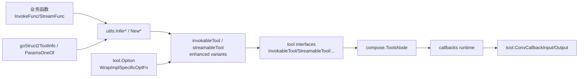

# tool_options_callback_and_function_adapters

`tool_options_callback_and_function_adapters` 这个模块本质上是在做一件“胶水层”工作：把**业务开发者写的普通 Go 函数**，稳定地接入到 Eino 的工具执行生态里（工具接口、JSON 入参/出参、回调系统、流式输出、多模态输出、运行时 option）。如果没有这层，团队会在每个工具里反复手写“JSON 解析 + schema 描述 + callback 适配 + 选项透传”的样板代码，既容易不一致，也容易在演进时产生隐形兼容问题。

---

## 这个模块解决了什么问题（先讲问题空间）

在 Eino 里，工具调用有几个天然张力：

第一，模型侧和编排侧（如 `ToolsNode`）希望看到的是统一接口：例如 `tool.InvokableTool` 的 `InvokableRun(ctx, argumentsInJSON string, opts ...tool.Option)`，或者流式、增强版的对应接口。但业务侧最自然的写法是 `func(ctx, typedInput) (typedOutput, error)`，甚至想直接返回 `*schema.ToolResult`。这两边的函数签名并不一致。

第二，工具参数 schema 需要给模型（`schema.ToolInfo` / `schema.ParamsOneOf`），而业务函数输入通常是 Go struct。手写 schema 成本高且容易偏离 struct 实际字段。

第三，框架层（callbacks）使用统一的 `callbacks.CallbackInput` / `callbacks.CallbackOutput`，但工具领域需要更语义化的数据结构（如 `tool.CallbackInput.ArgumentsInJSON`，`tool.CallbackOutput.ToolOutput`）。需要一个安全的“翻译器”。

第四，工具作者希望有实现特定的调用选项，但框架调用链只认识统一的 `tool.Option`。需要在“统一入口”和“实现私有配置”之间做类型桥接。

这个模块的设计洞察是：**把“函数适配、schema 推断、option 桥接、callback 语义映射”抽成稳定中间层**，让业务开发者只写核心逻辑，让框架拿到统一契约。

可以把它想象成机场里的“国际转机层”：不同国家（业务函数风格）来的乘客，先经过统一转机流程（解析、校验、映射），再进入统一登机口（tool interfaces / compose / callbacks）。

---

## 架构角色与数据流



从调用链看，最热路径通常是：`compose.ToolsNode` 在执行工具时调用 `InvokableRun` / `StreamableRun`；而这背后是 `invokableTool` / `streamableTool` 在做入参反序列化、函数执行、出参序列化。`ToolsNode` 中的 `wrapToolCall`、`wrapStreamToolCall`、`wrapEnhancedInvokableToolCall`、`wrapEnhancedStreamableToolCall` 会把原始工具包装成 endpoint，并在需要时包上一层 callback wrapper（如 `invokableToolWithCallback`），最终走到 `invokeWithCallbacks`/`streamWithCallbacks` 这类统一 callback 入口。

此外，`utils/callbacks/template.handlerTemplate` 在 `components.ComponentOfTool` 分支里调用 `tool.ConvCallbackInput` / `tool.ConvCallbackOutput`，把通用 callback 载荷转成工具语义对象，供 `ToolCallbackHandler` 使用。

---

## 心智模型：四层适配器

理解这个模块最有用的方式，是把它分成四层：

1. **契约层（Option + Callback DTO）**：`components/tool/option.go` 与 `components/tool/callback_extra.go`。
2. **构建层（create_options）**：把可选行为（自定义反序列化/序列化/schema 修改）组合成 `toolOptions`。
3. **执行适配层（invokable_func / streamable_func）**：把 typed function 包装成 `tool.*Tool` 接口实现。
4. **生态接入层（compose/callbacks）**：由其他模块调用本模块产物，实现图执行、回调、流式拼接等。

这四层是“由内到外”的：越内层越稳定、越外层越靠近运行时场景。

---

## 组件深潜

## 1) `components.tool.option.Option`：统一 option 外壳

`Option` 只有一个字段：`implSpecificOptFn any`。这是一个刻意的“弱类型壳”，用来承载具体实现定义的 `func(*T)`。

`WrapImplSpecificOptFn[T any](optFn func(*T)) Option` 负责把工具私有 option 函数装进统一 `Option`。`GetImplSpecificOptions[T any](base *T, opts ...Option) *T` 则在工具实现内部把同类型 option 提取出来并应用到 `base`。

设计上它牺牲了编译期强约束（内部 `any` + 运行时断言），换来跨工具统一入口。关键行为是：

- 类型不匹配的 option 会被静默忽略（`type assertion` 失败即跳过）；
- `base == nil` 时自动 `new(T)`；
- 推荐通过 `base` 提供默认值，再由 option 覆盖。

这解释了为什么测试和示例里都先构造默认配置再 `GetImplSpecificOptions(...)`。

## 2) `components.tool.callback_extra.CallbackInput` / `CallbackOutput`：callback 语义翻译层

`CallbackInput` 关注工具调用入参：`ArgumentsInJSON` + `Extra`；`CallbackOutput` 同时支持字符串输出（`Response`）和结构化多模态输出（`ToolOutput *schema.ToolResult`），外加 `Extra`。

`ConvCallbackInput` 支持三种输入：

- `*CallbackInput`（已是目标类型，直接返回）；
- `string`（视为 JSON 参数字符串）；
- `*schema.ToolArgument`（取其 `Text`）。

`ConvCallbackOutput` 对应支持：

- `*CallbackOutput`；
- `string`（写入 `Response`）；
- `*schema.ToolResult`（写入 `ToolOutput`）。

无法识别则返回 `nil`。这是一种“宽进严出”的策略：兼容多个上游形态，但不做猜测性转换。

## 3) `components.tool.utils.create_options.toolOptions`：构建时可插拔行为

`toolOptions` 是内部配置聚合：

- `um UnmarshalArguments`：自定义参数反序列化；
- `m MarshalOutput`：自定义输出序列化；
- `scModifier SchemaModifierFn`：自定义 schema 推断修饰。

公开入口是 `WithUnmarshalArguments`、`WithMarshalOutput`、`WithSchemaModifier`，最终由 `getToolOptions` 汇总。

这里的设计重点是“只允许少数关键扩展点”：它没有开放任意生命周期 hook，而只开放**参数、输出、schema**三个高影响点，既足够灵活，又避免适配器复杂度失控。

## 4) `invokable_func.go`：同步工具适配核心

这部分最关键的公开工厂包括：

- `InferTool` / `InferOptionableTool`
- `InferEnhancedTool` / `InferOptionableEnhancedTool`
- `GoStruct2ParamsOneOf` / `GoStruct2ToolInfo`
- `NewTool` / `NewEnhancedTool`

### schema 推断链路

`goStruct2ParamsOneOf` 使用 `jsonschema.Reflector`：

- `Anonymous: true`
- `DoNotReference: true`
- `SchemaModifier: jsonschema.SchemaModifierFn(options.scModifier)`

然后 `r.Reflect(generic.NewInstance[T]())` 得到 JSON Schema，清空 `Version` 后通过 `schema.NewParamsOneOfByJSONSchema` 进入 Eino schema 体系。`goStruct2ToolInfo` 再把 name/desc + params 组合为 `*schema.ToolInfo`。

### 执行链路（`invokableTool.InvokableRun`）

`InvokableRun` 的步骤非常稳定：

1. 反序列化 arguments：优先 `um`，否则 `sonic.UnmarshalString`。
2. 调用业务函数 `Fn(ctx, inst, opts...)`。
3. 序列化输出：优先 `m`，否则 `marshalString`（字符串直接透传，其他类型 JSON 序列化）。
4. 错误统一包裹并带 toolName 前缀。

增强版 `enhancedInvokableTool.InvokableRun` 类似，但入参是 `*schema.ToolArgument`，输出是 `*schema.ToolResult`，不再做字符串序列化。

`GetType()` 统一基于 `snakeToCamel(getToolName())`，用于类型标识。

## 5) `streamable_func.go`：流式工具适配核心

与 invokable 对称，公开工厂包括：

- `InferStreamTool` / `InferOptionableStreamTool`
- `InferEnhancedStreamTool` / `InferOptionableEnhancedStreamTool`
- `NewStreamTool` / `NewEnhancedStreamTool`

普通流式工具 `streamableTool.StreamableRun`：

- 先解析 `argumentsInJSON -> T`；
- 调用 `Fn` 得到 `*schema.StreamReader[D]`；
- 用 `schema.StreamReaderWithConvert` 把每个 `D` 转成 `string`（`m` 或默认 JSON）。

增强流式工具 `enhancedStreamableTool.StreamableRun`：

- 入参 `*schema.ToolArgument`；
- 输出 `*schema.StreamReader[*schema.ToolResult]`；
- 不做字符串转换，直接透传结构化帧。

这套分层让“文本流”和“多模态流”各自保持清晰契约，避免在同一接口里混入判别逻辑。

---

## 依赖关系分析（调用谁、被谁调用、契约是什么）

本模块主要调用：

- `github.com/bytedance/sonic`：默认 JSON 反序列化/序列化。
- `github.com/eino-contrib/jsonschema`：从 Go struct 推断 JSON Schema。
- `github.com/cloudwego/eino/internal/generic.NewInstance`：泛型实例化。
- `github.com/cloudwego/eino/schema`：`ToolInfo`、`ParamsOneOf`、`ToolArgument`、`ToolResult`、`StreamReader`。
- `github.com/cloudwego/eino/callbacks`：callback 通用输入输出类型（在 `callback_extra.go` 中做转换）。

本模块的产物被上游关键消费方使用：

- [Compose Tool Node](compose_tool_node.md)：`ToolsNode` 依赖 `tool.InvokableTool` / `tool.StreamableTool` / 增强版接口，并在 `convTools`、`wrap*ToolCall` 里执行。
- [Callbacks System](callbacks_system.md) 与 `utils/callbacks/template.go`：通过 `tool.ConvCallbackInput/Output` 将通用 callback 数据翻译到工具域。

数据契约关键点：

- 普通工具：输入是 JSON 字符串，输出是字符串（通常 JSON 字符串）。
- 增强工具：输入是 `*schema.ToolArgument`（内部取 `Text`），输出是 `*schema.ToolResult`。
- 流式普通工具：`StreamReader[string]`；流式增强工具：`StreamReader[*schema.ToolResult]`。
- `tool.Option` 会沿 compose 调用链透传到最终函数。

---

## 设计取舍与背后的理由

### 1) `any`-based option 容器 vs 强类型 option

当前选择是统一 `tool.Option` 包装 `any`，在工具实现处做类型断言提取。它降低了跨模块接口复杂度，允许不同工具自由扩展 option 类型；代价是错误 option 不会在编译期报错，运行时也可能被静默忽略。

在一个插件化工具生态里，这个权衡是合理的：接口稳定性优先于极致静态约束。

### 2) 默认 JSON + 可覆盖 serializer/unmarshaller

默认路径使用 `sonic`，简单高效；当用户有非标准编码需求时，用 `WithUnmarshalArguments` / `WithMarshalOutput` 覆盖。这是“默认快路径 + 明确逃生口”的经典设计。

### 3) 普通工具与增强工具分离，而非单接口 union

普通与增强在输出语义上差异很大（string vs multimodal `ToolResult`）。拆成独立接口避免了到处做类型分支，也让 `ToolsNode` 可以明确选择 `useEnhanced` 路径。

### 4) schema 自动推断 vs 手工定义

`Infer*` 大幅降低接入成本，尤其适合“函数即工具”的开发体验；但自动推断始终受 struct tag 表达力限制，因此提供 `WithSchemaModifier` 作为补偿。

---

## 使用方式与常见模式

### 模式 A：最小接入（自动 schema + 默认 JSON）

```go
func Search(ctx context.Context, in SearchInput) (SearchOutput, error) {
    // business logic
}

tl, err := utils.InferTool("search_user", "search user info", Search)
```

### 模式 B：需要运行时 option

```go
type MyOpt struct { TimeoutMs int }

func WithTimeoutMs(v int) tool.Option {
    return tool.WrapImplSpecificOptFn(func(o *MyOpt) { o.TimeoutMs = v })
}

func SearchWithOpt(ctx context.Context, in SearchInput, opts ...tool.Option) (SearchOutput, error) {
    conf := tool.GetImplSpecificOptions(&MyOpt{TimeoutMs: 1000}, opts...)
    _ = conf
    // business logic
}

tl, err := utils.InferOptionableTool("search_user", "search user info", SearchWithOpt)
```

### 模式 C：增强工具（多模态输出）

```go
func Run(ctx context.Context, in Input) (*schema.ToolResult, error) {
    return &schema.ToolResult{ /* Parts... */ }, nil
}

tl, err := utils.InferEnhancedTool("enhanced_tool", "desc", Run)
```

### 模式 D：自定义参数解析或输出编码

```go
tl, err := utils.InferTool("x", "desc", fn,
    utils.WithUnmarshalArguments(customUM),
    utils.WithMarshalOutput(customM),
)
```

---

## 新贡献者最需要注意的坑

第一，`GetImplSpecificOptions` 对类型不匹配 option 是“忽略”而不是报错。调试时如果发现 option 不生效，优先检查 `WrapImplSpecificOptFn` 的泛型类型与提取时 `T` 是否一致。

第二，`WithUnmarshalArguments` 返回值必须能断言为目标 `T`，否则会触发 `invalid type` 错误（`invokableTool` / `streamableTool` / 增强版都一样）。

第三，字符串输入在 JSON 语义下要注意引号。测试里有典型例子：对 `string` 输入，`InvokableRun(ctx, `100`)` 会失败，而 `InvokableRun(ctx, `"100"`)` 才是合法 JSON string。

第四，`GetType()` 依赖 `snakeToCamel` 和 `ToolInfo.Name`。如果 `info` 或 `name` 为空，类型字符串可能为空，影响依赖该标识的上游逻辑。

第五，callback 转换函数 `ConvCallbackInput/Output` 遇到不支持类型会返回 `nil`，调用方需要做空值防御（模板 handler 已按组件类型路由，但自定义代码要注意）。

第六，普通流式工具中每帧都会做一次 `D -> string` 转换；若 `MarshalOutput` 很重，可能成为热点，建议在自定义 `m` 中控制开销。

---

## 与其他模块的关系（避免重复阅读）

如果你要继续追踪工具在运行时如何被执行与回调，建议继续读：

- [Compose Tool Node](compose_tool_node.md)：工具如何被选择、并行/串行执行、以及 invokable/streamable 互转。
- [Callbacks System](callbacks_system.md)：回调触发时机、Handler 装配与上下文传播。
- [model_options_and_callback_extras](model_options_and_callback_extras.md)：对比模型组件的 option/callback 设计，理解跨组件一致性。

这份文档专注于“工具适配层”；执行编排与全局回调机制在上述模块里更完整。
