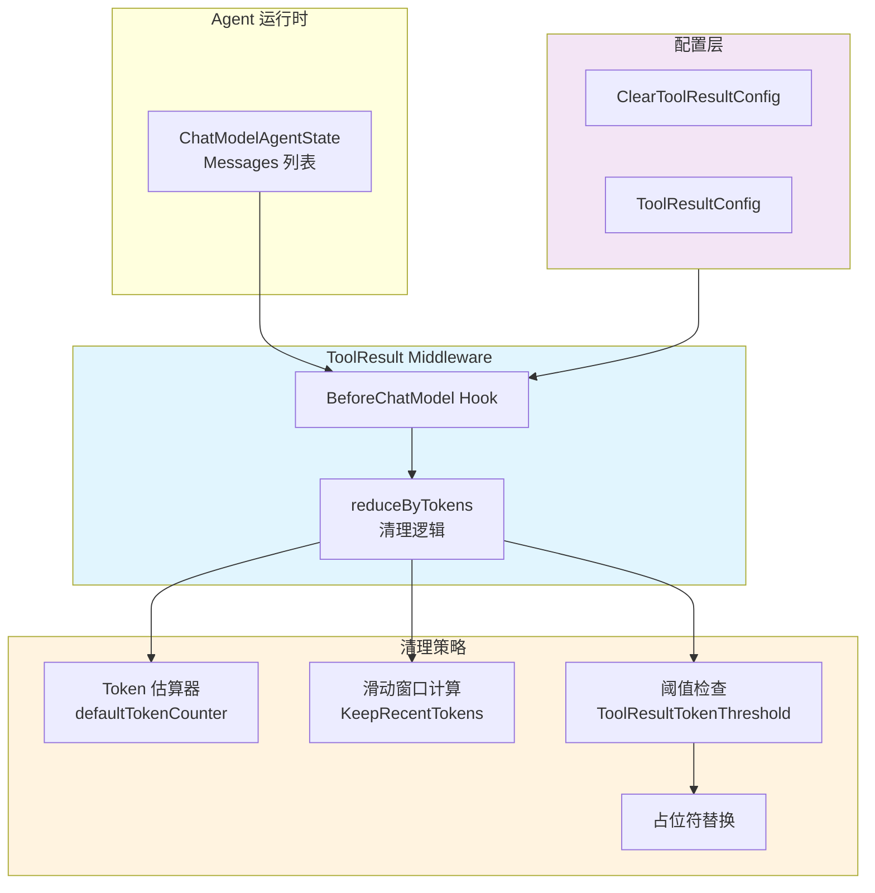

# Tool Result Clearing 模块深度解析

## 一、模块存在的意义：为什么需要清理工具结果？

想象你正在和一个 AI 助手进行多轮对话，这个助手可以调用各种工具来获取信息、执行操作。每一轮工具调用都会产生一个**工具结果（Tool Result）**，这些结果会被追加到对话历史中，供后续对话参考。

这听起来很合理，但很快就会遇到一个棘手的问题：**上下文窗口爆炸**。

### 问题空间

在一个典型的 Agent 工作流中，工具调用的频率可能非常高：
- 文件读取工具可能返回数千行的代码
- 搜索工具可能返回大量搜索结果
- 代码执行工具可能产生冗长的输出日志

如果不加控制，这些工具结果会迅速累积，导致：
1. **Token 消耗失控**：每次请求都携带大量历史工具结果，API 成本急剧上升
2. **上下文窗口溢出**：超过模型的最大 token 限制，请求直接失败
3. **注意力稀释**：过多的历史信息可能干扰模型对当前任务的专注

### 为什么简单的"截断"策略不够？

最直观的解决方案是：当上下文太长时，从头部开始删除旧消息。但这种 naive 的做法有几个致命问题：

1. **破坏对话连贯性**：直接删除可能切断重要的上下文依赖链
2. **丢失关键信息**：某些早期工具结果可能对后续推理仍然重要
3. **无法区分优先级**：用户消息、助手回复、工具结果的价值不同，应该区别对待

### 设计洞察

`tool_result_clearing` 模块的核心设计洞察是：**工具结果的价值随时间衰减，但近期上下文必须完整保留**。

这个模块采用了两层策略：
1. **滑动窗口保护**：从对话末尾向前计算 token 预算，确保最近的交互完整保留
2. **选择性清理**：只清理保护窗口之外的工具结果，用占位符替代其内容

这种设计在"保留必要上下文"和"控制 token 消耗"之间找到了一个实用的平衡点。

---

## 二、架构概览



### 架构角色定位

这个模块在整体架构中扮演**上下文优化器**的角色：

- **上游**：接收来自 [`ChatModelAgent`](adk_chatmodel_agent.md) 的对话状态（包含完整消息历史）
- **下游**：将优化后的消息列表传递给实际的 ChatModel 进行推理
- **触发时机**：每次调用模型之前（`BeforeChatModel` hook）

### 数据流 walkthrough

让我们追踪一次典型的清理操作：

1. **Agent 准备调用模型**：`ChatModelAgent` 收集当前所有消息到 `state.Messages`
2. **中间件拦截**：`BeforeChatModel` hook 被触发，`newClearToolResult` 返回的函数执行
3. **阈值检查**：遍历所有工具消息，累加 token 数，判断是否超过 `ToolResultTokenThreshold`
4. **窗口计算**：从消息列表末尾向前遍历，计算 `KeepRecentTokens` 预算内的起始索引
5. **选择性清理**：将保护窗口之外的工具结果内容替换为占位符
6. **继续执行**：优化后的消息列表传递给下游模型

---

## 三、核心组件深度解析

### 3.1 ClearToolResultConfig

**设计目的**：将清理策略的所有可调参数封装在一个配置结构中，使行为可预测、可测试、可复用。

```go
type ClearToolResultConfig struct {
    ToolResultTokenThreshold   int  // 工具结果总 token 阈值
    KeepRecentTokens           int  // 近期消息保护预算
    ClearToolResultPlaceholder string  // 占位符文本
    TokenCounter               func(msg *schema.Message) int  // 自定义 token 估算器
    ExcludeTools               []string  // 排除清理的工具名单
}
```

#### 参数设计 reasoning

| 参数 | 默认值 | 设计考量 |
|------|--------|----------|
| `ToolResultTokenThreshold` | 20000 | 平衡点：足够容纳多次工具调用，但不会耗尽典型上下文窗口 |
| `KeepRecentTokens` | 40000 | 通常是阈值的 2 倍，确保近期交互的完整性优先于工具结果清理 |
| `ClearToolResultPlaceholder` | `"[Old tool result content cleared]"` | 明确的语义提示，让模型知道内容被清理了，而不是丢失 |
| `TokenCounter` | `char_count / 4` | 简单启发式：避免依赖外部 tokenizers，降低耦合和延迟 |
| `ExcludeTools` | `[]` | 灵活性：允许保护特定关键工具的结果 |

#### 为什么使用启发式 token 估算而非精确计算？

这是一个典型的**性能 vs 精度**权衡：

```go
func defaultTokenCounter(msg *schema.Message) int {
    count := len(msg.Content)
    for _, tc := range msg.ToolCalls {
        count += len(tc.Function.Arguments)
    }
    return (count + 3) / 4  // 约 4 字符/token
}
```

**选择启发式的原因**：
1. **零依赖**：不需要加载 tokenizer 模型或调用外部 API
2. **低延迟**：O(n) 字符串长度计算，微秒级完成
3. **足够准确**：对于清理决策这种"软阈值"场景，±20% 的误差可接受
4. **语言无关**：不依赖特定语言的 tokenizer 规则

**代价**：对于特殊字符密集的内容（如代码、emoji），估算可能偏差较大。如果应用场景对精度要求高，可以通过 `TokenCounter` 注入自定义实现。

---

### 3.2 reduceByTokens —— 清理算法核心

这是整个模块的"大脑"，实现了滑动窗口保护 + 选择性清理的核心逻辑。

```go
func reduceByTokens(state *adk.ChatModelAgentState, 
                    toolResultTokenThreshold, keepRecentTokens int, 
                    placeholder string, 
                    counter func(*schema.Message) int, 
                    excludedTools []string) error
```

#### 算法流程分解

**阶段 1：总 token 统计**
```go
totalToolResultTokens := 0
for _, msg := range state.Messages {
    if msg.Role == schema.Tool && msg.Content != placeholder {
        totalToolResultTokens += counter(msg)
    }
}
```
- 只统计 `Tool` 角色的消息
- 跳过已经是占位符的消息（避免重复计算）
- 如果总和未超阈值，直接返回（fast path）

**阶段 2：滑动窗口计算**
```go
recentStartIdx := len(state.Messages)
cumulativeTokens := 0

for i := len(state.Messages) - 1; i >= 0; i-- {
    msgTokens := counter(state.Messages[i])
    if cumulativeTokens+msgTokens > keepRecentTokens {
        recentStartIdx = i
        break
    }
    cumulativeTokens += msgTokens
    recentStartIdx = i
}
```

这是算法的关键洞察：**从后向前累加，找到保护窗口的起始边界**。

```
消息索引：   0    1    2    3    4    5    6    7    8    9
            [---- 清理区域 ----][------- 保护区域 -------]
                              ↑
                         recentStartIdx
```

**阶段 3：选择性清理**
```go
for i := 0; i < recentStartIdx; i++ {
    msg := state.Messages[i]
    if msg.Role == schema.Tool && msg.Content != placeholder && !excluded(msg.ToolName, excludedTools) {
        msg.Content = placeholder
    }
}
```
- 只修改保护窗口**之前**的消息
- 只修改 `Tool` 角色的消息
- 尊重 `ExcludeTools` 配置

#### 原地修改 vs 创建副本

注意：`reduceByTokens` **直接修改** `state.Messages` 中的消息对象，而不是创建副本。

**设计理由**：
1. **性能**：避免深拷贝大消息列表的开销
2. **语义清晰**：中间件的目的就是修改状态，调用方预期此行为
3. **内存效率**：Agent 运行时在每次模型调用前都会创建新的 state 快照

**风险**：如果调用方在中间件执行后还需要原始消息，会观察到数据被修改。这是文档中应该明确说明的隐式契约。

---

### 3.3 ToolResultConfig —— 组合策略配置

`ToolResultConfig` 是新一代的配置结构，它将**清理**和**卸载（Offloading）**两种策略统一到一个配置中。

```go
type ToolResultConfig struct {
    // 清理相关参数（与 ClearToolResultConfig 相同）
    ClearingTokenThreshold   int
    KeepRecentTokens         int
    ClearToolResultPlaceholder string
    TokenCounter             func(msg *schema.Message) int
    ExcludeTools             []string
    
    // 卸载相关参数
    Backend              Backend  // 存储后端接口
    OffloadingTokenLimit int      // 单个工具结果的卸载阈值
    ReadFileToolName     string   // 读取工具的名称
    PathGenerator        func(ctx context.Context, input *compose.ToolInput) (string, error)
}
```

#### 为什么需要组合策略？

清理和卸载解决的是不同维度的问题：

| 策略 | 触发条件 | 处理方式 | 适用场景 |
|------|----------|----------|----------|
| **清理** | 所有工具结果**总和**超限 | 用占位符替换旧结果 | 控制整体上下文大小 |
| **卸载** | 单个工具结果**过大** | 写入文件，返回摘要 | 处理超大输出（如文件内容） |

组合后的 `NewToolResultMiddleware` 同时注册两个 hook：
- `BeforeChatModel` → 清理逻辑
- `WrapToolCall` → 卸载逻辑

这种设计体现了**关注点分离**：清理关注历史累积，卸载关注即时输出。

---

### 3.4 Backend 接口 —— 存储抽象

```go
type Backend interface {
    Write(context.Context, *filesystem.WriteRequest) error
}
```

这是一个极简的接口设计，只定义了 `Write` 方法。

**设计考量**：
1. **最小化耦合**：中间件不关心存储实现细节（本地文件、S3、数据库等）
2. **上下文传递**：`context.Context` 参数支持取消、超时、trace 等跨切面关注点
3. **扩展性**：未来可以添加 `Read`、`Delete` 等方法，但当前只需要写入

**隐式契约**：
- `WriteRequest` 中的路径必须是后续 `read_file` 工具可以访问的
- 写入应该是持久的（至少在当前 Agent 会话期间）
- 错误处理由实现方负责，中间件会捕获并记录

---

## 四、依赖关系分析

### 4.1 上游依赖（谁调用这个模块）

```
┌─────────────────────────────────────────────────────────┐
│  ChatModelAgent (adk.chatmodel.ChatModelAgent)         │
│  - 在每次模型调用前执行 BeforeChatModel hooks          │
│  - 传递 ChatModelAgentState 包含完整消息历史            │
└─────────────────────────────────────────────────────────┘
                          │
                          ▼
┌─────────────────────────────────────────────────────────┐
│  ToolResult Middleware                                  │
│  - 接收 state.Messages                                  │
│  - 修改工具结果内容                                     │
└─────────────────────────────────────────────────────────┘
                          │
                          ▼
┌─────────────────────────────────────────────────────────┐
│  BaseChatModel / ToolCallingChatModel                   │
│  - 接收优化后的消息列表                                 │
│  - 执行实际的 LLM 推理                                   │
└─────────────────────────────────────────────────────────┘
```

**关键依赖**：
- [`adk.ChatModelAgentState`](adk_chatmodel_agent.md)：状态结构，包含 `Messages []*schema.Message`
- [`schema.Message`](schema_message.md)：消息结构，包含 `Role`、`Content`、`ToolCalls` 等字段
- [`adk.AgentMiddleware`](adk_interface.md)：中间件接口，定义 `BeforeChatModel` 和 `WrapToolCall` hooks

### 4.2 下游依赖（这个模块调用谁）

```
┌─────────────────────────────────────────────────────────┐
│  ToolResult Middleware                                  │
└─────────────────────────────────────────────────────────┘
        │                    │
        ▼                    ▼
┌──────────────┐    ┌──────────────────┐
│ TokenCounter │    │ Backend.Write    │
│ (估算 token)  │    │ (卸载大结果)      │
└──────────────┘    └──────────────────┘
```

**数据契约**：
- 输入：`*schema.Message` → 输出：`int` (token 数)
- 输入：`*filesystem.WriteRequest` → 输出：`error`

### 4.3 与 Filesystem Middleware 的关系

文档中明确提到：
> NOTE: If you are using the filesystem middleware, this functionality is already included by default.

这意味着 [`filesystem middleware`](adk_filesystem_middleware.md) 内部已经集成了工具结果卸载功能。如果你同时使用两个中间件，需要：
1. 在 filesystem middleware 中设置 `WithoutLargeToolResultOffloading = true`，或
2. 不使用 filesystem middleware，单独使用本模块

这是一个典型的**功能重叠**场景，需要在文档中明确说明以避免重复处理。

---

## 五、设计决策与权衡

### 5.1 同步 vs 异步清理

**选择**：同步执行（在 `BeforeChatModel` hook 中直接处理）

**理由**：
- 清理操作是 CPU 密集型（字符串遍历），不是 I/O 密集型
- 必须在模型调用前完成，无法后台异步
- 延迟影响小（毫秒级）

**代价**：如果消息列表非常大（数万条），可能增加请求延迟。极端场景下可考虑增量清理策略。

### 5.2 字符/4 启发式 vs 精确 Tokenizer

**选择**：简单启发式（已在 3.1 节分析）

**补充权衡**：
- 对于英文文本，`char/4` 通常**低估** token 数（实际约 `char/3.5`）
- 对于中文文本，`char/4` 通常**高估** token 数（实际约 `char/6` 到 `char/8`）
- 这意味着清理阈值对中文内容更保守（更早触发清理）

如果应用场景主要是中文，可以考虑调整默认启发式或文档中说明此行为。

### 5.3 占位符策略 vs 完全删除

**选择**：用占位符替换内容，而不是删除整条消息

**理由**：
1. **保持消息结构**：删除消息会破坏 `user-assistant-tool` 的对话轮次结构
2. **语义提示**：占位符明确告知模型"这里有内容但被清理了"，避免模型困惑
3. **调试友好**：开发时可以清楚看到哪些内容被清理

**潜在问题**：如果占位符本身被模型误解为有效信息，可能产生幻觉。选择语义明确的文本（如 `"[Old tool result content cleared]"`）可以缓解此问题。

### 5.4 滑动窗口大小固定 vs 动态调整

**选择**：固定阈值（配置时设定，运行时不变）

**理由**：
- 简单可预测，易于调试和测试
- 大多数应用场景的上下文窗口是固定的

**扩展点**：如果需要动态调整（如根据剩余上下文窗口自适应），可以通过外部逻辑在每次调用前修改配置，或扩展 `TokenCounter` 实现更复杂的策略。

---

## 六、使用指南与示例

### 6.1 基础用法：仅清理策略

```go
import (
    "context"
    "github.com/cloudwego/eino/adk/middlewares/reduction"
)

func main() {
    ctx := context.Background()
    
    config := &reduction.ClearToolResultConfig{
        ToolResultTokenThreshold: 15000,  // 超过 15k token 开始清理
        KeepRecentTokens: 30000,          // 保护最近 30k token
        ExcludeTools: []string{"critical_tool"},  // 保护特定工具
    }
    
    middleware, err := reduction.NewClearToolResult(ctx, config)
    if err != nil {
        // handle error
    }
    
    // 将 middleware 注册到 Agent
    // agent := adk.NewChatModelAgent(..., middleware)
}
```

### 6.2 推荐用法：组合策略（清理 + 卸载）

```go
import (
    "context"
    "github.com/cloudwego/eino/adk/middlewares/reduction"
    "github.com/cloudwego/eino/adk/filesystem"
)

func main() {
    ctx := context.Background()
    
    // 使用 filesystem middleware 提供的 backend
    fsBackend := filesystem.NewBackend(...)
    
    config := &reduction.ToolResultConfig{
        ClearingTokenThreshold: 20000,
        KeepRecentTokens: 40000,
        Backend: fsBackend,
        OffloadingTokenLimit: 10000,  // 单个结果超过 10k token 时卸载
        ReadFileToolName: "read_file",
    }
    
    middleware, err := reduction.NewToolResultMiddleware(ctx, config)
    if err != nil {
        // handle error
    }
}
```

### 6.3 自定义 Token 估算器

如果你的应用场景有特殊的 token 分布（如大量代码、数学公式），可以提供自定义估算器：

```go
// 针对代码内容的更准确估算
func codeAwareTokenCounter(msg *schema.Message) int {
    content := msg.Content
    
    // 代码通常 token 密度更高（约 3 字符/token）
    if isCodeContent(content) {
        return len(content) / 3
    }
    
    // 普通文本用默认估算
    return len(content) / 4
}

config := &reduction.ClearToolResultConfig{
    TokenCounter: codeAwareTokenCounter,
}
```

### 6.4 与 Filesystem Middleware 的集成

```go
import (
    "github.com/cloudwego/eino/adk/middlewares/filesystem"
    "github.com/cloudwego/eino/adk/middlewares/reduction"
)

// 方案 A：使用 filesystem middleware 的内置卸载（推荐）
fsConfig := &filesystem.Config{
    // 其他配置...
    WithoutLargeToolResultOffloading: false,  // 默认就是 false
}
fsMiddleware, _ := filesystem.NewFilesystemMiddleware(ctx, fsConfig)
// 不需要额外的 reduction middleware

// 方案 B：单独使用 reduction middleware
fsConfig := &filesystem.Config{
    WithoutLargeToolResultOffloading: true,  // 禁用内置卸载
}
fsMiddleware, _ := filesystem.NewFilesystemMiddleware(ctx, fsConfig)

reductionConfig := &reduction.ToolResultConfig{
    Backend: fsBackend,
    // ...
}
reductionMiddleware, _ := reduction.NewToolResultMiddleware(ctx, reductionConfig)
```

---

## 七、边界情况与注意事项

### 7.1 空消息列表

```go
if len(state.Messages) == 0 {
    return nil
}
```
模块会优雅处理空消息列表，直接返回。这是防御性编程的体现。

### 7.2 所有消息都在保护窗口内

如果 `KeepRecentTokens` 足够大，覆盖所有消息，则 `recentStartIdx = 0`，不会清理任何内容。这是预期行为。

### 7.3 占位符重复累积

代码检查 `msg.Content != placeholder` 避免重复替换：
```go
if msg.Role == schema.Tool && msg.Content != placeholder {
    // 只替换非占位符内容
}
```
但如果多次运行中间件（如多次模型调用），占位符会持续存在。这通常不是问题，因为占位符本身 token 数很少。

### 7.4 工具名称匹配

`ExcludeTools` 使用精确字符串匹配：
```go
func excluded(name string, exclude []string) bool {
    for _, ex := range exclude {
        if name == ex {
            return true
        }
    }
    return false
}
```
**注意**：工具名称必须完全匹配，不支持通配符或前缀匹配。如果需要更复杂的排除逻辑，可以在外部预处理配置。

### 7.5 并发安全

中间件函数捕获配置变量的闭包，在并发场景下：
- **读取配置**：安全（只读访问）
- **修改 state**：需要调用方保证 `state` 不被并发修改

典型使用场景下，每个请求有独立的 `state` 实例，不存在并发问题。

### 7.6 与 Checkpoint 的交互

如果使用了 [`Checkpoint`](compose_checkpoint.md) 功能，清理后的状态会被持久化。这意味着：
- 恢复运行时，工具结果已经是占位符，无法恢复原始内容
- 如果需要保留完整历史用于调试，应该在 checkpoint 之前禁用清理，或使用独立的调试配置

---

## 八、扩展与定制

### 8.1 实现自定义 Backend

```go
type S3Backend struct {
    client *s3.Client
    bucket string
}

func (b *S3Backend) Write(ctx context.Context, req *filesystem.WriteRequest) error {
    _, err := b.client.PutObject(ctx, &s3.PutObjectInput{
        Bucket: aws.String(b.bucket),
        Key:    aws.String(req.Path),
        Body:   strings.NewReader(req.Content),
    })
    return err
}
```

### 8.2 实现动态阈值策略

```go
type DynamicThresholdConfig struct {
    BaseThreshold int
    ScaleFactor   float64  // 根据上下文长度动态调整
}

func (c *DynamicThresholdConfig) GetThreshold(currentContextLen int) int {
    return int(float64(c.BaseThreshold) * (1.0 - float64(currentContextLen)/100000 * c.ScaleFactor))
}
```

### 8.3 添加清理指标

可以在 `reduceByTokens` 中添加回调，记录清理统计：
```go
type ClearStats struct {
    TotalToolResults   int
    ClearedCount       int
    TokensBefore       int
    TokensAfter        int
}

func WithStatsCallback(callback func(Stats)) Option {
    // ...
}
```

---

## 九、相关模块参考

- [`adk_chatmodel_agent.md`](adk_chatmodel_agent.md)：ChatModelAgent 运行时，中间件的调用方
- [`adk_filesystem_middleware.md`](adk_filesystem_middleware.md)：文件系统中间件，提供 Backend 实现和 read_file 工具
- [`schema_message.md`](schema_message.md)：Message 结构定义，工具结果的数据载体
- [`compose_checkpoint.md`](compose_checkpoint.md)：检查点机制，与状态持久化的交互
- [`adk_interface.md`](adk_interface.md)：Agent 中间件接口定义

---

## 十、总结

`tool_result_clearing` 模块解决的是 Agent 系统中一个普遍但容易被忽视的问题：**工具结果累积导致的上下文爆炸**。

它的核心设计哲学可以概括为：
1. **近期优先**：保护最近的交互完整性，牺牲远期历史
2. **温和清理**：用占位符替代而非删除，保持结构完整
3. **简单实用**：启发式 token 估算，避免过度工程化
4. **组合策略**：清理 + 卸载，分别处理累积问题和单点大问题

对于新加入的开发者，理解这个模块的关键是认识到：**它不是追求完美的上下文管理方案，而是在工程实用性和理论最优之间找到的一个平衡点**。在大多数实际应用场景中，这种"足够好"的设计比复杂的自适应算法更可靠、更易维护。
