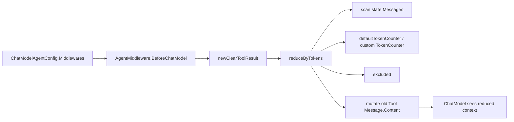

# tool_result_clearing_policy

`tool_result_clearing_policy`（代码在 `adk/middlewares/reduction/clear_tool_result.go`）本质上是在做一件很“运营化”的事：**当会话里 Tool 返回内容越来越长时，主动给历史“瘦身”**，避免模型每轮都背着大量旧工具输出继续推理。你可以把它想成聊天上下文里的“冷热分层”：最近消息是热数据，完整保留；较早且体积大的 tool result 是冷数据，必要时替换成占位符。它解决的是上下文预算和推理有效性之间的平衡问题，而不是单纯的字符串裁剪。

## 这个模块为什么存在：它在解决什么问题？

在带工具调用的 Agent 中，真正让上下文膨胀的往往不是用户问句，而是工具结果（例如检索、文件读取、执行输出）。如果不做控制，`state.Messages` 会不断增长，模型每次调用都要重复看到大量“历史工具原文”，直接带来两类问题：第一是 token 成本和延迟上升；第二是模型注意力被旧细节稀释，影响当前轮决策。

一个天真的方案是“超过阈值就删最早消息”。但这会破坏对话语义完整性：你删掉的可能是用户目标、assistant 的中间计划，反而把最关键的上下文砍掉。当前模块的设计洞察是：**优先只动 Tool 消息，而且只动“足够旧”的 Tool 消息**。换句话说，它不是做通用消息截断，而是做“针对工具结果的、带近端保护窗口的定向清理”。

## 心智模型：两道闸门 + 一条保护带

理解这个模块最好的方式，是把它想成一条高速路上的流量管控：

第一道闸门看“工具结果总量”——如果工具结果总体积还不大，什么都不做，避免过度优化。第二道闸门看“最近消息保护带”——从会话尾部往前累计 token，落在 `KeepRecentTokens` 预算内的消息区间一律不改。只有在这两道判断之后，才会对保护带之外的旧 Tool 消息做替换。

对应到实现，就是 `reduceByTokens(...)` 的三步：

1. 统计所有 `Role == schema.Tool` 且内容不是占位符的消息 token 总量；
2. 反向扫描消息，确定最近消息保护起点 `recentStartIdx`；
3. 仅对 `[0, recentStartIdx)` 区间内、且不是排除工具（`ExcludeTools`）的 Tool 消息进行内容替换。

这让它天然具备“**只在必要时触发**”和“**优先保护最近上下文**”两个行为特征。

## 架构角色与数据流

这个模块在架构上是一个 **BeforeChatModel 阶段的状态变换器（state transformer）**。它不调用模型、不访问外部存储，也不新增消息；它只在模型调用前就地修改 `ChatModelAgentState.Messages` 中部分 `Message.Content`。



从调用关系看，有两条典型入口：

- 直接入口：`NewClearToolResult(ctx, config)` 返回 `adk.AgentMiddleware`，把 `BeforeChatModel` 设为 `newClearToolResult(...)` 生成的闭包。
- 组合入口：`NewToolResultMiddleware(ctx, cfg)`（在 [middleware_entrypoint_and_contracts](middleware_entrypoint_and_contracts.md)）内部也调用了 `newClearToolResult(...)`，并与 offloading 能力一起组装成统一中间件。

这解释了为什么 `NewClearToolResult` 已标记 Deprecated：工程推荐把“清理”和“离线存储”放到一个统一策略中，而不是只做占位替换。

## 组件深潜

### `ClearToolResultConfig`

这是策略配置的核心结构体，表达的是“何时清、保留多少、如何估算、谁不能清”。几个字段背后的设计意图很明确。

`ToolResultTokenThreshold` 控制触发条件，默认 `20000`。阈值设计成“总 tool-result token”而不是“消息条数”，因为真正影响模型预算的是 token 体积，不是条数。

`KeepRecentTokens` 默认 `40000`，定义了“最近保护带”的大小。它不是“保留最近 N 条消息”，而是 token 预算，能更稳健适配消息长短不均的真实场景。

`ClearToolResultPlaceholder` 允许替换文案定制，默认是 `"[Old tool result content cleared]"`。这不是仅用于显示，它还参与去重逻辑（后文会讲 gotcha）。

`TokenCounter` 允许注入自定义估算器，默认用 `defaultTokenCounter`。这是典型的策略注入点：在不同模型 tokenizer 差异较大时，可以用更精确计数器。

`ExcludeTools` 是“硬保留名单”，通过 `ToolName` 匹配，不参与清理。

### `NewClearToolResult(ctx, config)`

这是公开构造函数，返回 `adk.AgentMiddleware`，仅设置 `BeforeChatModel`。它几乎是一个装配器：把配置解析和实际逻辑隔离开。

同时它被标记为 Deprecated，注释明确建议迁移到 `NewToolResultMiddleware`。这不是 API 噪音，而是架构方向变化：团队希望把上下文压缩策略集中在统一入口，降低中间件拼装复杂度。

### `newClearToolResult(ctx, config)`

这是真正的“配置固化器”。它做两件事：

第一，填充默认值（阈值、保护预算、占位符、计数器）。
第二，返回一个闭包 `func(ctx context.Context, state *adk.ChatModelAgentState) error`，在每次模型调用前执行。

这个闭包模式的好处是把配置读取成本前置，避免每轮调用重复做默认值分支判断。代价是配置在构造后不可热更新（除非重建 middleware）。

### `defaultTokenCounter(msg *schema.Message) int`

默认计数器基于 `len(msg.Content)`，并额外加上 `ToolCalls[].Function.Arguments` 的字符长度，然后按 `(count+3)/4` 估算 token。

这体现了“够用优先”的取舍：比起接入真实 tokenizer，这个实现零依赖、低开销、跨模型可用；但精度有限，尤其在中英文混杂、多模态字段、特殊编码文本下会偏差。

一个很重要的事实是：它只看 `Content` 和 `ToolCalls[].Function.Arguments`。`schema.Message` 里的 `MultiContent`、`UserInputMultiContent`、`AssistantGenMultiContent`、`ReasoningContent` 不在默认统计范围内。

### `reduceByTokens(...)`

这是核心算法函数，输入是 `state` 与已固化参数，输出只通过副作用体现：**就地修改** `state.Messages[i].Content`。

算法结构很克制：

- 先判空 `len(state.Messages) == 0`，直接返回；
- 扫描 Tool 消息累计 token（已是占位符的不重复计数）；
- 未超阈值立刻返回；
- 超阈值时反向计算最近保护区起点；
- 正向扫描旧区间，按条件替换内容。

这里的“先总量后局部”顺序很关键：如果没有先做总量闸门，会导致每轮都执行保护区计算和替换扫描，徒增成本且更难推断行为。

### `excluded(name string, exclude []string) bool`

简单线性匹配工具名。复杂度 O(n)（n 为排除列表长度），在排除列表通常较短时是合理的；若未来 `ExcludeTools` 很大，可改 map 预编译，但当前实现保持了最小复杂度与可读性。

## 依赖关系与契约分析

这个模块的外部依赖极少，边界清晰。

它依赖 `adk` 提供的中间件与状态契约：`NewClearToolResult` 产出 `adk.AgentMiddleware`，并以 `BeforeChatModel` 钩子接入执行链；执行时读取/修改 `*adk.ChatModelAgentState`。如果上游改变了 `BeforeChatModel` 调用时机或 `ChatModelAgentState.Messages` 语义，这里行为会直接变化。

它依赖 `schema.Message` 的结构约定，尤其是 `Role`、`Content`、`ToolName`、`ToolCalls`。`reduceByTokens` 假设 Tool 结果以 `Role == schema.Tool` 表示；如果未来 tool result 编码方式变化（比如转移到多模态字段），默认逻辑会漏清理。

反向看调用方，至少存在两个稳定调用面：

- Agent 配置层把它挂到 `ChatModelAgentConfig.Middlewares`（见 [agent_runtime_and_orchestration](agent_runtime_and_orchestration.md)）；
- 统一入口 `NewToolResultMiddleware` 在组装清理+offloading 时直接复用 `newClearToolResult`（见 [middleware_entrypoint_and_contracts](middleware_entrypoint_and_contracts.md) 与 [tool_result_offloading_pipeline](tool_result_offloading_pipeline.md)）。

这意味着它在系统中不是“孤立功能”，而是 reduction 策略栈里的一个基础算子。

## 设计取舍：为什么是现在这个样子

最核心的取舍是：**内容替换（clearing）而不是外部持久化（offloading）**。替换方案实现简单、无外部依赖、失败面小；但丢失原文。offloading 保留可追溯性，但要求 `Backend`、路径策略、read-back tool 协同。当前模块专注“最小闭环”，而把更完整能力交给统一中间件。

第二个取舍是估算精度 vs 运行成本。默认 `char/4` 明显不精确，但可预测、足够快、无 tokenizer 依赖。团队通过 `TokenCounter` 注入点把精度问题外包给业务方，而不是在基础库里绑定具体 tokenizer 实现。

第三个取舍是就地修改 state。这样零拷贝、无额外内存分配，执行快；代价是副作用明显，调试时必须意识到消息被永久改写（至少在当前 run 生命周期内）。这要求调用链对 state 可变性有共同认知。

## 使用方式与实践示例

虽然 `NewClearToolResult` 仍可用，但新代码建议优先使用 `NewToolResultMiddleware`。如果你只需要清理策略，仍可直接构造：

```go
mw, err := NewClearToolResult(ctx, &ClearToolResultConfig{
    ToolResultTokenThreshold:   30000,
    KeepRecentTokens:           20000,
    ClearToolResultPlaceholder: "[trimmed tool output]",
    ExcludeTools:               []string{"read_file"},
})
if err != nil {
    return err
}

agentCfg.Middlewares = append(agentCfg.Middlewares, mw)
```

如果你希望计数与实际模型更一致，可以自定义 `TokenCounter`：

```go
mw, _ := NewClearToolResult(ctx, &ClearToolResultConfig{
    TokenCounter: func(msg *schema.Message) int {
        // 这里只是示意：你可以调用自有 tokenizer
        return (len(msg.Content) + 1) / 2
    },
})
```

实践上建议先做一次离线观测：记录真实会话中 tool result 的 token 分布，再回填 `ToolResultTokenThreshold` 与 `KeepRecentTokens`，不要直接照搬默认值。

## 新贡献者需要特别注意的边界与坑

第一个容易忽略的点是占位符碰撞。代码通过 `msg.Content != placeholder` 判断“是否已清理”。如果原始工具输出恰好等于占位符，会被误判为已清理，进而不计入总量。这通常概率低，但在可控工具输出场景要留意。

第二个点是保护带边界的语义。`recentStartIdx` 是“第一个可能不受保护的位置”计算结果，循环中一旦 `cumulativeTokens + msgTokens > keepRecentTokens` 就停止，并把当前 `i` 设为起点。直观上这是“预算严格不超”的实现，边界行为要靠测试锁定。

第三个点是默认计数覆盖面有限。它不会统计多模态内容字段，也不会统计 `ReasoningContent`。如果系统大量依赖这些字段，清理触发时机会偏晚。

第四个点是 `ExcludeTools` 按 `ToolName` 精确匹配，没有大小写归一、没有前缀匹配。工具命名规范不统一时会出现“看起来配置了但没生效”。

第五个点是并发与可变状态。函数本身不做锁，默认假设 `BeforeChatModel` 对同一 `state` 的访问是串行的。若未来运行时改变调度模型，需要重新审视这一假设。

## 结语

`tool_result_clearing_policy` 的价值不在“把字符串换成占位符”这个动作本身，而在它体现的策略边界：**只在 tool result 总量失控时介入，并尽量不干扰最近推理上下文**。这让它成为一个低耦合、低成本、可组合的上下文治理原语。你可以把它当作 reduction 体系里的第一层安全阀，而把更强的保真与可追溯需求交给统一中间件与 offloading 管线。

## 参考

- [middleware_entrypoint_and_contracts](middleware_entrypoint_and_contracts.md)
- [tool_result_offloading_pipeline](tool_result_offloading_pipeline.md)
- [agent_runtime_and_orchestration](agent_runtime_and_orchestration.md)
- [message_schema_and_stream_concat](message_schema_and_stream_concat.md)
