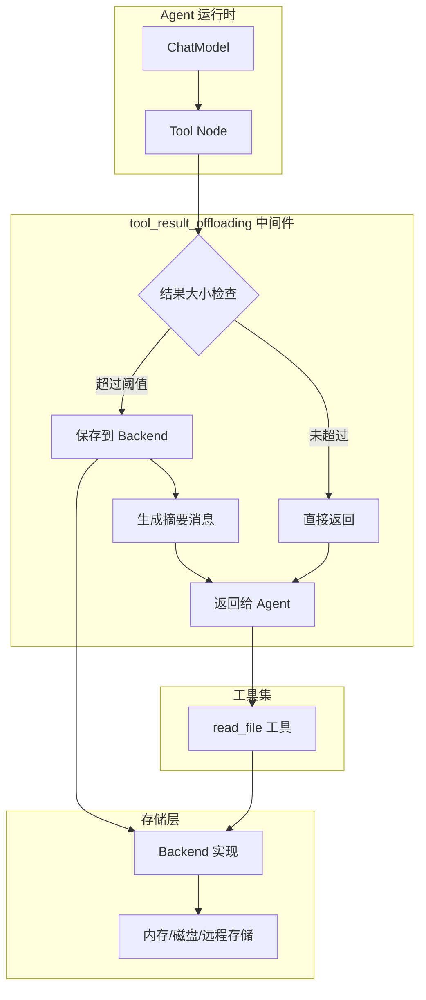

# tool_result_offloading 模块技术深度解析

## 概述：为什么需要这个模块

想象一下，你正在构建一个 AI Agent，它需要调用工具来处理大型文件、执行复杂查询或生成大量数据。当工具返回的结果过大时（比如几十 KB 甚至几 MB 的文本），会直接导致两个严重问题：

1. **上下文窗口爆炸**：LLM 的上下文窗口是有限的，过大的工具结果会迅速消耗 token 预算，导致后续对话无法进行
2. **注意力稀释**：即使上下文窗口能容纳，过多的细节也会干扰模型对关键信息的关注

一个天真的解决方案是直接截断结果，但这会丢失重要信息。另一个方案是让模型自己决定读取多少，但模型在调用工具时无法预知结果大小。

`tool_result_offloading` 模块采用了一种更优雅的设计模式：**透明卸载（Transparent Offloading）**。当工具结果超过阈值时，模块自动将完整结果保存到文件系统，然后返回一个结构化的摘要消息给模型，告诉它"结果已保存，你可以按需读取"。这就像图书馆的藏书系统——热门书籍放在手边书架，大型文献存放在书库，读者可以通过索书号按需调阅。

## 架构设计

### 模块定位

`tool_result_offloading` 是 ADK 中间件系统中的一个 **Tool Middleware**，它拦截工具调用的输出，在结果返回给 Agent 之前进行预处理。



### 核心数据流

1. **工具调用**：Agent 决定调用某个工具，传入参数
2. **工具执行**：底层工具执行并产生结果
3. **中间件拦截**：`tool_result_offloading` 捕获输出
4. **大小判断**：使用 Token 计数器估算结果大小
5. **分支处理**：
   - 若结果 ≤ 阈值：直接返回原始结果
   - 若结果 ＞ 阈值：保存完整结果到 Backend，返回摘要消息
6. **Agent 消费**：Agent 收到摘要，如需完整数据可调用 `read_file` 工具

## 核心组件详解

### toolResultOffloadingConfig

配置结构体，定义了卸载行为的所有可调参数：

```go
type toolResultOffloadingConfig struct {
    Backend          Backend                                    // 存储后端
    ReadFileToolName string                                     // 读取工具名称
    TokenLimit       int                                        // Token 阈值
    PathGenerator    func(ctx context.Context, input *compose.ToolInput) (string, error)  // 路径生成器
    TokenCounter     func(msg *schema.Message) int              // Token 计数器
}
```

**设计意图分析**：

- **Backend 抽象**：不直接依赖具体存储实现，而是通过接口隔离。这使得模块可以适配内存、磁盘、对象存储等多种后端，符合依赖倒置原则
- **PathGenerator 可注入**：路径生成逻辑可定制，避免硬编码路径规则。默认实现使用 `/large_tool_result/{CallID}`，但用户可以根据业务需求自定义（比如按日期分目录）
- **TokenCounter 可替换**：不同模型的 token 计算规则不同，允许注入自定义计数器提高了准确性。默认使用 `字符数/4` 的启发式估算

### toolResultOffloading

核心实现结构体，持有配置并提供中间件逻辑：

```go
type toolResultOffloading struct {
    backend       Backend
    tokenLimit    int
    pathGenerator func(ctx context.Context, input *compose.ToolInput) (string, error)
    toolName      string
    counter       func(msg *schema.Message) int
}
```

**关键方法**：

#### invoke（非流式工具拦截）

```go
func (t *toolResultOffloading) invoke(endpoint compose.InvokableToolEndpoint) compose.InvokableToolEndpoint
```

这是中间件的核心模式：**装饰器模式**。`invoke` 接收一个原始的工具端点函数，返回一个包装后的新函数。包装函数：
1. 调用原始端点获取输出
2. 调用 `handleResult` 处理结果
3. 返回处理后的输出

这种设计使得中间件可以链式组合，多个中间件可以依次包装同一个端点。

#### stream（流式工具拦截）

```go
func (t *toolResultOffloading) stream(endpoint compose.StreamableToolEndpoint) compose.StreamableToolEndpoint
```

流式工具的处理更复杂，因为结果是流式的。当前实现采用**缓冲聚合策略**：
1. 消费整个流，拼接成完整字符串
2. 调用 `handleResult` 处理
3. 将结果重新包装为单元素流返回

**设计权衡**：这里牺牲了流式的内存效率（需要缓冲完整结果），换取了处理逻辑的统一性。对于超大型流式结果，这可能不是最优解，但简化了实现。

#### handleResult（核心决策逻辑）

```go
func (t *toolResultOffloading) handleResult(ctx context.Context, result string, input *compose.ToolInput) (string, error)
```

这是模块的"大脑"，执行以下决策流程：

1. **大小检查**：`t.counter(msg) > t.tokenLimit * 4`
   - 注意这里的 `*4`：因为默认 TokenCounter 使用 `字符数/4` 估算，所以比较时需要还原为字符数
   - 这是一个隐式契约，文档中应明确说明

2. **路径生成**：调用 `pathGenerator` 获取存储路径

3. **摘要格式化**：
   - 调用 `formatToolMessage` 提取前 10 行作为样本
   - 使用 `pyfmt.Fmt` 填充预定义模板 `tooLargeToolMessage`

4. **持久化**：调用 `backend.Write` 保存完整结果

5. **返回摘要**：返回格式化后的摘要消息

### 辅助函数

#### formatToolMessage

```go
func formatToolMessage(s string) string
```

生成结果样本的函数，设计考虑了**可读性**和**安全性**：
- 最多提取前 10 行
- 每行超过 1000 字符时截断（使用 `utf8.RuneCountInString` 确保按 Unicode 字符而非字节截断）
- 添加行号前缀，便于模型理解上下文

这个函数的设计反映了对 LLM 行为的理解：模型不需要看到完整数据来判断是否需要读取，一个小的样本足以让它做出决策。

#### concatString

```go
func concatString(sr *schema.StreamReader[string]) (string, error)
```

流式结果聚合函数。注意它对 `nil` 流的显式检查，这是一个防御性编程实践，避免在流式工具未正确初始化时产生难以调试的 panic。

## 依赖关系分析

### 上游依赖（被谁调用）

1. **NewToolResultMiddleware**（[tool_result.md](tool_result.md)）
   - 这是模块的主要入口点
   - 将 `tool_result_offloading` 与 `clear_tool_result` 组合成完整的工具结果管理中间件
   - 调用 `newToolResultOffloading` 工厂函数创建中间件实例

2. **filesystem.NewMiddleware**（[filesystem.md](filesystem.md)）
   - 文件系统中间件内置了大结果卸载功能
   - 当 `Config.WithoutLargeToolResultOffloading = false` 时自动启用
   - 使用相同的 `newToolResultOffloading` 工厂函数

### 下游依赖（调用谁）

1. **compose.ToolMiddleware**
   - 模块返回的标准中间件结构
   - 包含 `Invokable` 和 `Streamable` 两个端点包装器
   - 由 Tool Node 在工具调用时执行

2. **adk.filesystem.backend.Backend**
   - 存储接口，定义 `Write` 方法
   - 具体实现可以是内存后端、磁盘后端或远程存储
   - 模块只依赖 `Write` 方法，符合接口隔离原则

3. **schema.Message / schema.ToolMessage**
   - 用于构造消息对象进行 Token 计数
   - 不修改消息结构，仅用于估算

4. **pyfmt.Fmt**
   - Python 风格的字符串格式化库
   - 用于填充摘要消息模板

### 数据契约

**输入**：`compose.ToolInput`
```go
type ToolInput struct {
    Name        string  // 工具名称
    Arguments   string  // 工具参数（JSON 字符串）
    CallID      string  // 调用 ID（用于生成唯一路径）
    CallOptions []tool.Option
}
```

**输出**：`compose.ToolOutput` 或 `compose.StreamToolOutput`
```go
type ToolOutput struct {
    Result string  // 工具结果（可能是原始结果或摘要）
}

type StreamToolOutput struct {
    Result *schema.StreamReader[string]  // 流式结果
}
```

**隐式契约**：
- 如果结果被卸载，返回的摘要消息中必须包含 `file_path` 和 `read_file_tool_name`
- 路径必须是 Backend 可写入的有效路径
- 调用方必须提供与 `ReadFileToolName` 匹配的读取工具，否则 Agent 无法读取卸载的内容

## 设计决策与权衡

### 1. 中间件模式 vs 工具包装器

**选择**：使用 `compose.ToolMiddleware` 而非直接包装工具

**原因**：
- 中间件可以透明地应用于所有工具，无需修改工具实现
- 支持中间件链，可以与其他中间件（如日志、重试）组合
- 符合框架的整体架构风格

**代价**：
- 中间件对所有工具生效，无法细粒度控制（虽然可以通过 TokenCounter 间接控制）

### 2. 同步缓冲 vs 异步流式处理

**选择**：流式工具也采用缓冲聚合

**原因**：
- 简化实现逻辑，`handleResult` 可以统一处理
- 对于大多数工具，结果大小在可接受范围内
- 流式工具通常用于逐步输出，而非超大数据

**代价**：
- 失去流式的内存优势
- 对于真正的超大型流式结果，可能导致内存压力

**改进空间**：可以实现真正的流式卸载——边接收边写入 Backend，同时计算累计大小，超过阈值后切换为摘要模式。

### 3. 启发式 Token 计数 vs 精确计数

**选择**：默认使用 `字符数/4` 的启发式估算

**原因**：
- 精确计数需要调用模型的 Tokenizer，增加延迟和依赖
- 对于阈值判断，近似值已足够
- 允许用户注入自定义计数器以满足精度需求

**代价**：
- 不同模型的 token 化规则不同，估算可能不准确
- 可能导致边界情况下的误判

### 4. 固定样本大小 vs 可配置样本

**选择**：硬编码前 10 行，每行 1000 字符

**原因**：
- 简化配置，减少用户的决策负担
- 经验值：10 行足以让模型判断内容类型
- 避免配置过多参数导致使用复杂

**代价**：
- 某些场景可能需要更多或更少的样本
- 无法根据内容类型动态调整

### 5. 路径生成策略

**选择**：默认使用 `/large_tool_result/{CallID}`

**原因**：
- CallID 是唯一的，避免路径冲突
- 扁平结构简化实现
- 路径可预测，便于调试

**代价**：
- 长期运行可能积累大量文件
- 没有内置的清理机制

**注意**：模块假设调用方会管理存储生命周期，这是一个隐式的责任划分。

## 使用指南

### 基础用法

通过 `NewToolResultMiddleware` 创建中间件：

```go
import (
    "context"
    "github.com/cloudwego/eino/adk/middlewares/reduction"
    "github.com/cloudwego/eino/adk/filesystem/backend"
)

// 创建存储后端
fsBackend := backend.NewInMemoryBackend()

// 配置中间件
cfg := &reduction.ToolResultConfig{
    Backend:                fsBackend,
    OffloadingTokenLimit:   20000,  // 20k tokens
    ReadFileToolName:       "read_file",
}

middleware, err := reduction.NewToolResultMiddleware(ctx, cfg)
if err != nil {
    // 处理错误
}

// 将中间件应用到 Agent
agent := adk.NewChatModelAgent(
    model,
    adk.WithMiddleware(middleware),
)
```

### 自定义路径生成器

按日期组织卸载文件：

```go
cfg.PathGenerator = func(ctx context.Context, input *compose.ToolInput) (string, error) {
    now := time.Now()
    dateDir := now.Format("2006-01-02")
    return fmt.Sprintf("/large_results/%s/%s", dateDir, input.CallID), nil
}
```

### 自定义 Token 计数器

使用模型的精确 Tokenizer：

```go
tokenizer := loadTokenizer("gpt-4")
cfg.TokenCounter = func(msg *schema.Message) int {
    return tokenizer.Count(msg.Content)
}
```

### 与文件系统中间件集成

如果使用文件系统中间件，卸载功能已内置：

```go
import "github.com/cloudwego/eino/adk/middlewares/filesystem"

fsCfg := &filesystem.Config{
    Backend: myBackend,
    // 默认启用卸载，如需禁用：
    // WithoutLargeToolResultOffloading: true,
    LargeToolResultOffloadingTokenLimit: 30000,
}

middleware, err := filesystem.NewMiddleware(ctx, fsCfg)
```

**注意**：不要同时使用 `reduction.NewToolResultMiddleware` 和 `filesystem.NewMiddleware` 的卸载功能，会导致重复处理。

## 边界情况与注意事项

### 1. 读取工具缺失

**问题**：如果 Agent 没有 `read_file` 工具，模型无法读取卸载的内容。

**症状**：模型收到摘要消息但无法获取完整数据，可能导致任务失败。

**解决方案**：
- 使用文件系统中间件（自动提供 `read_file` 工具）
- 或手动实现读取工具：

```go
readTool, err := utils.InferTool("read_file", "读取文件内容", 
    func(ctx context.Context, args struct {
        FilePath string `json:"file_path"`
        Offset   int    `json:"offset"`
        Limit    int    `json:"limit"`
    }) (string, error) {
        return fsBackend.Read(ctx, &filesystem.ReadRequest{
            FilePath: args.FilePath,
            Offset:   args.Offset,
            Limit:    args.Limit,
        })
    })
```

### 2. 存储后端写入失败

**问题**：Backend.Write 返回错误时，整个工具调用会失败。

**影响**：工具结果既没有返回给 Agent，也没有保存成功。

**建议**：
- 确保 Backend 实现有足够的容量和权限
- 在生产环境中监控写入失败率
- 考虑实现降级策略（如写入失败时返回截断结果）

### 3. 流式工具的内存压力

**问题**：流式结果会被完全缓冲到内存中。

**风险**：对于 GB 级别的流式输出，可能导致 OOM。

**缓解措施**：
- 设置合理的 TokenLimit
- 监控工具输出的大小分布
- 对于已知的超大型工具，考虑在工具内部实现分页

### 4. 路径冲突

**问题**：如果 PathGenerator 不是唯一的，可能导致文件覆盖。

**保证**：默认实现使用 CallID，保证唯一性。

**注意**：自定义 PathGenerator 时必须确保唯一性，建议包含 CallID 或时间戳。

### 5. Token 计数偏差

**问题**：启发式计数可能高估或低估实际 token 数。

**影响**：
- 高估：过早触发卸载，增加不必要的 I/O
- 低估：未触发卸载，导致上下文过大

**建议**：
- 对于关键应用，使用精确的 Tokenizer
- 设置阈值时留有余量（如目标值的 80%）

### 6. 存储生命周期管理

**问题**：模块不负责清理已卸载的文件。

**风险**：长期运行可能积累大量文件，占用存储空间。

**建议**：
- 实现定期清理任务
- 使用带 TTL 的存储后端
- 在 PathGenerator 中按日期分目录，便于批量删除

## 与相关模块的关系

- **[tool_result.md](tool_result.md)**：父模块，提供完整的工具结果管理策略（卸载 + 清除）
- **[filesystem.md](filesystem.md)**：集成模块，内置卸载功能并提供读取工具
- **[clear_tool_result.md](clear_tool_result.md)**：兄弟模块，负责清除旧的工具结果以控制总 token 数

## 扩展点

模块设计了多个扩展点，便于定制：

1. **Backend 接口**：实现自定义存储后端
2. **PathGenerator**：自定义路径生成逻辑
3. **TokenCounter**：使用精确的 token 计数
4. **ReadFileToolName**：适配不同的工具命名约定

## 总结

`tool_result_offloading` 模块通过透明卸载策略，优雅地解决了大工具结果与有限上下文窗口之间的矛盾。它的核心设计哲学是：

- **透明性**：工具实现无需感知卸载逻辑
- **可配置性**：关键参数可调整以适应不同场景
- **可扩展性**：通过接口抽象支持多种存储后端
- **实用性**：提供合理的默认值，降低使用门槛

理解这个模块的关键在于把握其中间件本质——它不是工具的一部分，而是工具调用链路上的一个智能过滤器，在合适的时机做出"保存还是传递"的决策。
