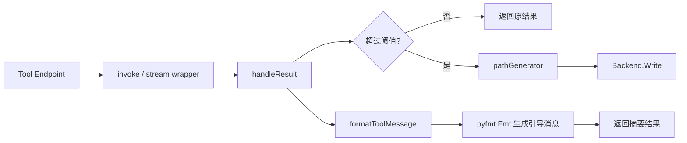

# tool_result_offloading_pipeline

`tool_result_offloading_pipeline`（实现位于 `adk/middlewares/reduction/large_tool_result.go`）负责处理“单次工具调用结果过大”的场景。它不试图在上下文里塞下全部内容，而是把完整结果写入外部存储，再返回一段“导航消息”告诉模型去哪里、如何分段读取。可以把它想成快递站：大件不直接搬进办公室，而是存到仓库并给你取件单。

## 它解决的核心问题

在 Agent 工具调用链中，单次工具返回可能非常大（如全文检索、代码执行日志、文件内容）。如果原样回灌给模型，会立即拉高本轮 token 消耗，并且挤占后续推理空间。

该子模块的策略是：

1. 先判断当前工具结果是否“过大”；
2. 过大则写入 `Backend`；
3. 返回精简摘要（含路径、tool_call_id、read_file 工具名和前 10 行样本）；
4. 引导模型后续按 offset/limit 分段读取。

这与清理历史（clearing）不同：offloading 面向“本次结果峰值”，目标是避免一次性爆炸。

## 关键组件与职责

### `toolResultOffloadingConfig`

构造参数集合，主要字段：

- `Backend`: 写入后端（必需能力）
- `ReadFileToolName`: 提示里引用的读取工具名，默认 `read_file`
- `TokenLimit`: 触发 offloading 的阈值（默认 20000）
- `PathGenerator`: 生成写入路径，默认 `/large_tool_result/{CallID}`
- `TokenCounter`: 估算消息 token 的函数，默认复用 `defaultTokenCounter`

这个配置层的设计重点是“策略可插拔”：路径、计数方式、提示工具名都可替换，不把模块锁死到某个文件系统实现。

### `toolResultOffloading`

运行期对象，内部保存 `backend/tokenLimit/pathGenerator/toolName/counter` 五个策略句柄。它通过 `invoke` 和 `stream` 两个包装器同时覆盖同步工具与流式工具。

## 调用链与数据流（端到端）

说明：

- `invoke` 路径：调用原 `compose.InvokableToolEndpoint` 后，把 `output.Result` 交给 `handleResult`。
- `stream` 路径：先用 `concatString` 把 `*schema.StreamReader[string]` 全量拼接，再走 `handleResult`，最后用 `schema.StreamReaderFromArray([]string{result})` 包回单段流。

这个设计让两种工具形态共享同一判定与写入逻辑，减少行为分叉。

## 内部机制细节

### `newToolResultOffloading(...)`

工厂函数，负责默认值填充并返回 `compose.ToolMiddleware`：

- `Invokable: offloading.invoke`
- `Streamable: offloading.stream`

默认值策略：

- `tokenLimit == 0` → `20000`
- `pathGenerator == nil` → `/large_tool_result/{CallID}`
- `toolName == ""` → `read_file`
- `counter == nil` → `defaultTokenCounter`

### `handleResult(...)`

核心判定逻辑：

- 构造 `schema.ToolMessage(result, input.CallID, schema.WithToolName(input.Name))`
- 调用 `counter(...)`
- 与 `t.tokenLimit*4` 比较
- 超限则：
  - 生成路径
  - `formatToolMessage` 抽样前 10 行
  - `pyfmt.Fmt` 填充 `tooLargeToolMessage`
  - `backend.Write(ctx, &filesystem.WriteRequest{FilePath: path, Content: result})`
  - 返回摘要文本
- 未超限则原样返回

### `concatString(...)`

把流式字符串完全收集到 `strings.Builder`，直到 `io.EOF`。若传入 `nil` 流，返回 `"stream is nil"` 错误。

### `formatToolMessage(...)`

用于摘要中的样本展示：

- 仅取前 10 行
- 每行最多 1000 rune
- 格式为 `"{lineNum}: {line}\n"`

这是为了防止摘要本身再次过大，同时给模型一个可读上下文切片。

## 设计取舍与潜在风险

1. **一致性优先于流式实时性**
   - `stream` 路径先全量拼接再判定，逻辑一致、实现简单；
   - 代价是超大流会产生额外内存峰值，失去“边读边处理”的优势。

2. **默认友好优先于强校验**
   - 默认路径、默认读取工具名降低接入门槛；
   - 但模块不验证读工具是否真的存在，可能出现“提示可读但系统无该工具”的运行期失配。

3. **摘要可读性优先于完整性**
   - 只给前 10 行样本，避免二次膨胀；
   - 但样本不保证覆盖关键信息，模型仍需后续 read_file 分段拉取。

4. **阈值语义要谨慎理解**
   - 代码比较条件是 `counter(msg) > tokenLimit*4`；
   - 默认 `counter` 是“字符数/4”。这意味着默认情况下触发点并非直觉上的 `tokenLimit`，新贡献者调参时要结合代码实际验证。

## 新贡献者注意事项

- `Backend` 为空接口值时，调用 `Write` 会在运行期失败（通常是 panic 或错误链），应在接入层保证非空实现。
- `PathGenerator` 需保证路径唯一性；若后端语义是“已存在报错”，重复 `CallID` 或固定路径会导致 offloading 失败。
- `formatToolMessage` 使用 `bufio.Scanner` 默认 token 限制，极长单行文本可能被截断；当前实现未显式处理 `reader.Err()`。
- `concatString` 会吞完整流后再返回，若你需要真正的流式背压控制，这里不是理想实现点。

## 参考

- [middleware_entrypoint_and_contracts](middleware_entrypoint_and_contracts.md)
- [tool_result_clearing_policy](tool_result_clearing_policy.md)
- [filesystem_middleware_and_tool_surface](filesystem_middleware_and_tool_surface.md)
- [Compose Tool Node](Compose Tool Node.md)
