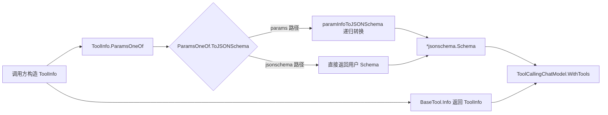

# tool_schema_definition 深度解析

`tool_schema_definition`（对应 `schema/tool.go` 中的 `ToolInfo`、`ParameterInfo`、`ParamsOneOf`）本质上是“工具调用世界”的**参数契约层**。你可以把它想成“给 LLM 的函数签名翻译器”：上层开发者希望用 Go 结构化方式描述工具参数，而模型侧通常消费 JSON Schema。这个模块存在的意义，就是把“人类/代码友好的参数描述”稳定地转成“模型可消费、可预测、可复现”的 Schema 形态，并把这种描述挂载到 `ToolInfo` 上，供工具系统与模型系统共享。

---

## 1. 这个模块解决了什么问题？

工具调用链路里最容易被低估的问题不是“调用工具”，而是“让模型**正确地构造参数**”。如果只给模型一个工具名和自然语言描述，模型会在参数结构上出现大量漂移：字段名不一致、嵌套层级错位、枚举值越界、数组元素类型不稳定。

一个朴素方案是：直接要求每个调用方手写 `*jsonschema.Schema`。这当然可行，但在工程上有三类问题。第一，绝大多数工具参数并不复杂，手写 JSON Schema 成本高且易错；第二，不同团队写法风格不一，输出顺序不稳定会导致测试快照抖动；第三，某些高级场景又确实需要原生 JSON Schema 的表达能力。

`tool_schema_definition` 选择了折中但很实用的设计：

- 用 `ParameterInfo` 提供一套“80% 场景够用”的直观参数 DSL（对象、数组、枚举、必填）。
- 用 `ParamsOneOf` 做“二选一”入口：要么给 `map[string]*ParameterInfo`，要么给 `*jsonschema.Schema`。
- 用 `ToJSONSchema()` 在真正对接模型前统一输出 `*jsonschema.Schema`。

这让调用方在简单场景下低成本表达，在复杂场景下不失逃生口。

---

## 2. 心智模型：把它看作“双轨制的海关申报系统”

可以把这个模块想成机场海关：

- `ToolInfo` 是旅客（工具）的总资料卡（名字、说明、额外信息、参数定义）。
- `ParamsOneOf` 是两条申报通道：
  - 快速通道：`params map[string]*ParameterInfo`
  - 专业通道：`jsonschema *jsonschema.Schema`
- `ToJSONSchema()` 是海关统一格式化环节：不管你走哪条通道，最后都归一到 JSON Schema。

关键点在于：系统不要求所有人都精通 JSON Schema 规范，但最终下游拿到的必须是同一种“机器契约”。

---

## 3. 架构与数据流



从职责上看，这个模块是一个**schema transformer + contract container**，不是执行器。它不负责执行工具、不负责参数反序列化，只负责定义与转换“工具参数契约”。

### 端到端路径（高频链路）

在高频路径上，`BaseTool` 实现需要通过 `Info(ctx)` 返回 `*schema.ToolInfo`（见 `components.tool.interface.BaseTool`）。随后模型层会通过 `ToolCallingChatModel.WithTools(tools []*schema.ToolInfo)` 绑定工具定义（见 `components.model.interface.ToolCallingChatModel`）。

也就是说，`tool_schema_definition` 的数据最终会进入模型工具选择/参数生成阶段。契约错了，后续全错。

### 实际依赖关系（基于代码可见关系）

- `adk.agent_tool.AgentToolOptions` 持有 `agentInputSchema *schema.ParamsOneOf`。
- `adk.agent_tool.WithAgentInputSchema(schema *schema.ParamsOneOf)` 把外部 schema 注入工具。
- `adk.agent_tool.agentTool.Info` 返回 `*schema.ToolInfo`，并把 `ParamsOneOf` 透传给模型侧。
- 工具接口层 `BaseTool.Info` / `InvokableTool` / `StreamableTool` 都以 `ToolInfo` 作为元信息入口。

> 注：在提供的源码片段内，`ParamsOneOf.ToJSONSchema()` 的直接调用点未显式展示；可以确认的是其设计意图是“模型调用前归一化为 JSON Schema”。

---

## 4. 组件深潜

## `ToolInfo`

`ToolInfo` 是工具元数据总容器，字段包括 `Name`、`Desc`、`Extra` 以及嵌入的 `*ParamsOneOf`。

设计上最值得注意的是匿名嵌入 `*ParamsOneOf`。这让 `ToolInfo` 在使用时可直接携带参数定义能力，而不是再套一层 `Parameters` 包装对象。好处是调用路径短、结构扁平；代价是语义上与 `ToolInfo` 更紧耦合，后续若要支持第三种参数描述方式，变更会直接触及核心结构。

当 `ParamsOneOf == nil` 时，注释明确语义为“工具无输入参数”。这是一条隐式但关键契约：不是“未知”，而是“确实不需要参数”。

## `ParameterInfo`

`ParameterInfo` 是面向工程师的人类友好参数描述结构：

- `Type DataType`：JSON Schema 基本类型。
- `ElemInfo *ParameterInfo`：数组元素类型。
- `SubParams map[string]*ParameterInfo`：对象子字段。
- `Enum []string`：枚举（当前注释写明仅 string）。
- `Required bool`：字段是否必填。

它的强项是可递归描述：对象里套数组，数组里套对象，都能表达。它的边界也很明显：只覆盖常见需求，没有暴露 JSON Schema 全量能力（如 `oneOf`、`patternProperties`、复杂约束等）。这正是“易用优先”的取舍。

## `ParamsOneOf`

`ParamsOneOf` 是“参数描述联合体”，内部有两个字段：

- `params map[string]*ParameterInfo`
- `jsonschema *jsonschema.Schema`

并通过两个构造函数约束入口：

```go
schema.NewParamsOneOfByParams(params)
schema.NewParamsOneOfByJSONSchema(s)
```

注释声明“必须二选一”，但实现上并没有运行时强校验（例如同时设置两个字段时，不报错，`ToJSONSchema()` 会优先走 `params` 分支）。这是一种偏性能与简洁的实现选择：把约束前移到构造约定，而不是每次转换都做防御性校验。

## `(*ParamsOneOf).ToJSONSchema()`

这是该模块的核心转换器。逻辑分三段：

1. `p == nil` 时返回 `(nil, nil)`，表示无参数 schema。
2. `p.params != nil` 时，构造 object schema，并递归转换每个参数。
3. 否则直接返回 `p.jsonschema`。

非显而易见但非常重要的一点：它在处理 `map` 时会**先排序 key**（`sort.Strings(keys)`），并使用 `orderedmap` 存 `Properties`。这使得输出 schema 的字段顺序确定，减少测试快照和序列化输出的随机抖动。换句话说，这里在“功能正确”之外，还主动保证了“工程可重复性”。

## `paramInfoToJSONSchema(paramInfo *ParameterInfo)`

这是递归转换函数。它会：

- 设置 `Type` 和 `Description`。
- 把 `Enum []string` 转成 `[]any` 写入 JSON Schema。
- `ElemInfo != nil` 时写入 `Items`。
- `SubParams` 非空时递归生成 `Properties` 与 `Required`。

这个函数不做强校验（例如 `Type=array` 但 `ElemInfo=nil`，或 `Type=object` 但无 `SubParams`）。它相信调用方输入是自洽的，属于“薄转换层”风格，而非“强校验层”。

---

## 5. 依赖分析：它调用谁、谁调用它

该模块自身外部依赖很少，但都很关键：

- `github.com/eino-contrib/jsonschema`：作为统一输出类型与模型侧 schema 契约。
- `github.com/wk8/go-ordered-map/v2`：保证 `Properties` 可按确定顺序插入。
- `sort`：对 map key 排序，确保确定性输出。

谁依赖它：

- 工具接口层通过 `BaseTool.Info() (*schema.ToolInfo, error)` 暴露它。
- 模型接口层通过 `ToolCallingChatModel.WithTools([]*schema.ToolInfo)` 消费它。
- ADK 场景中，`adk.agent_tool.WithAgentInputSchema` / `agentTool.Info` 直接使用 `*schema.ParamsOneOf` 和 `*schema.ToolInfo`。

因此它在架构里的角色是**协议中枢**：上接工具实现，下接模型工具调用能力。

---

## 6. 设计决策与权衡

这个模块最核心的权衡是“双表示 + 统一出口”。

选择双表示（`ParameterInfo` + raw JSON Schema）牺牲了一些纯粹性：需要维护两套输入路径，也引入了“one-of 约束靠约定”的风险。但换来的是开发体验和覆盖面的平衡：常规用户不必学习完整 JSON Schema，高阶用户不受 DSL 限制。

第二个关键选择是“弱校验转换”。当前实现几乎不做参数结构合法性验证，优点是实现简单、性能开销小、适配灵活；缺点是错误暴露会后移到模型调用或下游校验阶段。这个选择在基础 schema 层是常见策略，但要求上游构造工具时更自律。

第三个选择是“确定性优先”。通过排序和有序 map，模块为可测试性和可追踪性投入了额外逻辑。这在分布式/多团队协作中非常值得。

---

## 7. 使用方式与示例

### 用 `ParameterInfo` 描述常规参数（推荐默认）

```go
params := map[string]*schema.ParameterInfo{
    "city": {
        Type:     schema.String,
        Desc:     "城市名称",
        Required: true,
    },
    "unit": {
        Type: schema.String,
        Desc: "温度单位",
        Enum: []string{"celsius", "fahrenheit"},
    },
}

toolInfo := &schema.ToolInfo{
    Name:        "get_weather",
    Desc:        "查询天气",
    ParamsOneOf: schema.NewParamsOneOfByParams(params),
}
```

### 用原生 JSON Schema 描述复杂约束

```go
raw := &jsonschema.Schema{
    Type: "object",
    // ...更复杂的 JSON Schema 结构
}

toolInfo := &schema.ToolInfo{
    Name:        "advanced_tool",
    Desc:        "复杂参数工具",
    ParamsOneOf: schema.NewParamsOneOfByJSONSchema(raw),
}
```

### 工具实现通过 `Info` 暴露契约

`BaseTool` 约定：

```go
type BaseTool interface {
    Info(ctx context.Context) (*schema.ToolInfo, error)
}
```

模型侧会接收 `[]*schema.ToolInfo`（`ToolCallingChatModel.WithTools`）进行工具绑定。

---

## 8. 新贡献者需要特别注意的坑

首先，`ParamsOneOf` 的 one-of 约束是“文档约束”，不是“硬校验”。如果你绕过构造函数手动构造并同时设置两个字段，`ToJSONSchema()` 会优先使用 `params`，这可能掩盖配置错误。

其次，`paramInfoToJSONSchema` 没有 nil 防御。传入 `nil *ParameterInfo` 会触发 panic 风险（因为会访问 `paramInfo.Type`）。上游 map 值请确保非 nil。

再次，`Required` 只在父对象收集字段名，不会验证字段类型语义。例如 `Required=true` 但字段逻辑无效，转换层不会拦截。

最后，`DataType` / `Enum` 的注释语义依赖调用方自觉遵守。比如 `Enum` 注释说“only for string”，代码层并不强制。

---

## 9. 与其他模块的关系（参考阅读）

- 工具与模型接口契约：[`model_and_tool_interfaces.md`](model_and_tool_interfaces.md)
- 消息/工具调用消息体结构：[`message_schema_and_stream_concat.md`](message_schema_and_stream_concat.md)
- 流式 schema（若你在工具流式输出场景工作）：[`Schema Stream.md`](Schema%20Stream.md)

如果你要改 `tool_schema_definition`，建议先确认接口层与模型绑定链路中的契约不会被破坏，尤其是 `ToolInfo` 输出形态与参数 schema 的确定性行为。
