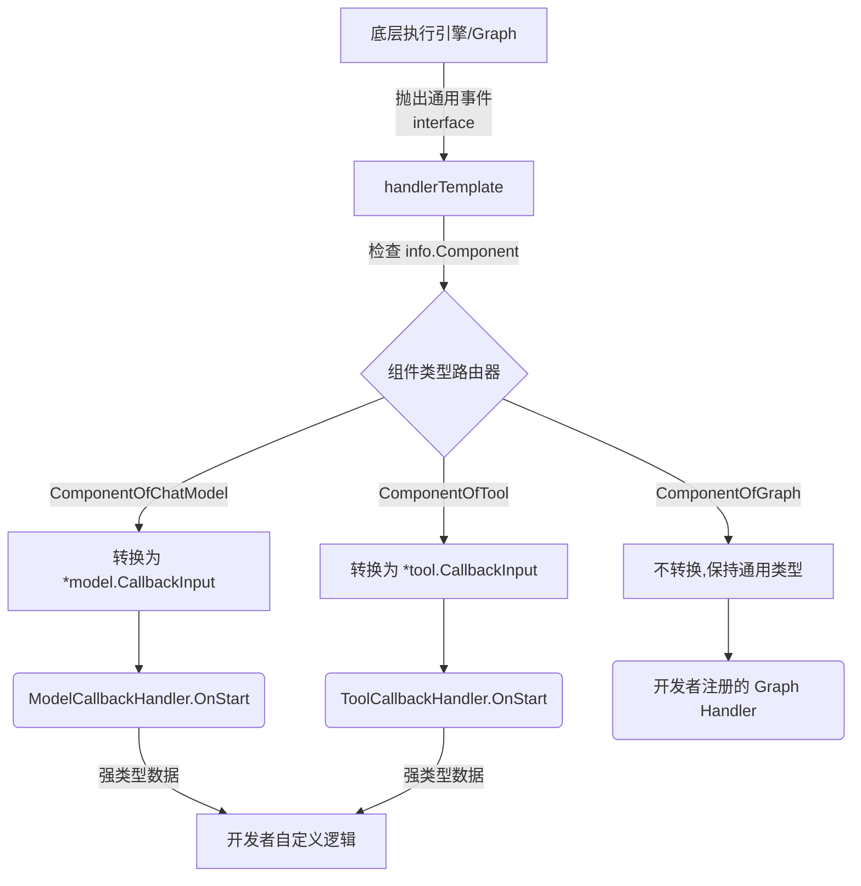

# Typed Templates (类型化回调模板) 模块深度解析

在构建复杂的大型 AI 应用时，可观测性、日志记录和中间件拦截是不可或缺的能力。Eino 框架通过统一的 [Callbacks System](callbacks_system.md) 提供了标准化的回调机制。然而，由于框架需要支持从大模型（ChatModel）、提示词（Prompt）到检索器（Retriever）等截然不同的组件，底层的 `callbacks.Handler` 接口为了保持通用性，只能接收基于空接口或抽象的通用载荷（如 `callbacks.CallbackInput`）。

**`typed_templates` 模块的存在，正是为了解决这种“通用性”与开发者期望的“强类型安全性”之间的核心冲突。** 

如果直接基于底层接口开发，开发者不得不在每个回调中编写大量的类型断言代码（例如 `if modelInput, ok := input.(*model.CallbackInput); ok`）。这个模块利用构建器模式（Builder Pattern）在底层通用事件总线和上层具体业务逻辑之间搭建了一层“类型安全适配器”。开发者只需关注特定组件的强类型数据，而框架负责处理所有肮脏的类型路由与转换工作。

---

## 核心心智模型与架构

你可以将这个模块想象成一个**“带智能分发功能的邮件分拣中心”**。
底层框架产生的事件如同标准格式的包裹，全部从同一个入口（如 `OnStart`）涌入。分拣员（`handlerTemplate`）站在流水线上，通过检查包裹上的标签（`info.Component`），决定将其送往哪个专员部门（例如 `ModelCallbackHandler`）。在送达之前，分拣员会将通用的包裹拆解并重新包装成该部门专用的强类型格式（通过各个组件提供的 `ConvCallbackInput` 方法），最终交给开发者自定义的业务逻辑进行处理。



整个模块的数据流是极其确定且单向的：
1. **输入阶段**：接收 `context`、`RunInfo` 和通用 `CallbackInput`。
2. **路由分配**：基于 `RunInfo.Component` 进行大范围的 `switch-case` 匹配。
3. **类型适配**：调用诸如 `model.ConvCallbackInput` 之类的辅助方法。
4. **业务执行**：触发注册在 `HandlerHelper` 中的具体组件 handler。
5. **返回**：返回更新后的 `context` 供下游继续执行。

---

## 核心组件深度剖析

### 1. `HandlerHelper` (构建器)
它是面向开发者的唯一入口。`HandlerHelper` 是一个极具代表性的“胖构建器（Fat Builder）”。它内部持有系统中所有核心组件专用处理器的指针（如 `promptHandler`, `chatModelHandler` 等）。
通过链式调用的 API 设计，开发者可以将针对不同组件的关注点分离，最后调用 `Handler()` 将它们组装成一个满足底层契约的 `callbacks.Handler`。

### 2. `handlerTemplate` (路由引擎)
这是一个典型的适配器（Adapter）。它实现了底层的 `callbacks.Handler` 接口，但自身并不包含任何业务逻辑。
在它的 `OnStart`, `OnEnd`, `OnError` 等方法内部，维护了极其庞大的 `switch-case` 逻辑。这种设计虽然看起来有些冗长，但却将所有的组件类型枚举集中在了一处，避免了逻辑散落在代码库的各个角落。

### 3. 组件专用 Handler (如 `ModelCallbackHandler`, `ToolCallbackHandler`)
这些结构体是实际承载业务逻辑的容器。相比于底层的庞大接口，它们采用了“函数组合（Function Composition）”的设计。它们不要求开发者实现一整个接口，而是暴露了公开的函数字段（如 `OnStart func(...)`）。
这种设计的精妙之处在于结合了下文的 `Needed` 机制，允许开发者只订阅他们关心的特定生命周期。

---

## 依赖关系与数据流契约

在架构分层中，该模块扮演的是**胶水层**的角色：
* **调用谁（下游依赖）**：严重依赖 [Component Interfaces](component_interfaces.md) 和 [Component Options and Extras](component_options_and_extras.md) 中的具体类型定义。不仅依赖它们的数据结构，更依赖它们提供的强制类型转换契约（即各个包名下的 `ConvCallbackInput` 和 `ConvCallbackOutput` 方法）。同时也依赖 [Schema Stream](schema_stream.md) 模块来处理流式数据封装。
* **被谁调用（上游调用方）**：通常在应用初始化阶段被开发者实例化，随后通过配置选项注入到 [Compose Graph Engine](compose_graph_engine.md) 编排引擎或具体的应用层逻辑中，由底层的事件总线唤醒执行。

**热点路径**：`Needed` 和各个生命周期函数（如 `OnStart`/`OnEnd`）将会在每一次节点执行时被触发。由于它横亘在执行的关键路径上，任何在其中运行的阻塞操作都会直接拖慢整个编排引擎的进度。

---

## 核心设计决策与权衡 (Tradeoffs)

### 1. 集中式耦合 vs 接口爆炸
这是一个经典的架构两难问题。`typed_templates` 选择了**强耦合**系统中的所有组件库（从 `document` 到 `model` 再到 `retriever`）。
* **为何这样选择？** 另一种做法是让回调接口泛滥，变成类似 `OnModelStart`, `OnToolStart` 等几十个方法的庞大接口。这不仅会让底层实现极其僵化，也会让不关心特定组件的使用者痛苦不堪。当前的方案将底层抽象保持在最精简的通用方法集，而把类型断言的脏活累活全集中在 `handlerTemplate` 处理。虽然每增加一种新组件都需要在这里加一个 `case` 分支，但这作为为了提升开发者体验的适配层，其带来的收益远大于耦合的代价。

### 2. 性能优先的短路机制 (`Needed`)
`handlerTemplate` 严格贯彻了回调底层的 `callbacks.TimingChecker` 接口协议。
如果在 `ModelCallbackHandler` 中开发者没有赋值 `OnStart` 函数，`Needed()` 机制会针对 `TimingOnStart` 时机直接返回 `false`。这意味着底层引擎在触发事件派发之前就会**提前截断**事件投递，甚至不会产生上下文复制和变量装箱的开销。这种“默认跳过”的设计是在接口灵活性和运行期极致性能之间做出的绝佳平衡。

### 3. 流式数据的惰性转换 (Lazy Conversion)
在处理大模型或工具的流式输出时（如 `OnEndWithStreamOutput`），框架面临一个挑战：如何在不破坏流式响应特性的前提下进行类型转换？
直接遍历整个流会导致流被阻塞，甚至引发内存激增。因此，代码中巧妙使用了 `schema.StreamReaderWithConvert` 包装器：
```go
schema.StreamReaderWithConvert(output, func(item callbacks.CallbackOutput) (*model.CallbackOutput, error) {
    return model.ConvCallbackOutput(item), nil
})
```
这体现了**惰性求值**的思想，宛如套在原水管上的一个即时滤网。只有当下游节点（或最终用户调用 `Recv()`）真正读取下一个数据块时，这个实时类型转换的回调才会执行，从而保证了流的纯正性和内存调度的轻量。

---

## 使用模式与最佳实践

在实际开发中，你通常可以通过链式调用一次性配置应用的所有切面逻辑：

```go
// 实例化一个全局的 Handler，按需订阅不同组件
tracerHandler := template.NewHandlerHelper().
    ChatModel(&model.ModelCallbackHandler{
        // 开发者现在可以直接处理强类型的 *model.CallbackInput，完全抛弃了接口断言
        OnStart: func(ctx context.Context, info *callbacks.RunInfo, input *model.CallbackInput) context.Context {
            fmt.Printf("Model %s is starting with messages: %v\n", info.Name, input.Messages)
            return ctx
        },
    }).
    Tool(&tool.ToolCallbackHandler{
        OnError: func(ctx context.Context, info *callbacks.RunInfo, err error) context.Context {
            fmt.Printf("Tool %s failed: %v\n", info.Name, err)
            return ctx
        },
    }).
    // 针对复杂的编排组件，依然可以挂载通用的泛型处理器
    Graph(myGenericGraphTracer). 
    Handler()
```

---

## 陷阱与边缘场景 (Gotchas)

1. **零值初始化的隐式忽略机制**
   如果你在注册时提供了一个空的实体结构（例如 `&model.ModelCallbackHandler{}`，内部函数字段全为 `nil`），那么该组件的**任何回调都不会被触发**。切勿认为框架会默认生成一个 No-op 的处理器并走入其中；在 `Needed` 检查期它就会被直接抛弃。你必须显式为需要拦截的生命周期阶段赋值处理函数。

2. **未覆盖的组件类型会静默穿透**
   在 `handlerTemplate` 的各个 `switch` 块中，都存在一个兜底的 `default: return ctx` 分支。这意味着，如果底层执行单元抛出了一个该模块未内置或未能识别的 `info.Component` 类型，`typed_templates` 既不会报错，也不会引发异常（panic），而是选择**静默忽略**并原样透传 `context`。在排查自定义组件回调未被命中的问题时，必须首先检查节点抛出的 `info.Component` 枚举值是否正确。

3. **对 Graph/Chain 等非原子组件的处理降级**
   `ComponentOfGraph`、`ComponentOfChain` 以及 `ComponentOfLambda` 并没有封装特定的强类型对象（因为它们的输入输出是由运行时动态构建的，形态万千，本质是 `any`）。当你通过 `.Graph(handler)` 注册时，实际上是退化回了原始的无类型泛型处理模式。在这种场景下，开发者依然需要在自定的 handler 中手动处理基于接口的类型断言。