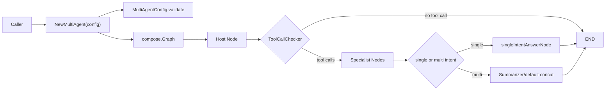

# types_and_config 模块深度解析

`types_and_config` 是 Flow Multi-Agent Host 里的“协议层”：它本身几乎不做业务推理，但它定义了 **Host / Specialist / Summarizer 怎么被描述、怎么被校验、怎么被执行入口调用**。如果把多智能体系统比作一家医院，这个模块不是具体看病的科室，而是“分诊单 + 会诊规则”：先定义谁是总控医生（Host）、哪些是专科医生（Specialist）、什么情况下要出会诊总结（Summarizer），再把这些定义交给图运行时去执行。它存在的核心价值，是把“多智能体编排意图”从“图执行细节”中解耦，避免调用方直接操纵底层 graph 造成耦合失控。

---

## 架构角色与数据流



这个模块在架构上是一个 **“配置与类型驱动的编排入口”**。`NewMultiAgent`（定义在同包 `compose.go`）读取 `MultiAgentConfig`，根据 `Host`、`Specialists`、`Summarizer` 生成一张 `compose.Graph` 并编译成 `compose.Runnable`，最后装入 `MultiAgent`。随后调用方只通过 `MultiAgent.Generate` 或 `MultiAgent.Stream` 执行，不需要再知道图内部节点、分支与状态管理的细节。

运行时的数据流可以分三段理解。第一段是 Host 决策：输入 `[]*schema.Message` 进入 Host 节点，Host 要么直接回答，要么产生 `ToolCalls` 指向某个或多个 Specialist。第二段是 Specialist 执行：图根据 Host 输出里的 tool call 名称分发到对应 Specialist 节点，节点输出被收集。第三段是收敛：若只命中一个 Specialist，直接输出该结果；若命中多个，则进入 Summarizer（若未配置则走默认拼接）生成最终回复。

---

## 心智模型：三层抽象

理解这个模块，建议在脑中放一个“三层模型”。

第一层是**角色层**：`Host` 是路由器，`Specialist` 是执行单元，`Summarizer` 是多路结果归并器。`AgentMeta` 给 Specialist 附带“路由语义”（`Name` + `IntendedUse`）。

第二层是**能力层**：Specialist 可以是 `ChatModel`，也可以是 `Invokable/Streamable`（例如其他 agent 形态包装成 lambda）。这让系统支持“统一入口，异构执行体”。

第三层是**运行层**：`MultiAgent` 只暴露 `Generate`/`Stream`/`ExportGraph`，底下持有 `compose.Runnable` 和 `compose.Graph`。可以把它理解成“编译后的可执行程序 + 可导出的中间表示”。

这就是该模块最关键的设计意图：**调用面统一，执行体可插拔，编排细节内聚在图里。**

---

## 核心组件深潜

## `type MultiAgent`

`MultiAgent` 是运行时门面，字段包括：

- `runnable compose.Runnable[[]*schema.Message, *schema.Message]`
- `graph *compose.Graph[[]*schema.Message, *schema.Message]`
- `graphAddNodeOpts []compose.GraphAddNodeOpt`

它的设计不是“再次实现一套 agent 接口”，而是把 compose 引擎编译产物托管起来。这样做的好处是：

1. 对外 API 简洁（同步/流式/导图）。
2. 保留图级可组合性（`ExportGraph`）。
3. 运行行为仍由 compose 基础设施保障（节点触发、分支、状态）。

### `Generate`

`Generate(ctx, input, opts...)` 的关键动作有两个。先通过 `agent.GetComposeOptions(opts...)` 把 `agent.AgentOption` 翻译成 compose 选项；再调用 `convertCallbacks(opts...)`，如果提取到 `MultiAgentCallback`，就用 `compose.WithCallbacks(handler).DesignateNode(ma.HostNodeKey())` 将回调绑定在 Host 节点。

为什么只指定 Host 节点？因为 handoff 事件语义上来自 Host 的 tool call 决策，不是 Specialist 的内部推理。

### `Stream`

`Stream` 与 `Generate` 基本同构，区别只在执行端调用 `ma.runnable.Stream`。这种“同一配置、双执行通道”的 API 设计减少了调用方分支复杂度。

### `ExportGraph`

返回 `(compose.AnyGraph, []compose.GraphAddNodeOpt)`，允许把当前多智能体系统作为子图挂进更大图。它体现的是“自治系统可组合”能力，而不是仅仅“可运行”。

### `HostNodeKey`

返回 `defaultHostNodeKey`。注意它返回的是图节点 key（固定语义标识），不是展示名。

---

## `type MultiAgentConfig`

`MultiAgentConfig` 是声明式装配入口，字段分四类：

1. **角色声明**：`Host`、`Specialists`。
2. **命名信息**：`Name`、`HostNodeName`。
3. **流式检测策略**：`StreamToolCallChecker`。
4. **多专家收敛策略**：`Summarizer`。

这不是简单配置表，而是把“行为可变点”显式暴露出来。最关键两个可变点：

- Host 流式输出何时判定为“要继续 tool 分发”；
- 多 specialist 时如何合并输出。

### `validate()`

校验逻辑刻意保持“必要不充分”：

- `conf != nil`
- Host 至少有一个模型：`Host.ChatModel` 或 `Host.ToolCallingModel`
- `Specialists` 非空
- 每个 Specialist 至少有一种执行能力（`ChatModel`/`Invokable`/`Streamable`）
- `AgentMeta.validate()` 通过

它不做过度策略校验（例如并不强制 ChatModel 与 Invokable/Streamable 互斥），把行为优先级留给构图代码处理。这是一个偏“宽入口”的选择：提升兼容性，但要求贡献者理解隐式优先级（见后文 gotcha）。

---

## `type AgentMeta`

`AgentMeta` 包含 `Name` 和 `IntendedUse`。它是 Specialist 的“路由契约”，不是装饰字段。

- `Name` 被用作 tool 名称、节点 key、分支匹配键。
- `IntendedUse` 被写入 Host 可见的工具描述，影响 Host 的选择质量。

`validate()` 只要求二者非空，但从系统正确性看，`Name` 实际上应在系统内唯一；注释已表达该约束，代码层当前未强制检测。

---

## `type Host`

`Host` 提供两种模型入口：

- `ToolCallingModel model.ToolCallingChatModel`（推荐）
- `ChatModel model.ChatModel`（已标记 Deprecated）

这是典型的“迁移期双轨”设计。新实现应走 `ToolCallingModel`，旧代码还能继续跑，避免一次性破坏升级。

`SystemPrompt` 是 Host 路由策略提示词，不是整个系统全局 prompt。

---

## `type Specialist`

`Specialist` 是最具扩展性的抽象。它支持两类实现路径：

1. `ChatModel model.BaseChatModel`
2. `Invokable` / `Streamable`（compose lambda 形式）

注释声称二者互斥，但实际装配逻辑是：若 `Invokable != nil || Streamable != nil`，优先走 lambda 分支；否则若 `ChatModel != nil`，走 ChatModel 分支。也就是说“同时配置”不会报错，但 ChatModel 会被忽略。

`SystemPrompt` 只在 ChatModel 路径生效，这也在注释里明确了。

---

## `type Summarizer`

`Summarizer` 很轻量：`ChatModel + SystemPrompt`。仅在 Host 选中多个 Specialist 时触发。未配置时，系统回退到默认拼接实现（把多个 message content 用换行连接成一条 assistant 消息）。

这是“默认可用、策略可升级”的典型设计：先保证功能闭环，再允许质量增强。

---

## `firstChunkStreamToolCallChecker`

默认流式工具调用检测器，逻辑是：

1. `defer sr.Close()`（非常关键，防泄漏）
2. 循环 `Recv()`
3. 遇到 `io.EOF` 返回 `(false, nil)`
4. 任一 chunk 出现 `ToolCalls` 返回 `true`
5. 前导空内容 chunk 跳过
6. 读到首个非空纯文本 chunk 即判定 `false`

它快、简单，但假设“工具调用会早出现”。这对某些模型（如先吐文本再补 tool call 的模型）不成立，因此 `MultiAgentConfig.StreamToolCallChecker` 被暴露为可注入策略。

---

## 关键端到端流程（结合调用关系）

`types_and_config` 本身定义了类型和入口方法，真实执行链跨到同包构图代码：

- 上游调用 `NewMultiAgent(ctx, config)` 构建 `MultiAgent`。
- `config.validate()` 先守住最小可运行约束。
- 构图阶段使用 `Host`、`Specialist`、`Summarizer` 生成节点/分支。
- 运行阶段调用 `MultiAgent.Generate` 或 `MultiAgent.Stream`。
- 选项经 `agent.GetComposeOptions` 下沉到 compose。
- 回调经 `convertCallbacks` -> `ConvertCallbackHandlers` 转成统一 `callbacks.Handler`，并通过 `DesignateNode(ma.HostNodeKey())` 限定在 Host 节点触发 handoff 事件。

从数据契约角度看，输入输出统一是消息协议：`[]*schema.Message -> *schema.Message`（流式场景为 `*schema.StreamReader[*schema.Message]`）。这让该模块可以和任何遵守 schema message 契约的上游/下游模块拼接。

---

## 依赖分析

这个模块向下依赖的关键能力有三类。

第一类是模型与消息协议：`components/model` 与 `schema`，分别提供模型接口与统一消息结构。它假设消息中的 `ToolCalls` 能表达 handoff 意图。

第二类是编排运行时：`compose`。`MultiAgent` 的执行、流式读取、子图导出都建立在 compose 抽象之上，属于强依赖。

第三类是 agent 选项桥接：`flow/agent`。`agent.AgentOption` 被翻译为 compose options，并承载 impl-specific 回调注入。

向上看，调用者通常是 Flow Multi-Agent Host 的运行模块或更上层业务编排；它们依赖本模块提供稳定的配置结构与 `Generate/Stream` 调用面。

如果下游契约变化，影响会很直接。例如：

- 若 `schema.Message.ToolCalls` 语义变化，Host handoff 与 callback 提取都会受影响。
- 若 `agent.GetComposeOptions` 行为变化，运行时 option 传递链会断裂或失效。
- 若 `compose.Runnable` 的调用语义变化，`MultiAgent` 作为门面将首当其冲。

---

## 设计取舍与非显然选择

这里有几个非常值得新同学关注的取舍。

首先是**兼容性优先于强约束**。例如 Host 同时保留 `ChatModel` 与 `ToolCallingModel`，Specialist 配置冲突时不报错而采用优先级。好处是迁移丝滑，代价是行为不完全显式，需要读实现才能知道谁生效。

其次是**默认策略优先于策略完备性**。默认 `firstChunkStreamToolCallChecker` 和默认 summarizer 都是“80 分可用方案”，并不覆盖所有模型习性和质量要求。它们降低了上手门槛，但在复杂生产场景往往要替换。

再者是**统一调用面优先于节点级透明控制**。`Generate`/`Stream` 层面对调用方很友好，但要做细粒度行为调试，还是得下探 graph 与分支节点逻辑。

最后是**回调锚定 Host 节点**。这减少噪音并贴合 handoff 语义，但如果你希望观察 Specialist 内部决策，这个默认路径不会给你，需要额外扩展 callback 链路。

---

## 使用方式与示例

```go
cfg := &host.MultiAgentConfig{
    Host: host.Host{
        ToolCallingModel: myToolCallingModel,
        SystemPrompt:     "Decide which specialist should handle the request.",
    },
    Specialists: []*host.Specialist{
        {
            AgentMeta: host.AgentMeta{
                Name:        "code_expert",
                IntendedUse: "Handle code-level debugging and implementation questions",
            },
            ChatModel:    myCodeModel,
            SystemPrompt: "You are a senior code specialist.",
        },
        {
            AgentMeta: host.AgentMeta{
                Name:        "search_expert",
                IntendedUse: "Handle retrieval/search-heavy tasks",
            },
            Invokable: myInvokeFn,
            Streamable: myStreamFn,
        },
    },
    Summarizer: &host.Summarizer{
        ChatModel:    mySummaryModel,
        SystemPrompt: "Merge multiple specialist answers into one coherent answer.",
    },
}

ma, err := host.NewMultiAgent(ctx, cfg)
if err != nil {
    // handle
}

out, err := ma.Generate(ctx, inputMessages,
    host.WithAgentCallbacks(myCallback),
)
```

自定义流式 tool call 检测器（注意关闭流）：

```go
cfg.StreamToolCallChecker = func(ctx context.Context, sr *schema.StreamReader[*schema.Message]) (bool, error) {
    defer sr.Close()
    for {
        msg, err := sr.Recv()
        if err == io.EOF {
            return false, nil
        }
        if err != nil {
            return false, err
        }
        if len(msg.ToolCalls) > 0 {
            return true, nil
        }
        // 你可以在这里实现更宽松/更严格的判断策略
    }
}
```

导出子图复用：

```go
graph, addNodeOpts := ma.ExportGraph()
_ = graph
_ = addNodeOpts
```

---

## 新贡献者高频坑点（务必先看）

第一，`HostNodeName` 不是节点 key，而是节点显示名。回调绑定使用的是 `HostNodeKey()`，当前返回固定 `defaultHostNodeKey`。不要把 `HostNodeName` 当成回调锚点。

第二，`Specialist` 的“互斥”是文档约束，不是硬校验。若同时配置 `ChatModel` 与 `Invokable/Streamable`，实际优先 lambda 路径。

第三，`StreamToolCallChecker` 的隐式契约是“必须关闭 `modelOutput` stream”。不关闭会导致资源泄漏或上游阻塞。

第四，默认 summarizer 不支持流式，并且只是字符串拼接。对答案一致性、去重、结构化要求高的场景应显式提供 `Summarizer`。

第五，`AgentMeta.Name` 应保持唯一；当前 `validate()` 未强制检测重复名，重复会在工具映射/分支匹配阶段引入不可预期覆盖。

---

## 参考阅读

- [Compose Graph Engine](Compose Graph Engine.md)：理解 `Graph`、`Runnable`、分支与编译语义。
- [Schema Core Types](Schema Core Types.md)：理解 `schema.Message`、`ToolCalls`、流式消息拼接契约。
- [Component Interfaces](Component Interfaces.md)：理解 `model.BaseChatModel`、`model.ToolCallingChatModel` 等接口边界。
- [runtime_execution_engine](runtime_execution_engine.md)：理解图运行时行为与执行路径。
