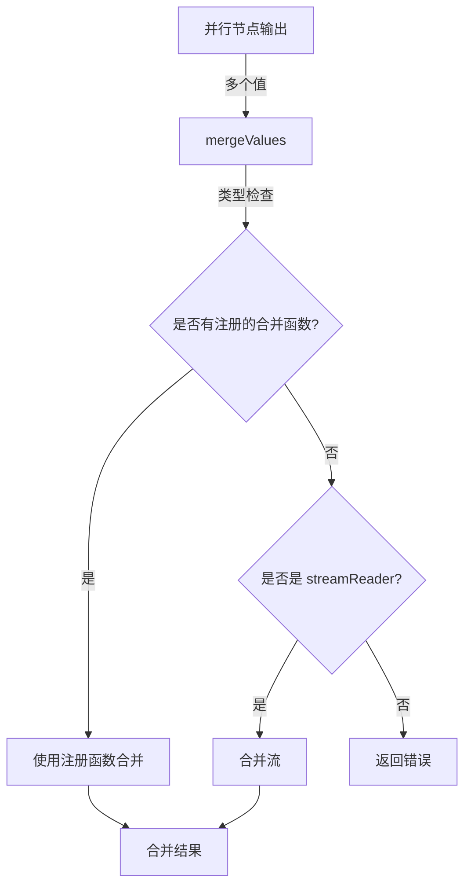

# value_merge_system 模块深度解析

## 1. 概述

`value_merge_system` 模块是 Compose Graph Engine 的核心组成部分，专门负责解决**多路分支输出合并**（fan-in merge）的问题。在构建复杂的工作流时，我们经常会遇到这样的场景：多个并行节点各自产生输出，需要将这些输出以某种方式合并成一个统一的结果，供下游节点使用。`value_merge_system` 就是为了解决这个问题而设计的。

## 2. 问题空间

在深入了解实现之前，让我们先理解为什么需要这样一个模块：

### 2.1 为什么简单的合并不够？

一个天真的实现可能会直接将所有输出放入一个列表中，但这在实际场景中往往不够用：

- **类型安全**：不同类型的数据需要不同的合并策略（例如，合并两个 map vs 合并两个整数）
- **流式数据**：当处理流式数据时，我们需要在数据到达时就开始合并，而不是等待所有数据都到达
- **自定义逻辑**：有时用户需要完全自定义的合并策略（例如，合并两个订单数据时需要特定的业务规则）
- **命名空间**：当合并多个来源的数据时，我们可能需要保留来源信息

### 2.2 设计目标

`value_merge_system` 的设计目标是：
1. **类型安全**：利用 Go 的反射和泛型机制，确保合并操作的类型正确性
2. **可扩展性**：允许用户为任意类型注册自定义合并函数
3. **流式支持**：原生支持流式数据的合并
4. **默认策略**：为常见类型（如 map）提供默认的合并策略

### 2.3 架构角色

在整个 Compose Graph Engine 架构中，`value_merge_system` 扮演着**数据聚合器**的角色：

- **位置**：它位于并行节点和下游节点之间，是 fan-in 模式的关键组件
- **职责**：它负责将多个并行节点的输出转换为单个下游节点可以处理的输入
- **抽象**：它提供了一个统一的合并接口，隐藏了不同类型数据合并的复杂性

可以把它想象成一个**数据交换机**：它接收来自多个来源的数据，按照预定义的规则进行处理，然后将处理后的数据转发到下一个阶段。

## 3. 心理模型

在使用 `value_merge_system` 时，有几个关键的心理模型可以帮助你更好地理解和使用这个模块：

### 3.1 类型注册表

把 `internal` 包中的类型注册表想象成一个**字典**：
- 键是类型（reflect.Type）
- 值是该类型的合并函数

当你调用 `RegisterValuesMergeFunc` 时，你就是在向这个字典中添加条目。当 `mergeValues` 需要合并某个类型的值时，它会先查这个字典。

### 3.2 合并函数的契约

每个合并函数都遵循一个简单的契约：
- 输入：一个该类型的值的切片
- 输出：一个合并后的值和一个可能的错误

你可以把合并函数想象成一个**聚合器**，它把多个相同类型的值"浓缩"成一个值。

### 3.3 流式合并

对于流式数据，合并的心理模型略有不同：
- 不是等待所有数据到达后再合并
- 而是随着数据的到达，逐步进行合并
- 可以想象成一个**管道**，多个输入流汇合成一个输出流

## 4. 核心组件与架构

### 4.1 主要组件

#### 4.1.1 `mergeOptions` 结构体

```go
type mergeOptions struct {
    streamMergeWithSourceEOF bool
    names                    []string
}
```

`mergeOptions` 是配置合并行为的核心结构：
- `streamMergeWithSourceEOF`：控制是否在合并流式数据时包含来源信息
- `names`：当需要保留来源信息时，用于存储每个来源的名称

#### 4.1.2 `RegisterValuesMergeFunc` 函数

```go
func RegisterValuesMergeFunc[T any](fn func([]T) (T, error)) {
    internal.RegisterValuesMergeFunc(fn)
}
```

这是模块的主要扩展点，允许用户为任意类型 `T` 注册自定义合并函数。

#### 4.1.3 `mergeValues` 函数

```go
func mergeValues(vs []any, opts *mergeOptions) (any, error)
```

这是模块的核心逻辑，负责实际执行合并操作。

### 4.2 架构图



## 5. 工作原理

### 5.1 合并流程

`mergeValues` 函数的工作流程可以分为以下几个步骤：

1. **类型检查**：首先检查第一个值的类型
2. **查找合并函数**：在内部注册表中查找该类型是否有注册的合并函数
3. **执行合并**：
   - 如果有注册函数，使用该函数合并所有值
   - 如果没有注册函数但值是 `streamReader` 类型，执行流式合并
   - 否则返回错误

### 5.2 流式数据合并

对于流式数据，`mergeValues` 会：
1. 检查所有流的 chunk 类型是否一致
2. 检查该 chunk 类型是否有注册的合并函数
3. 根据配置决定是否使用带名称的合并方式

### 5.3 内部实现细节

`value_merge_system` 模块的核心逻辑实际上是委托给 `internal` 包实现的：

- `RegisterValuesMergeFunc` 函数直接调用 `internal.RegisterValuesMergeFunc`
- `mergeValues` 函数通过 `internal.GetMergeFunc` 获取注册的合并函数

这种设计实现了关注点分离：
- `compose` 包负责提供公共 API 和处理流式数据
- `internal` 包负责维护类型注册表和提供底层合并机制

这种分层设计使得模块更加模块化，也更容易维护和测试。

## 6. 使用示例

### 6.1 注册自定义合并函数

```go
// 为自定义类型注册合并函数
type MyData struct {
    Value int
}

RegisterValuesMergeFunc(func(data []MyData) (MyData, error) {
    // 合并逻辑：将所有值相加
    sum := 0
    for _, d := range data {
        sum += d.Value
    }
    return MyData{Value: sum}, nil
})
```

### 6.2 合并 map

map 类型有默认的合并函数，无需额外注册：

```go
// 假设有两个 map
map1 := map[string]int{"a": 1, "b": 2}
map2 := map[string]int{"b": 3, "c": 4}

// 合并结果会是 {"a": 1, "b": 3, "c": 4}
// 注意：后面的值会覆盖前面的值
```

## 7. 设计权衡

### 7.1 类型安全 vs 灵活性

**选择**：通过反射和内部注册表实现类型安全的合并

**理由**：
- 类型安全可以在编译时（通过泛型）和运行时（通过反射检查）捕获错误
- 内部注册表允许灵活地扩展支持的类型
- 这种设计在保持类型安全的同时，提供了足够的灵活性

**权衡**：
- 优点：类型安全，易于扩展
- 缺点：需要手动注册合并函数，有一定的运行时开销

### 7.2 默认策略 vs 完全自定义

**选择**：为常见类型提供默认策略，同时允许完全自定义

**理由**：
- 常见类型（如 map）的默认策略可以覆盖大多数使用场景
- 允许自定义合并函数可以满足特殊的业务需求

**权衡**：
- 优点：开箱即用，同时支持高级场景
- 缺点：默认策略可能不适合所有场景，需要文档明确说明

## 8. 注意事项与陷阱

### 8.1 类型一致性

所有要合并的值必须是相同类型，否则 `mergeValues` 会返回错误。

### 8.2 流式数据的 chunk 类型

合并流式数据时，不仅所有流必须是 `streamReader` 类型，它们的 chunk 类型也必须一致，并且该 chunk 类型必须有注册的合并函数。

### 8.3 map 合并的覆盖行为

默认的 map 合并策略是后面的值覆盖前面的值，这可能不是你想要的行为。如果需要不同的合并策略（例如，将值相加），请注册自定义合并函数。

## 9. 与其他模块的关系

### 9.1 依赖关系

`value_merge_system` 模块依赖以下组件：
- **internal 包**：提供类型注册表和底层合并机制
- **streamReader 接口**：用于处理流式数据的合并
- **reflect 包**：用于运行时类型检查和处理

### 9.2 被依赖关系

以下模块依赖 `value_merge_system`：
- **[Compose Graph Engine](compose_graph_engine.md)**：在处理 fan-in 合并场景时使用
- **[Branch System](branch_system.md)**：可能在分支汇合时使用

### 9.3 数据流

在典型的 fan-in 场景中，数据流如下：

1. **并行执行**：多个节点并行执行，各自产生输出
2. **收集输出**：这些输出被收集到一个 `[]any` 切片中
3. **合并**：调用 `mergeValues` 函数合并这些输出
4. **传递**：合并后的结果传递给下游节点

对于流式数据，这个过程是增量的，数据一到达就开始合并，而不是等待所有数据都到达。

### 9.4 相关模块

- **[Field Mapping System](field_mapping_system.md)**：通常在合并之前使用，用于准备要合并的数据
- **[Schema Stream](schema_stream.md)**：提供流式数据的基础结构

## 10. 总结

`value_merge_system` 模块是一个设计精巧的组件，它解决了工作流中多路输出合并的复杂问题。通过类型安全的设计、灵活的扩展机制和对流式数据的原生支持，它为构建复杂的并行工作流提供了坚实的基础。

关键要点：
- 使用 `RegisterValuesMergeFunc` 为自定义类型注册合并函数
- 注意 map 合并的默认覆盖行为
- 合并流式数据时确保 chunk 类型一致且有相应的合并函数
