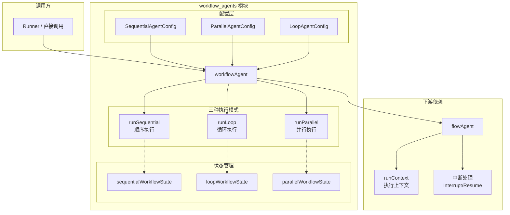
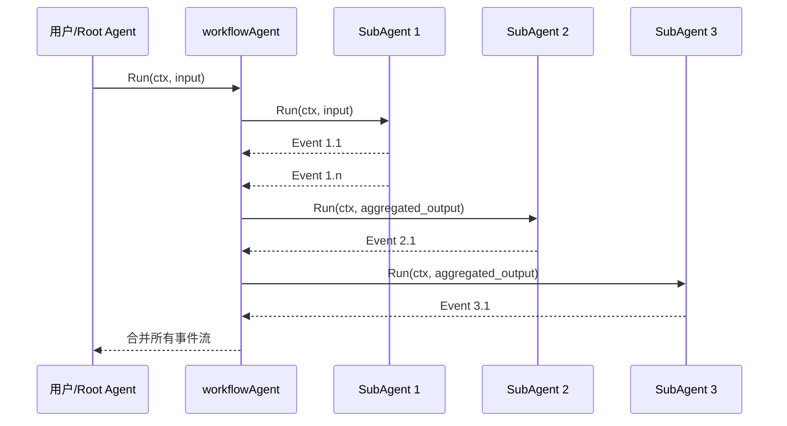
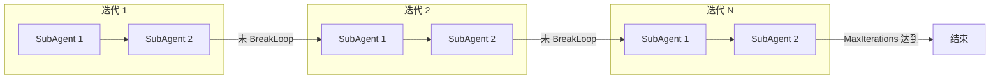
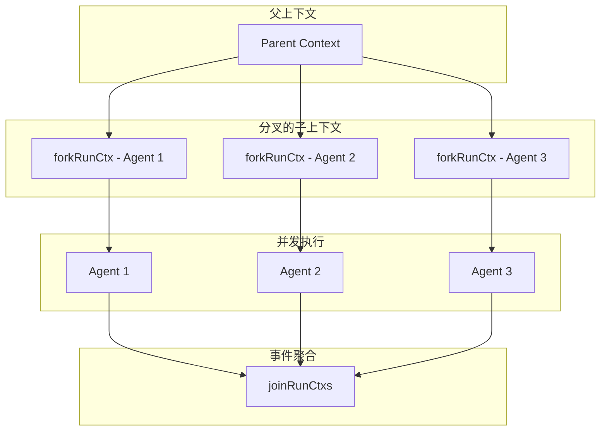
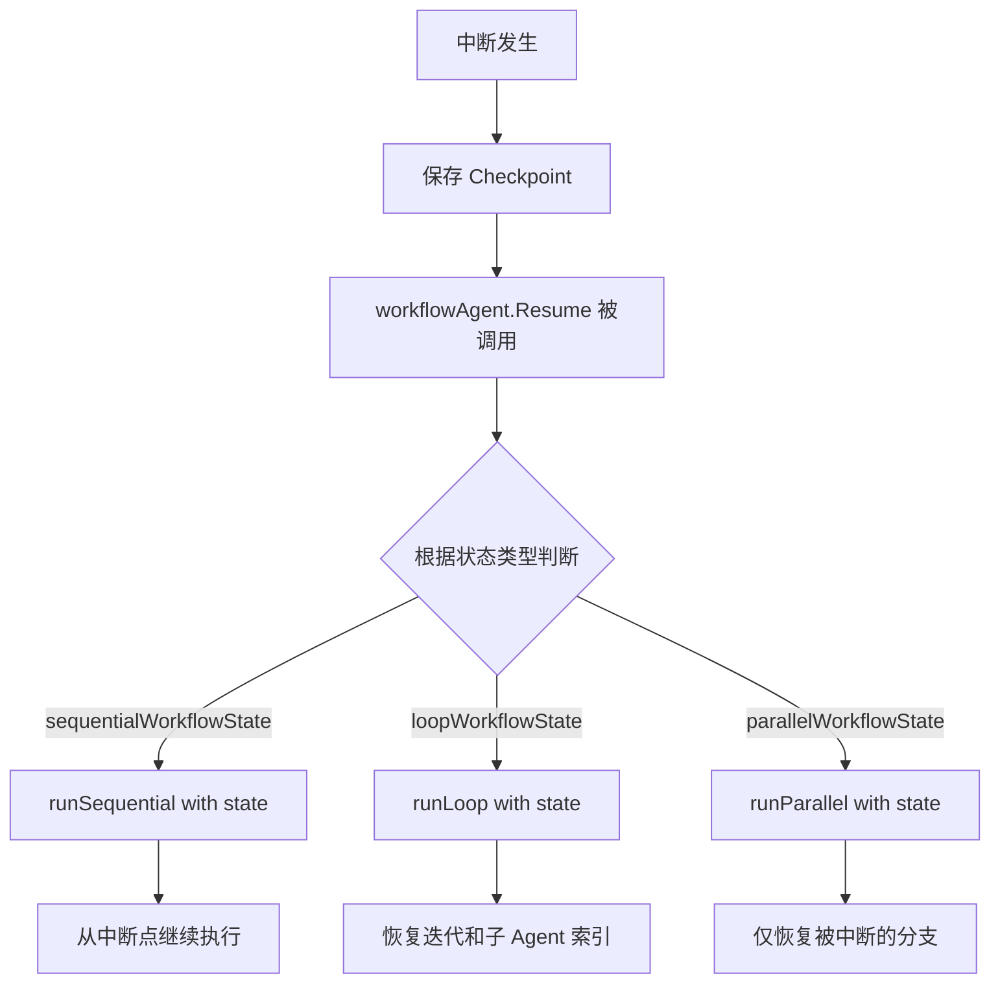
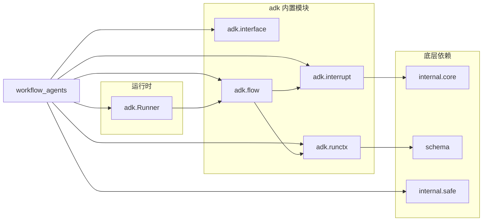

# workflow_agents 模块详解

## 概述

`workflow_agents` 模块是 Eino ADK (Agent Development Kit) 中的工作流编排核心，负责协调多个子 Agent 的协作执行。该模块提供了三种基本的工作流模式：**顺序执行 (Sequential)**、**并行执行 (Parallel)** 和 **循环执行 (Loop)**。

### 解决的问题

在构建复杂的 AI Agent 应用时，单个 Agent 的能力往往有限。实际场景中，我们需要：

1. **分而治之**：将复杂任务拆分为多个专业化的子任务，由不同的 Agent 分别处理
2. **串行依赖**：某些任务必须按特定顺序执行，后续任务依赖前序任务的输出
3. **并行优化**：对于相互独立的任务，同时执行以提高吞吐量
4. **迭代处理**：对于需要重复执行直到满足条件的场景（如对话轮次达到上限、用户明确中断等）

`workflow_agents` 模块正是为了解决这些编排需求而设计的。它不仅管理子 Agent 的执行流程，还处理了**中断恢复**（Checkpoint/Resume）这一关键特性，使得长时间运行的 Agent 工作流能够在被中断后从断点继续执行。

### 核心抽象

理解这个模块的关键是把握以下几个核心抽象：

| 抽象 | 职责 | 关键特性 |
|------|------|----------|
| `workflowAgent` | 核心工作流执行器 | 三种执行模式、状态管理、中断处理 |
| `SequentialAgentConfig` | 顺序执行配置 | 子 Agent 列表、名称、描述 |
| `ParallelAgentConfig` | 并行执行配置 | 子 Agent 列表、名称、描述 |
| `LoopAgentConfig` | 循环执行配置 | 子 Agent 列表、最大迭代次数 |
| `BreakLoopAction` | 循环中断机制 | 编程式中断控制（非 LLM 调用） |

---

## 架构设计

### 整体架构图



### 执行流程

#### 1. 顺序执行 (Sequential)



**关键设计点**：
- **上下文传递**：每个子 Agent 运行时，其执行路径 (`RunPath`) 会累积更新。例如执行到第三个 Agent 时，RunPath 可能为 `[{root}, {sub1}, {sub2}, {sub3}]`
- **状态传递**：前一个 Agent 的输出消息自动作为下一个 Agent 的输入上下文
- **中断恢复**：`sequentialWorkflowState.InterruptIndex` 记录了中断发生在哪个子 Agent 索引处

#### 2. 循环执行 (Loop)



**关键设计点**：
- **迭代计数器**：`loopWorkflowState.LoopIterations` 和 `loopWorkflowState.SubAgentIndex` 共同维护恢复点
- **BreakLoop 机制**：允许子 Agent 编程式地请求退出循环（区别于 LLM 生成的退出请求）
- **无最大迭代**：当 `MaxIterations = 0` 时，循环将无限执行直到收到 BreakLoop 或其他中断信号

#### 3. 并行执行 (Parallel)



**关键设计点**：
- **上下文分叉** (`forkRunCtx`)：每个子 Agent 获得独立的上下文副本，但共享事件历史
- **Lane 事件隔离**：并行分支的事件通过 `LaneEvents` 机制隔离，仅在 `joinRunCtxs` 时合并
- **中断聚合** (`CompositeInterrupt`)：多个子 Agent 可能同时中断，需要将它们的中断信号组合成单一中断事件

---

## 核心组件详解

### workflowAgent 结构体

```go
type workflowAgent struct {
    name        string
    description string
    subAgents   []*flowAgent

    mode workflowAgentMode  // sequential / loop / parallel

    maxIterations int       // Loop 模式下的最大迭代次数
}
```

**设计意图**：
- `workflowAgent` 本身不实现 `Agent` 接口的具体执行逻辑，而是充当**编排层**
- 它通过 `mode` 字段区分三种执行模式，将具体执行委托给 `runSequential`、`runLoop`、`runParallel` 方法
- 这种设计符合**策略模式 (Strategy Pattern)**，便于扩展新的执行模式

### 状态管理

#### sequentialWorkflowState

```go
type sequentialWorkflowState struct {
    InterruptIndex int  // 中断发生在第几个子 Agent
}
```

**恢复逻辑**：
```go
// 恢复时，从中断点的下一个 Agent 开始执行
startIdx = seqState.InterruptIndex
// 但需要重新构建之前 Agent 的 RunPath
for i := 0; i < startIdx; i++ {
    steps = append(steps, a.subAgents[i].Name(seqCtx))
}
```

#### loopWorkflowState

```go
type loopWorkflowState struct {
    LoopIterations int  // 当前迭代轮次
    SubAgentIndex  int  // 当前迭代内执行到第几个子 Agent
}
```

#### parallelWorkflowState

```go
type parallelWorkflowState struct {
    SubAgentEvents map[int][]*agentEventWrapper  // 各分支已执行的事件
}
```

### WorkflowInterruptInfo

这是用于 Checkpoint 持久化的结构体，通过 `gob` 序列化：

```go
type WorkflowInterruptInfo struct {
    OrigInput *AgentInput

    SequentialInterruptIndex int
    SequentialInterruptInfo  *InterruptInfo

    LoopIterations int

    ParallelInterruptInfo map[int]*InterruptInfo
}
```

**设计权衡**：
- **后向兼容**：`WorkflowInterruptInfo` 作为 `InterruptInfo.Data` 字段存储（已废弃字段），同时通过 `CompositeInterrupt` 的 state 参数传递新状态
- **双重存储**：这种设计既保持了与旧版本 Checkpoint 格式的兼容性，又支持了新的状态恢复机制

### BreakLoopAction

这是一个**编程式控制流**机制，仅供框架内部使用，不应由 LLM 触发：

```go
type BreakLoopAction struct {
    From              string  // 发起中断的 Agent 名称
    Done              bool    // 框架标记：已处理
    CurrentIterations int     // 框架标记：中断时的迭代次数
}
```

**使用场景**：
- 子 Agent 完成Tool调用后需要根据 Tool 结果决定是否继续循环
- 例如：用户说"够了，停止迭代"时

---

## 数据流分析

### 事件传递机制

在 workflow_agents 中，事件 (AgentEvent) 的流动遵循以下规则：

```go
// 典型的事件处理循环
for {
    event, ok := subIterator.Next()
    if !ok { break }
    
    if event.Err != nil {
        generator.Send(event)  // 错误立即上抛
        return nil
    }
    
    if lastActionEvent != nil {
        // 先发送上一个 action 事件
        generator.Send(lastActionEvent)
        lastActionEvent = nil
    }
    
    if event.Action != nil {
        // 消息事件后紧跟 Action 事件
        lastActionEvent = event
        continue
    }
    
    // 普通消息事件直接转发
    generator.Send(event)
}
```

**关键观察**：
1. **Action 事件延迟发送**：消息事件和其对应的 Action 事件分开发送，确保消费者能完整处理每个输出
2. **短路逻辑**：错误事件立即返回，不会继续执行后续子 Agent

### RunPath 维护

`RunPath` 追踪整个执行链，对于调试和可追溯性至关重要：

```go
// 顺序执行时累积路径
subAgent := a.subAgents[i]
subIterator = subAgent.Run(seqCtx, nil, opts...)
seqCtx = updateRunPathOnly(seqCtx, subAgent.Name(seqCtx))  // 追加当前 Agent 到路径
```

**并行执行的特殊性**：
- 并行分支独立维护自己的 `RunPath`，但在聚合时会合并
- 测试用例 `TestNestedParallelWorkflow` 验证了嵌套并行结构中事件可见性的正确性

---

## 中断与恢复机制

### 中断类型

| 中断类型 | 触发方式 | Workflow 处理 |
|----------|----------|---------------|
| **简单中断** | `Interrupt(ctx, info)` | 立即停止当前子 Agent，向上传递中断信号 |
| **带状态中断** | `StatefulInterrupt(ctx, info, state)` | 额外保存状态信息，恢复时可获取 |
| **组合中断** | `CompositeInterrupt(ctx, info, state, signals...)` | 聚合多个子 Agent 的中断信号 |

### 恢复流程



---

## 设计权衡与 trade-off 分析

### 1. 同步 vs 异步执行

**选择**：使用 goroutine + AsyncIterator 的异步模式

**权衡**：
- **优点**：避免阻塞主线程，特别是并行执行时能充分利用 Go 的并发优势
- **缺点**：增加了调试复杂性，错误传播需要通过 panic/recover 机制处理

```go
// 关键实现
go func() {
    defer func() {
        panicErr := recover()
        // ... 统一错误处理
    }()
    // ... 执行逻辑
}()
```

### 2. 状态内嵌 vs 外部存储

**选择**：将状态作为 Go 对象保存在内存中，通过 Checkpoint 机制持久化

**权衡**：
- **优点**：运行时性能高，无需每次操作都序列化
- **缺点**：需要额外处理状态序列化和反序列化

### 3. 严格隔离 vs 共享上下文

**选择**：并行模式下通过 `forkRunCtx` 创建隔离上下文，但共享事件历史

**权衡**：
- **优点**：各分支可以独立记录 LaneEvents，不会相互干扰
- **缺点**：需要小心处理竞态条件（通过 mutex 保护共享状态）

```go
// 并行执行中的互斥保护
mu.Lock()
subInterruptSignals = append(subInterruptSignals, event.Action.internalInterrupted)
dataMap[idx] = event.Action.Interrupted
mu.Unlock()
```

### 4. 事件顺序保证

**选择**：在 `joinRunCtxs` 中按时间戳排序事件

```go
sort.Slice(newEvents, func(i, j int) bool {
    return newEvents[i].TS < newEvents[j].TS
})
```

**权衡**：
- **优点**：确保事件按实际发生顺序呈现给用户
- **缺点**：轻微的性能开销（但在实际场景中事件数量通常有限）

---

## 扩展点与使用指南

### 创建自定义工作流 Agent

```go
// 使用提供的配置结构创建
config := &SequentialAgentConfig{
    Name:        "MyWorkflow",
    Description: "处理用户查询的工作流",
    SubAgents:   []Agent{agent1, agent2, agent3},
}

workflow, err := NewSequentialAgent(ctx, config)
```

### 处理中断

```go
// 在 Runner 中处理中断
iter := runner.Query(ctx, "用户查询")

for {
    event, ok := iter.Next()
    if !ok { break }
    
    if event.Action != nil && event.Action.Interrupted != nil {
        // 获取中断点信息
        checkpointID := saveCheckpoint(ctx, event)
        
        // 等待用户输入后恢复
        resumeParams := &ResumeParams{
            Targets: map[string]any{
                "interrupt_id": userInput,
            },
        }
        runner.ResumeWithParams(ctx, checkpointID, resumeParams)
    }
}
```

### 选项过滤机制

`workflow_agents` 支持将特定选项仅传递给目标 Agent：

```go
// 只有 "Agent1" 能看到这个选项
option := withValue("specific data").DesignateAgent("Agent1")
seqAgent.Run(ctx, input, option)
```

---

## 常见陷阱与注意事项

### 1. 空 SubAgents 列表

```go
// 不会报错，但不会执行任何操作
agent, _ := NewSequentialAgent(ctx, &SequentialAgentConfig{
    SubAgents: []Agent{},  // 空列表
})
```

### 2. 循环 Agent 的默认行为

```go
// MaxIterations = 0 意味着无限循环！
loopAgent, _ := NewLoopAgent(ctx, &LoopAgentConfig{
    MaxIterations: 0,  // 危险：直到收到 BreakLoop 才停止
})
```

### 3. 并行中断的竞态条件

当多个子 Agent 同时中断时，`runParallel` 使用互斥锁保护共享数据：

```go
// 必须使用锁保护
mu.Lock()
subInterruptSignals = append(subInterruptSignals, event.Action.internalInterrupted)
mu.Unlock()
```

### 4. RunPath 重建

恢复时必须重建完整的 `RunPath`，否则调试时无法追踪事件来源：

```go
// 正确：重建路径
var steps []string
for i := 0; i < startIdx; i++ {
    steps = append(steps, a.subAgents[i].Name(seqCtx))
}
seqCtx = updateRunPathOnly(seqCtx, steps...)
```

### 5. 嵌套工作流的事件可见性

测试用例 `TestNestedParallelWorkflow` 验证了重要特性：
- 前置 Agent 的事件对后续并行分支可见
- 分支内部的事件不会泄漏到其他分支
- 恢复时每个分支只能看到自己的事件 + 前置事件

---

## 与其他模块的关系

### 依赖关系图



### 关键依赖

| 模块 | 作用 | 关键类型/函数 |
|------|------|---------------|
| [agent_contracts_and_context](./agent_contracts_and_context.md) | Agent 接口定义 | `Agent`, `ResumableAgent` |
| [run_context_and_session_state](./run_context_and_session_state.md) | 执行上下文管理 | `runContext`, `runSession` |
| [interrupt_resume_bridge](./interrupt_resume_bridge.md) | 中断处理 | `Interrupt`, `CompositeInterrupt` |
| [flow_agent_orchestration](./flow_agent_orchestration.md) | Agent 编排 | `flowAgent`, `toFlowAgent` |

---

## 总结

`workflow_agents` 模块是 Eino ADK 中处理多 Agent 协作的核心组件。通过提供顺序、并行和循环三种执行模式，它满足了大多数复杂 Agent 应用的编排需求。

**设计哲学**：
1. **关注点分离**：工作流编排与具体 Agent 实现解耦
2. **状态驱动**：通过状态对象而非复杂的状态机管理执行流程
3. **可恢复性**：中断恢复作为一等公民设计，而非事后添加的特性
4. **灵活性**：通过选项过滤机制支持细粒度的执行控制

**使用建议**：
- 对于简单场景，直接使用 `NewSequentialAgent` / `NewParallelAgent` / `NewLoopAgent`
- 对于需要精细控制中断恢复的场景，深入理解 `WorkflowInterruptInfo` 和状态管理
- 并行执行时注意事件隔离和竞态条件