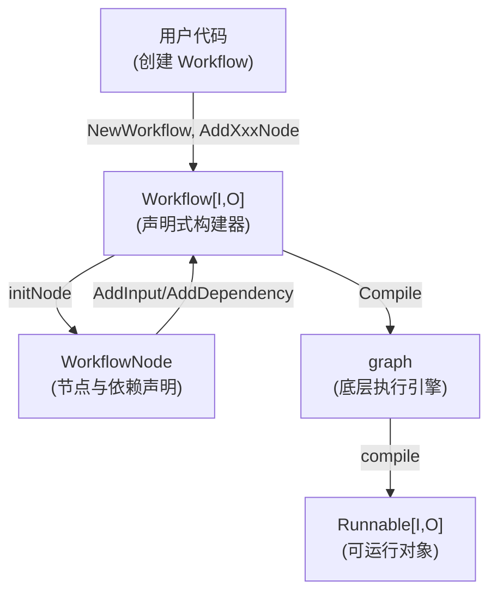

# workflow_core 模块技术深度剖析

## 1. 引言与问题定位

在构建复杂的 AI 应用流水线时，我们面临一个核心挑战：如何以简洁、可读的方式定义节点间的依赖关系和数据流，同时保证执行引擎的高效和正确性。

直接使用底层的 [Graph 引擎](compose_graph_engine.md) 虽然强大，但需要显式管理边（Edge），这在节点数量增长时会变得难以维护。开发者需要同时考虑：
1. **执行顺序**（哪些节点需要先完成）
2. **数据流**（数据如何从一个节点流向另一个）
3. **字段映射**（如何将源节点的输出字段映射到目标节点的输入字段）

这就是 `workflow_core` 模块诞生的原因 —— 它提供了一个更高级的抽象层，让开发者可以用"声明式依赖"的思维来构建流水线，而不是"边式思维"。

## 2. 核心概念与心智模型

### 2.1 核心抽象

`Workflow` 可以被视为一个 **"声明式的有向无环图 (DAG) 构建器"**。它将复杂的边管理转化为三个直观的概念：

1. **WorkflowNode**：工作流中的节点，不仅代表一个计算单元，还知道如何声明它需要什么数据以及从哪里获取。
2. **依赖关系**：通过 `AddInput` 和 `AddDependency` 声明"谁在谁之前运行"以及"谁需要谁的数据"。
3. **字段映射**：通过 `MapFields` 等机制精确控制数据如何从源节点流向目标节点。

### 2.2 心智模型

想象 `Workflow` 是一个 **"项目管理系统"**：
- 每个 `WorkflowNode` 是一个团队成员，有特定的技能（如调用模型、处理文档）
- `AddInput` 是说："在我开始工作前，我需要从张三那里拿到这些特定数据"
- `AddDependency` 是说："我等李四做完再开始，虽然我不需要他的数据"
- `SetStaticValue` 是给成员一些固定的参考资料
- `Compile` 是项目经理把所有这些关系整理成一张详细的执行计划表

## 3. 架构与数据流向

### 3.1 高层架构



### 3.2 关键数据流

当你构建并运行一个 Workflow 时，数据流经以下阶段：

1. **构建阶段**：
   - 开发者调用 `AddXxxNode` 添加节点，获得 `WorkflowNode`
   - 通过 `WorkflowNode.AddInput` 或 `AddDependency` 声明关系
   - 这些声明被暂存为延迟执行的函数，在 `Compile` 时才真正添加到图中

2. **编译阶段** (`Compile`)：
   - `Workflow.compile` 被调用
   - 分支被处理并添加到底层图中
   - 所有暂存的 `addInput` 函数被执行，建立真正的边
   - 静态值被转换为前置处理器
   - 最终调用底层 `graph.compile` 生成 `Runnable`

3. **执行阶段**：
   - 通过 `Runnable.Invoke` 或 `Stream` 执行
   - 这完全由底层的 [Graph 引擎](compose_graph_engine.md) 处理

## 4. 核心组件深度剖析

### 4.1 Workflow[I, O]

**设计意图**：作为整个工作流的容器和入口点，它是一个泛型类型，通过 `I` 和 `O` 类型参数提供编译时类型安全。

**关键特性**：
- 封装了底层的 `graph`，但不直接暴露它
- 维护 `workflowNodes` 映射，跟踪所有节点
- 维护 `dependencies` 映射，跟踪节点间的依赖关系类型
- 通过类型参数确保输入输出类型安全

**关键方法**：
- `NewWorkflow`：创建新工作流，接受 `NewGraphOption` 配置底层图
- `AddXxxNode` 系列：添加各种类型的节点（ChatModel、Retriever 等）
- `AddBranch`：添加分支结构
- `Compile`：将工作流编译为可运行的 `Runnable`

### 4.2 WorkflowNode

**设计意图**：表示工作流中的一个节点，提供流畅的 API 来声明它的输入、依赖和静态值。

**核心字段**：
```go
type WorkflowNode struct {
    g                *graph           // 底层图引用
    key              string           // 节点唯一标识
    addInputs        []func() error   // 延迟执行的输入添加函数
    staticValues     map[string]any   // 编译时确定的静态值
    dependencySetter func(...)        // 依赖设置回调
    mappedFieldPath  map[string]any   // 已映射字段路径跟踪（用于冲突检测）
}
```

**值得注意的设计**：
- `addInputs` 存储的是**函数**，而不是立即执行添加操作。这种延迟执行策略是关键 —— 它允许我们以任意顺序声明节点和依赖，而在编译时一次性构建正确的图结构。
- `mappedFieldPath` 用于防止字段映射冲突（例如不能同时映射整个对象和该对象的某个字段）

**关键方法**：

1. **`AddInput(fromNodeKey string, inputs ...*FieldMapping)`**
   - 最常用的方法，同时建立数据依赖和执行依赖
   - 如果没有提供 `FieldMapping`，默认映射整个输出
   - 返回 `*WorkflowNode` 以支持链式调用

2. **`AddInputWithOptions(...)`**
   - 高级版本，接受 `WorkflowAddInputOpt`
   - 支持 `WithNoDirectDependency()` 选项，这是一个重要的高级特性

3. **`AddDependency(fromNodeKey string)`**
   - 仅建立执行依赖，不传递数据
   - 适用于需要确保执行顺序但不需要数据的场景

4. **`SetStaticValue(path FieldPath, value any)`**
   - 设置节点的静态值，这些值在编译时确定
   - 在执行时会与其他输入合并

### 4.3 字段映射系统

字段映射是 `Workflow` 最强大的特性之一，它让你可以精确控制数据如何流动。

**核心概念**：
- `FieldPath`：表示字段路径，如 `FieldPath{"user", "name"}`
- `FieldMapping`：定义从源节点的某个字段到目标节点的某个字段的映射

**使用示例**：
```go
// 映射特定字段
node.AddInput("userNode", MapFields("user.name", "displayName"))

// 使用自定义提取器
node.AddInput("dataNode", MapFieldsWithExtractor(
    func(input any) (any, error) {
        // 自定义转换逻辑
        return transform(input), nil
    },
    "result"
))
```

**映射冲突检测**：
`WorkflowNode.checkAndAddMappedPath` 方法会检测并防止冲突：
- 不能同时映射整个输出和单个字段
- 不能有两个映射指向同一个终端字段

### 4.4 分支处理

`Workflow` 中的分支处理与底层 `Graph` 有一个关键区别：

**重要差异**：
- **Graph 的 Branch**：自动将分支的输入传递给选中的节点
- **Workflow 的 Branch**：不会自动传递输入，分支的结束节点需要自己定义字段映射

这是一个有意的设计选择，它使得 Workflow 中的数据流更加明确和可预测。

## 5. 设计决策与权衡

### 5.1 延迟执行 vs 立即执行

**决策**：使用延迟执行（将添加输入的操作存储为函数，在 Compile 时执行）

**原因**：
- 允许以任意顺序添加节点和声明依赖
- 简化了 API 设计，不需要先添加所有被依赖的节点
- 在编译时可以进行更全面的验证

**权衡**：
- 增加了内部复杂性
- 一些错误（如循环依赖）只能在编译时发现，而不是在调用 `AddInput` 时

### 5.2 显式依赖声明 vs 隐式依赖推断

**决策**：要求显式声明依赖

**原因**：
- 提高可读性：依赖关系一目了然
- 减少意外行为：不会因为字段名相同就自动创建依赖
- 更精确的控制：可以区分数据依赖和执行依赖

**权衡**：
- 需要更多的代码
- 对于简单场景可能显得冗长

### 5.3 类型安全 vs 灵活性

**决策**：通过泛型 `Workflow[I, O]` 提供编译时类型安全，同时内部使用 `any` 保持灵活性

**原因**：
- 对用户提供类型安全的 API
- 内部处理需要处理各种类型的数据
- 类型参数作为文档，明确工作流的输入输出

**权衡**：
- 增加了 API 的复杂性（需要理解泛型）
- 内部实现需要处理类型断言和反射

### 5.4 无环保证

**决策**：Workflow 底层使用 `NodeTriggerMode(AllPredecessor)`，因此不支持循环

**原因**：
- 简化了执行模型和心智模型
- 大多数 AI 应用流水线不需要循环
- 避免了复杂的循环检测和处理

**权衡**：
- 限制了表达能力（对于需要循环的场景，可能需要使用更底层的 Graph）
- 但对于目标场景（AI 应用流水线），这是一个合理的折衷

## 6. 高级特性与使用模式

### 6.1 `WithNoDirectDependency()` 的深层理解

这是一个容易被误解但非常强大的特性。让我们通过一个场景来理解它：

**场景**：
```
Input → A → Branch → B → END
         ↘                ↗
           C (需要 A 的数据)
```

在这个场景中，C 需要 A 的数据，但 C 应该在 Branch 选择 B 之后才执行（或者说，C 的执行应该由 Branch 的结果间接控制）。

如果我们直接使用 `C.AddInput("A")`，会创建一个从 A 到 C 的直接执行依赖，这可能会绕过 Branch 的控制。

**解决方案**：
```go
C.AddInputWithOptions("A", mappings, WithNoDirectDependency())
```

这会：
1. 创建从 A 到 C 的数据映射
2. 但不创建直接的执行依赖
3. C 的执行将由它的其他直接依赖（在这个例子中可能是 B）来控制

**关键要求**：必须存在一条从 A 到 C 的间接路径，确保 A 在 C 之前执行。

### 6.2 静态值的使用

`SetStaticValue` 允许你为节点设置在编译时确定的值：

```go
node.SetStaticValue(FieldPath{"config", "maxTokens"}, 100)
node.SetStaticValue(FieldPath{"prompt", "template"}, "Hello {name}")
```

这些值会在节点执行前与其他输入合并。

### 6.3 端点连接模式

连接到 END 节点的推荐方式（也是类型安全的方式）是：

```go
wf.End().AddInput("resultNode", MapFields("output", ""))
```

而不是使用已弃用的 `AddEnd` 方法。

## 7. 常见陷阱与注意事项

### 7.1 字段映射冲突

**陷阱**：
```go
node.AddInput("sourceA") // 映射整个输出
node.AddInput("sourceB", MapFields("field", "field")) // 冲突！
```

**原因**：你不能同时映射整个对象和该对象的单个字段。

**解决**：明确你需要哪些字段，避免模糊的映射。

### 7.2 分支中的数据传递

**陷阱**：期望分支自动将输入传递给选中的节点。

**记住**：Workflow 的分支不会自动传递输入，你需要显式地为分支的结束节点添加输入。

### 7.3 `WithNoDirectDependency()` 的间接路径要求

**陷阱**：使用 `WithNoDirectDependency()` 但没有确保存在间接路径。

**后果**：可能导致节点永远不会执行，或者执行顺序不正确。

**检查**：确保通过其他节点存在一条从源节点到目标节点的路径。

### 7.4 静态值与输入映射的冲突

**陷阱**：静态值和输入映射可能会冲突。

**行为**：如果两者映射到相同的字段路径，会发生什么？需要查看 `mergeValues` 的实现来确定优先级。

**建议**：避免静态值和输入映射指向相同的字段，或者明确理解合并规则。

## 8. 与其他模块的关系

- **底层依赖**：`Workflow` 是对 [compose.graph](compose_graph_engine.md) 的高级封装
- **类型系统**：使用 [schema](schema_core_types.md) 中的消息和流类型
- **组件集成**：与各种组件接口（model、retriever、embedding 等）无缝集成
- **Runnable 接口**：编译后产生 [Runnable](compose_graph_engine.md)，这是整个系统的核心执行抽象

## 9. 总结

`workflow_core` 模块成功地将复杂的图构建问题转化为直观的依赖声明问题。它的核心价值在于：

1. **简化心智模型**：从"管理边"转变为"声明依赖"
2. **类型安全**：通过泛型提供编译时类型检查
3. **精确控制**：细粒度地控制数据流和执行顺序
4. **优雅的 API**：流畅的链式调用风格

虽然它不支持循环，在表达能力上略低于底层的 Graph，但对于绝大多数 AI 应用流水线场景，这是一个非常合理的折衷 —— 它在简单性和能力之间找到了一个很好的平衡点。
