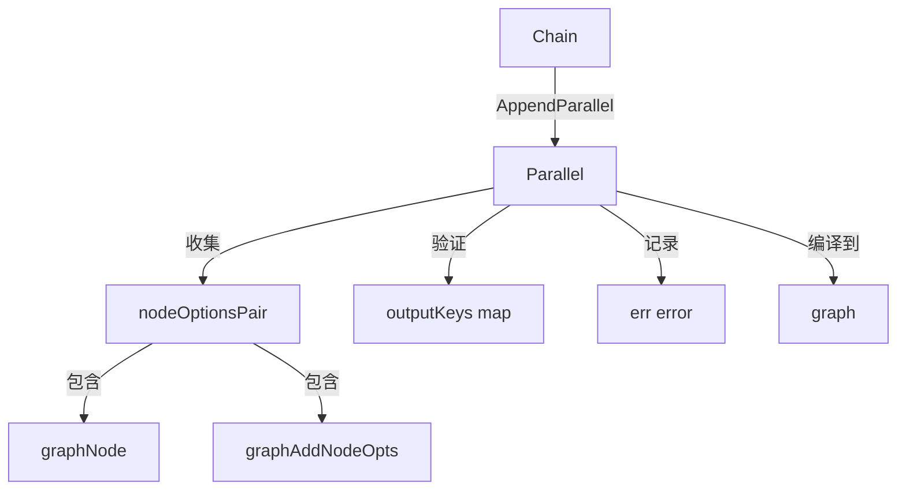

# workflow_parallel 模块技术深度文档

## 1. 问题背景与模块定位

在构建复杂的 AI 应用工作流时，我们经常遇到这样的场景：需要同时执行多个独立的操作——比如用不同的提示词调用多个大模型、并行检索多个数据源、或者同时处理多个文档。如果这些操作串行执行，会显著增加整个工作流的延迟。

这就是 `workflow_parallel` 模块要解决的核心问题：**提供一种简洁、类型安全的方式，在工作流中并行执行多个节点，并将它们的结果组织成一个键值对结构供下游使用**。

### 为什么不直接使用图引擎？

虽然底层的 [Compose Graph Engine](compose_graph_engine.md) 已经支持并行执行，但直接使用图 API 对于常见的"多个节点并行执行，收集结果"场景来说过于繁琐。`Parallel` 结构体是一个**专用抽象**，它封装了图引擎的复杂性，提供了一个流畅的 API 来表达并行执行的意图。

---

## 2. 核心抽象与心智模型

### 2.1 核心抽象

`Parallel` 结构体是这个模块的核心，你可以把它想象成一个**"并行任务收集器"**：

- **输入**：所有并行节点共享同一个输入
- **执行**：所有节点同时开始执行，互不等待
- **输出**：一个 `map[string]any`，其中键是你为每个节点指定的 `outputKey`，值是对应节点的输出结果

### 2.2 心智模型类比

把 `Parallel` 想象成**餐厅的厨房出餐口**：

1. 同一个订单（输入）被送到多个厨师（并行节点）手中
2. 每个厨师根据订单准备不同的菜品（执行各自的逻辑）
3. 所有菜品准备好后，被放在一个托盘里（`map[string]any`），每个菜品有自己的标签（`outputKey`）
4. 托盘被一起送到传菜口（输出给下一个环节）

关键在于：所有厨师同时工作，而不是一个做完另一个才开始。

---

## 3. 架构与数据流

### 3.1 组件架构



### 3.2 数据流详解

当你使用 `Parallel` 时，数据流动如下：

1. **构建阶段**：
   - 调用 `NewParallel()` 创建一个空的并行容器
   - 调用各种 `Add*` 方法（如 `AddChatModel`、`AddLambda`）向容器中添加节点
   - 每个节点都被赋予一个唯一的 `outputKey`
   - `Parallel` 内部会验证 `outputKey` 的唯一性

2. **集成阶段**：
   - 将 `Parallel` 实例传递给 `Chain.AppendParallel()` 或类似方法
   - 工作流在编译时，会将 `Parallel` 中的所有节点转换为图引擎中的节点
   - 这些节点被配置为从同一个输入节点接收数据，并将输出写入不同的状态键

3. **执行阶段**：
   - 输入数据到达并行块时，被复制发送给所有并行节点
   - 图引擎调度所有节点并行执行
   - 每个节点的输出被存储在以 `outputKey` 命名的状态字段中
   - 所有节点完成后，这些字段被打包成一个 `map[string]any` 作为并行块的输出

---

## 4. 核心组件深度解析

### 4.1 Parallel 结构体

```go
type Parallel struct {
    nodes      []nodeOptionsPair  // 存储所有并行节点及其选项
    outputKeys map[string]bool     // 用于检测重复的 outputKey
    err        error               // 构建过程中遇到的错误
}
```

**设计意图**：
- `nodes` 切片保存了所有要并行执行的节点，每个元素是节点实例和其配置选项的配对
- `outputKeys` 是一个集合，用于快速检测是否有重复的 `outputKey`——这是一个常见的错误源
- `err` 字段采用了"延迟错误"模式：构建过程中的错误不会立即 panic，而是存储起来，在编译时统一处理

### 4.2 NewParallel 函数

```go
func NewParallel() *Parallel {
    return &Parallel{
        outputKeys: make(map[string]bool),
    }
}
```

**设计意图**：简单的工厂函数，确保 `outputKeys` map 被正确初始化，避免 nil map panic。

### 4.3 Add* 方法族

`Parallel` 提供了一系列类型安全的 `Add*` 方法，每个方法对应一种组件类型：

- `AddChatModel` - 添加聊天模型节点
- `AddChatTemplate` - 添加聊天模板节点
- `AddToolsNode` - 添加工具节点
- `AddLambda` - 添加 Lambda 函数节点
- `AddEmbedding` - 添加嵌入模型节点
- `AddRetriever` - 添加检索器节点
- `AddLoader` - 添加文档加载器节点
- `AddIndexer` - 添加索引器节点
- `AddDocumentTransformer` - 添加文档转换器节点
- `AddGraph` - 添加子图/子链节点
- `AddPassthrough` - 添加直通节点（直接传递输入）

**方法签名示例**（以 `AddChatModel` 为例）：

```go
func (p *Parallel) AddChatModel(
    outputKey string, 
    node model.BaseChatModel, 
    opts ...GraphAddNodeOpt
) *Parallel
```

**设计意图**：
1. **类型安全**：每个方法都接受具体的组件接口类型，而不是 `any`，这样编译器可以在编译时捕获类型错误
2. **流畅接口**：所有方法都返回 `*Parallel`，支持链式调用
3. **自动配置**：内部自动调用 `WithOutputKey(outputKey)`，确保节点的输出键正确设置
4. **错误处理**：采用延迟错误模式，任何错误都存储在 `p.err` 中

**内部实现**（以 `AddChatModel` 为例）：

```go
func (p *Parallel) AddChatModel(outputKey string, node model.BaseChatModel, opts ...GraphAddNodeOpt) *Parallel {
    gNode, options := toChatModelNode(node, append(opts, WithOutputKey(outputKey))...)
    return p.addNode(outputKey, gNode, options)
}
```

这里调用了 `toChatModelNode` 辅助函数（来自 graph 模块）将组件转换为 `graphNode`，然后调用私有的 `addNode` 方法进行通用处理。

### 4.4 私有 addNode 方法

```go
func (p *Parallel) addNode(outputKey string, node *graphNode, options *graphAddNodeOpts) *Parallel {
    // 如果已经有错误，直接返回
    if p.err != nil {
        return p
    }

    // 验证节点不为 nil
    if node == nil {
        p.err = fmt.Errorf("chain parallel add node invalid, node is nil")
        return p
    }

    // 确保 outputKeys map 存在（防御性编程）
    if p.outputKeys == nil {
        p.outputKeys = make(map[string]bool)
    }

    // 检查 outputKey 是否重复
    if _, ok := p.outputKeys[outputKey]; ok {
        p.err = fmt.Errorf("parallel add node err, duplicate output key= %s", outputKey)
        return p
    }

    // 验证 nodeInfo 存在
    if node.nodeInfo == nil {
        p.err = fmt.Errorf("chain parallel add node invalid, nodeInfo is nil")
        return p
    }

    // 设置节点的 outputKey
    node.nodeInfo.outputKey = outputKey
    
    // 添加到节点列表
    p.nodes = append(p.nodes, nodeOptionsPair{node, options})
    p.outputKeys[outputKey] = true
    
    return p
}
```

**设计意图**：
1. **错误短路**：如果之前已经有错误，后续操作都直接跳过，避免级联错误
2. **多层验证**：对输入进行了全面的验证——节点非空、nodeInfo 非空、outputKey 唯一
3. **防御性编程**：即使 `outputKeys` 为 nil 也能处理（虽然 `NewParallel` 已经初始化了它）
4. **状态一致性**：只有在所有验证都通过后，才修改内部状态

---

## 5. 依赖分析

### 5.1 依赖的模块

| 模块 | 用途 | 相关组件 |
|------|------|----------|
| [Compose Graph Engine](compose_graph_engine.md) | 底层执行引擎 | `graphNode`, `GraphAddNodeOpt`, `to*Node` 函数 |
| [Component Interfaces](component_interfaces.md) | 组件类型定义 | `model.BaseChatModel`, `prompt.ChatTemplate`, `retriever.Retriever` 等 |
| [Compose Tool Node](compose_tool_node.md) | 工具节点支持 | `ToolsNode` |

### 5.2 被依赖的模块

| 模块 | 如何使用 |
|------|----------|
| [Compose Workflow](compose_workflow.md) | 通过 `AppendParallel` 方法将 `Parallel` 集成到工作流中 |

### 5.3 数据契约

**输入契约**：
- 所有并行节点接收相同的输入值
- 输入类型必须与所有并行节点期望的输入类型兼容

**输出契约**：
- 输出是一个 `map[string]any`
- 每个键对应添加节点时指定的 `outputKey`
- 每个值是对应节点的输出结果
- 只有当所有节点都成功完成时，才会产生输出；任何一个节点失败都会导致整个并行块失败

---

## 6. 设计决策与权衡

### 6.1 延迟错误 vs 立即失败

**决策**：采用延迟错误模式，错误存储在 `err` 字段中，而不是立即 panic 或返回错误。

**理由**：
- **流畅的 API**：支持链式调用，如 `p.AddChatModel(...).AddLambda(...)`
- **单一错误源**：所有错误在一个地方处理，不需要在每次调用后都检查错误
- **与图引擎一致**：图引擎本身也采用了类似的延迟错误模式

**权衡**：
- ✅ 优点：API 更流畅，使用更方便
- ❌ 缺点：错误不会在发生的第一时间暴露，可能导致在错误的状态下继续操作（不过代码中有"错误短路"逻辑来缓解这个问题）

### 6.2 输出键唯一性强制

**决策**：在添加节点时就检查 `outputKey` 的唯一性，而不是等到编译时。

**理由**：
- **早期反馈**：越早发现错误，越容易定位和修复
- **简单明确**：重复的 `outputKey` 没有合理的用例，应该被禁止
- **避免下游混淆**：如果两个节点有相同的 `outputKey`，下游节点会收到哪个结果是不确定的

**权衡**：
- ✅ 优点：早期发现错误，避免不确定行为
- ❌ 缺点：稍微增加了添加节点时的开销（但对于通常只有几个节点的并行块来说，这可以忽略不计）

### 6.3 类型安全的 Add* 方法 vs 通用 Add 方法

**决策**：为每种组件类型提供单独的 `Add*` 方法，而不是一个接受 `any` 的通用 `Add` 方法。

**理由**：
- **编译时类型检查**：错误的组件类型会在编译时被捕获，而不是运行时
- **更好的 IDE 支持**：自动补全和类型提示更准确
- **文档更清晰**：从方法名就能看出可以添加哪些类型的组件

**权衡**：
- ✅ 优点：类型安全，更好的开发体验
- ❌ 缺点：代码量更多，需要为每种新组件类型添加新方法

### 6.4 所有节点共享输入 vs 每个节点有独立输入

**决策**：所有并行节点接收相同的输入。

**理由**：
- **简单性**：这是最常见的用例，实现简单，易于理解
- **与 Chain 模型一致**：Chain 中的每个步骤都接收上一个步骤的输出，Parallel 作为 Chain 的一个步骤，自然应该接收相同的输入

**权衡**：
- ✅ 优点：简单、直观、符合直觉
- ❌ 缺点：对于需要给不同节点传递不同输入的场景，需要先在外面构建一个包含所有必要数据的结构，或者使用 Lambda 节点来适配

---

## 7. 使用指南与示例

### 7.1 基本用法

```go
import (
    "context"
    "github.com/cloudwego/eino/compose"
    "github.com/cloudwego/eino/schema"
    "github.com/cloudwego/eino-ext/components/model/openai"
)

func main() {
    ctx := context.Background()
    
    // 创建两个不同的聊天模型
    chatModel1, _ := openai.NewChatModel(ctx, &openai.ChatModelConfig{
        Model: "gpt-4",
    })
    
    chatModel2, _ := openai.NewChatModel(ctx, &openai.ChatModelConfig{
        Model: "gpt-3.5-turbo",
    })
    
    // 创建并行块
    parallel := compose.NewParallel().
        AddChatModel("gpt4_output", chatModel1).
        AddChatModel("gpt35_output", chatModel2)
    
    // 创建链并添加并行块
    chain := compose.NewChain[[]*schema.Message, map[string]any]()
    chain.AppendParallel(parallel)
    
    // 执行链
    input := []*schema.Message{{
        Role:    schema.User,
        Content: "Hello, how are you?",
    }}
    
    result, _ := chain.Invoke(ctx, input)
    
    // 结果是 map[string]any，包含两个键："gpt4_output" 和 "gpt35_output"
    gpt4Result := result["gpt4_output"]
    gpt35Result := result["gpt35_output"]
}
```

### 7.2 混合多种节点类型

```go
parallel := compose.NewParallel().
    // 添加聊天模型
    AddChatModel("model_output", chatModel).
    // 添加 Lambda 函数
    AddLambda("lambda_output", compose.InvokeLambda(func(ctx context.Context, input []*schema.Message) (string, error) {
        return fmt.Sprintf("Received %d messages", len(input)), nil
    })).
    // 添加直通节点
    AddPassthrough("original_input")
```

### 7.3 处理并行块的输出

并行块的输出是一个 `map[string]any`，你可以使用 Lambda 节点来处理这个结果：

```go
chain.AppendParallel(parallel)

// 添加一个 Lambda 节点来处理并行块的输出
chain.AppendLambda(compose.InvokeLambda(func(ctx context.Context, input map[string]any) (string, error) {
    gpt4Result := input["gpt4_output"].([]*schema.Message)
    gpt35Result := input["gpt35_output"].([]*schema.Message)
    
    // 比较两个模型的输出，或者做其他处理
    return fmt.Sprintf("GPT-4 says: %s\nGPT-3.5 says: %s", 
        gpt4Result[0].Content, gpt35Result[0].Content), nil
}))
```

---

## 8. 边界情况与注意事项

### 8.1 重复的 outputKey

**问题**：如果你尝试添加两个具有相同 `outputKey` 的节点，`Parallel` 会记录一个错误。

**表现**：
```go
parallel := compose.NewParallel().
    AddChatModel("same_key", chatModel1).  // 没问题
    AddChatModel("same_key", chatModel2)   // 这里会产生错误：duplicate output key
```

**注意**：这个错误会被存储在 `parallel.err` 中，在链编译时才会暴露。

### 8.2 节点执行失败

**问题**：并行块中的任何一个节点失败，都会导致整个并行块失败。

**行为**：
- 如果一个节点失败，其他正在执行的节点可能会被取消（取决于图引擎的实现）
- 不会有部分结果返回，要么全部成功，要么全部失败

**建议**：如果你希望即使某些节点失败也能获得其他节点的结果，可以在节点内部处理错误，或者使用 Lambda 包装节点来捕获错误。

### 8.3 输入类型兼容性

**问题**：所有并行节点必须能够处理相同的输入类型。

**表现**：如果你添加了一个期望 `[]*schema.Message` 的聊天模型和一个期望 `string` 的 Lambda，编译时不会报错，但执行时会失败。

**建议**：
- 确保所有节点的输入类型兼容
- 如果需要不同的输入类型，可以使用 Lambda 节点来适配输入

### 8.4 输出类型断言

**问题**：并行块的输出是 `map[string]any`，你需要手动进行类型断言。

**风险**：类型断言可能会 panic，如果类型不匹配。

**建议**：使用类型断言的安全形式：
```go
value, ok := result["key"].(ExpectedType)
if !ok {
    // 处理类型不匹配的情况
}
```

### 8.5 空的 Parallel

**问题**：如果你创建了一个 `Parallel` 但没有添加任何节点，会发生什么？

**行为**：这取决于链的实现，通常会导致编译错误或运行时错误。

**建议**：始终确保 `Parallel` 中至少有一个节点。

---

## 9. 总结

`workflow_parallel` 模块是一个精心设计的专用抽象，它解决了在工作流中并行执行多个节点的常见需求。通过封装底层图引擎的复杂性，它提供了一个简单、类型安全、流畅的 API，让开发者可以轻松地表达并行执行的意图。

关键要点：
- **问题**：串行执行多个独立节点会增加延迟
- **解决方案**：`Parallel` 结构体，一个并行任务收集器
- **核心思想**：相同的输入，并行执行，输出为 map
- **设计权衡**：延迟错误、类型安全、简单性优先
- **注意事项**：输出键唯一性、错误处理、类型断言

希望这份文档能帮助你深入理解 `workflow_parallel` 模块，并在你的项目中有效地使用它！
