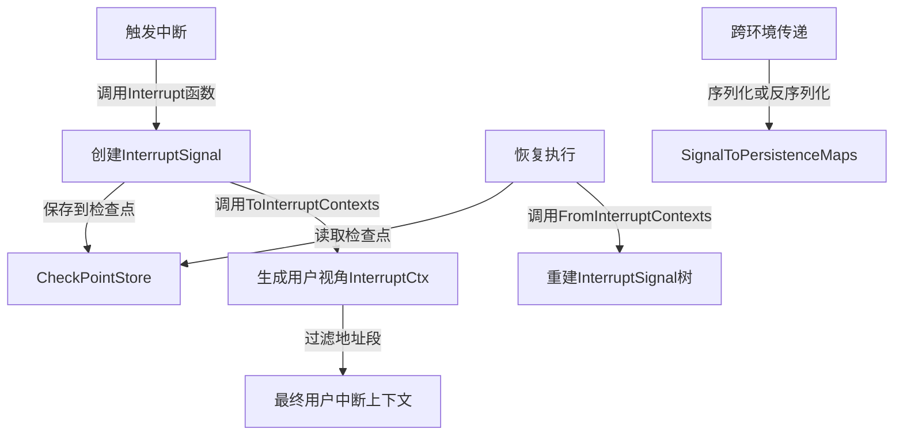

# 中断管理子模块

## 1. 模块概述

中断管理子模块是整个系统的核心协调机制之一，它解决了一个复杂分布式执行环境中的关键问题：**如何优雅地中断执行流、保存上下文信息，并在之后能够精确地从断点恢复执行**。

想象一下，您正在运行一个多阶段的智能体工作流，其中某个工具调用需要用户确认。传统的做法可能是阻塞等待，或者将状态保存到数据库并完全重启流程。这个模块提供了一种更优雅的方式：它像一个精密的"执行快照机"，能够在任意点暂停执行，保留完整的调用堆栈和上下文，然后在恢复时精确地回到暂停点继续执行。

## 2. 核心设计思想

这个模块的设计基于几个关键洞察：

1. **中断是层级结构的**：一个复杂的执行流可能包含多个层次（智能体→图节点→工具调用），中断需要反映这种层级关系
2. **中断需要两种视角**：
   - 内部视角：完整的执行状态，用于恢复
   - 用户视角：过滤后的简洁信息，用于展示和交互
3. **中断应该是可传输的**：需要能够在不同执行环境之间传递中断信息

这种设计使得系统能够支持复杂的工作流模式，如用户交互、长时间运行的任务、以及跨环境的执行迁移。

## 3. 架构与数据流程



### 主要组件角色

1. **InterruptSignal**：中断的内部表示，包含完整的层级信息和状态
2. **InterruptCtx**：中断的用户视角表示，提供结构化的中断链视图
3. **CheckPointStore**：检查点存储接口，负责持久化中断状态
4. **InterruptContextsProvider**：接口，允许从错误中提取中断上下文

### 数据流向

当执行流被中断时：
1. 组件调用 `Interrupt()` 函数创建 `InterruptSignal`
2. `InterruptSignal` 被保存到检查点存储
3. 通过 `ToInterruptContexts()` 转换为用户友好的 `InterruptCtx` 列表

当恢复执行时：
1. 从检查点读取状态
2. 如果是跨环境恢复，使用 `FromInterruptContexts()` 重建内部信号树
3. 系统使用重建的信号树恢复执行

## 4. 核心组件深度解析

### 4.1 InterruptSignal 结构体

```go
type InterruptSignal struct {
    ID string
    Address
    InterruptInfo
    InterruptState
    Subs []*InterruptSignal
}
```

**设计意图**：这是中断的内部完整表示，采用树状结构来反映执行流的层级关系。

- **ID**：唯一标识符，用于在检查点中引用
- **Address**：结构化的地址，表示中断在执行流中的位置
- **InterruptInfo**：中断的基本信息，包括是否是根本原因
- **InterruptState**：中断时的状态，包括通用状态和层特定负载
- **Subs**：子中断信号，构成层级结构

**关键点**：这个结构体实现了 `error` 接口，使得中断可以像普通错误一样在调用栈中传递。

### 4.2 InterruptCtx 结构体

```go
type InterruptCtx struct {
    ID          string
    Address     Address
    Info        any
    IsRootCause bool
    Parent      *InterruptCtx
}
```

**设计意图**：提供用户友好的中断上下文视图，隐藏内部实现细节。

- **ID**：完全限定的中断点地址，用于恢复时提供数据
- **Address**：结构化的地址段序列
- **Info**：用户可见的中断信息
- **IsRootCause**：标识是否是中断的根本原因
- **Parent**：指向父中断上下文的指针，形成中断链

**关键点**：这个结构体包含 `EqualsWithoutID` 方法，允许比较两个中断上下文是否等效，忽略临时生成的 ID。

### 4.3 Interrupt 函数

```go
func Interrupt(ctx context.Context, info any, state any, subContexts []*InterruptSignal, opts ...InterruptOption) (*InterruptSignal, error)
```

**设计意图**：创建中断信号的工厂函数，处理地址获取和配置应用。

**参数解析**：
- `ctx`：上下文，用于获取当前地址
- `info`：用户可见的中断信息
- `state`：中断时的状态
- `subContexts`：子中断上下文，用于构建层级结构
- `opts`：可选配置，如层特定负载

**关键逻辑**：
1. 从上下文获取当前地址
2. 应用可选配置
3. 如果没有子上下文，标记为根本原因
4. 创建并返回中断信号

### 4.4 ToInterruptContexts 和 FromInterruptContexts

这两个函数是内部表示和用户视角之间的桥梁：

**ToInterruptContexts**：
- 将内部 `InterruptSignal` 树转换为用户友好的 `InterruptCtx` 列表
- 支持按地址段类型过滤，隐藏实现细节
- 只返回根本原因的中断上下文，但保留完整的父链

**FromInterruptContexts**：
- 从用户视角的 `InterruptCtx` 列表重建内部 `InterruptSignal` 树
- 正确处理共同祖先，确保树结构一致
- 主要用于跨执行环境的中断传递

### 4.5 SignalToPersistenceMaps

```go
func SignalToPersistenceMaps(is *InterruptSignal) (map[string]Address, map[string]InterruptState)
```

**设计意图**：将中断信号树扁平化，便于持久化到检查点。

**返回值**：
- `id2addr`：ID 到地址的映射
- `id2state`：ID 到中断状态的映射

**关键点**：这种扁平化设计使得检查点存储可以简单地保存两个映射，而不需要处理复杂的树结构。

## 5. 依赖关系分析

### 5.1 被依赖模块

这个模块是一个底层核心模块，被多个高层模块依赖：

- **[Compose Interrupt](compose_interrupt.md)**：使用本模块构建图执行层的中断机制
- **[ADK Interrupt](adk_interrupt.md)**：使用本模块构建智能体层的中断接口
- **[地址管理子模块](地址管理子模块.md)**：提供地址结构，是中断位置表示的基础

### 5.2 依赖接口

- **CheckPointStore**：检查点存储接口，需要外部实现
- **InterruptContextsProvider**：中断上下文提供者接口，用于从错误中提取中断信息

### 5.3 数据契约

- 中断信号必须包含唯一 ID 和结构化地址
- 中断状态必须是可序列化的（用于检查点存储）
- 地址段必须遵循预定义的类型系统

## 6. 设计决策与权衡

### 6.1 内部表示 vs 用户视角

**决策**：分离 `InterruptSignal`（内部）和 `InterruptCtx`（用户）两种表示

**理由**：
- 内部表示需要完整的层级信息和状态，用于恢复
- 用户视角需要简洁、结构化的信息，用于展示和交互
- 分离使得内部实现可以演进，而不影响用户接口

**权衡**：增加了转换逻辑的复杂度，但提高了系统的灵活性和可维护性

### 6.2 树状结构 vs 扁平结构

**决策**：内部使用树状结构表示中断，持久化时扁平化为映射

**理由**：
- 树状结构自然反映执行流的层级关系
- 扁平化结构更易于存储和传输
- `SignalToPersistenceMaps` 和重建逻辑平衡了两者的优势

**权衡**：增加了转换逻辑，但获得了表示的直观性和存储的便利性

### 6.3 中断作为错误

**决策**：让 `InterruptSignal` 实现 `error` 接口

**理由**：
- 中断通常需要像错误一样在调用栈中传递
- 利用现有的错误处理机制，无需引入新的传递机制
- 使得中断可以与普通错误统一处理

**权衡**：可能会让中断看起来像错误，但实际上它们是不同的概念；需要调用者区分中断和真正的错误

### 6.4 地址过滤机制

**决策**：在 `ToInterruptContexts` 中支持按地址段类型过滤

**理由**：
- 不同层级的用户需要看到不同粒度的中断信息
- 隐藏实现细节，只暴露相关的中断点
- 使得同一中断可以在不同上下文中以不同形式呈现

**权衡**：增加了过滤逻辑的复杂度，但提高了用户体验

## 7. 使用指南与示例

### 7.1 创建中断

```go
// 基本中断
signal, err := interrupt.Interrupt(ctx, "需要用户确认", currentState, nil)

// 带层特定负载的中断
signal, err := interrupt.Interrupt(ctx, "工具执行中断", toolState, nil,
    interrupt.WithLayerPayload(toolSpecificData))

// 带子中断的层级中断
signal, err := interrupt.Interrupt(ctx, "工作流中断", workflowState, subSignals)
```

### 7.2 转换为用户视角

```go
// 获取所有根本原因的中断上下文
contexts := interrupt.ToInterruptContexts(signal, nil)

// 只保留智能体和工具层的中断信息
contexts := interrupt.ToInterruptContexts(signal, []address.AddressSegmentType{
    address.AgentSegment,
    address.ToolSegment,
})
```

### 7.3 重建中断信号

```go
// 从用户视角的上下文重建内部信号
signal := interrupt.FromInterruptContexts(contexts)
```

### 7.4 持久化中断

```go
// 扁平化中断信号
id2addr, id2state := interrupt.SignalToPersistenceMaps(signal)

// 保存到检查点存储
// (具体实现取决于 CheckPointStore 接口的实现)
```

## 8. 边界情况与注意事项

### 8.1 常见陷阱

1. **忘记检查中断类型**：由于中断实现了 `error` 接口，很容易将其当作普通错误处理。务必使用类型断言检查是否是中断。

2. **状态序列化问题**：`InterruptState` 中的状态必须是可序列化的，否则无法保存到检查点。避免包含函数、通道等不可序列化的类型。

3. **地址段类型不一致**：在过滤地址段时，确保使用的类型与系统定义的一致，否则可能过滤掉所有信息。

### 8.2 性能考虑

- 中断信号树的大小与执行流的复杂度成正比。对于非常深的调用栈，可能需要考虑内存使用。
- `ToInterruptContexts` 和 `FromInterruptContexts` 的时间复杂度与中断树的大小成正比，在高频中断场景中需要注意。

### 8.3 线程安全

- 这个模块本身不提供线程安全保证。如果在并发环境中使用，需要外部同步。
- 特别是在修改 `InterruptSignal` 的 `Subs` 字段时，需要确保没有其他 goroutine 正在读取或修改。

## 9. 总结

中断管理子模块是一个精巧的设计，它解决了复杂执行环境中的中断和恢复问题。通过分离内部表示和用户视角，使用树状结构反映层级关系，以及支持跨环境传输，这个模块为上层功能（如用户交互、长时间运行任务、执行迁移）提供了坚实的基础。

它的设计体现了几个重要原则：关注点分离、接口与实现分离、以及为不同使用场景提供不同的表示。虽然增加了一些复杂度，但换来的是系统的灵活性、可维护性和用户体验的提升。
