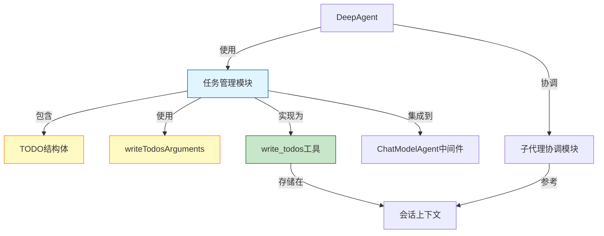

# 任务管理模块

## 1. 模块概述

任务管理模块是 Deep Research 预构建代理中的核心组件，负责研究任务的规划、跟踪和管理。它提供了结构化的任务表示、状态跟踪和更新机制，使研究代理能够将复杂的研究目标分解为可执行的子任务，并在整个研究过程中保持任务状态的一致性。

### 1.1 核心问题

在深度研究场景中，代理需要处理复杂的、多步骤的研究任务。一个简单的方法是让代理直接执行所有工作，但这种方法存在明显的局限性：
- 缺乏任务分解和优先级管理
- 难以跟踪研究进度
- 无法在中断后恢复工作
- 难以协调多个子代理或工具的执行

任务管理模块通过提供结构化的任务表示和管理机制解决了这些问题，使代理能够以更有条理、更高效的方式进行深度研究。

## 2. 架构与核心组件

### 2.1 架构图



### 2.2 核心组件

#### 2.2.1 TODO 结构体

`TODO` 是任务管理模块的核心数据结构，用于表示单个研究任务。

```go
type TODO struct {
    Content    string `json:"content"`
    ActiveForm string `json:"activeForm"`
    Status     string `json:"status" jsonschema:"enum=pending,enum=in_progress,enum=completed"`
}
```

**设计意图**：
- `Content`：存储任务的详细描述，帮助代理理解需要完成的工作
- `ActiveForm`：以祈使句形式表示的任务，便于代理直接执行
- `Status`：任务状态，限制为三个预定义值（pending、in_progress、completed），确保状态机的一致性

#### 2.2.2 writeTodosArguments 结构体

`writeTodosArguments` 是用于更新任务列表的参数结构。

```go
type writeTodosArguments struct {
    Todos []TODO `json:"todos"`
}
```

**设计意图**：
- 封装任务列表更新操作，提供统一的接口
- 通过 JSON 序列化确保数据在不同组件间的可靠传递

#### 2.2.3 newWriteTodos 函数

`newWriteTodos` 函数是任务管理模块的工厂函数，用于创建并配置任务管理中间件。

```go
func newWriteTodos() (adk.AgentMiddleware, error) {
    t, err := utils.InferTool("write_todos", writeTodosToolDescription, func(ctx context.Context, input writeTodosArguments) (output string, err error) {
        adk.AddSessionValue(ctx, SessionKeyTodos, input.Todos)
        todos, err := sonic.MarshalString(input.Todos)
        if err != nil {
            return "", err
        }
        return fmt.Sprintf("Updated todo list to %s", todos), nil
    })
    if err != nil {
        return adk.AgentMiddleware{}, err
    }

    return adk.AgentMiddleware{
        AdditionalInstruction: writeTodosPrompt,
        AdditionalTools:       []tool.BaseTool{t},
    }, nil
}
```

**设计意图**：
- 使用 `utils.InferTool` 自动推断工具的 schema，减少手动配置
- 通过 `adk.AddSessionValue` 将任务列表存储在会话上下文中，便于后续访问
- 使用 `sonic` 库进行高性能 JSON 序列化
- 返回的中间件包含了额外的指令和工具，使代理能够理解和使用任务管理功能

## 3. 工作原理

### 3.1 任务生命周期

任务管理模块实现了一个简单但有效的任务状态机：

1. **pending**：任务已创建但尚未开始执行
2. **in_progress**：任务正在执行中
3. **completed**：任务已完成

### 3.2 数据流程

1. 代理通过 `write_todos` 工具创建或更新任务列表
2. 任务列表被存储在会话上下文中，使用 `SessionKeyTodos` 作为键
3. 代理可以在后续迭代中通过 `adk.GetSessionValue` 读取和更新任务状态
4. 任务列表可用于跟踪研究进度和协调子代理执行

#### 3.2.1 访问任务列表

要从会话中读取任务列表，可以使用以下方式：

```go
// 从会话中读取任务列表
todosValue := adk.GetSessionValue(ctx, SessionKeyTodos)
if todosValue != nil {
    todos, ok := todosValue.([]TODO)
    if ok {
        // 使用任务列表
        for _, todo := range todos {
            // 处理每个任务
        }
    }
}
```

## 4. 设计权衡

### 4.1 简单性 vs 灵活性

任务管理模块采用了相对简单的设计，只包含三个状态和基本的任务属性。这种设计选择有以下考虑：

**优点**：
- 易于理解和使用
- 减少了代理理解和操作任务的复杂度
- 降低了出错的可能性

**缺点**：
- 可能无法满足所有复杂研究场景的需求
- 缺乏高级功能如任务依赖、优先级等

### 4.2 集中式 vs 分布式状态管理

任务列表被存储在会话上下文中，采用集中式管理方式：

**优点**：
- 确保任务状态的一致性
- 简化了状态访问和更新
- 便于实现任务持久化和恢复

**缺点**：
- 可能成为性能瓶颈（在高并发场景下）
- 需要谨慎处理并发访问问题

## 5. 使用指南

### 5.1 基本用法

任务管理模块通过 `write_todos` 工具暴露给代理使用。代理可以通过调用这个工具来创建、更新和管理任务列表。

示例：
```go
// 创建新的任务列表
todos := []TODO{
    {
        Content:    "研究人工智能的历史发展",
        ActiveForm: "研究人工智能的历史发展，从1950年代至今",
        Status:     "pending",
    },
    {
        Content:    "分析当前AI技术的主要趋势",
        ActiveForm: "分析当前AI技术的主要趋势，包括深度学习、强化学习等",
        Status:     "pending",
    },
}

// 通过write_todos工具更新任务列表
// 这将触发newWriteTodos函数中的逻辑
```

### 5.2 配置选项

在创建 DeepAgent 时，可以通过 `WithoutWriteTodos` 配置项来禁用内置的任务管理功能：

```go
cfg := &Config{
    // ... 其他配置
    WithoutWriteTodos: true, // 禁用任务管理功能
}
```

## 6. 注意事项和潜在问题

### 6.1 状态一致性

- 确保任务状态的更新是原子的，避免在多代理环境中出现状态冲突
- 考虑添加版本号或乐观锁机制来处理并发更新

### 6.2 任务粒度

- 任务的粒度应该适中，既不能太粗（难以管理），也不能太细（增加开销）
- 建议在实践中根据具体研究场景调整任务粒度

### 6.3 持久化

- 当前实现将任务列表存储在会话上下文中，重启后可能会丢失
- 对于需要长期运行的研究任务，考虑实现额外的持久化机制

### 6.4 序列化注册

任务管理模块使用了 schema 注册机制来确保 TODO 类型在不同组件间的正确序列化和反序列化：

```go
func init() {
    schema.RegisterName[TODO]("_eino_adk_prebuilt_deep_todo")
    schema.RegisterName[[]TODO]("_eino_adk_prebuilt_deep_todo_slice")
}
```

这确保了 TODO 类型在通过网络传输或存储时能够被正确识别和处理。

## 7. 相关模块

- [Deep Research 模块](./adk_prebuilt_deep_research.md)：任务管理模块是 Deep Research 代理的一部分
- [ADK ChatModel Agent](./adk_chatmodel_agent.md)：任务管理模块通过中间件形式集成到 ChatModelAgent 中
- [子代理协调模块](./子代理协调模块.md)：任务管理模块与子代理协调模块紧密配合，共同实现复杂研究任务的执行
