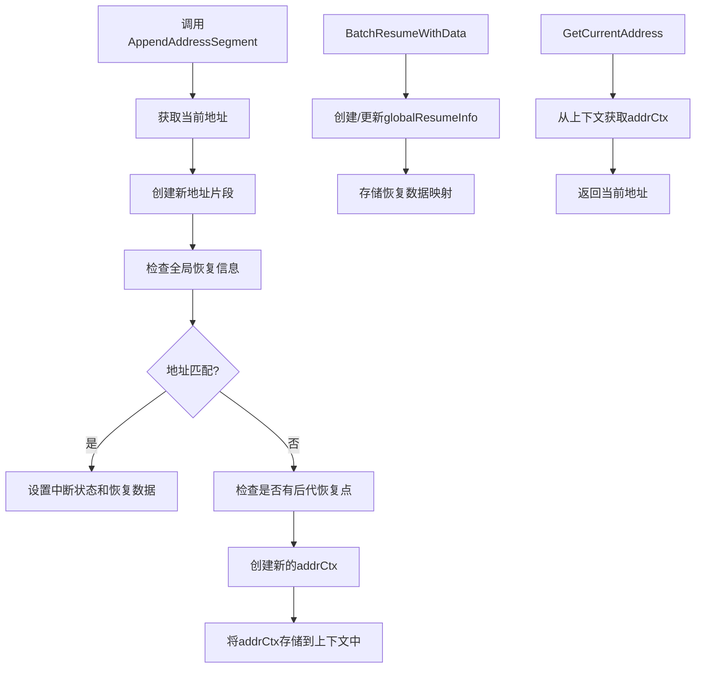

# 地址管理子模块技术深度分析

## 1. 问题空间与核心价值

在构建复杂的可恢复执行系统时，特别是涉及嵌套的图结构、代理和工具调用时，我们面临一个关键挑战：**如何精确标识执行路径上的任意位置，并在中断后能够准确恢复到该位置**？

想象一下，一个复杂的工作流可能包含多层嵌套的代理、图节点和工具调用。如果在执行过程中发生中断，我们不仅需要知道"哪里"中断了，还需要知道如何从该点继续执行，甚至如何让祖先组件知道它们需要继续执行以到达目标恢复点。

地址管理子模块就是为了解决这个问题而设计的。它提供了一套完整的机制，用于：
- 为执行路径上的每个点创建唯一的分层地址
- 在上下文中传递和维护这个地址
- 管理恢复信息，确保在中断后能够精确恢复

## 2. 核心抽象与心理模型

### 2.1 核心抽象

地址管理子模块引入了几个关键抽象：

- **AddressSegment**：执行路径上的单个片段，包含类型、ID和可选的子ID
- **Address**：由多个AddressSegment组成的完整路径，唯一标识执行结构中的一个点
- **addrCtx**：存储在上下文中的地址相关信息，包括当前地址、中断状态和恢复数据
- **globalResumeInfo**：全局恢复信息管理器，存储所有恢复点的地址、状态和数据

### 2.2 心理模型

可以将地址管理子模块想象成一个**文件系统路径管理器**：
- 每个执行组件就像一个目录或文件
- AddressSegment就像路径中的单个目录/文件名
- Address就像完整的文件系统路径
- 恢复机制就像书签，允许你在中断后快速回到之前浏览的位置

但与普通文件系统不同的是，这个"路径系统"是动态构建的，随着执行的深入而不断延伸，并且能够精确地标记需要恢复的位置。

## 3. 架构与数据流

让我们通过一个Mermaid图来理解地址管理子模块的核心组件和数据流：



### 3.1 核心数据流

1. **地址构建流程**：
   - 当执行进入一个新组件时，调用`AppendAddressSegment`
   - 系统获取当前上下文中的地址，并添加新的地址片段
   - 检查全局恢复信息，看是否需要在这个新地址处恢复
   - 创建新的`addrCtx`并存储到上下文中

2. **恢复信息管理流程**：
   - 通过`BatchResumeWithData`将恢复信息注入到上下文中
   - 恢复信息存储在`globalResumeInfo`结构中，包括地址到状态和数据的映射
   - 当执行到匹配的地址时，相应的恢复数据会被取出并使用

3. **地址使用流程**：
   - 组件可以通过`GetCurrentAddress`获取当前执行位置的地址
   - 可以通过`GetNextResumptionPoints`查找当前地址的直接子恢复点

## 4. 核心组件深度分析

### 4.1 Address与AddressSegment

```go
type AddressSegment struct {
    ID    string
    Type  AddressSegmentType
    SubID string
}

type Address []AddressSegment
```

**设计意图**：
- `AddressSegment`是地址的基本构建块，每个片段代表执行路径上的一个层级
- `Type`字段标识这个片段代表什么类型的组件（如节点、工具、代理等）
- `ID`是该组件的唯一标识符
- `SubID`是可选的，用于在ID不够唯一的情况下提供额外的唯一性保证（例如，同名工具的并行调用）

**关键方法**：
- `String()`：将地址转换为唯一的字符串表示，便于存储和传输
- `Equals()`：比较两个地址是否完全相同

### 4.2 addrCtx

```go
type addrCtx struct {
    addr           Address
    interruptState *InterruptState
    isResumeTarget bool
    resumeData     any
}
```

**设计意图**：
- 这是存储在上下文中的核心结构，携带了当前执行位置的所有地址相关信息
- `addr`是当前的完整地址
- `interruptState`是该位置的中断状态（如果有的话）
- `isResumeTarget`标识当前地址是否是恢复目标
- `resumeData`是恢复时需要的数据

**特别注意**：
- `isResumeTarget`不仅在当前地址是直接恢复目标时为true，当任何后代地址是恢复目标时也会为true。这允许复合组件知道它们需要继续执行子组件以到达实际的恢复目标。

### 4.3 globalResumeInfo

```go
type globalResumeInfo struct {
    mu                sync.Mutex
    id2ResumeData     map[string]any
    id2ResumeDataUsed map[string]bool
    id2State          map[string]InterruptState
    id2StateUsed      map[string]bool
    id2Addr           map[string]Address
}
```

**设计意图**：
- 这是全局恢复信息的中央存储库
- 使用互斥锁确保并发安全
- `id2ResumeData`和`id2ResumeDataUsed`管理恢复数据及其使用状态
- `id2State`和`id2StateUsed`管理中断状态及其使用状态
- `id2Addr`将ID映射到完整地址

**关键设计决策**：
- 每个恢复数据和状态都有对应的"已使用"标记，确保它们只被使用一次
- 这种设计允许多个恢复点共存，并且每个恢复点只在第一次到达时被使用

### 4.4 核心函数

#### AppendAddressSegment

```go
func AppendAddressSegment(ctx context.Context, segType AddressSegmentType, segID string, subID string) context.Context
```

**功能**：
- 创建一个新的执行上下文，扩展当前地址
- 检查并设置相应的中断状态和恢复数据

**设计亮点**：
1. 不仅设置当前地址的恢复信息，还会检查是否有后代地址是恢复目标
2. 使用标记确保恢复数据和状态只被使用一次
3. 即使当前地址不是直接恢复目标，如果有后代是恢复目标，也会标记为`isResumeTarget = true`

#### BatchResumeWithData

```go
func BatchResumeWithData(ctx context.Context, resumeData map[string]any) context.Context
```

**功能**：
- 准备恢复上下文的核心函数
- 将恢复目标及其对应数据注入到上下文中

**设计意图**：
- 这是"显式目标恢复"策略的基础
- 允许一次性设置多个恢复点
- 复制输入映射以防止外部修改

#### GetCurrentAddress

```go
func GetCurrentAddress(ctx context.Context) Address
```

**功能**：
- 返回当前执行组件的分层地址

**使用场景**：
- 日志记录和调试
- 自定义恢复逻辑
- 性能分析和跟踪

## 5. 依赖分析

地址管理子模块是一个相对底层的模块，它主要依赖于：

1. **context包**：用于在函数调用链中传递地址信息
2. **internal.generic包**：提供通用的工具函数，如`PtrOf`
3. **中断管理子模块**：使用`InterruptState`和相关类型

同时，它被以下模块依赖：
- **ADK Runner**：用于管理代理的执行和恢复
- **Compose Graph Engine**：用于图执行的地址管理和恢复
- **ADK Interrupt**：用于中断信息的处理

## 6. 设计决策与权衡

### 6.1 地址作为上下文值而非显式参数

**决策**：将地址信息存储在context中，而不是作为函数参数传递。

**权衡**：
- **优点**：
  - 简化了函数签名，不需要在每个函数中传递地址参数
  - 自动随着context传递，不需要手动管理
- **缺点**：
  - 类型安全性降低，需要进行类型断言
  - 对于不熟悉代码的人来说，地址的来源可能不明显

**为什么这个选择是合理的**：
在一个深度嵌套的执行系统中，将地址作为显式参数传递会导致几乎所有函数都需要接受和传递这个参数，造成API噪音。使用context虽然牺牲了一些类型安全性，但大大简化了API。

### 6.2 一次性使用的恢复数据

**决策**：恢复数据和状态在使用后会被标记为已使用，不会再次使用。

**权衡**：
- **优点**：
  - 确保恢复逻辑的可预测性
  - 防止意外重复使用相同的恢复数据
- **缺点**：
  - 如果需要在多个点使用相同的恢复数据，需要额外的机制

**为什么这个选择是合理的**：
在大多数恢复场景中，我们希望恢复数据只在第一次到达中断点时使用一次。这种设计符合最常见的使用模式，同时避免了复杂的使用计数机制。

### 6.3 祖先组件也标记为恢复目标

**决策**：不仅将直接恢复目标标记为`isResumeTarget = true`，还将其所有祖先组件也标记为恢复目标。

**权衡**：
- **优点**：
  - 允许复合组件知道它们需要继续执行子组件
  - 简化了恢复逻辑，不需要在每个组件中检查后代
- **缺点**：
  - 可能导致一些组件在不是直接恢复目标的情况下也执行恢复逻辑

**为什么这个选择是合理的**：
在嵌套的执行结构中，如果我们要恢复到某个深层节点，所有祖先节点都需要知道它们应该正常执行，以便到达目标恢复点。这种设计使得每个组件只需要检查自己的`isResumeTarget`标志，而不需要复杂的后代检查逻辑。

## 7. 最佳实践与常见陷阱

### 7.1 最佳实践

1. **始终在进入新组件时调用AppendAddressSegment**：
   ```go
   ctx = address.AppendAddressSegment(ctx, "node", nodeID, "")
   defer func() {
       // 可以在这里进行清理工作
   }()
   ```

2. **在恢复时使用BatchResumeWithData**：
   ```go
   resumeData := map[string]any{
       addressStr: myResumeData,
   }
   ctx = address.BatchResumeWithData(ctx, resumeData)
   ```

3. **使用GetCurrentAddress进行日志记录**：
   ```go
   addr := address.GetCurrentAddress(ctx)
   log.Printf("Executing at address: %s", addr.String())
   ```

### 7.2 常见陷阱

1. **忘记调用AppendAddressSegment**：
   - **问题**：如果在进入新组件时忘记添加地址片段，地址将不会正确更新，导致恢复机制失效。
   - **解决**：建立代码审查检查清单，确保所有组件入口点都正确处理地址。

2. **修改BatchResumeWithData的输入映射**：
   - **问题**：虽然函数会复制映射，但如果在调用后修改映射中的值（如果是引用类型），可能会导致意外行为。
   - **解决**：调用后不要修改输入映射中的值。

3. **假设isResumeTarget只在直接恢复目标时为true**：
   - **问题**：如果编写组件时假设`isResumeTarget`只在当前地址是直接恢复目标时为true，可能会导致错误的恢复逻辑。
   - **解决**：记住`isResumeTarget`也会在有后代恢复目标时为true，设计组件时考虑这种情况。

## 8. 总结

地址管理子模块是一个精巧而强大的组件，为复杂执行系统的可恢复性提供了基础支持。它通过分层地址的概念，解决了在嵌套执行结构中精确定位和恢复执行的难题。

其核心价值在于：
1. 提供了一种统一的方式来标识执行路径上的任意位置
2. 实现了灵活而强大的恢复机制
3. 通过上下文传递，简化了API设计

虽然它是一个相对底层的模块，不直接面向最终用户，但它为整个系统的可恢复性提供了关键支持，是构建可靠、健壮的复杂执行系统的重要基础。

## 相关模块

- [中断管理子模块](中断管理子模块.md)
- [Compose Graph Engine](Compose_Graph_Engine.md)
- [ADK Runner](ADK_Runner.md)
